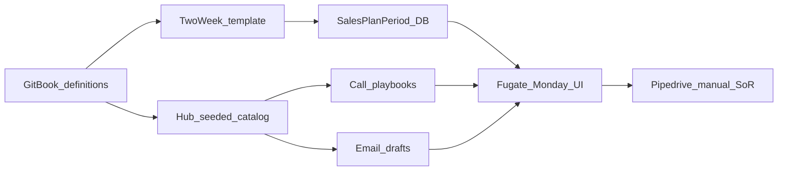

# Design: Hub Acquire Desk

## Goal

Give the Acquire owner (Fugate) a Hub workspace for day-of execution — two-week planning, call playbooks, and email drafts — while Pipedrive remains the system of record for leads, deals, and activities. GitBook remains the source of process definitions (SOPs / templates / checklists).

## Context

- Why now: Acquire SOPs and templates in the docs repo define process well, but are hard to use during a busy sales day.
- Related templates: [Two-week sales plan](../../templates/sales-plan-two-week.md), [First-touch outreach](../../templates/first-touch-outreach.md), [Referral ask](../../templates/referral-ask.md), [Demo checklist](../../checklists/demo-checklist.md).
- Related SOPs: [Acquire SOPs](../../sops/acquire/README.md), [Generate new leads](../../sops/acquire/generate-new-leads.md).
- Related strategy: [Go-to-market](../../strategy/go-to-market.md) (Pipedrive as SoR).
- Implementation lives in the **TLS-Hub** repo (`/acquire` UI + `tlsapi/acquire-desk` API).

## Decisions

1. **Hub is the coaching / execution UI; Pipedrive stays SoR for CRM** — Hub does not rebuild pipeline stages or contact sync in v1.
2. **Productize existing docs templates** — do not invent new process; seed structured content from approved templates (version footer on each tool).
3. **No AI-generated messaging in v1** — only fill approved templates with user-supplied fields; copy to clipboard; send from the user's email client.
4. **No proposal/contract generators in v1** — deferred until the desk is habit (Phase 3).
5. **Auth** — reuse Hub JWT login; any authenticated Hub user can use Acquire Desk (tighten later if needed).
6. **Persistence** — `SalesPlanPeriod` rows in Hub SQL for plan instances; call playbooks and email templates are catalog content (code-seeded, not per-user DB rows in v1).

### Alternatives considered

| Alternative | Why not for v1 |
|-------------|----------------|
| Pipedrive-only checklists / activities | Weak for rich plan + call UX; does not unlock Hub generators later |
| Rebuild CRM in Hub | Duplicates Pipedrive; high cost |
| Start with proposal/contract PDF | High risk; Fugate's weekly friction is plan / call / email first |

### Consequences

- Fugate still logs orgs, origin, and next activities in Pipedrive.
- Docs and Hub can drift if templates change — update Hub catalog when docs bump; footer shows source version.
- Later Pipedrive sync and generators should attach to the same desk / deal-context concepts.

## Scope

### In scope (v0.1)

- `/acquire` Acquire Desk home (Plan / Call playbooks / Email drafts).
- Persist two-week sales plans (goals, named priorities, week day blocks + done flags, check-in items, notes).
- Seeded call playbooks with checklist + copy-to-clipboard.
- Email draft fill + copy from first-touch / referral templates.
- Deep links / source pointers back to docs templates.
- Pilot runbook for Fugate's first real planning period.
- Home dashboard: today's board tasks (shared `BoardTask` model).
- Save/publish on two-week plan upserts Acquire day-block work onto the board.
- `/acquire/plans` plan history (list, open, set current).

### Out of scope (v1)

- Pipedrive API read/write
- Sending email from Hub
- Proposal / contract generators
- AI-authored copy
- Field-day stop list generator (Phase 2)
- Replacing Clients / Contacts CRM screens

## Approach (high level)

1. **Design** (this doc) — jobs, non-goals, data sketch.
2. **API** — `SalesPlanPeriod` CRUD + catalog endpoints for playbooks/emails.
3. **UI** — `/acquire` with three tools; current plan load/create/save.
4. **Pilot** — Fugate creates one real period in Hub; collect change requests before Phase 2.

## Data model sketch

### `SalesPlanPeriod` (Hub SQL)

| Field | Notes |
|-------|--------|
| `Id` | long PK |
| `OwnerName` | e.g. Eric Fugate |
| `PeriodStart` / `PeriodEnd` | date |
| `GeographicFocus` | Priority 1 / 2 / Other |
| `SegmentFocus` | LE / Court / Jail |
| `GoalsJson` | `[{ label, target, actual }]` |
| `PrioritiesJson` | `[{ agencyDeal, stage, nextAction, due }]` |
| `Week1BlocksJson` / `Week2BlocksJson` | `[{ day, timeBlock, work, isDone }]` |
| `OutOfScope` | text |
| `CheckInJson` | `[{ label, isDone }]` |
| `NotesRisks` | text |
| `IsCurrent` | at most one current plan per owner (v1: global current flag) |
| `CreatedUtc` / `UpdatedUtc` | audit |

### Catalog (code-seeded, not DB)

- Playbooks: `first-touch-phone`, `discovery-questions`, `referral-ask`, `demo-call` (items + scripts).
- Email templates: association/cold, referral-with-name, referral-no-name (subject options + body with placeholders).

## Jobs to be done

1. **Monday plan** — start or continue a two-week period; set goals and day blocks.
2. **On the phone** — open a playbook; check questions; copy opener.
3. **Outreach block** — fill email fields; copy subject/body; send externally; log in Pipedrive.
4. **Friday check-in** — mark definition-of-done items; update actuals vs targets.

## Open questions

- Pipedrive sync direction for Phase 2 (read deals into priorities vs write next-activity reminders).
- Whether `IsCurrent` should be per-user once multiple Acquire users exist.
- Canonical public GitBook URL for deep links from Hub (internal path used until confirmed).

## Follow-on work

| Phase | Work item |
|-------|-----------|
| Board | [Hub notecard board](hub-notecard-board.md) — cards as SoR; week agenda/calendar; bi-directional plan sync |
| Phase 2 | Friday scorecard view; field-day stop list; light Pipedrive read |
| Phase 3 | Proposal / contract generators using pricing + acquire-authority |
| Pilot | See [Pilot runbook](#pilot-runbook) below |

## Pilot runbook

**Goal:** Fugate's next two-week plan is created in Hub, not a Word/email copy of the markdown template.

1. Ensure Fugate has a Hub login (same identity used for Hub today).
2. Walkthrough (~15 min): open **Acquire Desk** → start period → fill goals + Week 1 blocks → save.
3. During the period: use **Call playbooks** on at least one live call; use **Email drafts** for one first-touch send; still log Pipedrive origin + next activity.
4. Friday: update Actuals + check-in items in Hub; bring Pipedrive proof to manager check-in.
5. Capture change requests (missing fields, awkward UX, template tweaks) before Pipedrive sync or generators.

## Notes

- Success metric (v0.1): next two-week plan exists as a `SalesPlanPeriod` in Hub.
- Source template versions at ship: sales-plan-two-week v0.1, first-touch-outreach v0.1, referral-ask v0.1, demo-checklist v0.3.
