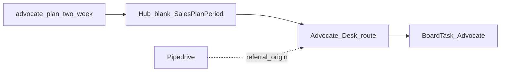

# Design: Hub Advocate Desk

## Goal

Give the Advocate epic owner a Hub **two-week coaching plan** for referral asks, captured referrals, and reference champions, with day-blocks on the notecard board — without rebuilding CRM or community tooling in Hub yet.

## Context

- Why now: Expand/Operate/Deliver desks established the plan + board pattern; Advocate has a real SOP ([Capture referral](../../sops/advocate/capture-referral.md)) and CVE stages for reference / referral / community.
- Related design: [Hub epic plans](hub-epic-plans.md), [Hub Expand Desk](hub-expand-desk.md), [Hub Acquire Desk](hub-acquire-desk.md), [Hub notecard board](hub-notecard-board.md)
- Related templates: [Two-week advocate plan](../../templates/advocate-plan-two-week.md), [Referral ask](../../templates/referral-ask.md)
- Related: [Advocate CVE](../../customer-value-engine/advocate/README.md), [SOPs — Advocate](../../sops/advocate.md)
- Implementation: TLS-Hub `/advocate` + `SalesPlanPeriod` with `Epic = Advocate`

## Decisions

1. **v0.1 = plan + board desk** — `/advocate` hosts the two-week plan (goals, named priorities, day-blocks). No community platform or referral inbox in Hub.
2. **Productize Advocate plan goals** — Seed blanks from [advocate-plan-two-week](../../templates/advocate-plan-two-week.md) / [epic plan goals](../../strategy/epic-kpis.md#advocate).
3. **Referral / reference SoR stays outside Hub** — Pipedrive origin + customer org notes remain where referrals and reference status are logged; Hub plan does not replace them.
4. **Cards carry executable work** — Day-blocks sync to Advocate-epic `BoardTask` cards (asks, follow-ups, reference refresh).
5. **Adjacent to Acquire, not the same desk** — Acquire may still run referral asks in its sales rhythm; Advocate owns the champion / referral / community coaching period.

### Alternatives considered

| Alternative | Why not for v0.1 |
|-------------|------------------|
| Fold Advocate into Acquire Desk | Different outcome (champions/community vs new logos) |
| Community / event CRM in Hub | Out of scope; community stage still thin |
| Board-only | Loses period goals and Friday check-in |

### Consequences

- Referral ask scripts remain in docs / Acquire catalog; Advocate desk is coaching + board.
- Company Funding RT KPIs (reference agencies, referral opportunities) stay on a future Scorecard — plan rows stay **Goals**.

## Scope

### In scope (v0.1)

- Docs: Advocate two-week plan template + this design
- Hub: `/advocate` desk + `/advocate/plans` history; Advocate-shaped blank template; priority labels (agency / contact · ask type)
- Home Plans: current Advocate period; day-blocks → board

### Out of scope (v0.1)

- Community event management
- Pipedrive sync / auto-origin stamping
- Company Scorecard KPI warehouse
- Sending referral emails from Hub

## Approach (high level)

1. Design (this doc).
2. Docs template for Advocate two-week plan.
3. Hub desk + history + nav; catalog already seeds Advocate goals.
4. Pilot: Advocate owner runs one real period in Hub.

## Open questions

- <mark style="color:red;">**TODO:**</mark> Whether hypercare-exit referral ask is Deliver/Expand-triggered vs Advocate-owned calendar.
- <mark style="color:red;">**TODO:**</mark> Community stage goals for two-week plans (events / speaking) once process exists.

## Follow-on work

| Phase | Work |
|-------|------|
| Pilot | One real Advocate two-week period from `/advocate` |
| Later | Deep links to referral-ask template / Acquire email drafts |
| Later | Scorecard auto-fill for references / referral origin |
