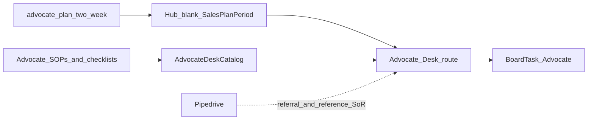

# Design: Hub Advocate Desk

## Goal

Give the Advocate epic owner a Hub **two-week coaching plan** for referral asks, captured referrals, and reference champions, with day-blocks on the notecard board — plus **session-local checklists** productized from Advocate SOPs — without rebuilding CRM or community tooling in Hub yet.

## Context

- Why now: Deliver/Operate/Expand desks established plan + board + checklist pattern; Advocate SOPs now cover referral, reference, and light community follow-up.
- Related design: [Hub epic plans](hub-epic-plans.md), [Hub Expand Desk](hub-expand-desk.md), [Hub Acquire Desk](hub-acquire-desk.md), [Hub notecard board](hub-notecard-board.md)
- Related templates: [Two-week advocate plan](../../templates/advocate-plan-two-week.md), [Referral ask](../../templates/referral-ask.md)
- Related: [Advocate CVE](../../customer-value-engine/advocate/README.md), [SOPs — Advocate](../../sops/advocate.md)
- Implementation: TLS-Hub `/advocate` + `SalesPlanPeriod` with `Epic = Advocate`

## Decisions

1. **v0.1 = plan + board desk** — `/advocate` hosts the two-week plan (goals, named priorities, day-blocks).
2. **v0.2 = checklist tools** — Seeded Hub checklists from Advocate SOPs/checklists. Session-local checks only; Pipedrive remains SoR.
3. **Productize Advocate plan goals** — Seed blanks from [advocate-plan-two-week](../../templates/advocate-plan-two-week.md) / [epic plan goals](../../strategy/epic-kpis.md#advocate).
4. **Referral / reference SoR stays outside Hub** — Pipedrive origin + org notes remain where referrals and reference status are logged.
5. **Cards carry executable work** — Day-blocks sync to Advocate-epic `BoardTask` cards (asks, follow-ups, reference refresh).
6. **Adjacent to Acquire, not the same desk** — Acquire works referred leads; Advocate owns champion / referral ask / community coaching period.
7. **Role title: Advocate owner** — not named incumbents in process text.
8. **Cadence (process, not Hub automation)** — Referral ask at hypercare exit + Healthy success (Deliver/Expand surface; Advocate owns ask). Reference ask after Healthy + qualification. Roster refresh quarterly. Community capture within 1 business day of events.

### Alternatives considered

| Alternative | Why not for v0.1 |
|-------------|------------------|
| Fold Advocate into Acquire Desk | Different outcome (champions/community vs new logos) |
| Community / event CRM in Hub | Out of scope; light follow-up checklist only |
| Board-only | Loses period goals and Friday check-in |

### Consequences

- Referral ask scripts remain in docs; Hub adds run-sheet checklists + coaching.
- Company Funding RT KPIs (reference agencies, referral opportunities) stay on a future Scorecard — plan rows stay **Goals**.

## Scope

### In scope (v0.1)

- Docs: Advocate two-week plan template + this design
- Hub: `/advocate` desk + `/advocate/plans` history; Advocate-shaped blank template; priority labels (agency / contact · ask type)
- Home Plans: current Advocate period; day-blocks → board

### In scope (v0.2)

- Docs: Reference + community SOPs; standalone Advocate checklists; Capture referral ownership clarification
- Hub: `/advocate` **Checklists** tab; `GET tlsapi/advocate-desk/checklists`

### Out of scope (v0.1 / v0.2)

- Community event management platform
- Pipedrive sync / auto-origin stamping
- Company Scorecard KPI warehouse
- Sending referral emails from Hub
- Persisted per-ask checklist instances (session-local only)

## Approach (high level)

1. Design (this doc).
2. Docs template for Advocate two-week plan.
3. Hub desk + history + nav; catalog already seeds Advocate goals.
4. Advocate SOPs + checklists; seed Hub AdvocateDeskCatalog; `/advocate` Checklists tab.
5. Pilot: Advocate owner runs one real period in Hub.

## Open questions

- Pipedrive custom fields for referring organization / reference roster (notes OK until created).
- Depth of Community program (user groups / newsletter) beyond event follow-up.

## Follow-on work

| Phase | Work |
|-------|------|
| Pilot | One real Advocate two-week period from `/advocate` |
| v0.2 | Checklists tab (referral, reference, refresh, community) |
| Later | Deep links to referral-ask template / Acquire email drafts |
| Later | Scorecard auto-fill for references / referral origin |
