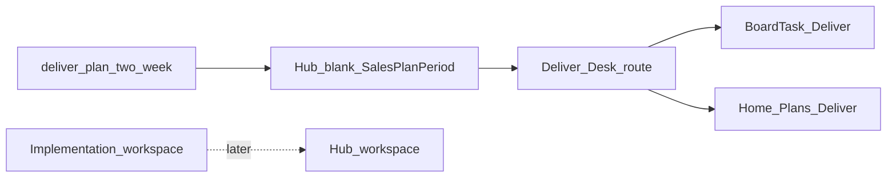

# Design: Hub Deliver Desk

## Goal

Give the Deliver epic owner a Hub **two-week coaching plan** (goals, named engagement priorities, day-blocks on the notecard board) without rebuilding the per-customer implementation workspace in Hub yet.

## Context

- Why now: Home Plans already lists Deliver; blank goals were generic. Deliver has the deepest SOP tree and a tool-neutral [implementation workspace standard](../../sops/deliver/implementation-workspace-standard.md) that anticipates Hub later.
- Related design: [Hub epic plans](hub-epic-plans.md), [Hub notecard board](hub-notecard-board.md), [Hub Acquire Desk](hub-acquire-desk.md)
- Related templates: [Two-week deliver plan](../../templates/deliver-plan-two-week.md)
- Related SOPs: [Deliver](../../sops/deliver/README.md), [Implementation lifecycle](../../sops/deliver/implementation-lifecycle.md)
- Implementation: TLS-Hub `/deliver` Deliver Desk + Home Plans + `SalesPlanPeriod` with `Epic = Deliver`

## Decisions

1. **v0.1 = plan + board desk** — `/deliver` hosts the two-week plan (KPIs, priorities, day-blocks). No playbooks or email catalog. Still no per-customer workspace SoR in Hub.
2. **Productize the Deliver two-week template** — Seed blank `SalesPlanPeriod` goals / check-in from [deliver-plan-two-week](../../templates/deliver-plan-two-week.md); do not invent process.
3. **Engagement SoR stays the workspace** — Per-customer status, phases 0–8, and exit criteria remain in the implementation workspace (whatever tool today). The Hub plan does not replace it.
4. **Cards carry executable work** — Day-blocks sync to Deliver-epic `BoardTask` cards; use client/product tags on cards for engagement context.
5. **Do not clone Acquire Desk** — No Pipedrive twin, cold outreach playbooks, or proposal generators for Deliver.

### Alternatives considered

| Alternative | Why not for v0.1 |
|-------------|------------------|
| Full Hub implementation workspace | Large; standard is tool-neutral until Hub is ready |
| Reuse Acquire sales goals as-is | Wrong outcomes (pipeline vs phase exits / go-lives) |
| Skip plan; board-only | Loses coaching goals and Friday check-in artifact |

### Consequences

- Deliver owners still maintain engagement workspaces outside Hub (or beside it) until a later workspace project.
- Acquire-only plan fields stay empty for Deliver periods.
- A future workspace UI should attach to the same `/deliver` plan + board concepts.

## Scope

### In scope (v0.1)

- Docs: Deliver two-week plan template + this design
- Hub: `/deliver` desk + `/deliver/plans` history; Deliver-shaped blank template; EpicPlanDialog labels for agency / phase
- Home Plans: create/save current Deliver period; day-blocks → board

### Out of scope (v0.1)

- Per-customer implementation workspace SoR in Hub
- Phase-gate / RACI UI
- Replacing shared folders, spreadsheets, or project tools
- Playbooks / email catalog (Acquire-style tools)
- Pipedrive or Directory sync for engagements

## Approach (high level)

1. Design (this doc + [epic plans](hub-epic-plans.md)).
2. Docs template for Deliver two-week plan.
3. Hub catalog seeds Deliver blanks; dialog labels soften.
4. Pilot: Deliver owner creates one real period in Hub; keep workspace SoR elsewhere.
5. Later: workspace-in-Hub initiative when leadership picks the container.

## Open questions

- <mark style="color:red;">**TODO:**</mark> Canonical mapping from named priorities to a specific engagement workspace URL/id (defer until workspace lands in Hub).
- <mark style="color:red;">**TODO:**</mark> Whether go-live decision records should deep-link from plan priorities.

## Follow-on work

| Phase | Work |
|-------|------|
| Pilot | Deliver owner runs one real two-week period from Home Plans |
| Later | Implementation workspace in Hub (phases 0–8, exit criteria) |
| Later | Optional Deliver desk tools (checklists pulled from SOPs) |
