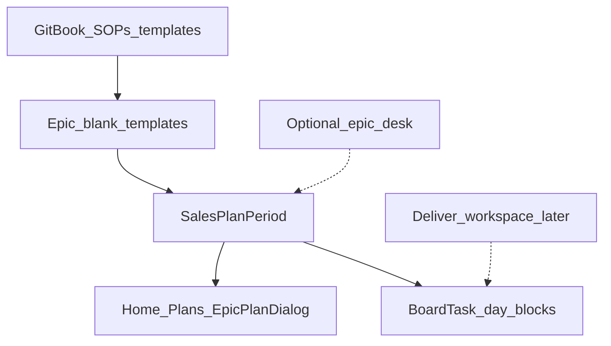

# Design: Hub epic plans

## Goal

Define one shared two-week **coaching plan** model for all CVE epics (Acquire, Deliver, Operate, Expand, Advocate, Internal), while keeping epic-specific methodology, systems of record, and optional “Desk” tools separate.

## Context

- Why now: Home Plans + `SalesPlanPeriod.Epic` already surface every epic; Acquire, Deliver, Operate, and Expand have dedicated desks.
- Related design: [Hub Acquire Desk](hub-acquire-desk.md), [Hub notecard board](hub-notecard-board.md), [Hub Deliver Desk](hub-deliver-desk.md), [Hub Operate Desk](hub-operate-desk.md), [Hub Expand Desk](hub-expand-desk.md)
- Related templates: [Two-week sales plan](../../templates/sales-plan-two-week.md), [Two-week deliver plan](../../templates/deliver-plan-two-week.md), [Two-week operate plan](../../templates/operate-plan-two-week.md), [Two-week expand plan](../../templates/expand-plan-two-week.md)
- Implementation: TLS-Hub (`SalesPlanPeriod`, `/tlsapi/acquire-desk/plans`, Home `EpicPlanDialog`)

## Decisions

1. **Shared shell** — Every epic uses the same persistence shape: period, owner, goals, named priorities, week day-blocks, check-in items, out-of-scope, notes/risks (`SalesPlanPeriod`).
2. **Goals ≠ company KPIs** — Plan goal rows are period commitments (Label / Target / Actual). Canonical list: [Epic plan goals](../../strategy/epic-kpis.md). The UI labels this section **Goals**. Company / Funding RT KPIs belong on a separate Scorecard surface.
3. **Epic-specific defaults** — Blank templates (goals, check-in, unused Acquire-only header fields) are seeded per epic from [Epic plan goals](../../strategy/epic-kpis.md) and plan templates. Do not invent process in Hub.
4. **Plans vs desks** — A **plan** is the two-week coaching artifact on Home. A **desk** is a dedicated route for that epic’s plan (and optional catalog tools). Acquire keeps `/acquire` (plan + playbooks + email). Deliver (`/deliver`), Operate (`/operate`), and Expand (`/expand`) are plan-only in v0.1. Advocate/Internal stay Home Plans until a desk design expands them.
5. **SoR split by epic** — Plans are never the engagement CRM or project workspace:
   - Acquire: Pipedrive remains CRM SoR ([Acquire Desk](hub-acquire-desk.md)).
   - Deliver: per-customer [implementation workspace](../../sops/deliver/implementation-workspace-standard.md) remains engagement SoR; the two-week plan is owner execution only.
   - Operate: shared support List remains request SoR ([Operate Desk](hub-operate-desk.md)); plan is owner execution only.
   - Expand: Pipedrive remains opportunity SoR ([Expand Desk](hub-expand-desk.md)); plan is owner execution only.
   - Advocate / Internal: follow their SOP trees; do not invent Hub SoRs in v0.1.
6. **Board sync** — Day-blocks publish to `BoardTask` cards with the plan’s epic (Phase A in [notecard board](hub-notecard-board.md)). Reverse sync remains Acquire-first until other epics prove the habit.
7. **Current plan** — At most one `IsCurrent` plan per epic (and owner when assigned); Home epic-plans already load via `GetCurrentForEpicAndOwnerAsync`.

### Alternatives considered

| Alternative | Why not |
|-------------|---------|
| Separate table per epic | Duplicates board sync and Home Plans UI |
| Full Deliver/Operate desks before templates | High cost; methodology already lives in GitBook |
| Collapse workspace into the two-week plan | Violates Deliver workspace standard (per-customer, phases 0–8) |

### Consequences

- Acquire-only fields (`GeographicFocus`, `SegmentFocus`) stay on the row; non-Acquire blanks leave them empty.
- Priority JSON keeps `AgencyDeal` / `Stage` keys; UI labels soften per epic (e.g. Deliver: agency + phase).
- Later desks and workspace Hub features attach beside this model, not instead of it.

## Scope

### In scope

- This shared-model design
- Docs templates per epic as they come online (Deliver next)
- Hub blank-template seeding + EpicPlanDialog label softening

### Out of scope

- Replacing Pipedrive or the implementation workspace
- Phase B (plan grid = card projection only)
- Email/Quo auto-ingest
- Full desks for non-Acquire epics

## Approach (high level)

1. Accept this design.
2. Add epic two-week templates in docs (Deliver first).
3. Seed Hub blanks from those templates; soften plan dialog labels.
4. Add desk or workspace designs only when an epic outgrows plan + board.

## Open questions

- <mark style="color:red;">**TODO:**</mark> When Operate / Expand / Advocate get dedicated two-week templates (after Deliver habit lands).
- <mark style="color:red;">**TODO:**</mark> Whether reverse board→plan sync should apply to non-Acquire epics before Phase B.

## Follow-on work

| Phase | Work |
|-------|------|
| Now | [Deliver Desk v0.1](hub-deliver-desk.md) — plan + board only |
| Later | Operate / Expand / Advocate / Internal templates |
| Later | Deliver implementation workspace in Hub |
| Phase B | Plan week grid = card projection ([notecard board](hub-notecard-board.md)) |
