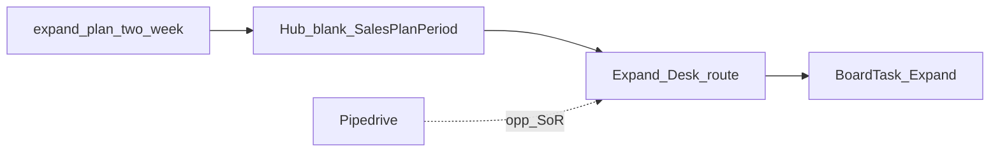

# Design: Hub Expand Desk

## Goal

Give the Expand epic owner a Hub **two-week coaching plan** for customer success check-ins and expansion conversations, with day-blocks on the notecard board — without building a full CS/CRM workspace in Hub yet.

## Context

- Why now: Deliver and Operate desks established the plan + board pattern; Expand CVE stages ([customer success](../../customer-value-engine/expand/customer-success.md), [expansion](../../customer-value-engine/expand/expansion.md)) need a period coaching home.
- Related design: [Hub epic plans](hub-epic-plans.md), [Hub Operate Desk](hub-operate-desk.md), [Hub Deliver Desk](hub-deliver-desk.md), [Hub notecard board](hub-notecard-board.md)
- Related templates: [Two-week expand plan](../../templates/expand-plan-two-week.md)
- Related: [Expand CVE](../../customer-value-engine/expand/README.md), [SOPs — Expand](../../sops/expand.md), [Customer success playbook](../../customer-success.md)
- Implementation: TLS-Hub `/expand` + `SalesPlanPeriod` with `Epic = Expand`

## Decisions

1. **v0.1 = plan + board desk** — `/expand` hosts the two-week plan (goals, named priorities, day-blocks). No CS playbook catalog or Pipedrive sync in Hub yet.
2. **Productize Expand plan goals** — Seed blanks from [expand-plan-two-week](../../templates/expand-plan-two-week.md) / [epic plan goals](../../strategy/epic-kpis.md#expand).
3. **CRM / account SoR stays outside Hub** — Pipedrive (or equivalent) remains where expansion opportunities are logged; Hub plan does not replace it.
4. **Cards carry executable work** — Day-blocks sync to Expand-epic `BoardTask` cards (check-ins, upsell talks, at-risk follow-ups).
5. **Do not clone Acquire Desk** — Expansion is adjacent to sales but Expand owns success + growth of existing customers.

### Alternatives considered

| Alternative | Why not for v0.1 |
|-------------|------------------|
| Fold Expand into Acquire Desk | Different SoR and owner jobs (pipeline vs live customers) |
| Full CS health scoring in Hub | Needs SOPs + data; Expand SOPs still thin |
| Board-only | Loses period goals and Friday check-in |

### Consequences

- Fugate (Expand owner today) still logs opportunities in Pipedrive; Hub is coaching + board execution.
- Company Funding RT KPIs (expansion rate, modules per env) stay on a future Scorecard — plan rows stay **Goals**.

## Scope

### In scope (v0.1)

- Docs: Expand two-week plan template + this design
- Hub: `/expand` desk + `/expand/plans` history; Expand-shaped blank template; priority labels (agency / account · focus)
- Home Plans: current Expand period; day-blocks → board

### Out of scope (v0.1)

- Customer health scoring / NPS warehouse
- Pipedrive sync
- Company Scorecard KPI warehouse
- Full Expand SOP desk tools (until SOPs exist)

## Approach (high level)

1. Design (this doc).
2. Docs template for Expand two-week plan.
3. Hub desk + history + nav; catalog already seeds Expand goals.
4. Pilot: Expand owner runs one real period in Hub.

## Open questions

- <mark style="color:red;">**TODO:**</mark> Cadence for mandatory post-go-live / hypercare-exit check-ins vs Expand-owned steady-state CS.
- <mark style="color:red;">**TODO:**</mark> When Expand SOPs land, replace goal definitions from those KPI tables.

## Follow-on work

| Phase | Work |
|-------|------|
| Pilot | One real Expand two-week period from `/expand` |
| Later | Expand SOPs + tighter goal definitions |
| Later | Scorecard auto-fill for expansion / modules-per-customer |
