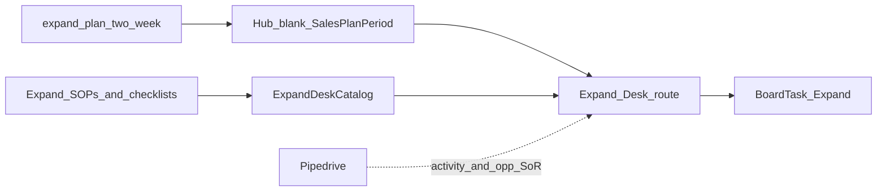

# Design: Hub Expand Desk

## Goal

Give the Expand epic owner a Hub **two-week coaching plan** for customer success check-ins and expansion conversations, with day-blocks on the notecard board — plus **session-local checklists** productized from Expand SOPs — without building a full CS/CRM workspace in Hub yet.

## Context

- Why now: Deliver and Operate desks established the plan + board + checklist pattern; Expand CVE stages ([customer success](../../customer-value-engine/expand/customer-success.md), [expansion](../../customer-value-engine/expand/expansion.md)) now have target-state SOPs.
- Related design: [Hub epic plans](hub-epic-plans.md), [Hub Operate Desk](hub-operate-desk.md), [Hub Deliver Desk](hub-deliver-desk.md), [Hub notecard board](hub-notecard-board.md)
- Related templates: [Two-week expand plan](../../templates/expand-plan-two-week.md)
- Related: [Expand CVE](../../customer-value-engine/expand/README.md), [SOPs — Expand](../../sops/expand.md), [Customer success playbook](../../customer-success.md)
- Implementation: TLS-Hub `/expand` + `SalesPlanPeriod` with `Epic = Expand`

## Decisions

1. **v0.1 = plan + board desk** — `/expand` hosts the two-week plan (goals, named priorities, day-blocks).
2. **v0.2 = checklist tools** — Seeded Hub checklists from Expand SOPs/checklists. Session-local checks only; Pipedrive remains SoR for activities and opportunities.
3. **Productize Expand plan goals** — Seed blanks from [expand-plan-two-week](../../templates/expand-plan-two-week.md) / [epic plan goals](../../strategy/epic-kpis.md#expand).
4. **CRM / account SoR stays outside Hub** — Pipedrive remains where expansion opportunities and success activities are logged; Hub plan does not replace it.
5. **Cards carry executable work** — Day-blocks sync to Expand-epic `BoardTask` cards (check-ins, upsell talks, at-risk follow-ups).
6. **Do not clone Acquire Desk** — Expansion is adjacent to sales but Expand owns success + growth of existing customers.
7. **Role title in tools/docs: Expand owner** — not named incumbents in process text (people may change).
8. **Cadence (process, not Hub automation)** — Healthy/steady: quarterly. New post-hypercare: Day 30/60/90 then quarterly. At-risk: monthly + next action ≤ 14 days. Expansion during check-in or inquiry.

### Alternatives considered

| Alternative | Why not for v0.1 |
|-------------|------------------|
| Fold Expand into Acquire Desk | Different SoR and owner jobs (pipeline vs live customers) |
| Full CS health scoring warehouse in Hub | Criteria live in checklists first; score in Pipedrive notes |
| Board-only | Loses period goals and Friday check-in |

### Consequences

- Expand owner still logs activities/opportunities in Pipedrive; Hub is coaching + board execution + run-sheet checklists.
- Company Funding RT KPIs (expansion rate, modules per env) stay on a future Scorecard — plan rows stay **Goals**.

## Scope

### In scope (v0.1)

- Docs: Expand two-week plan template + this design
- Hub: `/expand` desk + `/expand/plans` history; Expand-shaped blank template; priority labels (agency / account · focus)
- Home Plans: current Expand period; day-blocks → board

### In scope (v0.2)

- Docs: Expand SOPs + health/check-in/expansion/handoff checklists
- Hub: `/expand` **Checklists** tab; `GET tlsapi/expand-desk/checklists`; seeded from those docs

### Out of scope (v0.1 / v0.2)

- Customer health scoring warehouse / NPS warehouse
- Pipedrive sync
- Company Scorecard KPI warehouse
- Persisted per-account checklist instances in Hub (session-local only in v0.2)

## Approach (high level)

1. Design (this doc).
2. Docs template for Expand two-week plan.
3. Hub desk + history + nav; catalog already seeds Expand goals.
4. Expand SOPs + checklists; seed Hub ExpandDeskCatalog; `/expand` Checklists tab.
5. Pilot: Expand owner runs one real period in Hub.

## Open questions

- When usage/ticket data is reliable, tighten [Account health / risk](../../checklists/account-health-risk-checklist.md) criteria.
- Whether Watch cadence should be fixed monthly vs Expand-owner judgment (currently judgment with monthly bias).

## Follow-on work

| Phase | Work |
|-------|------|
| Pilot | One real Expand two-week period from `/expand` |
| v0.2 | Checklists tab (health, check-in, expansion, handoff) |
| Later | Scorecard auto-fill for expansion / modules-per-customer |
| Later | Optional Pipedrive deep links from named priorities |
