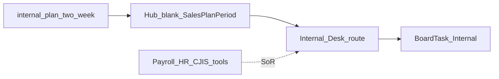

# Design: Hub Internal Desk

## Goal

Give the Internal epic owner a Hub **two-week coaching plan** for company ops (payroll/finance closes, employee CJIS/security items, process blockers, cross-epic dependencies), with day-blocks on the notecard board — without building a full HR/finance system in Hub.

## Context

- Why now: CVE desks (Acquire → Advocate) are plan + board; Internal is the company-ops lane on the board ([notecard board](hub-notecard-board.md)) and needs the same coaching period.
- Related design: [Hub epic plans](hub-epic-plans.md), [Hub notecard board](hub-notecard-board.md)
- Related templates: [Two-week internal plan](../../templates/internal-plan-two-week.md)
- Related: [Epic plan goals — Internal](../../strategy/epic-kpis.md#internal)
- Implementation: TLS-Hub `/internal` + `SalesPlanPeriod` with `Epic = Internal`

## Decisions

1. **v0.1 = plan + board desk** — `/internal` hosts the two-week plan (goals, named priorities, day-blocks). No payroll, HRIS, or compliance vault in Hub.
2. **Productize Internal plan goals** — Seed blanks from [internal-plan-two-week](../../templates/internal-plan-two-week.md) / [epic plan goals](../../strategy/epic-kpis.md#internal).
3. **Ops SoR stays outside Hub** — Payroll, banking, CJIS personnel files, and legal remain in their existing tools; Hub plan does not replace them.
4. **Cards carry executable work** — Day-blocks sync to Internal-epic `BoardTask` cards (payroll run, CJIS checklist, blocker clear, dependency unblock).
5. **Internal is not a CVE customer phase** — Same board epic color/lane, different SoR and vocabulary (ops items, not agencies/deals).

### Alternatives considered

| Alternative | Why not for v0.1 |
|-------------|------------------|
| Skip Internal desk; Home Plans only | Breaks parity; owners still need a dedicated plan home |
| Full company Scorecard as the desk | Scorecard is company KPIs; this desk is period coaching |
| Board-only | Loses period goals and Friday check-in |

### Consequences

- Starting goals are intentionally light until Internal SOPs exist.
- Company Funding RT / founder-time KPIs stay on a future Scorecard — plan rows stay **Goals**.

## Scope

### In scope (v0.1)

- Docs: Internal two-week plan template + this design
- Hub: `/internal` desk + `/internal/plans` history; Internal-shaped blank template; priority labels (item · type)
- Home Plans: current Internal period; day-blocks → board

### Out of scope (v0.1)

- Payroll / HRIS / banking integrations
- CJIS personnel record store
- Company Scorecard KPI warehouse
- Full Internal SOP catalog

## Approach (high level)

1. Design (this doc).
2. Docs template for Internal two-week plan.
3. Hub desk + history + nav; catalog already seeds Internal goals.
4. Pilot: Internal owner runs one real period in Hub.

## Open questions

- <mark style="color:red;">**TODO:**</mark> Named Internal SOPs (payroll close, employee CJIS onboarding) when process is written down.
- <mark style="color:red;">**TODO:**</mark> Whether founder-time tracking belongs on Internal plan goals or only on Scorecard.

## Follow-on work

| Phase | Work |
|-------|------|
| Pilot | One real Internal two-week period from `/internal` |
| Later | Internal SOPs + tighter goal definitions |
| Later | Scorecard for company / founder-leverage metrics |
