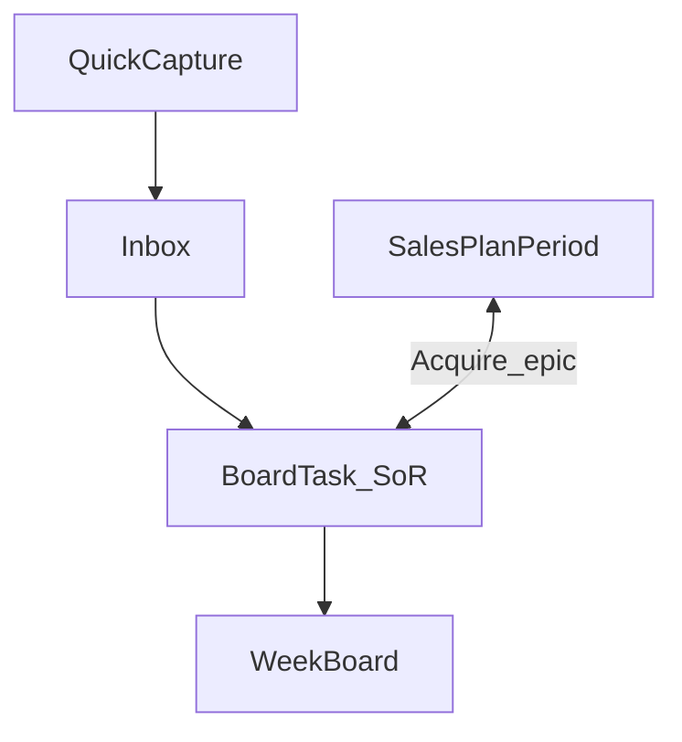

# Design: Hub notecard board

## Goal

Make Hub’s shared board a digital notecard system for day-to-day execution (inbox → triage → week board), with the Acquire two-week plan as coaching context that syncs both ways with Acquire-tagged cards.

## Context

- Why now: Physical notecards already encode the real workflow (verb title, flip-side notes, fluid target date, completed date, piles). The thin “today checklist from plan day-blocks” model is not enough.
- Related design: [Hub Acquire Desk](hub-acquire-desk.md), [Hub epic plans](hub-epic-plans.md), [Hub Deliver Desk](hub-deliver-desk.md), [Hub Operate Desk](hub-operate-desk.md), [Hub Expand Desk](hub-expand-desk.md)
- Implementation: TLS-Hub (`BoardTask`, `/tlsapi/board`, Home week board UI)

## Decisions

1. **Cards are the system of record** for title, notes, target date, completed date, blocked state, epic, owner, and successor links.
2. **Piles** — Inbox and Blocked are explicit (`TargetDate == null` / `IsBlocked`); This week / Next week / Future are **derived** from `TargetDate` relative to the viewed week (Monday start).
3. **Epic** (Acquire, Deliver, Operate, Expand, Advocate, Internal; legacy Development) drives card accent color; completed date always renders in neutral/black. Internal is for company ops (payroll, employee CJIS, etc.), not a CVE customer phase.
4. **Rewrite vs spawn** — evolve title on the same card (notes kept), or complete and create a linked successor (`SuccessorOfTaskId`).
5. **Board is personal-first** (filter by Hub user); “All people” remains a manager view.
6. **Acquire plan sync (Phase A)** — plan day-blocks publish to cards; saving an Acquire-epic card with a target date inside the owner’s current plan window upserts a day-block linked by `BoardTaskId`. Last write wins on the card. Forward sync must not delete non–plan-sourced cards.
7. **Phase B (later)** — plan week grid becomes a view of cards; day-block JSON becomes a read-only mirror or is removed.

### Alternatives considered

| Alternative | Why not |
|-------------|---------|
| Keep day-blocks as SoR | Dual-edit pain; cards stay second-class |
| Explicit pile enum for This/Next/Future | Dates already move constantly; derivation matches real life |
| Descope as user table | HubUsers seed is enough for owner selects |

### Consequences

- Home becomes a week board (agenda + calendar), not today-only.
- Acquire Desk goals/priorities/check-in stay on `SalesPlanPeriod`; executable work lives on cards.
- Email/Quo auto-ingest stays out of scope until quick-capture habit lands.

## Scope

### In scope

- Evolved `BoardTask` notecard fields + week/pile APIs
- Home: week arrows, agenda/calendar, quick inbox create, card detail (notes / complete / successor)
- Bi-directional sync with current Acquire plan (Phase A)

### Out of scope

- Email/Quo auto-ingest
- Drag-and-drop Kanban physics / offline mobile
- Replacing Pipedrive or Work Items
- Descope user sync

## Approach (high level)

1. Design (this doc).
2. Extend `BoardTask` + board CRUD / week APIs.
3. Replace Home with week navigator + agenda/calendar + card UI.
4. Reverse-publish Acquire cards into the current plan day grid.

## Open questions

- <mark style="color:red;">**TODO:**</mark> Client/Contact FK tags vs free-text tags (v1 uses optional `ClientTag` string).
- <mark style="color:red;">**TODO:**</mark> When to deprecate editable day-blocks in Acquire Desk UI (Phase B).

## Follow-on work

| Phase | Work |
|-------|------|
| Phase B | Plan week grid = card projection only |
| Later | Capture shortcuts from email/Quo; richer person/client tags |
