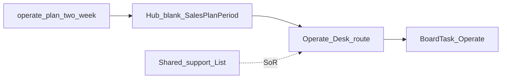

# Design: Hub Operate Desk

## Goal

Give the Operate epic owner a Hub **two-week coaching plan** for support triage and product-update rhythm, with day-blocks on the notecard board — without building a full ticketing system in Hub yet.

## Context

- Why now: Deliver Desk established the plan + board pattern; Operate SOPs ([triage](../../sops/operate/triage-support-request.md), [publish product update](../../sops/operate/publish-product-update.md)) already define starting metrics.
- Related design: [Hub epic plans](hub-epic-plans.md), [Hub Deliver Desk](hub-deliver-desk.md), [Hub notecard board](hub-notecard-board.md)
- Related templates: [Two-week operate plan](../../templates/operate-plan-two-week.md)
- Related: [Operate CVE](../../customer-value-engine/operate/README.md), [Operate authority](../../policies/operate-authority.md)
- Implementation: TLS-Hub `/operate` + `SalesPlanPeriod` with `Epic = Operate`

## Decisions

1. **v0.1 = plan + board desk** — `/operate` hosts the two-week plan (goals, named priorities, day-blocks). No ticket inbox, playbooks catalog, or email sender in Hub.
2. **Productize Operate plan goals** — Seed blanks from [operate-plan-two-week](../../templates/operate-plan-two-week.md) / [epic plan goals](../../strategy/epic-kpis.md#operate); do not invent process.
3. **Support SoR stays outside Hub for now** — Shared support List (or successor) remains where requests are logged; Hub plan does not replace it.
4. **Cards carry executable work** — Day-blocks sync to Operate-epic `BoardTask` cards (triage blocks, release prep, customer follow-ups).
5. **Do not clone Acquire Desk** — No Pipedrive/outreach tools. Do not clone a full ITSM product.

### Alternatives considered

| Alternative | Why not for v0.1 |
|-------------|------------------|
| Full Hub ticket system | Large; SOP still targeting shared List first |
| Fold Operate into Deliver Desk | Different owner rhythm and SoR (support vs engagement workspace) |
| Board-only | Loses period goals and Friday check-in |

### Consequences

- Gibson (steady support) / product owner (updates) still use the shared list and release process; Hub is coaching + board execution.
- Company Funding RT KPIs (response time trends, ships/month) stay on a future Scorecard — plan rows stay **Goals**.

## Scope

### In scope (v0.1)

- Docs: Operate two-week plan template + this design
- Hub: `/operate` desk + `/operate/plans` history; Operate-shaped blank template; priority labels (agency/issue · severity)
- Home Plans: current Operate period; day-blocks → board

### Out of scope (v0.1)

- Ticket inbox / shared List UI in Hub
- Auto-ingest from email/Quo
- Company Scorecard KPI warehouse
- Customer release email sender (template remains in docs)

## Approach (high level)

1. Design (this doc).
2. Docs template for Operate two-week plan.
3. Hub desk + history + nav; catalog already seeds Operate goals.
4. Pilot: Operate owner runs one real period in Hub.

## Open questions

- <mark style="color:red;">**TODO:**</mark> When shared support List exists, deep-link from named priorities.
- <mark style="color:red;">**TODO:**</mark> Whether hypercare-period support is Deliver-owned vs Operate-owned in the plan UI (SOPs: Fugate in hypercare; Gibson steady).

## Follow-on work

| Phase | Work |
|-------|------|
| Pilot | One real Operate two-week period from `/operate` |
| Later | Shared List integration / ticket deep links |
| Later | Scorecard auto-fill for support response and ships |
