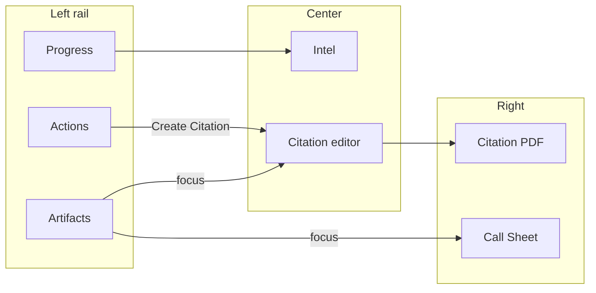

# Patrol Officer Command Center — Design Decisions

> **Source of truth:** Internal Docs (GitBook). Paths under `ThinLine.UI/` and `ThinLine.API/` refer to the product monorepo.

**Thin Line RMS · Officer Patrol dashboard and use-case workspaces**

Living design note for the Officer Command Center and guided **use cases** (starting with traffic stop). Captures product decisions, what is in v1, and what is deliberately deferred so future work does not re-litigate settled choices.

**Status:** Active (traffic-stop use case in progress on Patrol)  
**Related UI:** ``ThinLine.UI/src/components/dashboard/officer/`` (product monorepo: `ThinLine.UI/src/components/dashboard/officer/`)  
**Related stores:** ``patrolUseCaseStore.ts`` (product monorepo: `ThinLine.UI/src/stores/patrolUseCaseStore.ts`), ``patrolUseCaseConfigStore.ts`` (product monorepo: `ThinLine.UI/src/stores/patrolUseCaseConfigStore.ts`)

---

## 1. Product intent

The Officer Command Center is an **operational cockpit**: unit status, CAD work, intel, citations, and guided use cases in one place—not a second RMS desktop.

**Use cases** opinionate a common street workflow without blocking escape hatches (full call sheet, existing CAD/impound/citation surfaces).

| Principle | Meaning |
|-----------|---------|
| **Happy path is guided** | Rail + workspace steps for the common stop |
| **Escape hatches stay** | Call sheet and existing CAD/module actions remain available |
| **One job per surface** | Don’t fold Jail, tow inventory, crash investigation into the stop workspace |
| **Handoffs over inlining** | Arrest → booking, tow → impound/inventory are bridges to other modules later |

---

## 2. Layout model

Three-column layout while a use case is active:

| Column | Role |
|--------|------|
| **Left — Use-case rail** | Lifecycle: progress, **Actions** (Create Citation, Complete outcomes, Leave, Discard), **Artifacts** (call sheet + citations) |
| **Center — Work** | Intel and (when unlocked) Citation editor |
| **Right — Context** | Call Sheet and (when unlocked) Citation PDF preview |

Outside an active use case, the command center keeps its normal center tabs (calls, citations, lookup, etc.).

---

## 3. Traffic stop — v1 flow (decided)

### 3.1 Spine

1. **Start use case** → create/assign CAD call (configurable) → layout active  
2. **Intel** — plate/person search; clear hits can auto-add to call; session **tray** of candidates  
3. **Create Citation** (optional, repeatable) — unlocks citation editor + PDF; tray chips prefill person/vehicle  
4. **Complete** via rail outcomes (warnings, citation issued, close call, no action, keep open)  
5. **Close call / outcomes** dispose CFS; issuing a citation alone does **not** auto-close the call

### 3.2 Progress / rail

| Decision | Choice |
|----------|--------|
| Progress steps | **Intel → Citation → Complete** (no separate “Start” step) |
| Complete UX | Outcomes shown **directly on the rail** — no interstitial “Complete use case…” screen |
| Create action label | Always **Create Citation** (not “Open citation” / “New citation”) |
| Citation / PDF visibility | Hidden until Create Citation (or session already has citation artifacts / resumed on citation step) |
| Multiple citations | One stop supports **many** citations; artifacts list each draft/issued |
| Issuing a citation | Does **not** by itself close the CFS |
| Close call disposition | Context-aware: e.g. **CLR** if no citation issued this stop, **CI** after issue (configurable in gear dialog) |
| Artifacts | Clickable **Call sheet** + citation rows; focus switches center/right panels |
| Intel footer actions | Removed; lifecycle stays on the left rail |
| Actions header | Primary section label above Create / Complete / Leave / Discard |

### 3.3 Center / right tabs

| Surface | When visible |
|---------|----------------|
| Intel | Always during traffic stop |
| Citation tab + editor | After Create Citation (or existing artifacts / unlocked session) |
| Call Sheet | Always (right) |
| Citation PDF | Same unlock gate as Citation; tab chrome hidden when only Call Sheet |

Sticky unlock: once citation surface is opened, switching back to Intel must **not** tear down a draft before it is registered in artifacts.

### 3.4 Intel ↔ citation ↔ call

| Concern | Decision |
|---------|----------|
| Tray | Session tray merges intel ∪ call sheet ∪ citation picks; badges Intel / Call / Citation |
| Prefill | Tray chip → `loadPerson` / `loadVehicle` on citation editor |
| Call notes | Optional notes: `Citation started` (no TEMP number) / `Citation issued — {n}`; deduped via persisted session keys + existing notes |
| Snapshot sync | Optional push of person/vehicle/location snapshots onto the open call |
| Agency TRAFFIC STOP template prompts | Cleared for AgencyId 0 (migration) so mobile citation isn’t noisy for the stop path |

### 3.5 Outcomes (traffic stop)

Base outcomes (labels/disposition codes configurable):

- Citation issued  
- Verbal warning  
- Written warning  
- Close call (CLR / CI when citation issued)  
- No action  
- Keep CFS open  

Written warning is an **outcome** today; a first-class written-warning **document** is not required for v1 (see deferred).

### 3.6 Opinionation stance

- **Guided** via rail Complete and Create Citation.  
- **Call-sheet CAD actions** remain the escape hatch for atypical work.  
- If guided outcomes and CAD actions disagree later, **reconcile** (shared disposition mapping / disable duplicate paths)—do not invent a third parallel close path in the stop workspace.

---

## 4. Configuration (local)

Gear dialog / `patrolUseCaseConfigStore` (browser-local for now):

| Workflow flag | Intent |
|---------------|--------|
| `createCadCallOnStart` | Create/assign CAD call when starting a use case |
| `syncCitationSnapshotsToCall` | Push citation party/location onto the call |
| `postCitationNotesToCall` | Post started/issued citation notes |
| `autoCompleteOnArtifactIssue` | Jump toward complete when artifact issued |
| `disposeCallOnDiscard` | Clear unit / dispose CFS on Discard |

Outcome → `_DSD` disposition mappings per use-case kind, including Close call’s **when citation issued** override.

**Future:** promote config to agency settings when Patrol leaves spike/local storage.

---

## 5. Criminal trespass use case

**Spine:** Intel (person + organization) → **Create Trespass** (immediate `POST /criminal-trespasses` as **Draft**) → Notice editor + client PDF preview → **Mark as Issued** → rail outcomes.

| Surface | Behavior |
|---------|----------|
| Progress | Intel → Notice → Complete |
| Intel | Person + organization search; session tray includes orgs; premises location primarily from selected org address |
| Create Trespass | Requires tray subject person; `GET /new` then immediate POST (no TEMP drafts); default notice type `WRIT`; starts in **Draft** |
| Issue | Workflow Draft → Issued; premises/complainant completeness gated here; attaches Letter notice PDF (refreshed on re-issue) |
| Reopen | Issued → Draft (**Reset for Edit**); Revoke stays `_CTPS` status (not a workflow state) |
| Center / right | Notice editor + Notice PDF gated until create (or existing artifacts / resumed notice step) |
| Multiple notices | Session `trespasses[]`; rail Create always available; artifacts focus a notice |
| Sync | Call notes (`Trespass notice created — {number}`), CallModules `CTP`, Module Record Group member `CTP` |
| PDF | Client jsPDF 4″ notice (`usePatrolTrespassNoticeRenderer`); Letter **detail** + Letter **notice** via API QuestPDF (`full-pdf` / `notice-pdf`). No server 4″ PDF. Premises: RES (complainant person + location) / NRES (org + contact person + location). |

**Other** kind remains a lighter stub with its own outcomes — do not force traffic-stop or trespass tabs onto it.

---

## 6. Deferred / out of scope for traffic-stop v1

These are **real street events**, not “never.” They stay out of the stop workspace until a deliberate handoff or separate use case exists.

### 6.1 Custodial arrest → booking

| | |
|--|--|
| **Why deferred** | Most stops never book; Jail booking is a heavy workflow (charges, property, medical, prints, housing). Inlining it dilutes cite/warn/clear. |
| **Existing work** | Jail booking / JCC: backlog **BL-002**, **BL-003** |
| **Future shape** | Rail outcome or action: **Arrest — continue to booking** → dispose/handoff CFS appropriately, carry person/vehicle context into Jail booking (or My Work). **Handoff, not an in-stop booking UI.** |

### 6.2 Tow / wrecker / vehicle inventory

| | |
|--|--|
| **Why deferred** | Branch for arrest, DUI, hazard, obstruction—not the spine. Vehicle inventory is long-form / evidence-adjacent. |
| **Escape hatch now** | CAD **impound log** from call-sheet vehicle card (`CadImpoundLogDialog` / impound-log APIs) |
| **Future shape** | Rail action **Tow / impound** that opens existing CAD impound (and later inventory) with stop vehicle prefilled. Inventory remains its own document/flow if productized. |

### 6.3 Written warning as a document

Outcome exists; agencies may later need a printable written warning artifact analogous to citation. Until then, disposition + notes suffice.

### 6.4 Field interview / contact card

Adjacent RMS product. Do not add FI as a traffic-stop center tab; optional later handoff from intel tray.

### 6.5 Crash / DUI / major investigation

Different use case (or classic module handoff). Do not grow traffic-stop tabs into investigation workspaces.

### 6.6 Shift location / pinned masters

**Shift location (header):** Implemented — set/clear on Officer Command Center; prefills new citations and use-case CAD calls. See **§11**.

**Per-user pinned masters:** Still deferred; evolve Quick Locations toward personal lists and optionally “set as shift location.”

### 6.7 Module Record Groups + CallModules (dual-write)

**Decision:** Each patrol use case owns one **Module Record Group**. Durable records created in that use case are added as group members. **CallModules** is also written for issued citations (and the call remains the CAD-facing link) until CallModules is migrated onto groups.

| Event | Module Record Group | CallModules |
|-------|---------------------|-------------|
| Use case gets a CAD call | Seed/add `CLL` member | — |
| Citation issued | Add `CIT` member (real number/id) | Link `CIT` by number to the call |
| Trespass notice created | Add `CTP` member (real number/id) | Link `CTP` by number to the call (`CallController` supports CTP like CIT/INC) |
| Later booking / incident | Add member | Link when CAD still needs it |

Session fields: `moduleRecordGroupId`, `linkedModuleKeys` (dedupe). Implementation: `composables/patrol/usePatrolUseCaseRecordLinks.ts`.

### 6.8 Other possible later polish (still in-scope of Patrol, not Jail)

| Item | Notes |
|------|--------|
| Resume / multi-cite edge cases | Refresh with drafts; focus artifact ↔ PDF |
| Server-backed use-case config | Replace localStorage |
| Stronger CAD disposition reconciliation | Single source of truth vs call-sheet close |
| Written warning artifact | If agencies require it |
| Arrest / tow handoff buttons | Thin bridges only |
| Trespass Texas / signature / complainant parity | Classic module fields beyond patrol v1 |
| Other use case spine | Own product spine when prioritized |
| Server QuestPDF as live patrol trespass preview | Client jsPDF is the live 4″ preview; Letter notice/detail stay API |

---

## 7. Code anchors (implementation map)

| Concern | Primary location |
|---------|------------------|
| Command center shell | `OfficerCommandCenter.vue` |
| Use-case rail | `PatrolUseCaseRail.vue` |
| Traffic-stop workspace | `PatrolTrafficStopWorkspace.vue` |
| Trespass workspace | `PatrolTrespassWorkspace.vue` |
| Intel panel | `PatrolTrafficStopIntelPanel.vue` / `PatrolTrespassIntelPanel.vue` |
| Candidate tray | `PatrolStopCandidateTray.vue` / `PatrolTrespassCandidateTray.vue` |
| Citations in stop | `PatrolCitationsWorkspace.vue` |
| Trespass editor | `PatrolTrespassEditor.vue` |
| PDF preview | `PatrolCitationPdfPreview.vue` / `PatrolTrespassPdfPreview.vue` |
| Session / artifacts / steps | `stores/patrolUseCaseStore.ts` |
| Workflow + disposition config | `stores/patrolUseCaseConfigStore.ts` |
| Citation → call snapshots | `composables/patrol/useSyncCitationToCallSheet.ts` |
| Citation → call notes | `composables/patrol/usePatrolCitationCallNotes.ts` |
| Trespass → call notes | `composables/patrol/usePatrolTrespassCallNotes.ts` |
| Use-case record links (MRG + CallModules) | `composables/patrol/usePatrolUseCaseRecordLinks.ts` |
| Config UI | `PatrolUseCaseConfigDialog.vue` |
| Shift location | `PatrolShiftLocationControl.vue`, `stores/patrolShiftLocationStore.ts` |
| Unit tests | `tests/unit/patrolUseCaseStore.spec.ts`, `tests/unit/patrolShiftLocationStore.spec.ts`, `tests/unit/usePatrolUseCaseRecordLinks.spec.ts`, related patrol specs |

---

## 8. Non-goals (explicit)

- Replacing the full CAD call sheet or classic Citations module  
- Embedding Jail booking or full tow inventory in the stop layout  
- Auto-closing CFS solely because a citation was issued  
- Showing Citation / PDF chrome before the officer chooses Create Citation (except resume with existing artifacts)

---

## 9. Decision log

| Date | Decision |
|------|----------|
| 2026-07 | Traffic stop spine: CAD → Intel → optional citation(s) → rail outcomes |
| 2026-07 | No interstitial complete step; outcomes always on rail |
| 2026-07 | Issuing citation ≠ closing CFS; Close call uses CLR vs CI |
| 2026-07 | Multiple citations per stop; Artifacts list replaces passive Context |
| 2026-07 | Create Citation label; gate Citation + PDF until create (or existing artifacts) |
| 2026-07 | Booking and tow/inventory: **future handoffs**, not in-stop features |
| 2026-07 | Call-sheet CAD remains escape hatch; reconcile opinionation later if needed |
| 2026-07 | Location/shift: header Shift location spike shipped (see **§11**); per-user pins still follow-on |
| 2026-07 | Dual-write: one Module Record Group per use case + CallModules for issued citations (§6.7) |
| 2026-07 | Criminal trespass spine: Intel → Create Trespass (immediate POST) → editor/PDF; multi-notice; dual-write `CTP` (§5) |
| 2026-07 | MRG auth: `TestModule*ClaimForActiveUser` recognizes `CLL` (CAD modify) and `CTP` (criminal trespass modify) so patrol can seed/link groups |
| 2026-07 | CallModules: `POST /calls/{id}/modules` accepts `CTP` (link existing criminal trespass), same pattern as CIT/INC |
| 2026-07 | CTP prints: Letter detail + Letter notice (API QuestPDF); 4″ notice client jsPDF only (no server `mobile-pdf`) |
| 2026-07 | CTP premises: RES = complainant person + location; NRES = org + contact person + location; free-text complainant/premises retained but hidden in UI |
| 2026-07 | CTP workflow: Draft ↔ Issued; save allows incomplete premises; Issue runs workflow validation + attaches Letter notice PDF; Reset for Edit; Revoke stays `_CTPS` status |

---

## 10. How to use this document

- Before adding a new tab, outcome, or rail action to traffic stop: check **§6** and **§8**.  
- Prefer **handoff** language in tickets (“open impound with vehicle X”) over “build inventory in Patrol.”  
- Location / shift-default work: start from **§11** (as-built agency pin + Quick Locations) — do not invent a parallel store.  
- When a deferred item is scheduled, add a backlog plan and link it here under §6; move the row’s status from deferred → planned → done in the decision log.

---

## 11. Location pinning — as-built and options for Patrol

### 11.1 What exists today (do not re-litigate without reading this)

ThinLine already has **two** location-related mechanisms. They are easy to confuse with **module record pins** (`Pinned.vue` / recent favorites), which are a third, unrelated pattern (pin a citation/call/etc. for nav).

#### A. Agency (tenant) pinned location — single default

| | |
|--|--|
| **Storage** | `Agencies.PinnedMasterLocationSnapshotId` (ThinLineCommon) |
| **Admin UI** | Agency General → `location-module-card` bound to that field (`AdminAgencyGeneral.vue`); edit gated to full support user |
| **Exposed to client** | Copied onto **every** `SystemUser` payload as `pinnedMasterLocationSnapshotId` / `pinnedMasterLocationDescription` (`SystemUserViewModelFactory`) — **not** a per-user column |
| **Description quirk** | Description is currently **hardcoded** `"Police Station"` in the factory, not loaded from the master location |
| **Merge** | `AgencyDataStore` retargets agencies when location snapshots merge |
| **Role** | One agency-wide “home” location (station / HQ), used as the first Quick Locations entry |

This is **not** “officer parked at Main & 1st for radar.” It is “tenant default location,” typically the police station.

#### B. Quick Locations — `FavoriteMasterItems` (tenant-wide list)

| | |
|--|--|
| **Storage** | `FavoriteMasterItems` (`MasterGroupCode` e.g. `MLI`, `MasterId`, description); `CreatedBy` exists via `IUserEditable` but **lists are not filtered by user** |
| **API** | `GetAllFavoriteLocationsAsync` → all MLI favorites in the DB for the tenant |
| **UI add/remove** | Location master card → “Add to Quick Locations” / remove (`LocationCard.vue`); claim `MasterFavoriteModify` |
| **UI consume** | `MasterFavoritesMenu` (“Quick Locations”) on address quick controls when `showPinned` and agency pin is set (`AddressQuickControl.vue`) |
| **Menu shape** | **Row 1:** agency pinned snapshot (label from user payload, often “Police Station”). **Then:** all favorite location masters (resolved to current snapshot on select) |
| **Gate** | Menu is `v-if="pinnedMasterLocationSnapshotId"` — **no agency pin ⇒ no Quick Locations menu**, even if favorites exist |

So today: **one tenant default + a shared agency shortlist**, not personal pins.

#### C. Module pins (for contrast)

Per-user pin/recent of **module records** (navigate back to a citation, call, etc.). Same thumbtack metaphor, **different data**. Do not overload this for master locations without an intentional product merge.

### 11.2 Requirement: stationary traffic for a shift

Officers may sit one enforcement location for an entire shift and want citations (and optionally new CAD calls) to **prefill** that location until they move.

That is **shift-scoped active location**, which neither (A) nor (B) fully provides:

- (A) is usually the station, wrong for radar.  
- (B) shortens picking but still requires a click per document, and the list is shared across the agency.

### 11.3 Options (evaluated against as-built)

| Option | Fit | Notes |
|--------|-----|--------|
| **1. Patrol-only “shift location” on dashboard** | Solves auto-prefill | Easy to ship; risks a third location concept if it ignores Quick Locations |
| **2. Per-user pinned masters** (module-pin mental model) | Solves personal shortlist | Aligns with “manage my spots”; **FavoriteMasterItems today are tenant-wide** — would need user scoping (or a new table) + UI. Does **not** alone remove per-cite clicks |
| **3. Pins + “active / shift” on one pin** | Best long-term product fit | Reuse Quick Locations UX; agency pin stays fallback; active pin prefills cites/calls until cleared |
| **4. Copy last citation location** | Cheap | Wrong after the officer moves; no explicit control |
| **5. AVL / unit position** | Later | Optional when AVL is trustworthy; bad sole source for stationary enforcement |

**Implemented (spike):** Option **1** — header **Shift location** on Officer Command Center (`PatrolShiftLocationControl` + `patrolShiftLocationStore`). Set via Address Quick Control (includes agency pin / Quick Locations when available); Clear removes it. Persisted in browser localStorage for the browser profile.

**Prefill behavior when set:**

| Create path | Behavior |
|-------------|----------|
| New mobile citation (add) | `MobileCitationAddEdit` loads shift snapshot after draft create |
| Traffic stop CAD (TRAFFIC STOP template) | `applyCallTemplate` receives `masterLocationSnapshotId` |
| Other use-case CAD (`addCall`) | After create, `updateCall` sets location if missing/different |

Override remains available on each document. Agency pin and Quick Locations are unchanged.

**Recommended next evolution:** Option **3** — set shift location from (future) per-user pins; keep this header active control.

### 11.4 Explicit non-goals for this slice

- Replacing agency pin with “whatever the officer last used”  
- Auto-updating AVL or unit status merely because shift location was set  
- Putting location management only inside the traffic-stop rail (shift spans many stops and standalone cites)

### 11.5 Decision log (location)

| Date | Decision |
|------|----------|
| 2026-07 | Documented as-built: agency pin = single tenant default on `Agencies`; Quick Locations = tenant-wide `FavoriteMasterItems`; user payload mirrors agency pin (hardcoded “Police Station” label) |
| 2026-07 | Preferred future: per-user (or personal) master location pins + optional shift-active prefill; do not invent a Patrol-only parallel store of places |
| 2026-07 | **Spike shipped:** header Shift location (localStorage) prefills new citations + use-case CAD calls; picker reuses Address Quick Control / Quick Locations |
| 2026-07 | Shift/radar requirement no longer “deferred only” — header control is live; per-user pins remain a follow-on |
