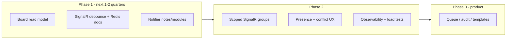

---
backlog: "BL-022 · CAD · Large-agency architectural remediation"
status: in-progress
created: 2026-05-25
updated: 2026-05-25
---

# Plan: CAD large-agency remediation (remaining work)

## Goal

Close **open** gaps from product-repo `Docs/CAD-Architectural-Audit.md` (#4 dispatch board, #5 SignalR, UX/ops) for **high-volume call centers** with **multiple concurrent dispatchers**.

**Prerequisite (complete):** [`BL-022-cad-state-centralization.md`](BL-022-cad-state-centralization.md)

## Context

- **Backlog:** [`PRIORITIZED.md`](../prioritized.md) — **BL-022**
- **Audit:** product-repo `Docs/CAD-Architectural-Audit.md` — open items + forward roadmap
- **Risk / lane:** feature + reliability; API, UI, ops docs — not migrations/auth/billing unless scoped

---

## Timeline

| Phase | When | Focus | Audit |
|-------|------|--------|-------|
| **Phase 1** | Next 1–2 quarters | Board read model; SignalR debounce + Redis; notifier parity | #4, #5 |
| **Phase 2** | Following | Scoped groups / deltas; presence; 409 UX; logging/metrics | #5 |
| **Phase 3** | Product-led | Queue, audit timeline, templates, filtered boards | — |

---

## Tier 1 — Do next (scale + reliability)

### 1. Dispatch board scaling (audit #4)

**Problem:** `GetOpenAndClosedCallViewModels` loads all open + 24h closed, then N× `GetCallCardViewModelAsync` (N+1).

**Approach:**

1. Read model / projection for call **cards** (no full call graph).
2. Replace N+1 in `CallViewModelFactory.GetOpenAndClosedCallViewModels`.
3. Bound default load (pagination, virtual scroll, or narrower closed window).
4. Full call graph only when opening a call sheet.
5. Load test at **100+ open calls**.

**Exit criteria:** Board p95 acceptable at 100+ open calls; single bounded query; no per-call N+1 on default path.

### 2. SignalR scaling (audit #5)

**Problem:** Single `CadGroup`; every change triggers refetch on every client.

| Step | Work | Owner |
|------|------|-------|
| **A** | Document + enforce **Redis required** for multi-instance CAD | Ops + dev |
| **B** | Client debounce/coalesce refetches per `callId` / `callUnitId` (~300–500ms) | UI |
| **C** | Scoped groups (per-agency; optionally per open call) | API + UI |
| **D** | Delta payloads (ids + change kind + optional `rowVersion`) | API + UI |

**Exit criteria:** Redis mandatory in scaled deploy docs; measurable refetch reduction under bursty updates.

### 3. Notifier parity

1. Notifier methods for **note added** and **module association changed**.
2. Remove direct hub/webhook calls from those `CallController` paths (keep resync endpoints as-is).

**Exit criteria:** No hub/webhook on call mutation paths in `CallController` except resync.

---

## Tier 2 — Security & multi-tenant hardening

1. Agency/tenant scoping audit + cross-agency integration tests.
2. Webhook ops — key rotation, delivery failure logging (extend product-repo `Docs/CAD-Outbound-Webhooks-Consumer-Guide.md`).
3. Structured observability — 409 fields, board load duration, SignalR refetch rate.

---

## Tier 3 — Ease of use (multi-dispatcher UX)

1. **Presence** — who is viewing/editing a call; optional advisory lock.
2. **Conflict UX** — banner after 409, highlight changed fields, unit state in message.
3. **Workflow polish** — keyboard nav (**BL-022-11**), call templates (**BL-022-12**), bulk clear (**BL-022-13**), filtered board (**BL-022-14**), unsaved-change guards. Detail: product-repo `Docs/CAD-Architectural-Audit.md` Tier 3.

---

## Tier 4 — Domain features (product / RFP)

| Feature | Notes |
|---------|--------|
| Dispatch audit timeline | Beyond auto dispatch notes |
| Call queue / pending stack | Created vs actively dispatched |
| Unit recommendation | AVL + status-aware suggest |
| Read-only dispatcher UX | **`CAD_READONLY` exists** — API largely enforced; UI polish + banner (BL-022-18) |
| Degraded-mode UX | Visible SignalR reconnect / resync |

---

## Tier 5 — Engineering practices

1. Load testing — 10–20 simulated dispatchers, 200 open calls, sustained status updates.
2. Concurrency integration scenarios — assign + close, remove + status, dual writer.
3. Optional `UpdateCallFromViewModelAsync` on `CallService`.

---

## Top three if capacity is limited

1. Dispatch board read model + bounded load  
2. SignalR debounce + Redis + scoped groups  
3. Presence + richer 409 UX  

---

## Implementation slices (sequential PRs)

| PR / slice | Tier | Delivers |
|------------|------|----------|
| **BL-022-1** | T1 | Board card projection + bounded query |
| **BL-022-2** | T1 | UI virtual scroll or pagination; configurable closed window |
| **BL-022-3** | T1 | Client refetch debounce |
| **BL-022-4** | T1 | Redis requirement doc + deploy checklist |
| **BL-022-5** | T1 | Notifier for notes + modules |
| **BL-022-6** | T2 | Agency scoping integration tests |
| **BL-022-7** | T2 | Structured 409 + board load logging |
| **BL-022-8** | T2 | SignalR scoped groups (agency) |
| **BL-022-9** | T3 | Call-sheet presence (MVP) |
| **BL-022-10** | T5 | Load test script + baseline numbers |
| **BL-022-11** | T3 | Keyboard navigation — **MVP done** — product-repo `Docs/CAD-Keyboard-Navigation.md` |
| **BL-022-12** | T3 | Call templates |
| **BL-022-13** | T3 | Bulk unit clear |
| **BL-022-14** | T3 | Filtered board views (UI filter only) |

Update product-repo `Docs/CAD-Architectural-Audit.md` when each slice lands.

---

## Files / areas

| Area | Paths |
|------|--------|
| Board read model | `CallViewModelFactory`, `CallDataStore`, SQL view / DTO |
| SignalR | `CadHubService`, `CadHub`, `cadHubService.ts`, `cadStore.ts` |
| Notifier | `ICadCallMutationNotifier`, `CallController` (notes, modules) |
| Infra docs | `Infrastructure/`, deployment README |
| Tests | `ThinLine.API.UnitTests/CAD/`, `ThinLine.API.IntegrationTests/CAD/` |

---

## Verification

- [ ] `dotnet build ThinLine.API/ThinLine.Server.slnx`
- [ ] `dotnet test … --filter "FullyQualifiedName~ThinLine.API.UnitTests.CAD"`
- [ ] Scoped coverage when touching BO/WebAPI CAD paths
- [ ] Integration (Docker SQL): CAD filter + `IntegrationTests.runsettings`
- [ ] UI (when touched): `npm run lint` and `npm run build` in `ThinLine.UI`
- [ ] Load test baseline before/after board + SignalR changes

---

## Open questions

| Question | Status |
|----------|--------|
| Default **closed-call window** (24h vs 4h vs per-agency)? | Open — product |
| Is **Redis mandatory** in production? | Open — infra |
| **Advisory locks** vs presence-only? | Open — product |
| Mega-board vs **filtered views**? | Open — product |
| Board read model: EF projection vs SQL view? | Open — BL-022-1 spike |

---

## Notes

- Sequential PRs per slices above; no EF migrations for board read model until BL-022-1 approach agreed.
- Webhook ordering: product-repo `Docs/CAD-Outbound-Webhooks-Consumer-Guide.md` §9.

## Related

- [`BL-022-cad-state-centralization.md`](BL-022-cad-state-centralization.md) — completed prerequisite (archive)
- product-repo `Docs/CAD-Architectural-Audit.md`
