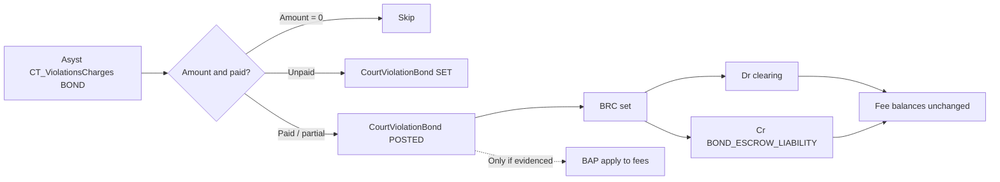

# Plan: Asyst BOND charge → CourtViolationBond + escrow (BRC)

## Goal

Stop treating Asyst `ChargeCode = BOND` as an `AccountingFees` line. Convert those amounts into Thin Line **bond escrow**: `CourtViolationBonds` + **BRC** transaction sets crediting `BOND_ESCROW_LIABILITY`, with **zero fee-balance impact**.

**Implementation (2026-07-29):** Phases A + B landed in Asyst pipeline (`19_Staging_Maps` `*BOND*` sentinel, `70_Accounting` / `71_BalanceReconcile` exclusions, `70b_Bonds_From_Staging.sql`, `00_Setup` bond teardown). Phase C skipped for New Deal (no BAP evidence). Phase D health: `Conversion6-Health/25_Bonds_EscrowHealth.sql` (+ vendor `70c_Bonds_Health.sql`).

## Context

- **Product model:** Bonds are escrow, not fees.
  - Entity: `CourtViolationBonds` (`BondType`, `BondAmount`, `BondStatus`, `BondReceiptTransactionSetId`, …).
  - Account: `BOND_ESCROW_LIABILITY` (`AccountingAccountCodes.BondEscrow`).
  - Set types: **BRC** (receipt), **BRD** (refund), **BAP** (apply escrow to fines/fees).
  - Runtime: `AccountingTransactionService.PostBondReceiptAsync` — Dr payment clearing / Cr escrow; **`FeeBalanceDebitAmount` / `FeeBalanceCreditAmount` = 0**.
- **New Deal Asyst extract (local staging):**
  - Catalog: `BOND` = “Bond posted for Deferred Adjudication”.
  - ~60 charge rows / ~$3,668 assessed; ~$3,623 paid via payment apps; ~32 zero-amount rows; 1 partial/unpaid.
  - Native `CT_Violations.BondPosted` / `BondSet` are unused (all zero/null) — money lives only on the charge line.
- **Today:** `19_Staging_Maps` parks `BOND` on research-holding fee `___`; `70_Accounting` posts it like any other fee. That is wrong for go-live balances.
- **Related product backlog (not this plan):** BL-004 / BL-005 (bond batch/export + finish bond logic). This plan is **conversion-only**.

## Approach

### Phase A — Stop fee pollution (small, do first)

1. In `19_Staging_Maps.sql`, **remove `BOND` from the `___` holding list** and add an explicit branch that marks it as non-fee, e.g. map sentinel `AccountingFeeCode = N'*BOND*'` (or omit from `_ConversionChargeCodeMap` entirely).
2. In `70_Accounting.sql` (charge assessments **and** payment applications):
   - **Exclude** rows whose legacy charge code is `BOND` (or mapped sentinel) from fee `AccountingTransactions` inserts.
   - Do **not** allocate BOND payment apps onto fee lines.
3. Health check: zero `AccountingTransactions` with fee code from legacy BOND / `___` that only existed for BOND.

**Tradeoff:** After Phase A, dollars disappear from the fee subledger until Phase B loads escrow. Acceptable between conversion runs; document in health scripts.

### Phase B — Load bond rows + BRC (correct model)

New pipeline script (suggested name): `71_Bonds_From_Staging.sql` (Asyst vendor + New Deal engagement copy), run **after** court violations exist and **after** (or instead of) fee import for those charges — order: violations → fees (excluding BOND) → **bonds** → payments (excluding BOND apps as fee paydowns; bond receipts handled here).

For each `CT_ViolationsCharges` row with `ChargeCode = BOND` and `Amount > 0` that maps to a converted `CourtViolations` row:

| Step | Action |
|------|--------|
| 1 | Insert `CourtViolationBonds`: `BondType = CASH`, `BondAmount = charge.Amount`, `BondSetDate` / `BondPostedDate` from charge `CreatedDate` (or payment date if clearer), `ConversionSource` e.g. `BONDCHG:{ChargeID}`. |
| 2 | Status: if `PaidToDate > 0` (or net payment apps > 0) → **POSTED**; if amount > 0 and unpaid → **SET** only (no BRC). |
| 3 | For posted cash: insert **BRC** `AccountingTransactionSets` + module transaction on the CV, lines Dr payment clearing / Cr `BOND_ESCROW_LIABILITY`, amount = **net cash posted** (prefer sum of non-reversed payment apps on that ChargeID; fallback `PaidToDate`). Set `FeeBalance*` = 0. Link `BondReceiptTransactionSetId`. |
| 4 | Payment method: derive from linked `CT_Payments.PaymentMethod` when possible; else default conversion tender (same as other PAY sets). |
| 5 | Idempotent on `ConversionSource` / bond receipt set source keys. |

**Zero-amount BOND rows (~32):** skip BRC; optional skip bond row entirely (noise) unless product wants a $0 SET marker — default **skip**.

**Partial unpaid:** create bond SET for full `Amount`, BRC only for paid portion; leave remainder as unposted set amount (or document as SET with partial receipt if product allows — confirm against bond service rules).

### Phase C — Apply-to-fines (BAP) — only if evidence exists

Asyst “bond posted for deferred adjudication” may have been consumed against costs later. **Do not invent BAP.**

1. Research whether payment apps / disposition actions show bond applied vs still held.
2. If clear: emit **BAP** (Dr escrow / credit fee allocation path per `ApplyBondEscrowToFinesAsync`) and set bond status **APPLIED** / update `AppliedAmountToFines`.
3. If unclear (likely for New Deal): leave escrow **POSTED**; clerks can apply/refund in-app. Health report: posted bond escrow vs open fee balances on same CV.

**New Deal finding (2026-07-29): skip Phase C.** All 28 positive BOND cases have the same receipt allocated to BOND **and** fee charges via payment apps (0 cases of fees cleared without fee pay apps). Auto-BAP would double-count. Leave bonds POSTED.

### Phase D — Verification / health

Add Conversion6 (or vendor) health checks:

- [ ] No fee txns whose conversion source is a BOND `ChargeID`.
- [ ] Count of `CourtViolationBonds` with `ConversionSource like 'BONDCHG:%'` ≈ count of positive BOND charges mapped to CVs.
- [ ] Sum of BRC credits to `BOND_ESCROW_LIABILITY` ≈ sum of net paid on BOND charges (~$3,623 for New Deal).
- [ ] Orphan BOND charges (no CV) listed, not silently dropped.

## Files / areas (expected)

| Area | Path |
|------|------|
| Map | `Utilities/Migration Tools/Asyst/SqlPackage/Pipeline/19_Staging_Maps.sql` (+ New Deal engagement copy) |
| Fee import filter | `…/Pipeline/70_Accounting.sql` |
| New bond load | `…/Pipeline/71_Bonds_From_Staging.sql` (new) |
| Pipeline order | Asyst `RunAll` / New Deal bat — insert step after 70 or split payments |
| GL map | `Overrides/11_AccountingAccounts_GLMap*.sql` — ensure `BOND_ESCROW_LIABILITY` mapped (already in TEMPLATE) |
| Health | `Conversion6-Health/` New Deal scripts |
| Product reference (read-only) | `AccountingTransactionService.PostBondReceiptAsync`, `CourtViolationBond`, bond status/type constants |
| Canvas | `new-deal-conversion-fallthroughs` — move BOND from “fee holding” to “bond escrow conversion” |

## Verification

- [ ] Re-run New Deal conversion on local `ThinLineRMS` after Phase A+B.
- [ ] Spot-check CTID with largest BOND (e.g. 183 / $220): bond row + BRC; **no** `___`/fee line for that ChargeID.
- [ ] Fee balance on that CV does not include the bond dollars.
- [ ] Account inquiry / trial: escrow liability increases by ~paid BOND total; agency fee revenue does not.

## Open questions

1. **Payment method on historical BRC** — use legacy tender, or force a conversion default (e.g. CSH) for all BRC?
2. **Unpaid / partial BOND** — SET-only vs SET + partial BRC; confirm product allows partial post.
3. **BAP discovery** — any New Deal signal that bond was applied to deferred-adjudication costs, or always leave POSTED?
4. **Surety / PR** — this extract’s BOND catalog is cash-for-DAP; any non-cash bond elsewhere in Asyst for other agencies?
5. Should Phase A ship alone (exclude from fees) before Phase B is ready, accepting temporary “missing” dollars on reports?

## Notes

- Mermaid (target flow):

- Do **not** introduce an `AccountingFees` code `BOND` or `TLS_BOND`.
- Related conversion fee work (TLS_DD / TLS_DSC) is independent; keep BOND out of that naming scheme.
