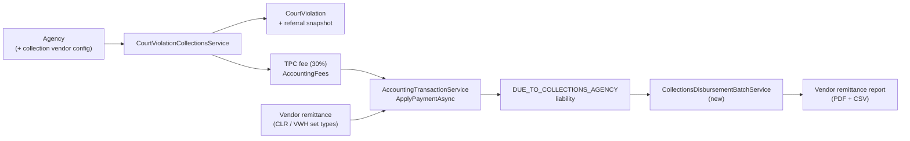

# Court Violation Third-Party Collections

> Plan for adding end-to-end support for referring criminal court violations to a third-party collector under Texas CCP 103.0031. Mirror of the Cursor plan file at `~/.cursor/plans/court-violation-third-party-collections_20f47730.plan.md`.

## Goal

Make a criminal court violation referrable to a contracted third-party collector per **Tex. Code Crim. Proc. Art. 103.0031** and post the **30% Third-Party Collections fee (TPC)** correctly in both directions of cash flow:

- **Court collects -> owes vendor**: defendant pays court directly; the 30% lands in a vendor liability and is disbursed in a periodic batch (check + remittance report).
- **Vendor collects -> owes court**: defendant pays the vendor; vendor remits principal to the court; clerk applies the remittance and the TPC line is cleared without cash.

Compliance anchors from Art. 103.0031:

- **(a)/(b)** Authority to add a 30% fee on items >60 days past due once referred to the contracted vendor.
- **(d)** **Indigent defendants are not liable** for the collection fee.
- **(e)** **Proportionate allocation** when partial payment is received.
- **(f)** Specific definitions of "more than 60 days past due" by item type.
- **(g)** The 30% **may only compensate the vendor** — not retained as court revenue.

---

## Current state (what we keep / reuse)

- `CourtViolation` already has rich state (`WorkflowStatusId`, `ProceduralStateCode`, `ComplianceStatusCode`, `BalanceAmount`) and a deprecated `IsIndigent` flag on the entity. See product-repo `ThinLine.API/ThinLine.Data.Model/Court/Entities/CourtViolations/CourtViolation.cs`.
- Fee code **`TPC` already exists** in `AccountingFees` as **"THIRD PARTY COLLECTIONS"** (category `REI`).
- Accounting GL constants in product-repo `ThinLine.API/ThinLine.RMS.Common/Constants/AccountingAccountCodes.cs` already declare:
  - `DueToCollectionsAgency = "DUE_TO_COLLECTIONS_AGENCY"` (liability)
  - `ExpCollections = "COLLECTIONS_EXPENSE"` (expense)
- Payment pipeline already supports non-cash satisfaction patterns (`JLT` jail credit, `CMS` community service) inside product-repo `ThinLine.API/ThinLine.Business.Objects/Accounting/Transactions/AccountingTransactionService.cs` — we will mirror this for vendor withholding.
- Settlement / batch infrastructure exists for inbound processor payouts (`AccountingSettlementBatch`, `AccountingDepositBatch`, `AccountingRevenueAllocationBatch`); a new **Collections Disbursement Batch** will sit alongside these.
- `Agency` carries court-tenant settings (`StripeConnectAccountId`, online flags, percent) — natural home for **one collection vendor per court** now, with referral-snapshot fields that allow many later.

## Architecture overview

GL pivots:

- **Remap TPC**: `AccountingAccountFeeAssociations` for fee code `TPC` changes from `LOCAL_FEE_COLLECTIONS_FUND` (revenue) to `DUE_TO_COLLECTIONS_AGENCY` (liability). When court collects, the 30% stays in liability until disbursed.
- **Vendor remits (no cash for TPC)**: clerk-side remittance posting uses a new "vendor withholding" credit on the TPC subledger line with no GL cash impact (mirrors `ZeroPaymentAsync`).

---

## Phase 1 — Referral state, 30% TPC assessment, indigency gate

Scope: model "in collections," assess `TPC` on referral, remap GL, surface in UI.

Data model

- New child table `CourtViolationCollectionsReferrals` (or columns on `CourtViolation`; child table preferred for audit/history). Suggested fields: `CourtViolationId`, `CollectionAgencyOrgSnapshotId?` (nullable for now; single vendor = pulled from Agency), `ReferredOn`, `ReferredBy`, `ReferralAmount` (snapshot of principal referred), `TpcAmount`, `TpcRate` (typically 0.30, capped by statute), `RecalledOn?`, `RecalledBy?`, `RecallReason?`, `Status` (`REFERRED`, `RECALLED`, `SATISFIED`), `Notes`.
- Add on `Agency`: `CollectionVendorName`, `CollectionVendorContact`, `CollectionVendorOrgSnapshotId?`, `CollectionFeeRate` (decimal, default 0.30, validated <=0.30 per statute), `CollectionsAreEnabled` (bool), `CollectionsAutoReferDays?` (nullable; null = manual only).
- Surface `IsIndigent` on `ICourtViolation` (currently only on the EF entity) so domain services can honor it.

Domain services

- New `ICourtViolationCollectionsService` (contracts in product-repo `ThinLine.API/ThinLine.API/Court/CourtViolations/`, impl in `ThinLine.Business.Objects`):
  - `Task<ValidationResult> ReferToCollectionsAsync(long violationId, string? note = null)` — guards: balance > 0, >60 days past due (per Art. 103.0031(f) — use the relevant trigger date for the case path), not already referred, not dismissed, not satisfied via time-served/CS.
  - `Task<ValidationResult> RecallFromCollectionsAsync(long violationId, string reason)` — judicial recall; reverses TPC assessment if not yet paid.
  - `Task<bool> IsEligibleForReferralAsync(long violationId)` — used by UI guard + future auto-batch.
- Extend product-repo `ThinLine.API/ThinLine.Business.Objects/Accounting/Transactions/AccountingTransactionService.cs` (or add a sibling `AddCollectionsFeeAsync`) to compute `TPC = round2(referralAmount * rate)` and **skip if indigent** per Art. 103.0031(d). Log indigency suppression for audit.

Migrations

- New EF migration `AddCollectionsReferralAndAgencySettings` — schema only; scaffold via `dotnet ef migrations add` per `AGENTS.md` (product repo `AGENTS.md`).
- New EF migration `RemapTpcFeeToCollectionsLiability` — `AccountingAccountFeeAssociations` update for `TPC` from `LOCAL_FEE_COLLECTIONS_FUND` to `DUE_TO_COLLECTIONS_AGENCY`. Wrap raw SQL in `exec()` per product-repo `.cursor/rules/migrations-sql-exec-wrapper.mdc`.

UI (product-repo `ThinLine.UI/`)

- Add **Collections** card/tab to court violation details (sits next to status/accounting).
- Buttons: **Refer to Collections** (with confirmation showing referral amount and computed TPC), **Recall from Collections** (judicial recall).
- Show: referral status, vendor name/contact, referral date, referred amount, TPC computed, balance breakdown.
- New work queue: "Collections Eligible" — violations >60 days past due not yet referred (drives a clerk batch action later).

Tests

- Unit tests in product-repo `ThinLine.API/ThinLine.API.UnitTests/`:
  - Referral eligibility (60-day clock, dismissal exclusion, satisfaction exclusion, indigency).
  - TPC assessment math + indigency suppression.
  - GL remap verification at payment time (Dr Cash, Cr `DUE_TO_COLLECTIONS_AGENCY` for TPC share).
  - Recall path reverses unpaid TPC.

---

## Phase 2 — Inbound: clerk applies vendor remittance to court

Scope: ingest "vendor collected from defendant, here is your share" and clear the TPC line without cash.

Approach

- New transaction set type/method on the existing PAY pipeline rather than a parallel pipeline:
  - **Payment method `CLR`** (Collections Remittance) for the cash portion the court actually receives (routes to `UndepositedChecks` via existing `GetPaymentAccountCode` extension).
  - For the **TPC** subledger line, post a non-cash credit on a parallel "vendor withholding" path (modeled like `JLT`/`CMS`): subledger balance reduces, no GL cash debit, no `DUE_TO_COLLECTIONS_AGENCY` movement (the vendor already kept their share).

Service work

- Extend product-repo `ThinLine.API/ThinLine.Business.Objects/Court/CourtViolations/CourtViolationPaymentService.cs` with `ApplyVendorRemittanceAsync(long violationId, decimal courtCashAmount, DateTime vendorReceivedOn, string vendorReferenceNumber, string note)` — splits payment using existing `PaymentAllocationHelper`, but routes any allocation to fee code `TPC` through the no-cash satisfaction path.
- Optional CSV import (deferred to Phase 4 unless needed sooner): wire to the new method per row.

UI

- New dialog **Apply Vendor Remittance** opened from the violation Collections card and from a new clerk page **Collections Remittance Entry** for bulk entry across multiple violations.
- Required fields: vendor batch/reference number, vendor received date, court cash amount per violation, optional notes.

Tests

- Unit tests covering split allocation, TPC clearance with zero cash, idempotency on vendor reference number, and reconciliation against subledger balances.

---

## Phase 3 — Outbound: pay vendor when court collects directly

Scope: produce a periodic disbursement batch and remittance report when the court collected payments that included TPC.

Data model

- New entities `AccountingCollectionsDisbursementBatch` and `AccountingCollectionsDisbursementBatchItem` (mirrors `AccountingDepositBatch` shape):
  - Batch: `AgencyId`, `VendorOrgSnapshotId`, `PeriodStart`, `PeriodEnd`, `TotalAmount`, `StatusCode` (`OPEN`/`POSTED`/`VOIDED`), `CheckNumber?`, `PostedOn?`, `PostedBy?`.
  - Item: `BatchId`, `CourtViolationId`, `TransactionSetId`, `TpcAmount`, `PaidOn`.

Service

- New `IAccountingCollectionsDisbursementBatchService` (product-repo `ThinLine.API/ThinLine.API/Accounting/Transactions/`, impl in `ThinLine.Business.Objects`):
  - Selects `PAY` sets in the period where any allocation touched fee code `TPC` and is not yet on a posted batch.
  - On post: GL entry **Dr `DUE_TO_COLLECTIONS_AGENCY`, Cr `UndepositedChecks` (or `CashOnHand`)** for total TPC. Liability clears.
  - Void path mirrors `AccountingDepositBatchService` twin-void semantics.

UI

- New accounting page **Collections Disbursement Batches** (parallel to deposit/settlement batches):
  - List view with status, totals, check number.
  - Detail view with item lines, "Generate Check + Report," "Post," "Void."

Reports

- New report service `ICollectionsRemittanceReportService` producing:
  - **PDF**: cover summary + line items for the vendor (case number, defendant ref, date paid, principal paid, TPC owed).
  - **CSV**: same line-level data for vendor systems. Mirror existing `AccountingReconciliations` CSV export pattern in product-repo `ThinLine.API/ThinLine.RMS.WebAPI/Controllers/Accounting/`.

Tests

- Unit tests on batch selection, void/twin-void, GL postings, total math; report-model unit tests.

---

## Phase 4 — Triggers, imports, polish

- **Auto-eligibility scanner**: scheduled task that surfaces violations crossing day-61 past-due into the **Collections Eligible** work queue (manual approval to actually refer, unless `CollectionsAutoReferDays` is set).
- **Vendor remittance CSV import**: file upload that drives Phase 2's `ApplyVendorRemittanceAsync` for each row; staging table for unmatched rows.
- **Audit / reporting**: include indigency suppression in audit trail; add a "Collections Activity" report.
- **Notifications**: optional defendant/clerk notifications on referral and recall.

---

## Verification (per `AGENTS.md` (product repo `AGENTS.md`))

- API gate: `dotnet build ThinLine.API/ThinLine.Server.slnx` and `dotnet test ThinLine.API/ThinLine.API.UnitTests/ThinLine.API.UnitTests.csproj`.
- UI: `npm run lint`, `npm run build`, `npm run test:run` from product-repo `ThinLine.UI/`.
- DB verification (read-only) on a dev environment: confirm `AccountingAccountFeeAssociations` row for `TPC` reflects new `DUE_TO_COLLECTIONS_AGENCY` mapping after migration.

## Risks and tradeoffs

- **GL re-map of `TPC`** changes historical reporting semantics. Mitigation: migration writes a one-time SQL backfill note; documentation flags the cutover date; consider a feature flag if any deployed environments already have `TPC`-tagged transactions in revenue accounts (verify per environment before deploy).
- **Statutory edge cases** (Art. 103.0031(e) proportional allocation on partial payment) need careful tests; existing `PaymentAllocationHelper` allocates by tiers + case-major, which differs from the "proportional across comptroller/court/vendor" model the statute describes. Likely fine if TPC sits as its own priority tier, but flag for legal review.
- **One vendor per agency now** is a simplification; the per-referral snapshot stores the vendor org so we can later support multi-vendor without breaking history.
- **No first-class AP module**: the disbursement batch we add is purpose-built for collections. If the product later needs broader AP/check-run features, this batch may need to be generalized.

## Open questions (resolve before or during execution)

- Auto-refer at day 61, or strictly clerk-initiated? (Plan currently: clerk-initiated with a candidates queue; `CollectionsAutoReferDays` left null by default.)
- Backfill: are there existing violations already "in collections" via informal mechanisms that need a one-time data import?
- Check writing: do we integrate with an existing AP/check system, or is "print check + record check number" sufficient for Phase 3?
- Should we suppress TPC on payment plans where the defendant is current, even if 60+ days past original due date? (Statute is silent; product call.)

---

## Implementation todos

- [x] **Phase 1 — Data model**: Add `CourtViolationCollectionsReferrals` table and `Agency` collection-vendor fields; surface `IsIndigent` on `ICourtViolation`. _(2026-05-14: entity in product-repo `ThinLine.API/ThinLine.Data.Model/Court/Entities/CourtViolations/CourtViolationCollectionsReferral.cs`; Agency fields `CollectionsAreEnabled` / `CollectionVendorName` / `CollectionVendorContact` / `CollectionFeeRate` / `CollectionsAutoReferDays`; `IsIndigent` un-deprecated and surfaced on `ICourtViolation`)._
- [x] **Phase 1 — GL remap**: Migration to remap `TPC` fee from `LOCAL_FEE_COLLECTIONS_FUND` to `DUE_TO_COLLECTIONS_AGENCY`. _(2026-05-14: migration `20260514191947_AddCollectionsAgencySettingsAndRemapTpcFee` seeds the `DUE_TO_COLLECTIONS_AGENCY` liability account when missing and updates the TPC association; migration `20260514192056_AddCourtViolationCollectionsReferrals` creates the referral table.)_
- [x] **Phase 1 — Service**: `ICourtViolationCollectionsService` (Refer / Recall / Eligibility); extend `AddFeeAsync` to compute `TPC = referralAmount * rate` and skip when indigent. _(2026-05-14: product-repo `ThinLine.API/ThinLine.API/Court/CourtViolations/ICourtViolationCollectionsService.cs` + product-repo `ThinLine.API/ThinLine.Business.Objects/Court/CourtViolations/CourtViolationCollectionsService.cs`; reused `AccountingTransactionService.AddFeeAsync` with computed amount; indigency suppression skips assessment per (d). REST endpoints in product-repo `ThinLine.API/ThinLine.RMS.WebAPI/Controllers/Court/CourtViolation/CourtViolationCollectionsController.cs`. Recall auto-reversal of unpaid TPC deferred — clerk uses existing reversal flow.)_
- [x] **Phase 1 — UI**: Collections card on court violation details; Refer/Recall actions; agency vendor settings. _(2026-05-14: card at product-repo `ThinLine.UI/src/components/modules/courtViolation/collections/CourtViolationCollectionsCard.vue` wired into the General tab right column; typed client at product-repo `ThinLine.UI/src/api/courtViolationCollectionsApi.ts`; admin vendor settings in product-repo `ThinLine.UI/src/components/admin/AdminAgencyGeneral.vue` plumbed via AgencyViewModel/Factory/Mapper. UI gates: card hides for courts that haven't enabled collections and have no historical referrals. **Collections Eligible work queue NOT built** — pushed to Phase 4 alongside the auto-eligibility scanner.)_
- [x] **Phase 1 — Tests**: Unit tests for eligibility, TPC math, indigency suppression, GL postings, recall reversal. _(2026-05-14: 25 tests in product-repo `ThinLine.API/ThinLine.API.UnitTests/Court/CourtViolationCollectionsService_Tests.cs` covering rate clamping, trigger-date selection, eligibility gates, refer with/without indigency, and recall guardrails. Full suite green: 2592/2592.)_

### Phase 1 status — complete

Phase 1 is **fully shipped and verified** (`dotnet build`, `dotnet test` 2592/2592 green; UI `npm run build`, `npm run lint`, `npm run test:run` 209/209 green). The API surface is:

| Method | Route |
|---|---|
| GET | `/tlsapi/court-violations/{id}/collections/eligibility` |
| GET | `/tlsapi/court-violations/{id}/collections/referrals` |
| GET | `/tlsapi/court-violations/{id}/collections/active-referral` |
| POST | `/tlsapi/court-violations/{id}/collections/refer` |
| POST | `/tlsapi/court-violations/{id}/collections/recall` |

UI entry points:

- **Court violation details → General tab (right column, under Status)**: Collections card with refer/recall actions and history. Auto-hides for courts that haven't enabled collections and have no prior referrals.
- **Admin → Agency → Court Violation Online Payment card**: Third-Party Collections subsection with enable toggle, vendor name/contact, TPC rate (clamped server-side to 0.30), and optional auto-refer days.

Carry-over follow-ups (logged, not blocking):

1. **Auto-reversal of unpaid TPC on recall**: today, recall just flips the referral row; clerks use the existing support reversal path for the TPC ADM. Revisit if the manual path becomes a friction point.
2. **Stale `TPC → LOCAL_FEE_REVENUE_GENERAL` association**: a prior migration inserted a new association row rather than updating the existing one, leaving two active `TPC` mappings after the Phase 1 remap. Soft-delete migration recommended before any TPC traffic flows in production.
3. **Collections Eligible work queue**: bumped to Phase 4 where it's a natural companion to the auto-eligibility scanner.
- [x] **Phase 2 — Inbound service**: `ApplyVendorRemittanceAsync` + `ApplyVendorRemittanceBatchAsync` on `CourtViolationCollectionsService` with non-cash TPC clearance (mirrors JLT/CMS path). _(2026-05-14: implemented in product-repo `ThinLine.API/ThinLine.Business.Objects/Court/CourtViolations/CourtViolationCollectionsService.cs`. Cash flows through new `CLR` payment method → `UndepositedChecks`; TPC clears via new `IAccountingTransactionService.AddVendorWithholdingTpcCreditAsync` subledger-only credit. `CLR` payment method seeded by migration product-repo `ThinLine.API/ThinLine.Data.Store/Migrations/ThinLineCommon/20260514201825_AddCollectionsRemittancePaymentMethodCode.cs`. Note: chose to put the method on `CourtViolationCollectionsService` (not `CourtViolationPaymentService`) so all collections logic stays in one service.)_
- [~] **Phase 2 — Inbound UI**: Collections Remittance Entry bulk page **shipped**; per-violation "Apply Vendor Remittance" dialog on the violation Collections card **NOT shipped**. _(2026-05-14: bulk page product-repo `ThinLine.UI/src/components/modules/accounting/collections/CollectionsRemittanceEntry.vue` wired through `Accounting → Collections Remittance Entry`. The bulk page covers the common monthly-statement workflow; the single-violation dialog is the future "I just got a one-off check" affordance.)_
- [x] **Phase 3 — Remittance report (stateless)**: PDF + CSV report of TPC paid in the period. _(2026-05-14: product-repo `ThinLine.API/ThinLine.Business.Objects/Accounting/Reporting/CollectionsRemittanceReportService.cs` + product-repo `ThinLine.API/ThinLine.Reporting/ThinLine.Reporting.Engine/ReportModels/Accounting/CollectionsRemittanceReportModelFactory.cs` and UI product-repo `ThinLine.UI/src/components/modules/accounting/collections/CollectionsRemittanceReport.vue`. Also exposes `/collections-remittance-report/batch/{id}` JSON + PDF + CSV endpoints to render the remittance attached to a posted disbursement batch.)_
- [x] **Phase 3 — Disbursement batch (shipped)**: `AccountingCollectionsDisbursementBatch` header + `AccountingCollectionsDisbursementBatchTransactionSet` junction with `DRAFT`/`POSTED`/`VOIDED` lifecycle; `ICollectionsDisbursementBatchService` posts a rollup transaction set (TypeCode `DSB`, `Dr DUE_TO_COLLECTIONS_AGENCY / Cr OPERATING_BANK_ACCOUNT`) on transition to POSTED, voids via `IAccountingTransactionService.SoftDeleteTransactionSetAsync` (twin-void parity with `AccountingDepositBatchService`). UI: `CollectionsDisbursementBatchSearch.vue` (list + create dialog with eligible-items picker) and `CollectionsDisbursementBatchDetail.vue` (post-with-check-number, void, GL preview, per-batch vendor PDF/CSV). _(2026-05-14: migration product-repo `ThinLine.API/ThinLine.Data.Store/Migrations/ThinLineCommon/20260514225041_AddCollectionsDisbursementBatches.cs`; service product-repo `ThinLine.API/ThinLine.Business.Objects/Accounting/Transactions/CollectionsDisbursementBatchService.cs`; controller product-repo `ThinLine.API/ThinLine.RMS.WebAPI/Controllers/Accounting/CollectionsDisbursementBatchesController.cs`; UI product-repo `ThinLine.UI/src/components/modules/accounting/collections/CollectionsDisbursementBatchSearch.vue` + product-repo `ThinLine.UI/src/components/modules/accounting/collections/CollectionsDisbursementBatchDetail.vue`; 15 new unit tests in product-repo `ThinLine.API/ThinLine.API.UnitTests/Accounting/Transactions/CollectionsDisbursementBatchService_Tests.cs`.)_
- [ ] **Phase 4 — Polish (none started)**: Auto-eligibility scanner (cron → Collections Eligible queue), vendor remittance CSV import (drives `ApplyVendorRemittanceAsync`), Collections Activity report (incl. indigency suppression audit), Collections Eligible work queue UI (carried over from Phase 1), optional notifications.

---

## Outstanding gaps (single source of truth)

Plain-language inventory of what is **NOT** done as of 2026-05-14:

### Material gaps (will be felt in production)

1. ~~**No GL clearance of `DUE_TO_COLLECTIONS_AGENCY` liability.**~~ **Resolved 2026-05-14.** The Collections Disbursement Batch (Phase 3, shipped) now debits the liability and credits the bank when the periodic check posts; void emits an offsetting set so the liability is restored. The vendor PDF/CSV that accompanies the check is generated directly from the batch's junctions, so the report and the GL movement stay in lock-step.
2. **No per-violation "Apply Vendor Remittance" dialog** on the violation Collections card. Today single one-off remittances must be entered through the bulk page (one row, then post). The dialog is straightforward future work.
3. **Stale duplicate `TPC → LOCAL_FEE_REVENUE_GENERAL` association still active** (Phase 1 carry-over). A prior migration created the row instead of updating it, so after the Phase 1 remap two associations exist. Needs a soft-delete migration before TPC traffic flows to production, or revenue reports will misclassify the 30%.
4. **Recall does not auto-reverse unpaid TPC.** Recalling a referral flips the row's status but leaves the TPC assessment on the violation; clerks have to reverse it manually via the existing reversal path. Carried over from Phase 1. **This is the main friction in the interim “include new fees” path** (see gap 11 / **BL-023**).

### Phase 4 (not started)

5. **Auto-eligibility scanner** — scheduled task to surface day-61+ violations into a work queue; honors `Agency.CollectionsAutoReferDays` when set.
6. **Collections Eligible work queue UI** — clerk-facing list of candidates with batch refer action.
7. **Vendor remittance CSV import** — file upload that drives `ApplyVendorRemittanceBatchAsync` per row, with staging for unmatched references.
8. **Collections Activity report** — audit-grade report including indigency-suppression events.
9. **Notifications** (optional) — defendant/clerk emails on referral and recall.

### Legal/statutory exposure to revisit

10. **Art. 103.0031(e) proportional allocation on partial payment.** `PaymentAllocationHelper` allocates by tiers + case-major, not the proportional split the statute describes for comptroller / court / vendor on partial pays. Likely OK because TPC is in its own priority tier, but flagged for legal review before go-live. No code change yet.
11. **Post-referral fees / supplemental item-level referrals (Art. 103.0031(b)/(f)).** Schema and service are **case-level snapshots** only; new fees do not auto-increase `ReferralAmount` or assess incremental TPC. **Backlog: [BL-023](../plans/BL-022-collections-supplemental-item-referrals.md).** Ideal: per-item clocks + supplemental referral lines. **Interim (good enough today):** recall → reverse unpaid TPC if a fresh TPC on the new total is needed → re-refer. UI warns on recall and when prospective TPC is $0 because unpaid TPC remains.
