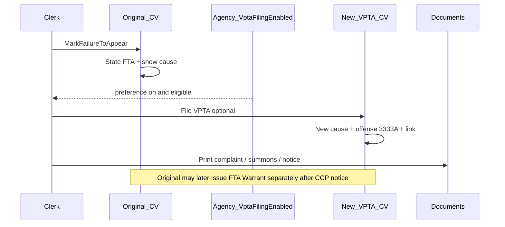
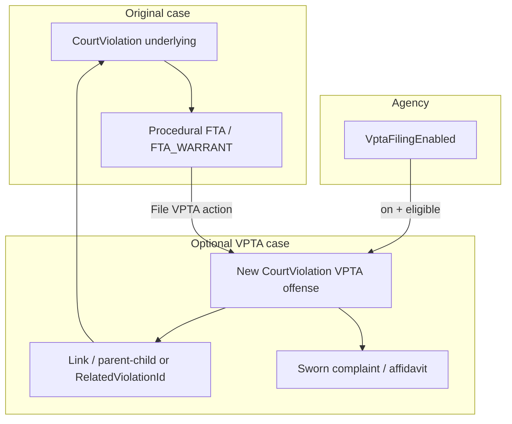

---
name: court-vpta-separate-charge
overview: "Optional agency-gated workflow for Texas municipal courts that file Violate Promise to Appear (VPTA) as a separate criminal charge when a defendant fails to appear on a Rules of the Road citation—distinct from ThinLine’s existing procedural FTA / FTA_WARRANT posture on the original case."
status: draft
created: 2026-07-13
todos:
  - id: confirm-new-deal-behavior
    content: "Confirm with New Deal what they mean by VPTA (new case, labeling, fee, or combo)"
    status: pending
  - id: agency-preference-shape
    content: "Decide Agency flag name/location and admin UI for VPTA filing enablement"
    status: pending
  - id: domain-model
    content: "Sketch case link, offense code, complaint/affidavit, and state-machine touchpoints"
    status: pending
  - id: mvp-scope
    content: "Define MVP vs later (batch create, plea bargain dismiss-pair, fee Art. 45A.264)"
    status: pending
isProject: false
---

# Court VPTA — separate charge (design notes)

Initiative-sized design doc. Capture research, product decisions, and eventual API/UI/data shape. Not tied to a `BL-###` yet.

**Driver:** New Deal Municipal Court files **VPTA** (Violate Promise to Appear). ThinLine today models **procedural FTA** on the original violation; it does not model filing a separate VPTA offense case.

---

## Goal (working)

Enable courts that choose to do so to **file VPTA as a new criminal case** linked to a nonappearance on an eligible underlying citation—without forcing that workflow on courts that only use procedural FTA.

“Done” for a first ship (subject to MVP cut): agency can turn the feature on; from an eligible FTA posture the clerk (or prosecutor-directed flow) can create a linked VPTA violation; UI is hidden when the preference is off.

---

## Research notes (Texas municipal / justice court)

### What VPTA is

| | **VPTA** | **FTA (Penal Code offense)** | **Procedural FTA (ThinLine today)** |
|---|---|---|---|
| **Meaning** | Separate criminal offense: willfully violate written promise to appear | Separate criminal offense: fail to appear after release from custody on condition of appearing | Case posture on the **original** violation after nonappearance |
| **Statute** | Transp. Code § 543.009 | Penal Code § 38.10 | Court process / CCP warrant & notice rules (not a new offense by itself) |
| **When it fits** | Underlying offense is **Rules of the Road** (Transp. Code ch. 541–600) **and** defendant **signed** the citation | Defendant was in custody (including citation detention) and released on appearance condition | Almost any nonappearance path the court uses |
| **Fine range** | $1–$200 (general Transp. Code penalty) | Class C: $1–$500 | N/A (original case continues; fees/warrants may apply) |
| **How filed** | New cause + sworn complaint; prosecutor decides | Same | State transition: e.g. → `FTA` → `FTA_WARRANT` |

**If both VPTA and Penal Code FTA seem to fit:** charge **VPTA** as the more specific offense (*Azeez v. State*).

**Local practice:** Many courts work only the original case’s FTA/warrant path and rarely (or never) file a second charge. Others (e.g. New Deal) routinely file **VPTA** as a separate case—often used in plea bargaining (“plead to original / dismiss VPTA” or vice versa). Filing is a **State/prosecutor** charging decision; clerks/judges should not invent policy. Best practice: LE or prosecutor as affiant; if clerk files, judge should recuse/exchange on that matter.

**Not the same as:** Art. 45A.264(d) **FTA/VPTA fine up to $25** (fee assessment on nonappearance)—related product area, documented in fee inventory, but not “file a VPTA case.”

### Useful external refs

- TMCEC Level I / Charging & Pre-Trial — FTA vs VPTA  
- Texas Justice Court Criminal Deskbook — VPTA elements, Rules of the Road, *Azeez*  
- Transp. Code § 543.009, § 542.401; Penal Code § 38.10  

---

## Product decision (agreed in research)

| Layer | Decision |
|-------|----------|
| **Domain capability** | Build VPTA filing as **shared product logic** (not New Deal–only `if` branches). |
| **Visibility** | Gate clerk actions / menus behind an **agency preference** (default **off**). Pattern: `OmniBaseEnabled`, payment toggles on `Agency`. |
| **Procedural FTA** | Keep for **all** courts; VPTA is additive, not a replacement. |
| **Penal Code FTA as separate charge** | Out of scope for first cut unless a court asks; same preference family later if needed. |

**Why preference, not always-on:** Filing VPTA is local prosecutor policy. Always-on UI invites misuse at courts that do not file these cases.

**Why preference, not hardcode New Deal:** Next VPTA court should flip a flag, not get a special build.

---

## Workflow walkthrough (design discussion 2026-07-13)

### Is this the right mental model?

**Mostly yes, with timing nuance.**

1. Defendant misses appearance on the **original** Rules-of-the-Road citation case.
2. Clerk runs **Mark Failure To Appear** → original case → procedural `FTA` (show-cause date, Inactive workflow). That step stays as today for all courts.
3. **If** agency `VptaFilingEnabled` and case is eligible → UI offers **File VPTA** (checkbox on Mark FTA, or a separate action from `FTA` state). That creates a **second** criminal case.

Do **not** auto-create VPTA on every Mark FTA unless New Deal explicitly wants that; legally filing is a prosecutor decision. Prefer **optional action** gated by preference.



### What needs to happen on the VPTA case?

| Step | Needed? | Notes |
|------|---------|--------|
| New court violation (new cause) | **Yes** | Separate docket / cause number |
| Sworn **complaint** (charging instrument) | **Yes** | VPTA is complaint-filed, not a new roadside ticket. ThinLine already has `CourtViolation_document_violation_promise_appear` and FTA/VPTA affidavits |
| **Notice / summons** to defendant | **Yes (best practice)** | Tell them a new charge was filed and give an appearance date. Distinct from CCP Art. 45A.104(e) warrant-notice on nonappearance |
| CCP **45A.104(e) notice** before warrant | On whichever case gets a nonappearance warrant | Existing FTA 10-day / show-cause docs on original (and later on VPTA if they FTA that case too). Not auto-mailed today—clerk prints |
| New LE **citation** (officer ticket) | **No (legally)** | No second stop; court/prosecutor files by complaint |
| ThinLine `Citation` row | **Probably yes (product constraint)** | `CourtViolation.CitationId` is required today—see “Citation constraint” below |
| Link to originating violation | **Yes** | Explicit FK or relation table |
| Warrant on VPTA at create | **No** | Create case + complaint + appearance/summons first; warrant only after notice + another miss |

### Citation constraint (important)

Today every `CourtViolation` **must** have a `CitationId`. Production create path is citation import (`{CitationNumber}-{NN}`).

So we cannot “just create a naked court violation” without either:

| Option | Idea | Tradeoff |
|--------|------|----------|
| **A. Court-filed synthetic citation** | Create a `Citation` with type/source = court complaint; `CitationAgencyId = CourtAgencyId`; one offense = VPTA (`3333A`); then import-style CV | Fits current schema; clear “court filed this” |
| **B. Reuse original `CitationId`** | New CV row on same citation as next `ViolationNumber` | Misrepresents history (VPTA wasn’t on the ticket); pollutes multi-offense citation semantics |
| **C. Relax schema** | Allow complaint-originated CVs with nullable `CitationId` | Cleanest legally; migration + null-safe paths (see **CitationId dependency audit** below) |

**Working recommendation (implemented):** **C** — optional `CitationId` for complaint-origin cases. Numbering is `{parent}V`. Avoid **B**.

If **A**: both agencies on the synthetic citation / CV can be the **court** (`CitationAgencyId = CourtAgencyId = court`). The **link** carries the LE original case, not the citation FK.

### CitationId dependency audit — what the mandatory link is for

`CourtViolation` already **denormalizes** most day-to-day fields from the citation at import:

| On CV (no Citation nav needed) | Still mainly via Citation row |
|--------------------------------|-------------------------------|
| `CitationNumber`, `CitationDateTime`, `CitationAgencyId`, `CitationTypeCode` | Speeding: alleged/posted speed, school/construction zone |
| `OffenseId`, `OcaTypeCode`, `AssignedOfficerId` | Officer certification / `CitedById` for e-sign oath blocks |
| `MasterPersonSnapshotId`, appearance, juvenile flags | Vehicle/location snapshots, insurance/accident factors |
| `CourtViolationNumber`, balance, state machine | Citation attachments (ticket PDF, racial profiling) |

So the FK is **not** required for “what offense / who / when / cause number” on a normal court screen. It is required today for **identity of the LE ticket** and for code that always loads `Citation`.

#### What breaks hard if `CitationId` is null (without fixes)

| Area | Why |
|------|-----|
| **DB / EF** | Column non-nullable; FK required + **cascade delete** (deleting a citation deletes CVs) |
| **Search view** `vw_CourtViolationSearch` | `WHERE … AND c.IsDeleted = 0` — null citation rows **never appear** in search |
| **Detail VM** `CourtViolationViewModelFactory` | Always `GetCitationAsync(CitationId)` → not found |
| **Create / fees** | Only create path is citation import; `AddTransactions(ICitation)` uses citation for posted date + speed/school-zone fee rules |
| **Person history query** | `GetCourtViolationsByPersonAsync` filters `Citation.IsDeleted == false` |
| **EDR export** | Unconditional citation load |

#### What degrades or is already OK

| Area | Behavior |
|------|----------|
| **VPTA / FTA affidavit / show cause docs** | Mostly CV + person — VPTA form does **not** load citation |
| **Complaint PDF** | Filled/e-sign paths load citation for officer/offense line; empty mode OK; can fall back to CV offense |
| **Warrants** | E-sign officer block wants citation; filled/empty modes OK |
| **State machine / OCA events** | Use `CitationDateTime` / offense — not `CitationId` |
| **Public payment** | Keyed by **`CitationNumber`** string (must still set a value on CV — can be parent ticket # or cause #) |
| **DPS conviction** | Already null-checks citation; CMV/Haz/CDL suffer without it |
| **UI drawer** | Already hides citation prints when no `citationId` |

#### Minimal fix set if we go optional (Option C)

1. Nullable `CitationId` + FK optional, **Restrict/SetNull** (not cascade).  
2. Search view: `(c.Id IS NULL OR c.IsDeleted = 0)`.  
3. ViewModel factory: load citation only when id present.  
4. New create path that does not require `ICitation`; fee assessor overload using CV fields / originating case.  
5. Null-safe person/search queries and report loads.  
6. UI/TS: `citationId: number | null`.

**Tradeoff:** Option **C** is the right legal model and avoids fake tickets; Option **A** is less code churn for MVP. Highest-risk Option C touchpoints: **search view**, **detail VM**, **`AddTransactions`**.

### Connect the two violations?

**Yes.** Proposed:

- `OriginatingCourtViolationId` on the VPTA row (or `CourtViolationRelations` with `RelationCode = VPTA`).
- UI: “Related: VPTA cause …” on original; “Originating: …” on VPTA.
- Do **not** rely only on shared citation number.

Offense master already has **VIOLATE PROMISE TO APPEAR** — DPS `3333` / TLS `3333A` / OCA `NTO`.

### Violation number / cause number?

**Decided:** append `V` after the existing `-XX` suffix of the **originating** court violation number.

| Pattern | Example |
|---------|---------|
| Originating (citation import) | `260156-01` |
| Linked VPTA | `260156-01V` |

Format: `{OriginatingCourtViolationNumber}V` → display shape `*******-**V` (parent already includes `-XX`).

Enforce uniqueness on `(CourtViolationNumber, CourtAgencyId)` as today. Max length 24 — parent numbers that are already long leave little room; validate at create.

If a second VPTA were ever needed on the same parent (should be rare / blocked by one-VPTA-per-origin rule), do **not** nest (`…V01`); reopen product discussion instead.

### Can child violations have child violations?

**Recommend: no. Flat, one level only.**

- VPTA → points at originating speeding (etc.) case.
- If defendant later FTAs on the **VPTA** case: use **procedural FTA** on that VPTA row (same Mark FTA / warrant path). Do **not** file “VPTA of VPTA.”
- Eligibility for File VPTA: originating case must be citation-backed Rules-of-the-Road with signature—and **must not already be a VPTA-relation child**.

Nested trees add little real-world value and break clerk mental models.

### Agencies on the new case

| Field | Working recommendation |
|-------|------------------------|
| `CourtAgencyId` | Court (same as original) |
| `CitationAgencyId` | Court if synthetic court-filed citation (A); else TBD under C |
| Person / snapshot | Same defendant as originating case (copy/reuse snapshot pattern) |
| `AppearanceDateTime` | New setting date for the VPTA charge (clerk/prosecutor enters or default from agency) |

### What ThinLine already has (reuse)

- Procedural FTA / show cause / FTA warrant pipeline on **any** CV (including the new VPTA row later).
- Documents: `ViolationPromiseAppear`, FTA affidavits (citation variant), FTA 10-day notice, show cause, complaint PDF pipeline.
- Offense seed `3333A`.

### Still confirm with New Deal

1. File VPTA on Mark FTA vs later from FTA screen vs batch.
2. Who may click File VPTA (clerk vs prosecutor-only).
3. Preferred cause-number format.
4. Whether they print complaint + summons the same day.
5. Whether warrant for nonappearance stays on **original**, **VPTA**, or both (local practice varies).

---

## Integration anchor (existing code)

| Item | Location |
|------|----------|
| **Procedural FTA states** | Court violation state machine: `FTA`, `FTA_WARRANT` — see `ThinLine.Business.Objects/Court/CourtViolations/StateMachine/StateDefinitions/` |
| **Agency toggles** | product-repo `ThinLine.API/ThinLine.Data.Model/Common/Entities/Agency.cs` — e.g. `OmniBaseEnabled`, `CourtViolationOnlinePaymentIsEnabled` |
| **FTA/VPTA fee (related, distinct)** | Fee code `FTA` (“FTA/VPTA FINE”); gaps in product-repo `ThinLine.API/docs/COURT_FEE_ASSESSMENT_INVENTORY.md` §1.1 |
| **FTA affidavit report (existing)** | `CourtViolationAffidavitFailureToAppearCitationReportModel` — may inform VPTA complaint/affidavit artifacts |
| **Layering** | product-repo `ThinLine.API/docs/API-ARCHITECTURE.md`, product-repo `ThinLine.UI/docs/UI-ARCHITECTURE.md` |
| **Routes** | kebab-case per product-repo `docs/ROUTE-NAMING.md` |

### Feature flag / agency preference (proposed)

| Setting | When **off** (default) | When **on** |
|---------|------------------------|-------------|
| `VptaFilingEnabled` *(name TBD)* on `Agency` | No “File VPTA” actions; no batch create VPTA; API rejects create-VPTA if called | Eligible nonappearance flows can create a linked VPTA violation; UI surfaces action |

Eligibility (always enforce when on): underlying offense Rules of the Road; signed promise to appear (citation signature present / recorded); preference on; prosecutor-directed process (product may still allow clerk filing with audit trail—confirm with New Deal).

---

## 1. Technical architecture (sketch)



*Refine once New Deal confirms create-from-FTA vs create-anytime-on-eligible-citation.*

---

## 2. Build vs buy

| Area | Choice | Notes |
|------|--------|--------|
| Charging / case creation | **Build** | Same CourtViolation pipeline as any new Class C / traffic offense |
| Legal content (complaint text) | **Build** + court templates | Mirror existing FTA affidavit report pattern; TMCEC forms as reference |
| OmniBase / scofflaw | Existing | VPTA case may have its own warrant/Omni path later; do not conflate with original |

---

## 3. Recommended MVP (draft)

| Layer | Choice | Rationale |
|-------|--------|-----------|
| Preference | Agency bool, default off; enable New Deal | Matches OmniBase-style gates |
| Create path | Single-violation action from FTA (or FTA_WARRANT) posture | Smallest clerk workflow |
| New case | Standard new CourtViolation with VPTA offense code + link to source violation | Reuse domain; no parallel “fee-only” fake case |
| UI | Hide when preference off | Avoid noise for non-VPTA courts |
| Fee Art. 45A.264 | **Defer** or track separately | Already inventoried; different trigger |
| Batch create VPTA | **Defer** | After single-path proven |
| Auto-dismiss paired case on plea | **Defer** | Prosecutor workflow; high policy risk |

---

## 4. Production-ready (later)

| Concern | Notes |
|---------|--------|
| Offense master | VPTA code in offense/citation tables; ALL UPPERCASE descriptions per project rule |
| Affidavit / complaint PDF | Dedicated report; affiant role |
| Audit | Who created VPTA case; link both ways in UI |
| Health / OCA | New cases count as new filings; disposition pairing |
| Juvenile / notice rules | Same warrant-notice gates as other nonappearance warrants |

---

## 5. Schema / data model (open)

*Illustrative only — finalize after New Deal walkthrough.*

Options under discussion:

1. **Related violation FK** on `CourtViolation` (e.g. `RelatedCourtViolationId` / `OriginatingCourtViolationId`) when type = VPTA.  
2. **Link table** `CourtViolationRelations` (`ParentId`, `ChildId`, `RelationCode = VPTA`) for multi-relation future.  
3. **Offense code only** with convention/search — weak; prefer explicit link.

Also need: how “signed citation” is stored today (import vs manual); Rules of the Road detection (chapter range vs offense flags).

```sql
-- Placeholder — do not implement until design locked
-- ALTER Agency ADD VptaFilingEnabled bit NOT NULL DEFAULT 0;
-- Link column or relation table TBD
```

**Risk boundary:** Any schema change needs an EF migration via `dotnet ef migrations add` (see `AGENTS.md`); do not hand-edit snapshots.

---

## 6. API design (placeholder)

- Prefer extending existing court-violation create / transition flows over a one-off New Deal endpoint.  
- Example shape (TBD): `POST tlsapi/court/court-violations/{id}/file-vpta` or transition payload with fee/create flags.  
- Validate agency preference + eligibility server-side (never UI-only).  
- Unit tests required for any behavior change (API Change Safety Rule).

---

## 7. Codebase areas (expected)

```
ThinLine.API/ThinLine.API/Court/...
ThinLine.API/ThinLine.Business.Objects/Court/CourtViolations/...
ThinLine.API/ThinLine.Data.Model/Common/Entities/Agency.cs
ThinLine.API/ThinLine.Data.Model/Court/Entities/CourtViolations/...
ThinLine.API/ThinLine.Data.Store/Migrations/ThinLineCommon/   # agency flag
ThinLine.API/ThinLine.Data.Store/Migrations/ThinLine/         # link / offense if needed
ThinLine.API/ThinLine.RMS.WebAPI/...
ThinLine.UI/src/... (court violation actions, agency admin)
ThinLine.API/ThinLine.API.UnitTests/Court/...
```

---

## 8. Example orchestration (pseudocode)

```csharp
// Preference off → ValidationResult error; no case created
// Preference on + not Rules of the Road or no signature → ValidationResult error
async Task<ValidationResult> FileVptaFromNonappearanceAsync(long sourceViolationId)
{
    var agency = await GetAgencyAsync(...);
    if (!agency.VptaFilingEnabled) { return Fail("VPTA filing is not enabled for this court."); }

    var source = await GetViolationAsync(sourceViolationId);
    if (!IsEligibleForVpta(source)) { return Fail("Underlying case is not eligible for VPTA."); }

    var vpta = CreateLinkedViolation(source, offenseCode: "VPTA" /* TBD */);
    await SaveAsync(vpta);
    return Ok(vpta);
}
```

---

## 9. Risks, edge cases, testing

| Risk | Mitigation |
|------|------------|
| Clerks file VPTA when prosecutor does not want it | Agency preference default off; confirm New Deal who may initiate |
| VPTA filed on non–Rules of the Road | Hard eligibility check |
| No signature on citation | Hard eligibility check; clarify mailed citations |
| Confusing VPTA case with procedural FTA / fee code `FTA` | Clear UI labels; separate docs; do not overload fee code as “the VPTA case” |
| Double charging / wrong *Azeez* path | Prefer VPTA over PC FTA when preference is “VPTA filing”; document |
| Migrations / billing / auth | Stay inside `AGENTS.md` review boundaries |

**Tests:** Unit tests for eligibility, preference gate, link creation; integration only if persistence of relation is critical to the first PR.

---

## 10. Open questions

1. **New Deal meaning of “does VPTA”** — new case only, labeling, Art. 45A.264 fee, or combination?  
2. **Who initiates** — prosecutor only, clerk with direction, automated on Mark FTA?  
3. **Offense code** — existing code in their data / conversion, or new master row?  
4. **Timing** — create VPTA at Mark FTA, at Issue Warrant, or any time while FTA?  
5. **Signature evidence** — field on citation/import today?  
6. **Rules of the Road** — detect via statute chapter, offense category flag, or allowlist?  
7. **UI pairing** — show related VPTA on original case card and vice versa?  
8. **Backlog id** — add `BL-###` to `PRIORITIZED.md` when prioritized?  
9. **Separate Penal Code FTA filing** — ever needed for other clients?  

---

## Step-by-step build plan (handoff — draft)

1. **M0 — Discover:** Walk New Deal workflow; answer open questions; sample cases.  
2. **M1 — Preference:** Agency flag + admin UI; no create path yet.  
3. **M2 — Domain:** Eligibility helpers; create linked VPTA violation API; unit tests.  
4. **M3 — UI:** Action on eligible FTA case when preference on; related-case display.  
5. **M4 — Documents:** VPTA complaint/affidavit report if required for go-live.  
6. **M5 — Optional:** Batch; fee Art. 45A.264 alignment; plea-pair helpers.

---

## Tradeoffs

- **Agency preference vs always-on** — Preference chosen: correct for prosecutor-policy features; small config cost.  
- **Shared capability vs client fork** — Shared + flag chosen: avoids New Deal-only code.  
- **New case vs status flag on original** — New case matches Texas law (separate offense); status-only would be incorrect modeling for courts that file VPTA.  
- **Ship fee + case together vs separately** — Prefer separate tracks; fee already has inventory gaps.

---

## Session log

| Date | Notes |
|------|--------|
| 2026-07-13 | Research: VPTA = Violate Promise to Appear; distinct from procedural FTA and from FTA/VPTA fine. Agreed: shared logic + agency preference (default off); New Deal as first enablement. Doc created. |
| 2026-07-13 | Workflow walkthrough: Mark FTA stays procedural; optional File VPTA creates linked new case. Complaint + notice/summons yes; no new LE citation (synthetic court citation or schema relax). Explicit link; flat one-level children only; cause number TBD. |
| 2026-07-13 | Numbering decided: `{originatingCourtViolationNumber}V` (`*******-**V`). CitationId audit: denormalized CV fields cover most UI; hard breaks = DB FK, search view WHERE, detail VM, AddTransactions, person query, EDR. Option C viable with targeted null-safety; A still smaller MVP. |
| 2026-07-13 | **Implemented (phased):** Phase 1 optional `CitationId` + search view + null-safety. Phase 2 `VptaFilingEnabled`, `OriginatingCourtViolationId`, `FileVptaAsync`, `POST .../file-vpta`, admin toggle, File VPTA menu action. Cause `{parent}V`; `CitationNumber` = originating ticket; `_CIT` `CC` COURT COMPLAINT. |
