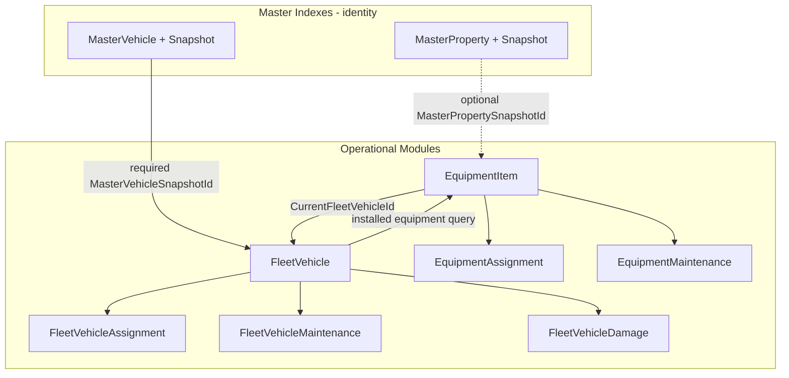

---
name: Equipment Fleet Modules
overview: Add two new Law Enforcement RMS modules — Equipment (EQP) and Fleet (FLM) — as operational records layered on Master Property Index (optional) and Master Vehicle Index (required). **Primary implementation template: Notepad module (`FCS`)** — root + child entities, child controllers, master snapshot FKs, tabbed details, `useSearchBase` / `useModuleBase`. MVP covers CRUD, assignment/checkout, maintenance, damage (fleet), retire/dispose, cross-module equipment-on-vehicle visibility, and basic search/report views. Fuel log and formal audit sessions deferred to Phase 2.
todos:
  - id: pr1-foundation
    content: "PR1: SystemModules, code seeds, agency flags, auth claims (Access+Modify×2), EF entities + migration + views"
    status: completed
  - id: pr2-equipment-api
    content: "PR2: Equipment backend CRUD (service, root, controller, view models, unit tests)"
    status: completed
  - id: pr3-equipment-ui
    content: "PR3: Equipment UI routes, nav, search, detail General tab"
    status: completed
  - id: pr4-equipment-assign
    content: "PR4: Equipment assignment/checkout/check-in/return API + UI tabs"
    status: completed
  - id: pr5-equipment-maint
    content: "PR5: Equipment maintenance + disposal"
    status: completed
  - id: pr6-fleet-api
    content: "PR6: Fleet backend CRUD with required MVI link"
    status: completed
  - id: pr7-fleet-ui
    content: "PR7: Fleet UI routes, nav, search, detail General tab"
    status: completed
  - id: pr8-fleet-assign
    content: "PR8: Fleet assignment + odometer tracking"
    status: completed
  - id: pr9-fleet-maint-damage
    content: "PR9: Fleet maintenance, damage, disposal"
    status: completed
  - id: pr10-cross-module
    content: "PR10: Installed equipment on fleet + vehicle panel on equipment"
    status: completed
  - id: pr11-reports
    content: "PR11: Grid print and saved search views for both modules"
    status: completed
  - id: pr12-admin-polish
    content: "PR12: Agency admin flags, role claims UI, API feature index, final verification"
    status: completed
isProject: false
---

# Equipment and Fleet Modules — Implementation Plan

## Integration anchor (existing code)

| Item | Location |
|------|----------|
| **Primary module template** | **Notepad (`FCS`)** — best structural match; see [§1 Primary template](#primary-template-notepad-module-fcs) |
| **Master Property (MRI)** | [`ThinLine.API/ThinLine.Data.Model/Masters/Entities/MasterProperties/`](ThinLine.API/ThinLine.Data.Model/Masters/Entities/MasterProperties/) — `MasterProperty` + `MasterPropertySnapshot` (serial, brand, model, `PropertyTypeId`) |
| **Master Vehicle (MVI)** | [`ThinLine.API/ThinLine.Data.Model/Masters/Entities/MasterVehicles/`](ThinLine.API/ThinLine.Data.Model/Masters/Entities/MasterVehicles/) — `MasterVehicle` + `MasterVehicleSnapshot` (VIN, plate, year/make/model) |
| **Property/Evidence (separate)** | [`ThinLine.API/ThinLine.Data.Model/LawEnforcement/Entities/Evidence/Evidence.cs`](ThinLine.API/ThinLine.Data.Model/LawEnforcement/Entities/Evidence/Evidence.cs) — custody chain via `EvidenceHistory`; links `MasterPropertySnapshotId` |
| **Assignment history shape** | JMS [`EpisodeLocationAssignment`](ThinLine.API/ThinLine.Data.Model/Jms/Entities/EpisodeLocationAssignment.cs) — append-only `EffectiveFrom` / `EffectiveTo` (domain logic); **Notepad** for child-entity/controller pattern |
| **Module shell (UI)** | Notepad-style: [`ThinLine.UI/src/components/modules/notepad/`](ThinLine.UI/src/components/modules/notepad/), [`routes.ts`](ThinLine.UI/src/router/routes.ts), [`NotepadModuleDetails`](ThinLine.UI/src/models/modules/BaseModuleDetails.ts) |
| **API layering** | [`ThinLine.API/docs/API-ARCHITECTURE.md`](ThinLine.API/docs/API-ARCHITECTURE.md), [`API-FEATURE-INDEX.md`](ThinLine.API/docs/API-FEATURE-INDEX.md) |
| **Claims** | [`ClaimKeys.cs`](ThinLine.API/ThinLine.RMS.Common/Constants/ClaimKeys.cs) — `Rms.{Area}.{Access\|Modify\|…}` |
| **Audit timeline** | `IAuditable` on entities + [`AuditTimeline.vue`](ThinLine.UI/src/components/shared/AuditTimeline.vue) |
| **Attachments** | [`AttachmentLister.vue`](ThinLine.UI/src/components/shared/AttachmentLister.vue) keyed by `moduleKeyCode` + `moduleKeyId` |

**Confirmed MVP decisions:** fuel log deferred to Phase 2; MRI link on equipment is **optional** (link or create MRI when identity matters).

---

## 1. Existing architecture observations

### Where similar modules live

- **Operational RMS modules** (user-facing lifecycle records): `ThinLine.API/ThinLine.Business.Objects/LawEnforcement/`, controllers under `ThinLine.RMS.WebAPI/Controllers/LawEnforcement/`, UI under `ThinLine.UI/src/components/modules/{area}/`.
- **Master indexes** (identity only): `Masters/MasterProperties`, `Masters/MasterVehicles` — slideout cards in `ThinLine.UI/src/components/masters/`, routes like `/masters/property` (not `ModuleContainer`).
- Equipment and Fleet are **operational modules**, not master indexes. Follow **Notepad** module layout (root + lifecycle children + master snapshot FKs), not master slideout cards.

### Primary template: Notepad module (`FCS`)

**Why Notepad over Warrant/Criminal Trespass:** Notepad already combines (1) a root operational record, (2) **repeatable child entities** with their own controllers, (3) **master index snapshot FKs** (property/vehicle on children; location on root), (4) system-generated record numbers, (5) Access + Modify claims only, and (6) tabbed details with attachments + audit — all of which map cleanly to Equipment/Fleet. Warrant is court-centric with offense/service children; Criminal Trespass is a thin single-entity module without child controllers.

**Copy-from paths (Notepad):**

| Layer | Notepad path | Equipment/Fleet analogue |
|-------|--------------|--------------------------|
| Entities | [`Entities/Notepad/`](ThinLine.API/ThinLine.Data.Model/LawEnforcement/Entities/Notepad/) | `Entities/Equipment/`, `Entities/Fleet/` |
| Root BO | [`NotepadRoot.cs`](ThinLine.API/ThinLine.Business.Objects/LawEnforcement/Notepads/NotepadRoot.cs) | `EquipmentRoot`, `FleetVehicleRoot` |
| Child BO | [`NotepadPropertyChild.cs`](ThinLine.API/ThinLine.Business.Objects/LawEnforcement/Notepads/NotepadPropertyChild.cs) | `EquipmentAssignmentChild`, `EquipmentMaintenanceChild`, … |
| Service | [`NotepadService.cs`](ThinLine.API/ThinLine.Business.Objects/LawEnforcement/Notepads/NotepadService.cs) | `EquipmentService`, `FleetVehicleService` |
| Root controller | [`NotepadController.cs`](ThinLine.API/ThinLine.RMS.WebAPI/Controllers/LawEnforcement/Notepad/NotepadController.cs) | `EquipmentController`, `FleetVehicleController` |
| Child controller | [`NotepadPropertyController.cs`](ThinLine.API/ThinLine.RMS.WebAPI/Controllers/LawEnforcement/Notepad/NotepadPropertyController.cs) | `EquipmentAssignmentController`, `EquipmentMaintenanceController`, … |
| Search | [`NotepadSearchController.cs`](ThinLine.API/ThinLine.RMS.WebAPI/Controllers/LawEnforcement/Notepad/NotepadSearchController.cs) | `EquipmentSearchController`, `FleetSearchController` |
| UI module | [`components/modules/notepad/`](ThinLine.UI/src/components/modules/notepad/) | `equipment/`, `fleet/` |
| Search store | [`notepadSearchStore.ts`](ThinLine.UI/src/stores/notepadSearchStore.ts) | `equipmentSearchStore.ts`, `fleetSearchStore.ts` |
| Module details | [`NotepadModuleDetails`](ThinLine.UI/src/models/modules/BaseModuleDetails.ts) | `EquipmentModuleDetails`, `FleetModuleDetails` |
| Record number | `NotepadRoot.CommitAsync` → `GetNextRecordNumberAsync` (`FCS`) | `EQP` for `EquipmentNumber` |

**Intentional divergences from Notepad:**

| Notepad | Equipment / Fleet |
|---------|-------------------|
| Draft/Complete workflow + snapshot-on-complete | No draft workflow MVP; master snapshots linked at create/edit when applicable |
| `NotepadProperty` / `NotepadVehicle` **repeatable** master children | Equipment: optional MRI on **root**; Fleet: required MVI on **root** (one vehicle per fleet record) |
| Field contact / lost-and-found domain | Assignment, maintenance, damage, retire/dispose lifecycle |
| Lost & Found second search route | Saved filter presets on main search (no second module sub-route in MVP) |

### Reusable patterns

| Pattern | Notepad reference | Reuse for Equipment/Fleet |
|---------|-------------------|---------------------------|
| Root + child entities | `Notepad` + `NotepadPerson` / `NotepadProperty` / … | `EquipmentItem` + `EquipmentAssignment` / `EquipmentMaintenance`; `FleetVehicle` + assignments/maintenance/damage |
| `*Root` + `*Child` BO | `NotepadRoot`, `NotepadPropertyChild` | `EquipmentRoot`, `EquipmentAssignmentChild`, … |
| **Child REST controllers** | `tlsapi/notepads/{id}/properties` | `tlsapi/equipment/{id}/assignments`, `…/maintenance`; fleet equivalents |
| Master snapshot FK | `NotepadProperty.MasterPropertySnapshotId` | Optional MRI on equipment root; required MVI on fleet root |
| `vw_*Search` + `*SearchObject` | `vw_NotepadSearch` pattern | `vw_EquipmentSearch`, `vw_FleetVehicleSearch` |
| `useSearchBase` Pinia store | `notepadSearchStore.ts` | Per-module search stores |
| Tabbed details + `useModuleBase` | `NotepadDetailsTabs.vue`, child tab CRUD | Equipment/Fleet detail tabs |
| `AttachmentLister` + `AuditTimeline` | `NotepadDetailsTabAttachments/History` | Same `module-key-code` pattern (`EQP`, `FLM`) |
| `GetNextRecordNumberAsync` | `FCS` / `NotepadNumber` on commit | `EQP` / `EquipmentNumber` (fleet uses agency `UnitNumber` instead) |
| Agency `*Enabled` + 2 claims | `NotepadEnabled`, Access + Modify | `EquipmentEnabled`, `FleetEnabled` |
| Auth migration | `Rms.Notepad.Access/Modify` seed | Four equipment/fleet claims |
| Append-only assignment dates | — (use JMS `EpisodeLocationAssignment` for **field shape** only) | `EffectiveFrom` / `EffectiveTo` on assignment children |

### Relevant entities already present

- **MRI** holds durable identity: serial, brand, model, description, `PropertyTypeId`.
- **MVI** holds durable identity: VIN, plate, year/make/model, category.
- **Evidence** is the closest analog for “property custody” but is **incident-linked evidentiary property** — Equipment must remain a separate table/module with no automatic Evidence coupling.
- **ImpoundLog** links `MasterVehicleSnapshotId` for impounded vehicles (incident/CAD context) — distinct from agency fleet operations.
- **No existing Equipment/Fleet/Asset operational entities** in the codebase.

### Master index reference convention

Operational modules store **`Master*SnapshotId`** (not master ID) for point-in-time stability — same as Notepad property/vehicle children, Evidence, Citation, Incident rows.

### Permission conventions

- Claims: `Rms.{Module}.{Action}` (e.g. `Rms.Notepad.Access`, `Rms.Notepad.Modify` — **the model to copy**).
- Controller: class-level `[Authorize(Access)]`, mutating actions `[Authorize(Modify)]`.
- UI: `route.meta.claim`, `systemUser.canAccess*` from [`SystemUserViewModelFactory.cs`](ThinLine.API/ThinLine.RMS.WebAPI/ViewModels/Common/Users/SystemUserViewModelFactory.cs).
- Most RMS modules stop at **Access + Modify**. Equipment and Fleet follow that MVP pattern; assignment, maintenance, damage, and grid print are **Modify** operations. Optional `Dispose` claims can be added later if agencies need disposal restricted separately.

### Audit conventions

- Entity implements `IAuditable` with `AuditModuleKey` = `SystemModules.*` code.
- Field-level changes flow to audit timeline via existing infrastructure.
- **Operational history** (assignments, maintenance, checkout) lives in **child tables**, not only audit — mirrors `EvidenceHistory` and `EpisodeLocationAssignment`.

### Property vs Equipment separation

| | Property/Evidence | Equipment |
|--|-------------------|-----------|
| Purpose | Seized, found, evidentiary, safekeeping | Agency-owned operational gear |
| Module | `EVC` Evidence | `EQP` Equipment (new) |
| Master link | Required `MasterPropertySnapshotId` | **Optional** `MasterPropertySnapshotId` |
| Custody | Chain of custody / property room | Issuance, checkout, fleet install |

---

## 2. Recommended domain model

### Module codes (new)

Add to [`SystemModules.cs`](ThinLine.API/ThinLine.RMS.Common/Constants/SystemModules.cs):

| Code | Constant | Display name |
|------|----------|--------------|
| `EQP` | `Equipment` | Equipment |
| `FLM` | `Fleet` | Fleet |

(`FLM` avoids confusion with MVI module code `MVI` and CAD `UNT`.)

### Naming: `FleetVehicle` vs `FleetUnit` (confirmed)

**Internal / code:** keep `FleetVehicle`, table `FleetVehicles`, service `FleetVehicleRoot`, etc. Do **not** introduce `FleetUnit` as an entity name.

**Why not `FleetUnit`:** `Unit` already means CAD dispatch unit in this codebase ([`SystemModules.Unit`](ThinLine.API/ThinLine.RMS.Common/Constants/SystemModules.cs) = `UNT`, entity [`Unit`](ThinLine.API/ThinLine.Data.Model/CAD/Entities/) with `UnitNumber` for radio/personnel assignments). Reusing “unit” as a type name would collide with established domain language.

**Police fleet “unit number”** (patrol car 101, K-9 42) is a **field** on `FleetVehicle`, not a separate entity:

| Layer | Name | Example |
|-------|------|---------|
| DB column / API | `UnitNumber` | `"101"`, `"K9-2"` |
| Route param | `unitNumber` | `/module/fleet/101/:agencyId` |
| Organizational assignment | `DivisionCode` (`_DVS`) | Patrol, CID — **not** CAD `Unit` |

**User-facing UI labels (Fleet module):**

| Context | Label | Avoid |
|---------|-------|-------|
| Nav / module | **Fleet** | Fleet Asset, Assets, Vehicles (as module name) |
| Add / detail page title | **Fleet Vehicle** or **Vehicle** | Fleet Asset, Asset |
| Primary identifier field | **Unit Number** | Fleet ID, Asset Tag |
| Search column / filter | **Unit Number** | Unit (alone — ambiguous with CAD) |
| MVI linkage section | **Vehicle** (master vehicle reference) | Master Vehicle Index (in labels; ok in help text) |
| List page heading | **Fleet** or **Fleet Vehicles** | Fleet Assets |

Equipment assignment to a fleet record: UI says **“Assigned vehicle”** / **“Unit number”** (e.g. “Assigned to unit 101”), not “assigned to fleet unit.”

### Retire / Dispose UI language (confirmed)

**Backend/database:** keep `Dispose*`, `Disposal*`, `RetiredDate`, `POST …/dispose` endpoints, and status codes like `RETIRED` / `DISPOSED` — no schema rename for MVP.

**User-facing UI:** use **Retire / Dispose** (not “Dispose” alone) for the action, dialog title, and nav/history labels. Agencies use different words for the outcome; the dialog captures that via reason/type codes.

| Module | UI action label | Example outcome reasons (code descriptions, ALL UPPERCASE) |
|--------|-----------------|-------------------------------------------------------------|
| Equipment | **Retire / Dispose** | DESTROYED, SOLD, DISCARDED, LOST WRITE-OFF, … |
| Fleet | **Retire / Dispose** | RETIRED, SOLD, TRANSFERRED, SURPLUSED, WRECKED (TOTALED), … |

- Equipment status codes can include `RETIRED`, `DISPOSED`, etc.
- Fleet status transition sets `RETIRED` / `SOLD` / similar via `DisposalTypeCode` (`_FDR`) — UI shows the selected reason, not the word “disposal.”
- Saved views: **Retired / Disposed** (not “Disposed only”).
- Phase 2 optional claim: `Rms.*.Dispose` described in UI as **Retire / Dispose** permission.

### Record identifiers (confirmed)

Follow existing RMS record-number patterns ([`NotepadRoot.CommitAsync`](ThinLine.API/ThinLine.Business.Objects/LawEnforcement/Notepads/NotepadRoot.cs) — `GetNextRecordNumberAsync` for `FCS`; same hook for `EQP`).

#### Equipment

| Field | Source | Required | Role |
|-------|--------|----------|------|
| `Id` | DB identity | — | Internal key only |
| `EquipmentNumber` | **System-generated** on create (`GetNextRecordNumberAsync` for module `EQP`) | Yes (after save) | Thin Line record number; unique per agency; used in routes (`/:equipmentNumber/:agencyId`) and links |
| `AgencyTagNumber` | **Agency-entered** | **No** | Agency inventory / property tag when they have one |
| Serial / make / model | **From MRI snapshot** when linked; editable on MRI at link/create time | No on equipment row | Manufacturer identity lives on Master Property, not duplicated on `EquipmentItem` |

**UX implications:**

- Add form does **not** require an agency inventory number — agencies without formal tagging can still create equipment.
- Detail header shows **Equipment Number** (system) prominently; **Agency Tag** shown when present.
- Search/filter supports `EquipmentNumber`, `AgencyTagNumber`, and serial (via `vw_EquipmentSearch` denormalized from MRI).
- `AgencyTagNumber` unique per agency **when provided** (nullable unique index — two blank tags allowed).

#### Fleet

| Field | Source | Required | Role |
|-------|--------|----------|------|
| `Id` | DB identity | — | Internal key only |
| `UnitNumber` | **Agency-entered** | **Yes** | Primary user-facing identifier; unique per agency; used in routes (`/:unitNumber/:agencyId`) |
| `MasterVehicleSnapshotId` | Selected/created at add | **Yes** | Vehicle identity (VIN, plate, year/make/model) |
| `MasterVehicleId` | Denormalized from snapshot | Yes | FK convenience / search |

Fleet does **not** need a separate system record number — police users already know vehicles by **unit number**. VIN/plate come from MVI.

### Architecture diagram



### Major entities

#### `EquipmentItem` (table: `EquipmentItems`)

Agency-scoped operational record. **Soft-delete only**; disposal = status change + dates, not hard delete.

| Field group | Key columns |
|-------------|-------------|
| Identity | `EquipmentNumber` (**system-generated**, unique per agency), `AgencyId`, optional `MasterPropertySnapshotId` |
| Agency ops | `AgencyTagNumber` (**optional**, agency-entered inventory/property tag), `CategoryCode`, `ItemName`, `Description`, `DistinguishingCharacteristics` |
| State | `StatusCode`, `ConditionCode` |
| Current assignment (denormalized) | `CurrentAssignmentTypeCode`, `CurrentOfficerId`, `CurrentFleetVehicleId`, `CurrentDivisionCode` (`_DVS`), `CurrentLocationCode`, `CurrentLocationNarrative` |
| Acquisition | `AcquiredDate`, `AcquisitionSourceCode`, `PurchaseCost`, `WarrantyExpirationDate` |
| Disposal | `DisposedDate`, `DisposedByUserId`, `DisposalReasonCode`, `DisposalNotes` — UI: **Retire / Dispose** |
| Standard | `ISoftDelete`, `IUserEditable`, `IConvertable`, `IImportable`, `IAuditable` |

**MRI strategy:** When linked, serial/make/model display from `MasterPropertySnapshot` (do not store `SerialNumber` on `EquipmentItem`). Operational status/assignment always on `EquipmentItem`. UI offers “Link existing property” (`PropertyModuleCard`) or “Create MRI from equipment details” (calls existing master property create flow, then stores returned `MasterPropertySnapshotId`).

**Record number:** On `CommitAsync` for new records, assign `EquipmentNumber` via `GetNextRecordNumberAsync(AgencyId, …)` — same pattern as Notepad `NotepadNumber`. User never types `EquipmentNumber` on add.

#### `EquipmentAssignment` (append-only history)

**Storage model:** one row per assignment event with **nullable target columns** — only fields matching the assignment type are populated; the rest stay `NULL`. This keeps the schema flexible without implying every assignment has every target.

| Column | Notes |
|--------|-------|
| `EquipmentItemId` | Parent |
| `AssignmentTypeCode` | Target/workflow — see `_EAT` codes below |
| `EffectiveFrom` / `EffectiveTo` | Current = `EffectiveTo IS NULL` |
| `OfficerId` | Populated when type is `PERSON` or `CHECKOUT` |
| `FleetVehicleId` | Populated when type is `VEHICLE` |
| `DivisionCode` | Populated when type is `DIVISION` (`_DVS`) |
| `LocationCode`, `LocationNarrative` | Populated when type is `LOCATION` |
| `ConditionAtIssueCode`, `ConditionAtReturnCode` | Checkout/return |
| `ExpectedReturnDate` | `CHECKOUT` only |
| `AssignedByUserId`, `ReturnedToUserId`, `Notes` | |

**`_EAT` codes (storage):** `ISSUED` (person, long-term), `CHECKOUT` (person, temporary), `VEHICLE`, `DIVISION`, `LOCATION`, `RETURN` (close event — optional explicit return row vs closing `EffectiveTo` on open assignment; pick one in implementation, prefer close-in-place).

**Server validation:** reject requests that populate target fields not applicable to `AssignmentTypeCode` (e.g. `OfficerId` must be null when type is `VEHICLE`). API request DTOs accept only the fields for the selected type.

Closing an assignment sets `EffectiveTo`, clears denormalized current fields on `EquipmentItem`, and writes audit.

#### `EquipmentMaintenance`

| Column | Notes |
|--------|-------|
| `EquipmentItemId` | Parent |
| `MaintenanceDate`, `ReasonCode`, `VendorName`, `Cost` | |
| `OutOfServiceDate`, `ReturnedToServiceDate`, `NextMaintenanceDate` | |
| `Notes` | |

#### `FleetVehicle` (table: `FleetVehicles`)

Agency fleet operational record. Entity name stays **`FleetVehicle`**; users see **Unit Number** + **Fleet Vehicle** in the UI.

| Field group | Key columns |
|-------------|-------------|
| Identity | `UnitNumber` (**agency-entered, required** — patrol unit number; unique per agency), `AgencyId`, `MasterVehicleSnapshotId` (required), `MasterVehicleId` (denormalized for FK convenience) |
| Ops | `FleetStatusCode`, `VehicleTypeCode`, `DivisionCode` (`_DVS` — patrol division/team, not CAD `Unit`), `LocationCode` |
| Odometer | `StartingMileage`, `CurrentMileage`, `MileageAsOfDate` |
| Compliance | `InServiceDate`, `RegistrationExpirationDate`, `InspectionExpirationDate`, `InsuranceInfo` |
| Current assignment | `CurrentOfficerId`, `CurrentAssignmentTypeCode` (pool/spare/officer/division) |
| Disposal | `RetiredDate`, `DisposalTypeCode`, `DisposalNotes` — UI: **Retire / Dispose** |
| Standard | soft-delete, audit, user-editable |

**MVI strategy:** Fleet add requires **Unit Number** (user-entered) plus master vehicle selection (`VehicleModuleCard`). `UnitNumber` is validated unique per agency on save. VIN/plate/year-make/model come from MVI snapshot — no separate system fleet record number.

#### `FleetVehicleAssignment`, `FleetVehicleMaintenance`, `FleetVehicleDamage`

Mirror equipment patterns. Damage adds `DamageDate`, `ReportedByOfficerId`, `Description`, `StatusImpactCode`, `LedToMaintenance` (bool), link optional `FleetVehicleMaintenanceId`.

### Equipment-on-vehicle cross-visibility

- **Single source of truth:** `EquipmentItem.CurrentFleetVehicleId` + `EquipmentAssignment` history.
- **Fleet detail “Installed equipment” panel:** `GET tlsapi/fleet/{unitNumber}/equipment` → equipment where `CurrentFleetVehicleId = fleetVehicle.Id` (and not disposed).
- **Equipment detail “Assigned vehicle” panel:** show linked `FleetVehicle` from `CurrentFleetVehicleId`.
- **Assign to vehicle:** `POST tlsapi/equipment/{id}/assign` with `assignmentType: VEHICLE` updates assignment history, `CurrentFleetVehicleId`, and equipment `StatusCode` → `ASSIGNED_TO_VEHICLE` (code `_EQS`).
- **Remove from vehicle:** close assignment, clear `CurrentFleetVehicleId`, set status back to `AVAILABLE` or `IN_STORAGE`.

No duplicate equipment rows inside Fleet.

### History / audit placement

| Event | Storage |
|-------|---------|
| Field edits on header | `IAuditable` → audit timeline |
| Assign, checkout, return | `EquipmentAssignment` / `FleetVehicleAssignment` |
| Maintenance, damage | Child tables + audit |
| Disposal/retire | Header status fields + audit |

### Soft-delete vs status

- **Never hard-delete** operational rows in normal workflows.
- `IsDeleted` for admin cleanup only.
- **Retired/Disposed/Sold** = status codes; records remain searchable in “retired/disposed” views.

---

## 3. MVP scope

### Equipment MVP

- Create / edit / view equipment item (optional MRI link or create-from-form)
- List / search / filter (category, status, condition, officer, vehicle, unit, location)
- Assignment to officer, vehicle, division, location
- Checkout / check-in (temporary assignment with expected return; overdue list)
- Status and condition tracking (code-backed)
- Assignment history tab (read-only timeline from `EquipmentAssignment`)
- Basic maintenance entries (add/list on detail)
- Basic **retire/dispose** (status transition + required reason/type — UI label **Retire / Dispose**)
- Basic reports/views: full inventory, by officer, by vehicle, by location, by category, issued, available, checked-out, overdue, lost/stolen, damaged, maintenance due, history export via grid print

**MVP physical inventory (Equipment only):** saved search filters + grid print / reports — **not** a formal audit workflow. Examples:

- Filter: status = ISSUED, division = Patrol → print as “Patrol issued equipment”
- Filter: overdue checkout → exception-style list
- Filter: status vs expected location/assignment mismatch (manual reconciliation offline)

No audit session entity, no scan workflow, no supervisor approval in MVP.

### Fleet MVP

- Create / edit / view fleet vehicle (required MVI link)
- List / search / filter (status, unit, division, officer, maintenance due)
- Assignment to officer, division, location, pool/spare
- Status tracking
- Odometer tracking (manual update on assignment return and maintenance)
- Maintenance entries + next-due date/mileage
- Damage reporting
- Installed equipment list (read from Equipment module)
- **Retire / Dispose** (status transition + reason/type)
- Basic reports/views: fleet inventory, active, available/spare, assigned, out-of-service, in maintenance, maintenance schedule, repair log, registration/inspection due, equipment on vehicle, **retired/disposed**

**Deferred from MVP:** fuel log (per your choice).

---

## 4. Phase 2 scope

### Formal equipment inventory audit (Phase 2 — confirmed out of MVP)

A true inventory audit becomes its **own subsystem** quickly. Do **not** start this in MVP even if tempting — scope explodes. Phase 2 would add entities/workflows such as:

| Component | Purpose |
|-----------|---------|
| **Audit session** | Header: who, when, scope (category/location/division), status |
| **Expected items** | Snapshot of what should be present for the session scope |
| **Scanned/found items** | Barcode/QR/manual check-off against expected list |
| **Exceptions** | Missing, wrong location, unexpected finds, condition discrepancies |
| **Reconciliation** | Apply audit results back to equipment records (status/location/assignment updates) |
| **Supervisor approval** | Close/sign-off before reconciliation commits |

MVP substitute: **search filters + reports** (see Equipment MVP above). Evidence module’s inventory-audit print ([`EvidenceController.CreateInventoryAuditAsync`](ThinLine.API/ThinLine.RMS.WebAPI/Controllers/LawEnforcement/EvidenceController.cs)) is a useful **report pattern** reference, not a model to copy wholesale for Equipment Phase 2.

### Other Phase 2 items

- Barcode / QR / RFID scanning
- Fuel card integration and advanced fuel logs
- Daily vehicle checkout checklists
- Officer signatures / acknowledgement forms
- Vehicle inspection checklists
- Replacement planning / depreciation
- Consumable inventory
- Vendor integrations
- CAD mileage / use integration
- External city/county fleet system integration
- Purchase order workflows
- Optional `Rms.Equipment.Dispose` / `Rms.Fleet.Dispose` claims if agencies need disposal restricted separately

(Formal audit sessions listed above — not repeated here.)

---

## 5. UI / navigation plan

### Top-level nav

Add two `nav-drawer-module` entries in [`NavDrawer.vue`](ThinLine.UI/src/layouts/classic/NavDrawer.vue) (and modern/fullscreen variants), gated by `systemUser.canAccessEquipment` / `canAccessFleet` and agency flags.

| Module | Route root | Nav label |
|--------|------------|-----------|
| Equipment | `/module/equipment` | Equipment |
| Fleet | `/module/fleet` | Fleet |

Register in [`BaseModuleDetails.ts`](ThinLine.UI/src/models/modules/BaseModuleDetails.ts): `EquipmentModuleDetails`, `FleetModuleDetails`.

### Equipment pages

| Page | Route name | Components |
|------|------------|------------|
| Search | `EquipmentSearch` | `equipment/search/EquipmentSearch.vue`, `EquipmentSearchOptions.vue`, `EquipmentSearchResults.vue` |
| Add | `EquipmentAdd` | `equipment/add/EquipmentAddGeneral.vue` |
| Detail | `EquipmentDetails` | `/:equipmentNumber/:agencyId` — header shows system **Equipment Number** + optional **Agency Tag** |

**Detail tabs:** General | Assignment | Maintenance | History (assignments) | Attachments | Audit — **Retire / Dispose** action on General or Assignment tab (confirm in implementation; not a separate tab in MVP)

**Note:** **Audit** tab = system change timeline ([`AuditTimeline`](ThinLine.UI/src/components/shared/AuditTimeline.vue)), not physical inventory audit (Phase 2).

**General tab sections:** Equipment Number (read-only after save), Agency Tag (optional), Identification (optional MRI card — serial from master property), Status/Condition, Current assignment summary, Acquisition, Notes.

**Assignment tab:** Current assignment summary + actions (**Assign**, **Checkout**, **Check-in**, **Return**) + history table. See **Equipment assignment UI** below — do not render all target fields at once.

**Equipment assignment UI (progressive disclosure):**

Use a **type-first** flow. Never expose `OfficerId`, `FleetVehicleId`, `DivisionCode`, `LocationCode`, and `LocationNarrative` on the same form.

1. **Assign to** (required first step — radio or `tls-code-select`):

| UI label | Shows only | Maps to `AssignmentTypeCode` |
|----------|------------|------------------------------|
| **Person** | Officer picker (`OfficerId`) | `ISSUED` |
| **Vehicle** | Fleet unit lookup (`FleetVehicleId` / unit number search) | `VEHICLE` |
| **Location** | Location code (`LocationCode`) + narrative (`LocationNarrative`) | `LOCATION` |
| **Unit/Division** | Division select (`DivisionCode`, `_DVS`) | `DIVISION` |

2. **Checkout** (separate action, not a fifth “assign to” option): opens same **Person** fields + **Expected return date** + condition at issue → `CHECKOUT`.

3. **Check-in / Return:** close current assignment; show condition at return + notes when applicable.

4. **General tab** shows read-only assignment summary (human-readable target label, not raw FK ids).

Composable: `useEquipmentAssignment.ts` owns the type → visible-fields mapping and API payload shaping (omit null targets).

**Saved search presets (nav drawer):** All equipment, Available, Issued, Checked out, Overdue, By my unit, Maintenance due, Lost/Stolen.

### Fleet pages

| Page | Route name | Components |
|------|------------|------------|
| Search | `FleetSearch` | `fleet/search/*` — page title **Fleet**; results column **Unit Number** |
| Add | `FleetAdd` | `fleet/add/FleetAddGeneral.vue` — title **Add Fleet Vehicle**; required fields **Unit Number** + master **Vehicle** |
| Detail | `FleetDetails` | `/:unitNumber/:agencyId` — header shows **Unit Number** + year/make/model from MVI |

**Detail tabs:** General | Assignment | Installed Equipment | Maintenance | Damage | Attachments | Audit — **Retire / Dispose** action (same pattern as Equipment)

**General tab sections:** Unit Number, Vehicle (MVI card), Status, Division, Location, Odometer, Compliance dates, Current assignment.

**Installed Equipment tab:** Read-only `tls-table-server` of equipment on this vehicle; link to equipment detail; “Assign equipment to this vehicle” opens equipment assign dialog (if user has `Rms.Equipment.Modify`).

**Saved search presets:** Active fleet, Available/Spare, Assigned, Out of service, In maintenance, Registration due, Inspection due, Maintenance due.

**Copy rules:** never use “asset” in Fleet UI strings. Prefer **Fleet**, **Fleet Vehicle**, **Vehicle**, **Unit Number**.

### Cross-module UX

- Equipment assigned to vehicle shows fleet **Unit Number** as link → Fleet detail (label: “Assigned vehicle” / “Unit number”).
- Fleet installed equipment shows `EquipmentNumber` as link → Equipment detail.
- Use existing master embed components: `PropertyModuleCard`, `VehicleModuleCard` for MRI/MVI linkage.
- When showing division/team, label **Division** (`_DVS`); do not label CAD dispatch units in Fleet screens.

---

## 6. Permissions / claims plan

Follow `Rms.{Area}.{Action}` and seed via [`ThinLineAuthorization`](ThinLine.API/ThinLine.Data.Store/Migrations/ThinLineAuthorization/) migration (mirror Notepad / [`20260512191350_AddCriminalTrespassAuthClaims.cs`](ThinLine.API/ThinLine.Data.Store/Migrations/ThinLineAuthorization/20260512191350_AddCriminalTrespassAuthClaims.cs) structure).

### MVP claims (keep it simple)

Match **Notepad**: **Access + Modify only**.

| Claim | Purpose |
|-------|---------|
| `Rms.Equipment.Access` | View search, detail, assignment/maintenance history (read-only), grid print |
| `Rms.Equipment.Modify` | Create/edit, assign, checkout, check-in, return, maintenance entries, dispose/retire |
| `Rms.Fleet.Access` | View search, detail, installed equipment list, assignment/maintenance/damage history, grid print |
| `Rms.Fleet.Modify` | Create/edit, odometer updates, assign/return, maintenance, damage reports, dispose/retire |

**Default role grants (same pattern as Notepad):**

- `LE_OFFICER` → Access + Modify for both modules
- `LE_READONLY` → Access only

Assignment, maintenance, damage, and disposal are ordinary modify workflows for small agencies — no separate claims in MVP.

### Optional later (Phase 2 or on demand)

Add only if a pilot agency needs disposal restricted without blocking day-to-day edits:

| Claim | Purpose |
|-------|---------|
| `Rms.Equipment.Dispose` | Retire/dispose without full Modify |
| `Rms.Fleet.Dispose` | Retire/dispose without full Modify |

If added later: dispose endpoints switch from `[Authorize(Modify)]` to `[Authorize(Dispose)]`; UI hides dispose actions unless user has Dispose **or** Modify (backward compatible). Other granular claims (`Assign`, `Maintenance`, `Damage`, `Report`) are **not planned** unless product asks — they add role-setup friction with little payoff for small agencies.

### Agency flags

Add to [`Agency.cs`](ThinLine.API/ThinLine.Data.Model/Common/Entities/Agency.cs) (ThinLineCommon migration):

- `EquipmentEnabled`
- `FleetEnabled`

Wire in `AgencyRoot`, `AgencyViewModelFactory`, `SystemUserViewModelFactory` (`CanAccessEquipment`, `CanAccessFleet`).

---

## 7. API plan

Place under **Law Enforcement** area (same as Notepad). Update [`API-FEATURE-INDEX.md`](ThinLine.API/docs/API-FEATURE-INDEX.md).

### Equipment (`tlsapi/equipment`) — Notepad-style routing

Mirror Notepad’s split: root controller + **child controllers** for assignments/maintenance (like `NotepadPersonController`, `NotepadPropertyController`).

| Method | Route | Claim |
|--------|-------|-------|
| GET | `/` | Access — search (`EquipmentSearchCriteria`) |
| GET | `/gridPrint` | Access |
| GET | `/{equipmentNumber}` | Access — detail |
| GET | `/{equipmentNumber}/exists` | Access |
| GET | `/new` | Modify |
| POST | `/` | Modify — create |
| PUT | `/{equipmentItemId}` | Modify — update |
| POST | `/{equipmentItemId}/assign` | Modify |
| POST | `/{equipmentItemId}/check-out` | Modify |
| POST | `/{equipmentItemId}/check-in` | Modify |
| POST | `/{equipmentItemId}/return` | Modify |
| GET | `/{equipmentItemId}/assignments` | Access |
| GET | `/{equipmentItemId}/maintenance` | Access |
| POST | `/{equipmentItemId}/maintenance` | Modify |
| PUT | `/{equipmentItemId}/maintenance/{id}` | Modify |
| POST | `/{equipmentItemId}/dispose` | Modify |

### Fleet (`tlsapi/fleet`)

| Method | Route | Claim |
|--------|-------|-------|
| GET | `/` | Access — search |
| GET | `/gridPrint` | Access |
| GET | `/{unitNumber}` | Access — detail |
| GET | `/{unitNumber}/exists` | Access |
| GET | `/new` | Modify |
| POST | `/` | Modify |
| PUT | `/{fleetVehicleId}` | Modify |
| POST | `/{fleetVehicleId}/assign` | Modify |
| POST | `/{fleetVehicleId}/return` | Modify |
| GET | `/{fleetVehicleId}/assignments` | Access |
| GET | `/{unitNumber}/equipment` | Access — installed equipment |
| GET | `/{fleetVehicleId}/maintenance` | Access |
| POST | `/{fleetVehicleId}/maintenance` | Modify |
| PUT | `/{fleetVehicleId}/maintenance/{id}` | Modify |
| GET | `/{fleetVehicleId}/damage` | Access |
| POST | `/{fleetVehicleId}/damage` | Modify |
| POST | `/{fleetVehicleId}/dispose` | Modify |

### Layering (per module — copy Notepad folders)

```
Controllers/LawEnforcement/Equipment/          # mirror Notepad/
  EquipmentController.cs                       # NotepadController
  EquipmentSearchController.cs                 # NotepadSearchController
  EquipmentAssignmentController.cs             # NotepadPersonController pattern
  EquipmentMaintenanceController.cs
ThinLine.API/LawEnforcement/Equipment/         # mirror Notepads/
ThinLine.Business.Objects/LawEnforcement/Equipment/
  EquipmentService.cs, EquipmentRoot.cs
  EquipmentAssignmentChild.cs, EquipmentMaintenanceChild.cs
ViewModels/LawEnforcement/Equipment/           # mirror Notepad/{Area}/
```

Fleet mirrors under `Fleet/` with `FleetVehicleController`, `FleetVehicleAssignmentController`, `FleetVehicleMaintenanceController`, `FleetVehicleDamageController`.

---

## 8. Frontend plan

### New files (Equipment) — mirror `notepad/`

- `ThinLine.UI/src/components/modules/equipment/` — copy shape from [`notepad/`](ThinLine.UI/src/components/modules/notepad/): NavDrawer, search trio, add, `details/` + `*Tab*.vue`
- `ThinLine.UI/src/api/equipmentApi.ts` — mirror [`notepadApi.ts`](ThinLine.UI/src/api/notepadApi.ts)
- `ThinLine.UI/src/models/equipment/` — mirror `models/notepad/`
- `ThinLine.UI/src/stores/equipmentSearchStore.ts` — mirror `notepadSearchStore.ts` + Pinia `useModuleBase` store for detail/child CRUD (Notepad pattern)

### New files (Fleet)

- `ThinLine.UI/src/components/modules/fleet/` — parallel structure
- `ThinLine.UI/src/api/fleetApi.ts`
- `ThinLine.UI/src/models/fleet/`
- `ThinLine.UI/src/stores/fleetSearchStore.ts`

### Shared controls

- Reuse `SearchContainer`, `tls-table-server`, `tls-code-select`, `ModuleDetailsContainer`, `AttachmentLister`, `AuditTimeline`.
- **Equipment assignment:** `useEquipmentAssignment.ts` — type-first dialog; conditional fields per target (Person / Vehicle / Location / Unit-Division); Checkout reuses Person fields + expected return date.
- **Fleet assignment:** `useFleetAssignment.ts` — same progressive-disclosure pattern where applicable (officer vs division vs location vs pool/spare).

### Forms

- Equipment add: category, name, optional **Agency Tag**, optional MRI link panel, initial status/condition. **Equipment Number assigned on save** (not shown on add form).
- Fleet add: **Unit Number** (required, user-entered), MVI required, in-service date, starting mileage, initial status.

---

## 9. Migration plan

### ThinLine DB migration (scaffold via `dotnet ef migrations add`)

**Tables:** `EquipmentItems`, `EquipmentAssignments`, `EquipmentMaintenance`, `FleetVehicles`, `FleetVehicleAssignments`, `FleetVehicleMaintenance`, `FleetVehicleDamage`

**Record numbers:** Register module `EQP` in agency `RecordNumbers` / `GetNextRecordNumberAsync` (mirror Notepad `FCS` / [`NotepadRoot.CommitAsync`](ThinLine.API/ThinLine.Business.Objects/LawEnforcement/Notepads/NotepadRoot.cs)). Fleet uses agency-entered `UnitNumber` only — no `FLM` record-number sequence.

**Views:** `vw_EquipmentSearch`, `vw_FleetVehicleSearch` (denormalize display fields from MRI/MVI snapshots + current assignment; include `SerialNumber` from MRI on equipment search view)

**Indexes:**

- Unique `(EquipmentNumber, AgencyId)`
- Unique filtered `(AgencyTagNumber, AgencyId)` where `AgencyTagNumber IS NOT NULL` (nullable — multiple nulls OK)
- Unique `(UnitNumber, AgencyId)`
- FK indexes on `MasterPropertySnapshotId`, `MasterVehicleSnapshotId`, `CurrentFleetVehicleId`

**Code seeds** (via migration `Insert_Code` / `CodeCommons` — ALL UPPERCASE descriptions):

| Code type | Constant | Examples |
|-----------|----------|----------|
| `_EQS` | EquipmentStatus | AVAILABLE, ISSUED, ASSIGNED TO VEHICLE, CHECKED OUT, IN STORAGE, IN REPAIR, LOST, STOLEN, DAMAGED, RETIRED, DISPOSED |
| `_EQC` | EquipmentCondition | NEW, GOOD, FAIR, POOR, DAMAGED, UNUSABLE |
| `_EQY` | EquipmentCategory | RADIO, BODY CAMERA, TASER, FIREARM, … |
| `_EAT` | EquipmentAssignmentType | ISSUED, CHECKOUT, VEHICLE, DIVISION, LOCATION, RETURN (UI groups ISSUED/CHECKOUT under “Person”) |
| `_FLA` | FleetStatus | ACTIVE, AVAILABLE, ASSIGNED, SPARE, IN SERVICE, OUT OF SERVICE, IN MAINTENANCE, WRECKED, RETIRED, SOLD |
| `_FVT` | FleetVehicleType | PATROL, CID, ANIMAL CONTROL, TRAILER, … |
| `_EDR` | EquipmentDisposalReason | DESTROYED, SOLD, DISCARDED, … (ALL UPPERCASE) |
| `_FDR` | FleetDisposalReason | RETIRED, SOLD, TRANSFERRED, SURPLUSED, WRECKED, … (ALL UPPERCASE) |

### ThinLineCommon migration

- `EquipmentEnabled`, `FleetEnabled` on `Agencies`

### ThinLineAuthorization migration

- Insert **four** MVP claims; default `LE_OFFICER` / `LE_READONLY` grants (mirror Notepad)

### Backward compatibility

- No changes to MRI/MVI schema beyond optional new `vw_Master*Records` entries later (Phase 2) showing equipment/fleet operational links.
- Evidence and incident property flows untouched.

### Multi-tenant scoping

- All queries filter by `_activeUser.RequestedAgencyId` (and authorized agencies).
- Routes use `/:recordId/:agencyId` composite pattern.
- Unique constraints scoped per `AgencyId`.

---

## 10. Testing plan

### Unit tests (`ThinLine.API.UnitTests`)

New folders: `LawEnforcement/Equipment/`, `LawEnforcement/Fleet/`

| Area | Tests |
|------|-------|
| `EquipmentRoot` | Create with/without MRI; assign to officer/vehicle; checkout/check-in; overdue detection; dispose blocks new assignments |
| `FleetVehicleRoot` | Create requires MVI; assign/return updates odometer; dispose |
| Cross-module | Assign equipment to fleet updates both sides; remove clears `CurrentFleetVehicleId` |
| Search criteria | Filter by status, officer, vehicle, overdue |
| Permissions | Access vs Modify on read/write endpoints (mirror Notepad tests); no granular claim matrix in MVP |
| Validation | Cannot assign disposed equipment; cannot delete fleet with installed equipment without removal |

### API tests

- Controller authorization attributes (existing convention tests if present)
- Integration tests (optional, Docker SQL): create equipment → assign to fleet → list installed equipment

### UI tests

- Vitest: search store convert functions, tab enums
- Optional: component tests for assignment dialog — type selection shows/hides correct fields; payload omits irrelevant target columns

### Regression risks

- Master property/vehicle search and merge (ensure no conflation of agency equipment MRI with evidence property)
- Attachment module key registration for new `EQP`/`FLM` codes
- Audit timeline module key registration
- Agency admin UI for new enabled flags

---

## 11. Suggested implementation sequence (PR-sized)

Each PR should build, pass unit tests, and be reviewable independently.

| PR | Scope |
|----|-------|
| **PR1 — Foundation** | `SystemModules` EQP/FLM; code type constants; CodeCommons seeds; Agency flags; Auth claims (4 total); entity classes + EF config; initial migration + views; `ClaimKeys`; **RecordNumbers config for `EQP`** (equipment system number pattern); register DI stubs |
| **PR2 — Equipment backend CRUD** | `IEquipmentService`, `EquipmentRoot`, child roots, DataStore, controllers (Notepad-style root + child), ViewModels, unit tests |
| **PR3 — Equipment UI shell** | Routes, `EquipmentModuleDetails`, nav, search store/API, list page, detail General tab (mirror `notepad/details`) |
| **PR4 — Equipment assignment** | `EquipmentAssignmentChild` + `EquipmentAssignmentController`, Assignment tab (Notepad child-tab pattern) |
| **PR5 — Equipment maintenance & disposal** | Maintenance child, dispose endpoint, tabs, unit tests |
| **PR6 — Fleet backend CRUD** | Fleet entity stack (requires MVI), controller, search view, unit tests |
| **PR7 — Fleet UI shell** | Routes, nav, search, detail General tab, MVI picker on add |
| **PR8 — Fleet assignment & odometer** | Assignment history, assign/return, unit tests |
| **PR9 — Fleet maintenance, damage, disposal** | Child entities, tabs, unit tests |
| **PR10 — Cross-module equipment-on-vehicle** | Fleet installed-equipment endpoint + tab; equipment vehicle panel; integration tests |
| **PR11 — Reports & grid print** | Saved filter routes, `gridPrint` for both modules |
| **PR12 — Admin & polish** | Agency settings UI for flags; API feature index; lint/build verification |

**Suggested merge order:** PR1 → PR2 → PR3 → PR4 → PR5 → PR6 → PR7 → PR8 → PR9 → PR10 → PR11 → PR12.

Equipment can reach usable state after PR5 while Fleet completes in PR6–PR9.

---

## Key tradeoffs documented

| Decision | Choice | Alternative |
|----------|--------|-------------|
| Primary template | **Notepad (`FCS`)** — root + children, child controllers, master FKs, tabs | Warrant (court/offense) or thin Criminal Trespass |
| MRI link | Optional | Required link — rejected; uniform/keys don't need MRI |
| Module vs master | Separate operational tables | Extend MRI/MVI only — rejected; mixes evidence identity with ops lifecycle |
| Assignment model | Append-only child tables; nullable target FKs populated per type | Status-only on header — rejected; loses history |
| Assignment UI | Type-first: Person / Vehicle / Location / Unit-Division; conditional fields only | Single form with all target fields visible |
| Equipment identifiers | `EquipmentNumber` system-generated; `AgencyTagNumber` optional agency tag; serial on MRI | Agency-entered equipment number; `SerialNumber` duplicated on equipment row |
| Fleet naming | `FleetVehicle` entity + agency-entered `UnitNumber`; UI: Unit Number, Vehicle, Fleet Vehicle | `FleetUnit` (conflicts with CAD `Unit` / `UNT`); “Fleet Asset” in UI |
| Equipment physical inventory | MVP: search filters + grid print only | Formal audit subsystem (session, expected/found, exceptions, reconciliation, approval) — **Phase 2** |
| MVP claims | Access + Modify only (×2 modules) | Granular claims — deferred; optional Retire/Dispose claim in Phase 2 |
| Retire/dispose UI | **Retire / Dispose** in UI; `Disposal*` fields/endpoints in DB/API | Rename schema to “Retire”; UI says “Dispose” only |

---

## Persistence note

After plan approval, save a copy under [plans/](./) (e.g. `equipment-fleet-modules.md`) and optionally add a backlog item in [prioritized.md](../prioritized.md) when prioritized.
