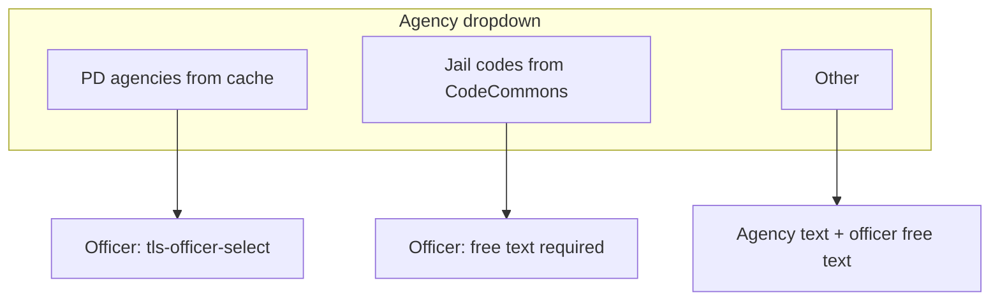

# Jail intake — arresting agency (PD agencies, jail codes, Other)

## Goal

Extend the add-booking wizard arrest step so the **arresting agency** control offers **three kinds** of choices, with **different officer capture** for each:

| Mode | Agency source | Stored value | Arresting officer |
|------|----------------|--------------|-------------------|
| **PD agency** | Existing agencies table (LE / PD), current filter logic | `ArrestAgencyId` (FK) | **`tls-officer-select`** — officers for that agency; store `ArrestingOfficerId` |
| **Jail arresting agency (code)** | New **code type** (e.g. “jail arresting agencies”) via `CodeCommons` | **Code** string (the code value users/admin maintain) | **Free text** (required) — no officer FK |
| **Other** | Same as prior plan | Free-text agency name (+ optional sentinel `ArrestAgencyId` for validation if still used) | **Free text** (required) |

## UX — single dropdown, three option families

- **Group 1 — PD agencies:** Items from the existing LE agency list (same sourcing as today: [`TlsAgencySelect`](ThinLine.UI/src/components/shared/controls/derived/TlsAgencySelect.vue) with `agency-type-code-prefix="LE_"` / cache agencies).
- **Group 2 — Jail arresting agencies:** Items loaded from the new code type (labels for display; **item value = code** to persist).
- **Group 3 — Other:** One synthetic item; when selected, show required **agency name** text field (if not fully captured by a single “Other” label alone — product may store display as code “OTHER” + separate free-text field; see storage).

Use Vuetify patterns that match the app: e.g. **`v-list-subheader`** / grouped `v-select` items, or a custom composite `item-value` that encodes `{ kind, agencyId? | code? }` so one v-model can drive validation and submit.

**Officer UI:**

- After selection, if **PD agency** → show `tls-officer-select` with `agency-id` = selected PD agency (existing behavior).
- If **code** or **Other** → **hide** officer select; show **required** `v-text-field` for arresting officer name (single shared free-text field for both non-PD modes is fine).

## Data model (Booking)

Discriminate the three modes explicitly to avoid ambiguous combinations:

- **`ArrestAgencySource`** (string or tinyint enum in DB): e.g. `PD_AGENCY` | `JAIL_CODE` | `OTHER`.
- **PD:** `ArrestAgencyId` set; `ArrestingOfficerId` set; code-specific and Other-specific columns null.
- **Jail code:** `ArrestAgencyCode` (or `JailArrestingAgencyCode`) set to the **stored code**; `ArrestingOfficerFreeText` required; `ArrestAgencyId` null (or unused); `ArrestingOfficerId` null.
- **Other:** `ArrestAgencyFreeText` + `ArrestingOfficerFreeText` required; `ArrestAgencyId` optionally a sentinel FK for legacy validation, or adjust validation to allow null id when `Source = OTHER` and free text present.

**Column count:** At minimum you need **source discriminator + code column + two free-text columns (agency other + officer)** plus existing ids — i.e. **more than two columns** if you also store the **code** separately from “Other” agency text. Rough sketch:

- `ArrestAgencySource` (required once feature ships)
- `ArrestAgencyId` (nullable) — PD only
- `JailArrestingAgencyCode` (nullable, `MaxLength` aligned with code tables) — code list only
- `ArrestAgencyFreeText` (nullable) — Other only (agency name)
- `ArrestingOfficerId` (nullable) — PD only
- `ArrestingOfficerFreeText` (nullable) — code + Other

Adjust naming to match team conventions (`TrimAndUpper` where codes require uppercase per project rules).

## Codes — new code type

- Add a **new code type** (e.g. `JAIL_ARRESTING_AGENCY` or name agreed with product) and seed or admin-managed **`CodeCommons`** rows for each selectable jail arresting agency **code** + description.
- **Migration:** Follow team process for [`ThinLine.Data.Store/Migrations`](ThinLine.API/ThinLine.Data.Store/Migrations) and code seeds; coordinate if this touches shared code infrastructure.

## API

- Extend [`CompleteBookingAddRequest`](ThinLine.API/ThinLine.RMS.WebAPI/ViewModels/JailIntake/Booking/JailIntakeBookingRequests.cs) and TS [`CompleteBookingAddRequest`](ThinLine.UI/src/api/jailIntakeApi.ts) with: source discriminator, optional `arrestAgencyId`, optional jail code string, optional free-text fields, optional `arrestingOfficerId`, optional `arrestingOfficerFreeText`.
- Map through [`JailIntakeViewModelMapper`](ThinLine.API/ThinLine.RMS.WebAPI/ViewModels/JailIntake/Booking/JailIntakeViewModelMapper.cs) → [`JailIntakeService.StartBookingWithPendingIncidentAsync`](ThinLine.API/ThinLine.Business.Objects/JailIntake/JailIntakeService.cs) / `BookingRoot`.
- [`IBooking`](ThinLine.API/ThinLine.API/JailIntake/IBooking.cs) / `BookingRoot` / [`BookingViewModel`](ThinLine.API/ThinLine.RMS.WebAPI/ViewModels/JailIntake/Booking/BookingViewModel.cs): surface new fields for detail screens.

## Validation

- **Server + client:** Enforce mutual exclusivity and required fields per `ArrestAgencySource`.
- Update [`BookingRoot.ValidateAsync`](ThinLine.API/ThinLine.Business.Objects/JailIntake/BookingRoot.cs) (or service-level validation on complete-add) so “arresting agency required” means: PD has id; JAIL_CODE has code; OTHER has agency free text — and officer rule: PD requires officer id; JAIL_CODE and OTHER require officer free text.

## Accept booking / incident creation

- Reuse prior plan: **remove** `ArrestingOfficerId ?? _activeUser.Officer?.Id` when **free-text officer** is in use for that booking.
- **`CreateIncidentFromPendingBookingAsync`** ([`JailIntakeService`](ThinLine.API/ThinLine.Business.Objects/JailIntake/JailIntakeService.cs)): when agency is **code** or **Other**, `incident.AgencyId` cannot blindly equal a PD `ArrestAgencyId` — define product rule (e.g. jail agency, sentinel, or note-only). Same for `IncidentArrestee` officer representation (FK vs note vs optional new column) as in the earlier plan.

## UI touchpoints (non-exhaustive)

- [`JailIntakeEntry.vue`](ThinLine.UI/src/components/modules/jailIntake/JailIntakeEntry.vue): replace single `tls-agency-select` with grouped selection + conditional officer controls; review step labels; `getRecordsByPersonAsync` filtering — **PD agency id only**; for code/Other, pass **no** PD filter or agreed behavior.
- [`JailIntakeBookingDetailsHeader.vue`](ThinLine.UI/src/components/modules/jailIntake/details/JailIntakeBookingDetailsHeader.vue): labels — PD from cache; code mode show **code description** from CodeCommons (or code + description); Other show free text; officer from id vs free text.
- Load code list: reuse existing code-fetch patterns (`tls-code-select` or API used elsewhere for `CodeCommons` by type).

## LE user lock

- If `isLeAgencyUser` forces PD agency to the user’s agency, confirm whether **code** and **Other** remain available; update plan during implementation if product says jail-only users get all three and LE users are PD-only.

## Implementation todos

1. **Schema:** `Booking` columns: `ArrestAgencySource`, `JailArrestingAgencyCode`, `ArrestAgencyFreeText`, `ArrestingOfficerFreeText` (or equivalent); migration + snapshot.
2. **Codes:** New code type + seed/admin process for jail arresting agency codes.
3. **Domain/API:** `CompleteBookingAdd`, `IBooking`/`BookingRoot`, view models, validation.
4. **Incident accept:** Officer fallback fix; define `incident.AgencyId` + arrestee officer for code/Other paths.
5. **UI:** Grouped agency control; officer select vs free text; review + header; TS types.

## Diagram

