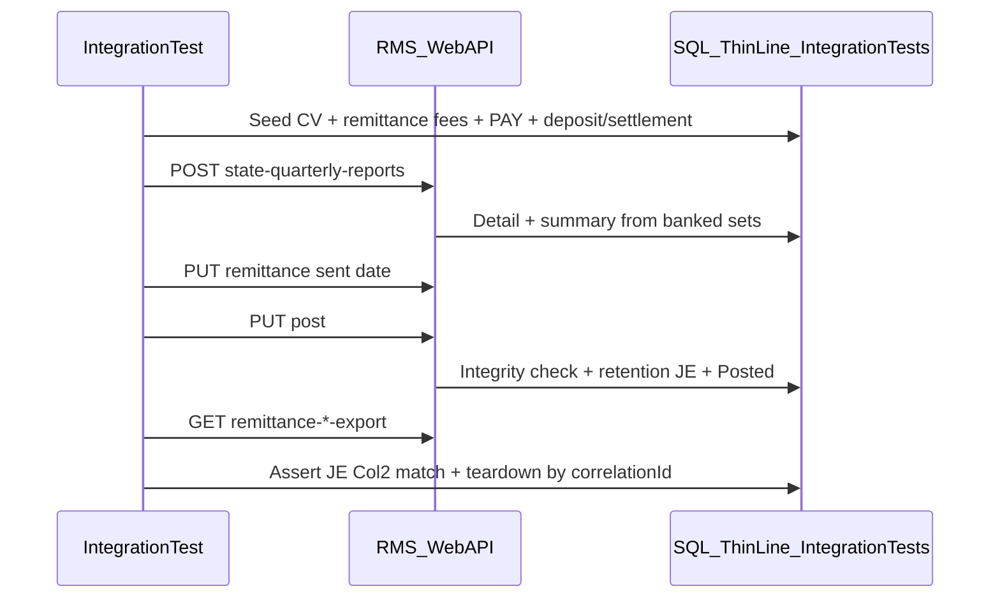

# Plan: State Quarterly & remittance allocation — HTTP integration tests

## Goal

Add a focused **`MsSqlIntegration`** HTTP suite that exercises the same product areas recently locked by unit tests — **create/rebuild/post SQR**, **retention JE vs CD40 Col2**, **form integrity gates**, **remittance GL/PDF exports**, and **RAR Verify/Apply/export** — against a real SQL catalog + ASP.NET pipeline, with **owned fixture data** and teardown.

**Done when:** ~35–45 mutating/read HTTP facts pass under Docker or LocalDB, are excluded from `TestExplorerDefault.runsettings` “Run All,” and document the Slaton-style invariants (form-line gate, Family B Col2=0, void disabled, RAR Apply = new JE only).

**Shipped (2026-07-28):** **19** HTTP facts green via `THINLINE_ITEST_CONNECTION_STRING` → migrated `ThinLineRMS` (Docker EF migrate still blocked on pre-existing `CollectionVendorName` ordering). Filter: `StateQuarterlyRemittance_|RemittanceAllocation_HttpTests`. Optional gaps remain (LATE remittance, full RAR Apply + re-Verify, settled-card-only banking).

## Context

- **Unit coverage (already strong):** pure math (`FeeAssociationPhaseAllocation`, `RemittanceAllocationReconciliationMath`, `StateQuarterlyRetentionReallocation`, integrity, form-line engine) and mocked `PostReportAsync` / export gates.
- **IT gap:** no `StateQuarterly*` or RAR HTTP tests under [`ThinLine.API.IntegrationTests`](../../../../thin-line-worktree/court/ThinLine.API/ThinLine.API.IntegrationTests) today. Closest patterns: **`CourtAccounting_*`** (payment seed + deposit/settlement) and **`AccountingEndpointBehavior_HttpTests`**.
- **Risk / lane:** testing lane; no product behavior changes unless a seam is required for seedability. Respect data-isolation rules in the IntegrationTests README.
- **Live product caveats (do not bake into IT as “correct forever”):** void disabled this release; Line 11 unmapped; `IM_OMNI-L` off CD40 form.

## What integration tests uniquely prove

| Layer | Unit tests already cover | Integration must prove |
|-------|--------------------------|-------------------------|
| Form math / kits | Lump %, Family A/B, Omni-L gate | Summary/detail rows after **create/rebuild** from real banked txns |
| Post orchestration | Integrity blocks, missing dates, ON_TIME derive | Status → `Posted`; **retention JE** set id; JE debit = Σ Col2; GL lines balanced |
| RAR | ForceBalance, prior-Apply cover math | VerifyOnly run persisted; Apply posts **new** ADD set; originals unchanged; re-Verify 0 residual |
| Exports | Posted-only gates (mocked) | CSV / Tyler / CentralSquare / accountant PDF **non-empty** after post; 4xx before post |
| Auth / claims | Controller unit mocks | 401 anonymous; modify claims for create/post/Apply |

Unit tests remain the fast gate; ITs are the **end-to-end contract** for remittance filing.

## Approach

### 1) Fixture strategy (owned seed, not bacpac reliance)

Mirror **`CourtAccounting_TestData` / `CourtAccounting_PaymentFlow`**:

1. **Correlation id** prefix e.g. `ITSQ-{guid8}` on citation / person / optional notes.
2. Seed one (or few) **court violation(s)** for a test agency that already has remittance fee kits in the migrated catalog (agency **1** on `_Base` bacpac if kits exist; otherwise seed associations for SCF/STF2 in the test helper — prefer reuse of migrated kit rows).
3. Assess/post **payment** for remittance fees with **payment-phase 100% Due-To-State** (kit-driven).
4. **Bank** the money:
   - Cash/check path: post into a **PST** deposit batch with `DepositDate` inside the target quarter window; **or**
   - Card path: completed settlement with `PayoutArrivalDate` / `BatchDate` in window.
5. Choose **report year/quarter** from that deposit window (avoid colliding with an open header for the same agency — cancel/teardown any open header created by the test; never delete shared seed).
6. Teardown reverse-FK: SQR records/summaries/header → retention/RAR ADD sets (soft-delete) → deposit/settlement joins → PAY/REV sets → CV → person (same spirit as CourtAccounting teardown).

**Do not** depend on Slaton production header Id=1 or fixed JE ids.

### 2) Shared helpers (new)

Under `ThinLine.API.IntegrationTests/Court/StateQuarterly/` (and thin RAR helpers under `Accounting/`):

| Helper | Role |
|--------|------|
| `StateQuarterlyRemittance_HttpTestBase` | `MsSqlIntegration` collection; Auth/Modify clients; `RunWithSeedAsync` |
| `StateQuarterlyRemittance_TestData` | Seed options (fees, offense dates, amounts, quarter); teardown |
| `StateQuarterlyRemittance_SqlProbe` | Read header/summary/detail; JE lines by `RetentionTransactionSetId`; RAR run/lines |
| `StateQuarterlyRemittance_Workflow` | HTTP: create → wait generate-progress → remittance → post → export |
| `RemittanceAllocation_Workflow` | HTTP: VerifyOnly / Apply / get run / exports |

Reuse PayIt / CourtAccounting payment + deposit helpers where possible; **do not fork** payment posting.

### 3) Test suites (proposed ~40 facts)

Map 1:1 to the unit-test “high value” areas, but fewer cases (HTTP cost).

#### A. Create / rebuild / generate rollup (~8)

| Test | Assert |
|------|--------|
| Create for empty quarter | Header `Created`; summaries 1–13 present (zeros OK) |
| Create with banked SCF (+ offense in L1 window) | Detail row(s); Line 1 Col1 ≈ paid; Col2 = round(Col1×10%) |
| Create with STF2 vs STF offense dates | Line 4 @ 4% vs Line 5 @ 5% |
| Include settled card sets when no deposit | Same as unit rebuild rule |
| Exclude `IM_OMNI-L` from detail/summary | Off-form fee banked but not on CD40 lines |
| Rebuild while `Created` | Detail refreshed; still `Created` |
| Rebuild while `Posted` | 422 / validation (unsafe) |
| Create when period already Posted | Support-guidance validation |

#### B. Integrity + remittance + post (~12)

| Test | Assert |
|------|--------|
| Post without remittance sent date | Error; status unchanged |
| Post with integrity-bad Col2 (seed/corrupt summary via SQL after create) | Blocked; support message; no JE |
| Post Family B non-zero Col2 (SQL tweak Line 9) | Blocked |
| Post Line 7 $0.04 × 10% → Col2 $0 | Allowed |
| Happy path ON_TIME post | `Posted`; `RemittanceStatusCode=ON_TIME`; `RetentionAmount` = Σ Col2; JE set id set |
| Retention JE debit = form Col2 | SQL: Due-To-State debit total equals header retention (within $0.01) |
| Retention JE balanced | Debits = credits on that set |
| Off-form Omni-L does **not** inflate JE vs Col2 | Seed Omni-L + on-form fees; JE matches Col2 only |
| LATE remittance (sent after due) | Late path; Col2/retain behavior per late kits (0 retain JE or late set field) |
| Post when already Posted | Warning / no second JE |
| Void | Error “not available in this release”; status unchanged |
| Cancel (full-support claim if required) | Or skip if claim matrix blocks — document |

#### C. Remittance exports (~6)

| Test | Assert |
|------|--------|
| CSV / Tyler / CentralSquare / accountant PDF before post | 4xx + empty body |
| After post, CSV export | 200; contains Due-To-State / bank (or remapped) amounts |
| Tyler + CentralSquare after post | Non-empty text |
| Accountant PDF after post | Non-empty PDF magic `%PDF` |
| Export after voided/canceled header | Error (if status not Posted) |

#### D. RAR Verify / Apply / export (~10)

| Test | Assert |
|------|--------|
| VerifyOnly with clean payment-shape seed | Run `Completed`; drift count 0 or only intentional skips |
| VerifyOnly with intentional wrong GL (agency revenue credit) | Drift line(s); `DeltaJson` accounts match kit target |
| Apply on drift seed | New `AppliedTransactionSetId`; **original PAY/REV lines unchanged** (probe by id/amounts) |
| Re-Verify after Apply | 0 uncovered residual (prior-Apply cover) |
| Apply idempotency / second Apply | No double-move (or residual empty) |
| Tyler / CentralSquare / accountant PDF on Applied run | Non-empty |
| VerifyOnly on Applied run exports | 404/empty if no JE — document actual API |
| Anonymous run | 401 |
| List by agency | Includes correlation run |

#### E. Auth smoke (~2–4)

| Test | Assert |
|------|--------|
| Anonymous GET search / POST create | 401 |
| Reader without modify on post/Apply | 403 or validation — match claim model |

**Total target: ~38–45 facts** (not 75 — ITs should stay scenario-based; unit suite already carries combinatorial InlineData).

### 4) Isolation & VS Test Explorer

- Trait/collection: **`[Collection("MsSqlIntegration")]`**.
- Add class name prefixes to **`TestExplorerDefault.runsettings`** filter (`FullyQualifiedName!~StateQuarterlyRemittance_` and `!~RemittanceAllocation_Http` or similar) so solution-wide Run All stays fast.
- Document filter in IntegrationTests README next to CourtAccounting.
- Prefer **serial** class execution if JE posting races on shared agency sequences; keep data keyed by correlation id regardless.

### 5) Implementation phases

| Phase | Deliverable | Verification |
|-------|-------------|--------------|
| **M1 — Scaffold** | HttpTestBase + TestData seed (one SCF banked) + teardown; create/summary smoke | `dotnet test --filter StateQuarterlyRemittance_Create` |
| **M2 — Post + JE** | Remittance + post happy path + Col2 JE probe + Omni-L exclusion | Filter `~Post` |
| **M3 — Gates + exports** | Integrity/void/rebuild/export matrix | Filter `~Export\|~Integrity\|~Void` |
| **M4 — RAR** | Drift seed + Verify/Apply/re-Verify + exports | Filter `~RemittanceAllocation_` |
| **M5 — Docs** | README + runsettings exclusions | Full IntegrationTests.runsettings pass locally |

## Files / areas (expected)

**New (product monorepo):**

- `ThinLine.API/ThinLine.API.IntegrationTests/Court/StateQuarterly/StateQuarterlyRemittance_*`
- `ThinLine.API/ThinLine.API.IntegrationTests/Accounting/RemittanceAllocation/RemittanceAllocation_*` (or nest under Court if preferred for shared seed)
- Updates: `ThinLine.API/ThinLine.API.IntegrationTests/README.md`
- Updates: `ThinLine.API/TestExplorerDefault.runsettings`

**Reuse:**

- `Court/CourtAccounting/CourtAccounting_PaymentFlow.cs`, PayIt seeded cash flow
- Controllers: `StateQuarterlyController` (`tlsapi/state-quarterly-reports`), `AccountingRemittanceAllocationReconciliationsController` (`tlsapi/accounting/remittance-allocation-reconciliations/*`)
- Domain: `StateQuarterlyService`, `AccountingRemittanceAllocationReconciliationService`

**Avoid:**

- Client bacpac under `Clients/` as hard dependency for assertions
- Destructive SQL outside owned correlation ids
- Enabling void or rewriting product rules inside the test lane

## Verification

- [ ] `dotnet build ThinLine.API/ThinLine.Server.slnx`
- [ ] `dotnet test ThinLine.API/ThinLine.API.UnitTests/ThinLine.API.UnitTests.csproj` (no regressions)
- [ ] `dotnet test ThinLine.API/ThinLine.API.IntegrationTests/ThinLine.API.IntegrationTests.csproj --settings ThinLine.API/IntegrationTests.runsettings --filter "FullyQualifiedName~StateQuarterlyRemittance_|FullyQualifiedName~RemittanceAllocation_"`
- [ ] Confirm `TestExplorerDefault.runsettings` still skips the new classes
- [ ] Spot-check: retention JE Due-To-State debit == header `RetentionAmount` on happy-path seed

## Open questions

1. **Agency for kits:** Does `_Base_ThinLineRMS` bacpac + EF migrations already include SCF/STF2/JRF… Payment/Timely/Late associations for agency 1, or must M1 seed associations?
2. **Deposit API surface:** Prefer HTTP deposit-batch post (like CourtAccounting) vs SQL-only deposit join for speed?
3. **LATE path:** Worth a full second seed (recompute summary) in M2, or defer to M3?
4. **RAR drift seed:** SQL-inject wrong account credit vs pay through a legacy association path — which is stabler under kit migrations?
5. **Backlog id:** Promote to a `BL-###` in `prioritized.md` when scheduling?

## Tradeoffs

| Choice | Pros | Cons / alternative |
|--------|------|---------------------|
| ~40 HTTP scenarios vs 75 IT clones of unit InlineData | Stable, meaningful; units keep combinatorics | Less matrix coverage in CI Docker time |
| Seed via PayIt + deposit HTTP | Matches production “collected” definition | Slower/flakier than pure SQL seed; mitigate with helpers |
| Apply RAR in IT | Proves “new JE only” | Mutates catalog; needs strict teardown + unique fees |
| SQL tweak summary to force integrity fail | Easy negative post tests | Slightly synthetic; still validates API gate |
| Service-level IT without HTTP | Faster | Misses auth/middleware/route contracts — keep HTTP as primary |

## Notes

- Unit suite (~110 new cases) stays the default PR gate; this IT plan is the **release-confidence** layer before enabling void / Line 11 / city reverse-GL.
- Slaton prod header/JE leftovers are **out of scope** for automation; ops checklist remains manual.
- Optional follow-on: Playwright UI create/post error toast (uses `extractValidationMessage`) — not required for this API IT plan.
