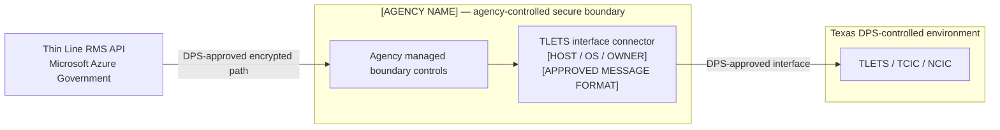

# Agency network diagram template

**Status:** Internal working template — the agency must replace placeholders, remove unused paths, verify accuracy, and approve the final diagram.  
**Use when:** The agency does not have a current CJIS network diagram suitable for the interface approval packet.  
**Classification:** Mark the exported submission **FOR OFFICIAL USE ONLY (FOUO)** or with the agency/DPS-required handling label.

This template is a starting point, not evidence that the pictured controls exist. The final diagram must match the agency's actual devices, boundaries, security controls, and approved Thin Line connector topology.

## Ownership

| Content | Owner |
|---|---|
| Agency users, ORI, workstations/mobile devices, LAN/WAN, routers, firewalls, IDS/IPS, VPN, and local servers | Agency |
| Thin Line application, Azure Government services, cloud security boundary, and application data flow | Thin Line |
| TLETS connection, message format, interface endpoint, and approval conditions | Joint; confirm with DPS/TLETS Operations |
| Final accuracy review, date, approval, and submission | Agency |

## Required substitutions

Replace every bracketed value:

- `[AGENCY NAME]`
- `[ORI]`
- `[REVISION DATE]`
- `[DEVICE TYPES AND COUNTS]`
- `[AGENCY FIREWALL / ROUTER / IDS-IPS]`
- `[AGENCY NETWORK SEGMENTS]`
- `[AGENCY MFA / IDENTITY PROVIDER]`
- `[THIN LINE TENANT / AZURE RESOURCE NAMES]`
- `[APPROVED MESSAGE FORMAT]`

Delete systems and connections that are not present. Add all agency-controlled CJI endpoints and relevant network/security devices. Do not include secret keys, passwords, private IP addresses, or other unnecessary sensitive configuration.

## Generic proposed diagram — cloud connector option

Use this version only if DPS approves the TLETS interface connector in Thin Line's Azure Government environment.

```mermaid
flowchart LR
    subgraph Agency["[AGENCY NAME] — ORI [ORI] — agency-controlled boundary"]
        Users["Authorized agency personnel"]
        Devices["[DEVICE TYPES AND COUNTS]<br/>Agency-managed workstations / MDTs / mobile devices"]
        LAN["[AGENCY NETWORK SEGMENTS]<br/>Secure LAN / managed wireless / mobile network"]
        Boundary["[AGENCY FIREWALL / ROUTER / IDS-IPS]<br/>Managed agency boundary"]
        IdP["[AGENCY MFA / IDENTITY PROVIDER]"]

        Users --> Devices
        Devices --> LAN
        LAN --> Boundary
        Devices -. authentication .-> IdP
    end

    Internet["Approved external network path<br/>CJI in transit encrypted with TLS 1.2+"]

    subgraph ThinLine["Thin Line Software LLC — Microsoft Azure Government"]
        CloudBoundary["Azure Government / Thin Line managed boundary controls"]
        UI["Thin Line RMS/CAD web application<br/>[THIN LINE TENANT / RESOURCE NAMES]"]
        API["Thin Line RMS API<br/>Authentication, authorization, audit"]
        Data[("Azure SQL<br/>CJI encrypted at rest")]
        Connector["Thin Line TLETS interface connector<br/>[APPROVED MESSAGE FORMAT]<br/>Placement subject to DPS approval"]

        CloudBoundary --> UI
        UI --> API
        API --> Data
        API --> Connector
    end

    subgraph DPS["Texas DPS-controlled environment"]
        TLETS["TLETS / TCIC / NCIC"]
    end

    Boundary -->|"HTTPS / TLS 1.2+"| Internet
    Internet --> CloudBoundary
    Connector -->|"DPS-approved encrypted interface"| TLETS
```

## Alternative — agency/on-premises connector

If DPS requires an agency-hosted connector, replace the cloud connector path above with this segment and show the connector's actual secure location, host, operating system, firewall path, and management owner.

## Agency completion checklist

- [ ] Diagram shows agency name, ORI, revision date, preparer, and handling marking.
- [ ] All agency endpoints that may display, process, transmit, or store CJI are shown by type and count.
- [ ] Relevant routers, switches, firewalls, IDS/IPS, VPN/remote-access paths, servers, and network segments are shown.
- [ ] Trust boundaries and ownership are explicit: Agency, Thin Line/Azure Government, and DPS.
- [ ] Every path crossing a secure boundary identifies the transport and encryption.
- [ ] Remote-access paths match the agency's approved remote-access policy.
- [ ] Connector placement and message format match the TLETS Interface Questionnaire.
- [ ] Thin Line has reviewed the Thin Line/Azure portion.
- [ ] Agency technical staff/LASO have verified the agency portion.
- [ ] Agency approving authority has approved the final diagram.

## Export

Export the approved diagram to PDF or the format requested by DPS. Mermaid source can be transferred to Visio, draw.io, or another agency-approved diagramming tool. The editable source should remain under agency change control.

## Related

- [Thin Line network diagram insert](thin-line-network-diagram-insert.md)
- [Interface Approval Packet answers](interface-approval-packet.md)
- [Direct-interface scope](direct-interface-scope.md)
