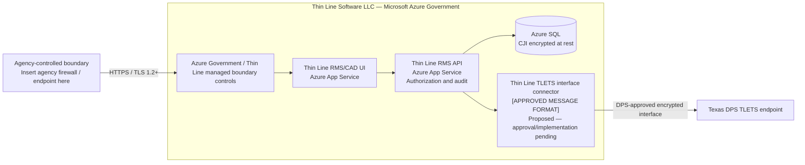
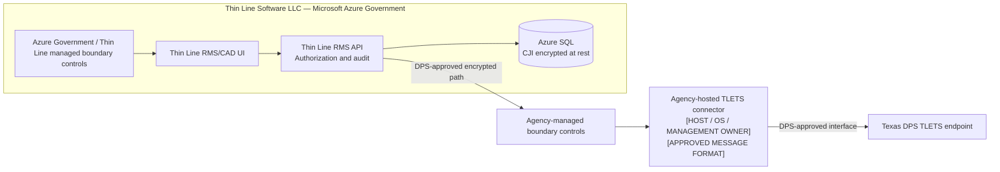

# Thin Line network diagram insert

**Status:** Internal working template — update after connector topology is approved and before giving it to an agency.  
**Use when:** The agency already has its own CJIS network diagram and needs the Thin Line/Azure Government portion to insert.

The agency remains responsible for its complete diagram and final submission. Thin Line owns the accuracy of this vendor segment. Do not depict the connector as operational or approved until engineering implementation, DPS TEST, and DPS approval support that statement.

## Vendor segment — cloud connector proposal

Use this segment only if DPS approves the connector in Thin Line's Azure Government environment.

## Vendor segment — agency-hosted connector alternative

Use this segment if DPS requires the connector within the agency-controlled secure boundary.

## Text to accompany the insert

> Authorized agency personnel access Thin Line RMS/CAD through agency-managed endpoints over HTTPS using TLS 1.2 or higher. The application is hosted by Thin Line Software LLC in Microsoft Azure Government. Thin Line-managed application components enforce authentication, authorization, and audit controls and use Azure Government services for protected application processing and storage. The final TLETS interface connector location, message format, and connection to Texas DPS are shown according to the DPS-approved topology. Agency endpoints, identity controls, local network boundaries, remote-access paths, and agency-managed equipment remain documented and controlled by the agency.

## Values Thin Line must supply

- Agency tenant name and current Azure resource identifiers suitable for the submission.
- Current UI, API, database, and interface component names.
- Actual connector location and management owner.
- Approved message format and interface transport.
- Authentication/MFA integration description.
- TLS configuration and applicable Microsoft FIPS validation evidence.
- Logging, monitoring, and query-audit destinations.
- Revision date and Thin Line reviewer.

## Integration instructions for the agency

1. Place the selected vendor segment outside the agency-controlled trust boundary.
2. Connect the agency's actual endpoint/firewall path to **Agency-controlled boundary**.
3. Show any agency-hosted connector inside the correct secure segment.
4. Preserve the ownership labels and encrypted-transport labels.
5. Reconcile the resulting diagram with the TLETS Interface Questionnaire and remote-access policy.
6. Have Thin Line review the vendor portion and the agency approve the complete diagram.

## Known decision still open

The current documentation does not establish whether DPS will approve an Azure Government connector or require an agency-hosted connector. Keep both alternatives available, but submit only the approved/accurate one.

## Related

- [Agency network diagram template](agency-network-diagram-template.md)
- [Interface Approval Packet answers](interface-approval-packet.md)
- [Open decisions](open-decisions.md)
