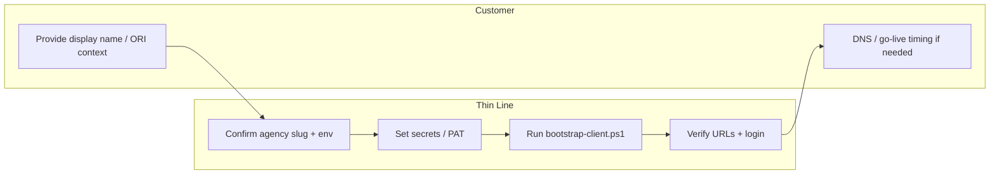
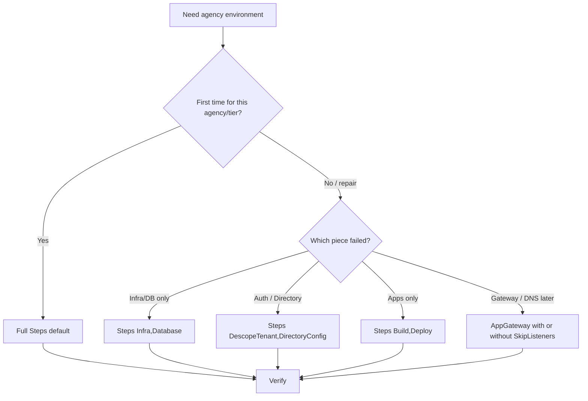
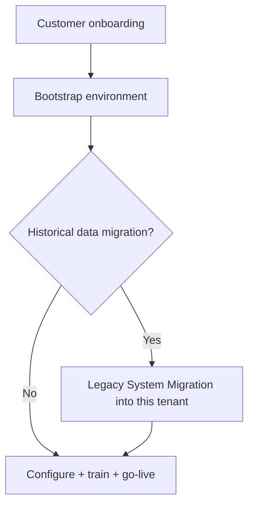

# Bootstrap Environment

**Phase:** Deliver  
**Document type:** SOP  
**Status:** v1  
**Next review:** <mark style="color:red;">**TODO:**</mark> Set date (suggested: 2026-10-17)

---

## Executive Summary

| | |
|--|--|
| **Objective** | Provision a new agency tenant **according to the [Bootstrap Environment Standard](bootstrap-environment-standard.md)** so platform wiring exists and health checks pass. |
| **Typical duration** | 30–90 minutes for a standard full bootstrap (excluding credential wait / DNS). |
| **Owner** | Implementation Lead *(current incumbent: Matthew Keslin)* |
| **Primary stakeholders** | Implementation · Engineering · Customer (DNS / go-live timing) |
| **Success criteria** | [Environment Health Checklist](../../checklists/environment-health-checklist.md) passes · naming/URLs match the Standard |
| **Related standards** | [Bootstrap Environment Standard](bootstrap-environment-standard.md) · [Environment Inventory](environment-inventory-standard.md) · [Bootstrap vs Configuration](bootstrap-vs-configuration.md) |
| **Related SOPs** | [Legacy System Migration](legacy-system-migration.md) · [Customer Onboarding](customer-onboarding.md) · [Go-Live Readiness Assessment](../../assessments/go-live-readiness-assessment.md) |
| **Authoritative scripts** | Product monorepo `Infrastructure/` (especially `scripts/bootstrap-client.ps1`) |

---

## Responsibility swimlane



| Lane | Responsibilities |
|------|------------------|
| **Thin Line** | Azure login, secrets, script execution, verification |
| **Customer** | Agency naming / branding inputs; DNS or cutover timing when required |

---

## 1. Purpose

Create a working Thin Line tenant for an agency **to the [Bootstrap Environment Standard](bootstrap-environment-standard.md)**: Azure resources (SQL DB, API/UI apps, file share), baseline database import, Descope tenant, Directory API configuration, Application Gateway routing, and Build/Deploy of the chosen release branch.

Bootstrap does **not** perform agency business configuration (ORI, officers, courts, codes, printers, policies). See [Bootstrap vs Configuration](bootstrap-vs-configuration.md).

---

## 2. Scope

### In scope

- New agency environments: `dev`, `test`, or `prod` ([Environment Classification](environment-classification.md))
- Full or partial runs of `Infrastructure/scripts/bootstrap-client.ps1`
- Standalone re-runs of individual steps (idempotent)
- Teardown via `teardown-client.ps1` when retiring a tenant ([Environment Lifecycle](environment-lifecycle.md) — Destroy)

### Out of scope

- Agency **configuration** after infra is healthy ([Bootstrap vs Configuration](bootstrap-vs-configuration.md))
- Legacy data conversion ([Legacy System Migration](legacy-system-migration.md))
- Day-to-day support after go-live
- Changing shared platform resources (SQL server host, App Service Plan, shared App Gateway appliance itself)—bootstrap **adds** client entries and databases
- Owning / refreshing baseline bacpacs ([Baseline Database Standard](baseline-database-standard.md))

---

## 3. Owner

| Role | Assignment |
|------|------------|
| **Accountable owner** | Implementation Lead |
| **Current incumbent** | Matthew Keslin |

---

## 4. Trigger

- Signed commercial path ready for environment provisioning (typically after contract / onboarding kickoff)
- Agency slug and display name agreed
- Target tier known: `dev` | `test` | `prod`
- Release / version branch chosen (e.g. `release/6.1.0`)

---

## 5. Preconditions

- Azure CLI installed; logged into **Azure US Government** (`az cloud set --name AzureUSGovernment` then `az login`)
- Access to the product Git repo (`Infrastructure/` folder)
- SqlPackage available (repo `Clients\__DAC\SqlPackage.exe` or installed DAC)
- For Build/Deploy steps: Azure DevOps CLI extension + PAT with Build/Release execute
- Secrets available as environment variables (see [Tools](#8-tools))—do not commit secrets

---

## 6. Inputs

| Input | Example | Notes |
|-------|---------|-------|
| Environment | `prod` | Must match `Infrastructure/environments/*.profile.json` / `.bicepparam` |
| AgencyName (slug) | `thinlinepd` | Lowercase slug used in resource names and hostnames |
| FriendlyAgencyName | `Thin Line PD` | Display name; Descope tenant name / Directory Name |
| VersionBranch | `release/6.1.0` | Branch for Build/Deploy pipelines |
| Bacpac (optional override) | `Clients\_Base\Databases\_Base_ThinLineRMS.bacpac` | Default if omitted |
| Steps (optional) | `Infra,Database,...` | Default = full sequence |

---

## 7. Outputs

- Azure resources: `tls-{agency}-{env}-rms` database, `-api` / `-ui` web apps, file share (naming via Bicep / `TlsBicepResourceNames.ps1`)
- App Gateway routes: `{agency}.thinline.app` and `{agency}-api.thinline.app` (default suffix)
- Descope tenant ID
- Directory API tenant config
- Deployed application build for the agency

---

## 8. Tools

| Tool | Use |
|------|-----|
| Product Git `Infrastructure/scripts/` | Bootstrap / teardown PowerShell |
| `Infrastructure/environments/*.profile.json` | Subscription, RG, region, SQL defaults per tier |
| `Infrastructure/environments/shared.profile.json` | Shared App Gateway RG/name |
| Azure CLI (US Government) | Deploy Bicep / manage resources |
| Azure DevOps PAT | Build + Deploy pipeline steps |
| Descope management API | Tenant create |
| Directory API | Tenant config create/merge |
| SqlPackage | Bacpac import |

**Authoritative command reference:** product monorepo `Infrastructure/README.md` — keep this SOP aligned when scripts change; do not duplicate every parameter flag here.

---

## 9. Current state

| Area | Today |
|------|-------|
| **Orchestration** | `bootstrap-client.ps1` runs numbered scripts in order |
| **Profiles** | `-Environment` loads subscription/RG/region/SQL/App Gateway defaults from JSON profiles |
| **Idempotency** | Steps are designed to be re-runnable (DB reimport, App Gateway skip-if-exists, Descope return existing, Directory merge) |
| **Secrets** | Env vars (`TLS_SQL_*`, `TLS_DESCOPE_*`, `TLS_DEVOPS_PAT` / `AZURE_DEVOPS_EXT_PAT`, `TLS_DIRECTORY_API_*`) |
| **Partial runs** | `-Steps` selects subsets (e.g. `Infra,Database` only) |
| **Teardown** | `teardown-client.ps1` reverse order; leaves shared platform resources |

---

## 10. Target state

| Area | Target |
|------|--------|
| **Delegation** | Implementation specialists run full bootstrap from this SOP without founder involvement |
| **CI/CD** | Non-interactive service principal / OIDC; approval gates for prod |
| **Secrets** | Org secret store (not local defaults) |
| **Visibility** | Hub / status for “environment ready” |

---

## 11. Gap analysis

| Gap | Current → Target | Priority |
|-----|------------------|----------|
| Founder-dependent secrets/knowledge | Documented env vars + profiles → specialist-runnable | High |
| Interactive Azure login | Manual `az login` → service principal / OIDC | Medium |
| Prod approval | Honor system → formal gate | Medium |
| Hub status | None → environment readiness signal | Low |

---

## 12. Common risks

| Risk | Mitigation |
|------|------------|
| Wrong Environment / AgencyName | Confirm slug and tier before run; names drive hostnames and DB |
| Missing PAT / Descope / SQL secrets | Fail fast; set env vars before full Steps |
| App Gateway conflict | Use `-AutoPriority` (bootstrap does); do not invent hostnames |
| Bacpac / SqlPackage missing | Verify path and SqlPackage before Database step |
| Directory API unreachable | Set `TLS_DIRECTORY_API_URL` / key per README |
| Running Deploy without BuildId | Run Build first or pass `-BuildId` |

---

## 13. Decision trees

### Full vs partial bootstrap



### Sequencing with data migration



Bootstrap (or at least Infra + Database) must exist before importing conversion data into that tenant.

---

## 14. Time expectations

| Phase | Typical duration |
|-------|------------------|
| Prerequisites / secrets | 5–15 min |
| Full `bootstrap-client.ps1` | 30–60 min |
| Verification / smoke login | 10–15 min |
| DNS / customer wait | Customer dependent |

---

## 15. Automation score

| Process | Level | Notes |
|---------|------:|-------|
| Orchestrated script run | 4 / 5 | `bootstrap-client.ps1` |
| Secret handling | 2 / 5 | Env vars / local knowledge |
| Verification | 2 / 5 | Manual smoke checks |
| CI/CD unattended prod | 1 / 5 | Not yet |

---

## 16. Procedure

### Phase 0 — Confirm parameters

1. Agree **AgencyName** (slug), **FriendlyAgencyName**, **Environment** (`dev`|`test`|`prod`), **VersionBranch**.
2. Confirm bacpac source (default base RMS bacpac unless a special seed is required).
3. Record parameters on the engagement notes / assessment.

### Phase 1 — Machine / cloud setup

From a machine with the product repo:

```powershell
az cloud set --name AzureUSGovernment
az login
az account set --subscription "<subscription-from-profile-or-override>"
```

Install/verify Azure CLI, SqlPackage, and (for pipelines) `az extension add --name azure-devops`.

### Phase 2 — Set secrets (session)

Set only what the chosen Steps require. Prefer environment variables over embedding secrets in command history.

| Variable | Used by |
|----------|---------|
| `TLS_SQL_USER` / `TLS_SQL_PASSWORD` | Database, Directory |
| `TLS_DESCOPE_PROJECT_ID` / `TLS_DESCOPE_MANAGEMENT_KEY` | DescopeTenant, Directory |
| `TLS_DESCOPE_ACCESS_KEY` / `TLS_DESCOPE_TENANT_ID` | Directory (as required by script) |
| `TLS_DEVOPS_PAT` or `AZURE_DEVOPS_EXT_PAT` | Build, Deploy |
| `TLS_DIRECTORY_API_KEY` / `TLS_DIRECTORY_API_URL` | Directory (overrides) |
| `TLS_ELASTIC_POOL_NAME` | Optional pool override (empty = skip move) |

Defaults for subscription, resource group, region, SQL server, and App Gateway come from **`Infrastructure/environments/<Environment>.profile.json`** and **`shared.profile.json`** when `-Environment` is set.

### Phase 3 — Full bootstrap (standard path)

From the **product repo root**:

```powershell
.\Infrastructure\scripts\bootstrap-client.ps1 `
    -Environment prod `
    -AgencyName <slug> `
    -FriendlyAgencyName "<Display Name>" `
    -VersionBranch "release/x.y.z" `
    -SkipWhatIf
```

Default **Steps** (in order):

| Step | Script(s) | What it does |
|------|-----------|--------------|
| **Infra** | `01-bootstrap.ps1` → `02-deploy.ps1` | Cloud/subscription/RG; Bicep deploy (SQL DB shell, API/UI apps, file share) |
| **Database** | `03-deploy-database.ps1` | Import bacpac; post-import auth/agency SQL; optional elastic pool |
| **AppGateway** | `04-update-app-gateway.ps1` | Backend pools, HTTPS listeners, routes (`-AutoPriority` when via bootstrap) |
| **DescopeTenant** | `05-create-descope-tenant.ps1` | Create (or resolve) Descope tenant |
| **DirectoryConfig** | `06-register-directory-config.ps1` | Create/merge Directory API tenant config |
| **Build** | `07-run-pipelines.ps1` (BuildOnly) | Build pipeline for VersionBranch |
| **Deploy** | Directory ensure + `07-run-pipelines.ps1` (DeployOnly) | Deploy pipeline for environment (requires BuildId) |

Convenience: `BuildAndDeploy` runs Build then Deploy in one step list entry.

### Phase 4 — Partial / repair runs

Examples:

```powershell
# Infra + database only
.\Infrastructure\scripts\bootstrap-client.ps1 ... -Steps "Infra,Database" -SkipWhatIf

# Build + Deploy only (infra/auth already done)
.\Infrastructure\scripts\bootstrap-client.ps1 ... -Steps "Build,Deploy"

# Deploy only (pass prior build id)
.\Infrastructure\scripts\bootstrap-client.ps1 ... -Steps "Deploy" -BuildId <id>
```

Individual scripts under `Infrastructure/scripts/01-…` through `07-…` may also be run standalone; see product `Infrastructure/README.md`.

### Phase 5 — Verify (health)

Complete the [Environment Health Checklist](../../checklists/environment-health-checklist.md).

Confirm naming and URLs against the [Bootstrap Environment Standard](bootstrap-environment-standard.md). On pass, hand off to **Configuration** ([Bootstrap vs Configuration](bootstrap-vs-configuration.md)) — do not treat bootstrap as agency setup complete.

### Phase 6 — Teardown (only when retiring)

```powershell
.\Infrastructure\scripts\teardown-client.ps1 `
    -Environment <env> `
    -AgencyName <slug> `
    -FriendlyAgencyName "<Display Name>"
```

Default teardown steps: DirectoryConfig → DescopeTenant → AppGateway → Database → Infra (client apps/share). Shared SQL server / App Service Plan / gateway appliance remain.

---

## 17. Verification

Bootstrap is complete when the [Environment Health Checklist](../../checklists/environment-health-checklist.md) passes and the environment matches the [Bootstrap Environment Standard](bootstrap-environment-standard.md). Next lifecycle stages: Configuration → (optional Migration) → Training → Go Live — see [Environment Lifecycle](environment-lifecycle.md).

---

## 18. Failure and escalation

| Situation | Action |
|-----------|--------|
| Script throws on a step | Fix precondition (secret, path, Azure login); re-run **that** step or `-Steps` subset (idempotent) |
| App Gateway / DNS not ready | Complete Infra/Database/Directory; run AppGateway later; optional `-SkipListeners` on `04-…` when used standalone |
| Deploy pipeline fails | Confirm Directory config + BuildId; check DevOps PAT and branch |
| Suspected shared-resource impact | **Stop.** Do not delete shared SQL server / plans; escalate to Engineering |

---

## 19. KPIs

| KPI | Definition | Target |
|-----|------------|--------|
| Bootstrap duration | Start Phase 1 → Phase 5 pass | <mark style="color:red;">**TODO:**</mark> measure |
| First-time success rate | Full run without rework | <mark style="color:red;">**TODO:**</mark> |
| Specialist-run share | Bootstraps without founder | <mark style="color:red;">**TODO:**</mark> |

---

## 20. Related documents

| Document | Relationship |
|----------|--------------|
| [Bootstrap Environment Standard](bootstrap-environment-standard.md) | What “done” looks like (naming, DNS, tiers) |
| [Environment Inventory Standard](environment-inventory-standard.md) | Bill of materials |
| [Environment Lifecycle](environment-lifecycle.md) | Request → destroy |
| [Environment Classification](environment-classification.md) | dev / test / prod / demo / training |
| [Baseline Database Standard](baseline-database-standard.md) | Seed bacpac |
| [Bootstrap vs Configuration](bootstrap-vs-configuration.md) | Boundary |
| [Hub Environment Integration](hub-environment-integration.md) | Future Hub record |
| [Environment Health Checklist](../../checklists/environment-health-checklist.md) | Phase 5 |
| Product repo `Infrastructure/README.md` | Command-level detail, profiles, teardown |
| [Bootstrap environment (CVE stage)](../../customer-value-engine/deliver/bootstrap-environment.md) | Stage context |
| [Legacy System Migration](legacy-system-migration.md) | Data load after/with environment |
| [Customer Onboarding](customer-onboarding.md) | Broader Deliver sequence |
| [Go-Live Readiness Assessment](../../assessments/go-live-readiness-assessment.md) | Before exclusive use |
| [Business Systems Architecture](../../operating-system/business-systems-architecture.md) | Systems of record |

---

## Continuous improvement system

### Weaknesses

- Secrets and PAT still session/local  
- Verification is manual  
- Prod lacks formal approval gate in automation  

### Automation opportunities

| Opportunity | Relieves |
|-------------|----------|
| Service principal / OIDC for Azure + DevOps | Interactive login / PAT churn |
| Post-bootstrap smoke test script | Manual Phase 5 |
| Hub “environment ready” status | Ad hoc tracking |

### Product impact

| If we build… | Work reduced |
|--------------|--------------|
| One-click / guided tenant provision in Hub | Manual PowerShell orchestration for standard cases |
| Built-in smoke checks | Manual verification |

### Process maturity

| | |
|--|--|
| **Current level** | **3 / 5** |
| **Description** | Standardized PowerShell orchestration (`bootstrap-client.ps1`) with profiles; still secret- and founder-knowledge dependent for some runs. |
| **Next milestone** | Implementation specialist completes a standard prod bootstrap using only this SOP + `Infrastructure/README.md`. |
| **Future goal** | Unattended or Hub-triggered provision with approval gates. |

### Next review date

| Field | Value |
|-------|-------|
| **Next review** | <mark style="color:red;">**TODO:**</mark> Set date (suggested: 2026-10-17) |
| **Review owner** | Implementation Lead |
| **Review questions** | Did Steps list stay accurate? Any new required secrets? Specialist-run success? |

---

## Change history

| Date | Change |
|------|--------|
| 2026-07-17 | Placeholder stub |
| 2026-07-17 | v1 — documented current `Infrastructure/scripts/bootstrap-client.ps1` process (steps, profiles, secrets, verify, teardown) |
| 2026-07-17 | Linked Bootstrap Standard, health checklist, lifecycle, config boundary |
