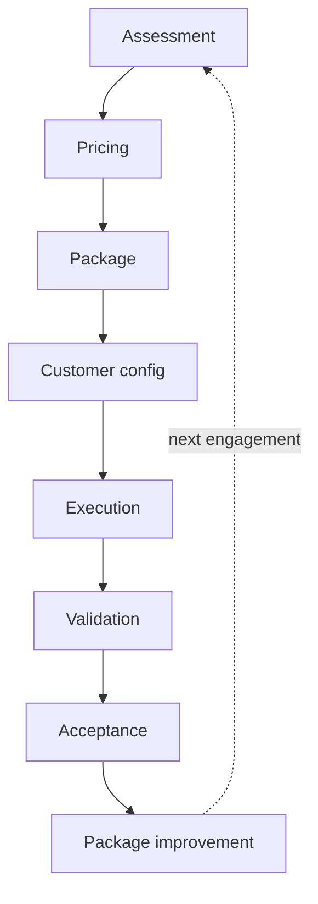

# Migration Architecture

**Document type:** Overview  
**Status:** v1  
**Audience:** Sales · Implementation · Engineering

One-page mental model for legacy data migration. Principles: [Migration Philosophy](migration-philosophy.md). Decisions: [Migration Decision Matrix](migration-decision-matrix.md).

---

## End-to-end flow



| Stage | What happens | Primary doc |
|-------|--------------|-------------|
| **Assessment** | Can we convert? Risk, modules, package fit | [Legacy System Migration Assessment](../../../assessments/legacy-system-migration-assessment.md) |
| **Pricing** | Quote outcomes from assessment | [Migration Pricing Policy](../../../policies/migration-pricing.md) |
| **Package** | Choose / extend vendor Migration Package | [Migration Package Standards](vendor-packages/migration-package-standards.md) · [Vendor Guides](vendor-packages/vendor-conversion-guides/README.md) |
| **Customer config** | Checklist + Overrides (not shared Pipeline) | [Customer Configuration Standard](migration-customer-configuration.md) |
| **Execution** | StagingImporter + Pipeline + [Post-Conversion Utilities](post-conversion-utilities.md) | [Legacy System Migration](legacy-system-migration.md) · product `PROCESS.md` |
| **Validation** | Counts, relationships, spot checks | [Migration Validation Standard](migration-validation-standard.md) |
| **Acceptance** | Customer acknowledges | [Customer Validation Checklist](../../../checklists/customer-validation-checklist.md) · Acceptance form |
| **Package improvement** | Promote reusable fixes; bump `VERSION`; backlog | [Package Standards — backlog](migration-package-standards.md#package-backlog) |

---

## Two layers (always)

```text
┌─────────────────────────────────────┐
│  Vendor package (common)            │  Utilities/Migration Tools/<Vendor>/
│  VERSION · Pipeline · templates     │
└─────────────────┬───────────────────┘
                  │ + configuration
                  â–¼
┌─────────────────────────────────────┐
│  Customer engagement                │  Clients/<Client>/Conversion/...
│  Filled checklist · Overrides       │
└─────────────────────────────────────┘
                  │
                  â–¼
            Thin Line tenant
```

---

## Where migration sits in implementation

Migration is **one Deliver phase**, not the whole implementation:

```text
Contract
  → Implementation workspace / bootstrap
  → Migration (this architecture)
  → Configuration
  → Training
  → Go-live
  → Support
```

Environment provisioning: [Bootstrap Environment](../infrastructure/bootstrap-environment.md). Broader onboarding: [Customer Onboarding](../customer-onboarding.md) *(placeholder)*.

---

## Related documents

| Document | Role |
|----------|------|
| [Migration Philosophy](migration-philosophy.md) | Why |
| [Migration Decision Matrix](migration-decision-matrix.md) | Where work goes |
| [CVE — Data conversion](../../../customer-value-engine/deliver/data-conversion.md) | Stage overview |
| [Migration Metrics](migration-metrics.md) | Lightweight tracking |

---

## Change history

| Date | Change |
|------|--------|
| 2026-07-17 | v1 — one-page architecture |
