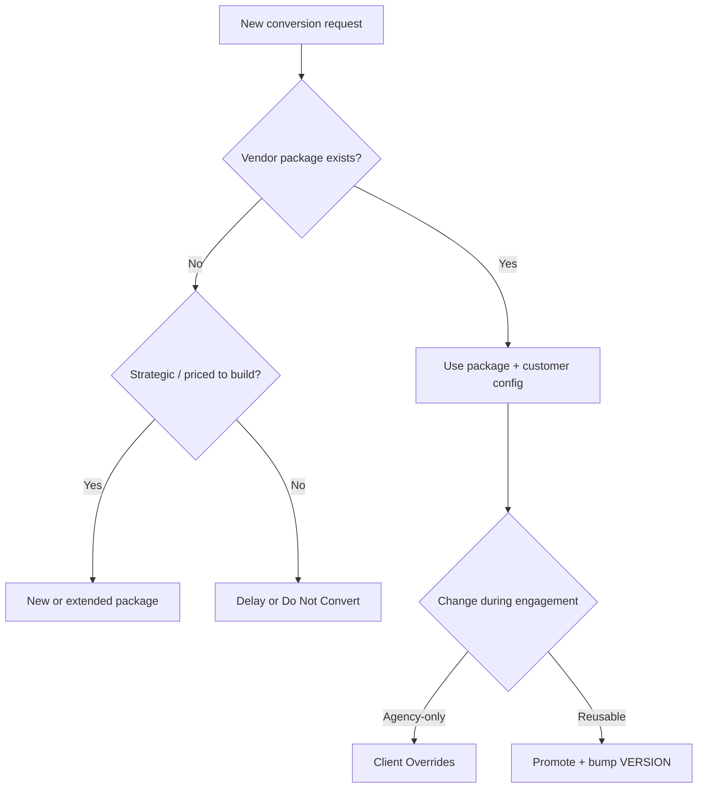

# Migration Decision Matrix

**Document type:** Reference  
**Status:** v1  
**Audience:** Implementation · Engineering · anyone deciding where a change belongs

Use this when something is unclear. Principles: [Migration Philosophy](migration-philosophy.md).

---

## Quick matrix

| Question | Decision |
|----------|----------|
| Existing vendor package for this product? | **Yes** → Use that package (`Utilities/Migration Tools/<Vendor>/`) |
| Unsupported vendor / no package? | **Assess** → Build package if we proceed, or Decline / Delay |
| One-off customer mapping (name, ORI, officer, court, one-off keys)? | **Configuration** → Client engagement folder Overrides / checklist |
| Reusable improvement (next agency will need it)? | **Package** → Promote into common Pipeline / templates; bump `VERSION` |
| Customer-specific SQL that must not be reused? | **Client folder** only — never merge into shared Pipeline as “default” |
| Generic SQL / shared transform? | **Package** `Pipeline` / `Common/scripts` |
| How do we know it worked? | **[Validation Standard](migration-validation-standard.md)** — not “scripts exited 0” |
| Assessment found gaps in the package? | **Package backlog** — not buried only in customer notes |
| Environment not ready? | **[Bootstrap Environment](../infrastructure/bootstrap-environment.md)** before import |
| After import, workflows / call masters? | **[Post-Conversion Utilities](post-conversion-utilities.md)** |

---

## Build vs configure vs decline

---

## Examples

| Example | Belongs in |
|---------|------------|
| “Thin Line PD” agency seed SQL | Client Overrides |
| Officer badge → username map for this agency | Client Overrides |
| Staging join missing a column all CopSync DBs have | Package (promote) |
| New checklist question discovered mid-run | Vendor `AgencyChecklist.md` |
| Jail CSV that is not CopSync | Separate path / new package — not CopSync Overrides |
| Fix attachment path logic for all CrimeStar | Package |

---

## Related documents

| Document | Role |
|----------|------|
| [Migration Architecture](migration-architecture.md) | Flow |
| [Migration Package Standards](vendor-packages/migration-package-standards.md) | Package rules |
| [Customer Configuration Standard](migration-customer-configuration.md) | Config layer |
| [Vendor Conversion Guides](vendor-packages/vendor-conversion-guides/README.md) | Per-vendor knowledge |

---

## Change history

| Date | Change |
|------|--------|
| 2026-07-17 | v1 — decision matrix |
