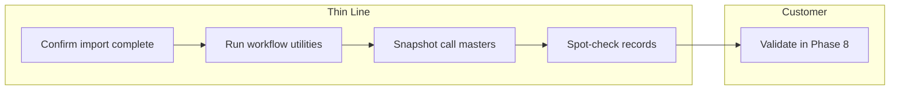
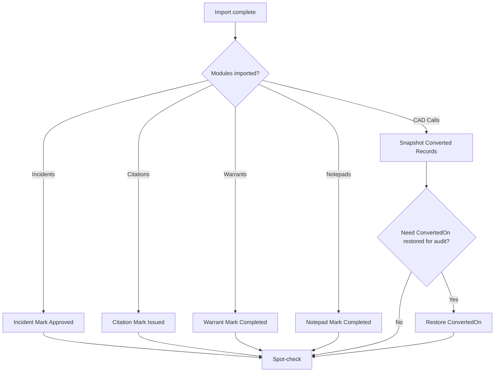
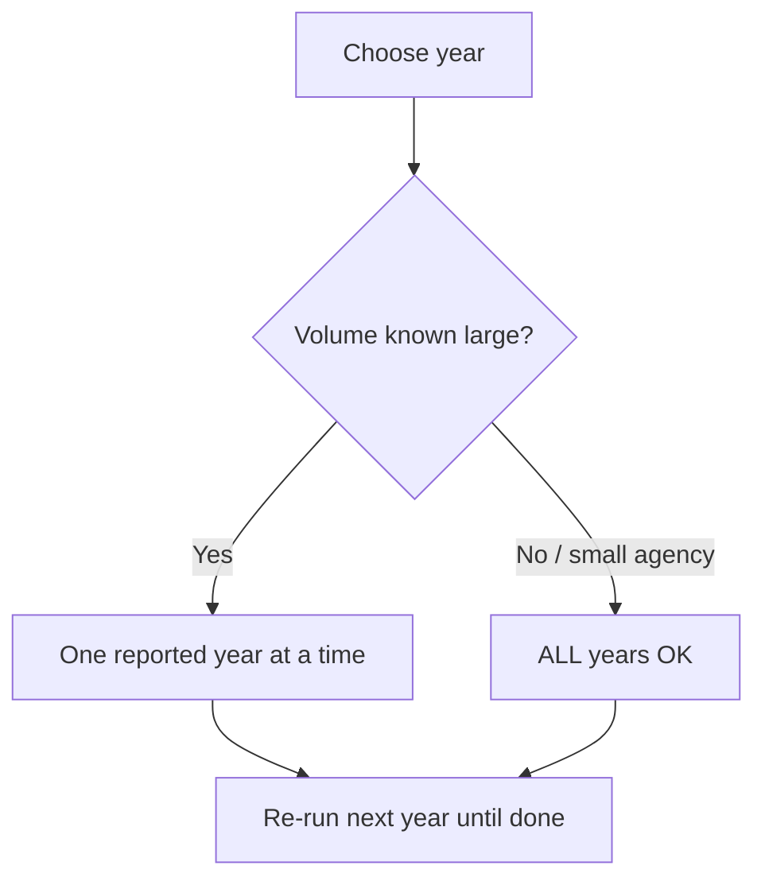

# Post-Conversion Utilities

**Phase:** Deliver  
**Document type:** SOP  
**Status:** v1  
**Next review:** <mark style="color:red;">**TODO:**</mark> Set date (suggested: 2026-10-17)

---

## Executive Summary

| | |
|--|--|
| **Objective** | After legacy import, move converted module records out of conversion/draft workflow and snapshot CAD call master records so the tenant is usable for validation and go-live. |
| **Typical duration** | Minutes to hours depending on volume (year filters recommended for large agencies). |
| **Owner** | Implementation Lead *(current incumbent: Matthew Keslin)* |
| **Primary stakeholders** | Implementation · Engineering (support claim) |
| **Success criteria** | Converted incidents/citations/warrants/notepads are in expected end statuses · Converted calls have master snapshots · Sample records open correctly in UI |
| **Related SOPs** | [Legacy System Migration](legacy-system-migration.md) · [Bootstrap Environment](../infrastructure/bootstrap-environment.md) |
| **Authoritative UI** | Thin Line Admin → **Data Utilities** (`/admin/data-utilities`) |

---

## Responsibility swimlane

| Lane | Responsibilities |
|------|------------------|
| **Thin Line** | Run Admin Data Utilities with Thin Line Support access; verify samples |
| **Customer** | Downstream validation (not the utility run itself) |

---

## 1. Purpose

Legacy conversion scripts typically leave records in a **conversion** or **draft** workflow state and mark CAD calls with **`ConvertedOn`** so masters still need snapshotting. Admin Data Utilities finish that work through the product API (same validation/side-effect paths as normal workflow where applicable), instead of hand-editing SQL.

---

## 2. Scope

### In scope

- **Module Data Conversion Workflow** (Admin): Incident, Citation, Warrant, Notepad
- **Data Conversion Snapshot** (Admin): CAD Calls — snapshot masters; optional restore `ConvertedOn`
- Optional helpers on the same page: Location acronym sync; Incident deserialize test

### Out of scope

- Running StagingImporter / Pipeline SQL ([Legacy System Migration](legacy-system-migration.md))
- Master merge / duplicate cleanup (separate Admin tools)
- Court-violation work-queue utilities (different UI)
- Day-to-day workflow changes for live (non-converted) records

---

## 3. Owner

| Role | Assignment |
|------|------------|
| **Accountable owner** | Implementation Lead |
| **Current incumbent** | Matthew Keslin |

---

## 4. Trigger

- Conversion import into the target tenant has finished (UAT or Production per migration decision)
- Agency checklist / vendor package indicates which modules were imported
- Ready for customer validation or internal smoke check of converted data

---

## 5. Preconditions

- Tenant is bootstrapped and apps are reachable ([Bootstrap Environment](../infrastructure/bootstrap-environment.md))
- Signed in as a user with **Thin Line Support** claim (API: `ThinLineSupportClaim` on `/tlsapi/utilities/*`)
- Know which **modules** and **years** were converted
- Prefer a quiet window for large **ALL**-year runs (long-running; per-record failures are skipped)

---

## 6. Inputs

| Input | Example | Notes |
|-------|---------|-------|
| Agency / environment | `{agency}.thinline.app` prod | Run against the DB that received the import |
| Reported year | `ALL` or `2024` | Year filter reduces runtime and blast radius |
| Incident filter status | `CONVERSION (0)` (default) | Only rows still in conversion status |
| Citation filter status | `CONVERSION (0)` (default) | Or `DRAFT` if that is how rows landed |
| Bypass validations | On (default for incident/citation) | Typical for conversion; off only when you want full validation |

---

## 7. Outputs

- Incidents → **Approved** (for matching filter)
- Citations → **Issued / Completed**
- Warrants / Notepads in **Draft** → **Completed**
- Calls with `ConvertedOn` set → new master snapshots (location, vehicle, person, organization); `ConvertedOn` cleared (import/conversion source tags preserved)
- Optional: `ConvertedOn` restored from `ImportedOn` for audit after snapshot

---

## 8. Tools

| Tool | Use |
|------|-----|
| Admin → **Data Utilities** | Primary UI (`AdminDataUtilities` / `AdminDataUtilityWorkflow`) |
| API `PUT /tlsapi/utilities/...` | Same operations (support claim required) |
| Spot-check in module UIs | Incidents, Citations, Warrants, Notepads, CAD Calls |

---

## 9. Current state

| Area | Today |
|------|-------|
| **Entry point** | Admin nav → Data Utilities (error-styled support tool) |
| **Workflow** | Bulk year-scoped transition via module services |
| **Call masters** | Snapshot only rows with `ConvertedOn` set |
| **Failures** | Per-record exceptions are caught and skipped; toast success does not mean every row succeeded |
| **Catalog** | Incident / Citation / Warrant / Notepad workflow + Call snapshot (+ optional restore / acronyms) |

---

## 10. Target state

| Area | Target |
|------|--------|
| **Reporting** | Counts processed / skipped / failed per utility |
| **Automation** | Optional post-import script or Hub step after StagingImporter |
| **Checklist** | Agency checklist auto-lists required utilities by modules converted |

---

## 11. Gap analysis

| Gap | Current → Target | Priority |
|-----|------------------|----------|
| Silent skip on errors | Toast-only → counts / log | High |
| Tribal sequencing | This SOP → checklist-driven | Medium |
| Call “workflow” wording | Legacy notes said call workflow; product uses **snapshot** for calls | Done (documented) |

---

## 12. Common risks

| Risk | Mitigation |
|------|------------|
| Running on wrong tenant | Confirm URL / agency before any red button |
| **ALL** years on huge datasets | Prefer year-by-year; expect long request timeouts |
| Bypass validations off with dirty conversion data | Leave **Bypass Validations** on for first pass |
| Snapshot before import finished | Only run after Pipeline / StagingImporter completes |
| Assuming toast = 100% success | Spot-check counts and sample records; re-run if rows remain in conversion / `ConvertedOn` |

---

## 13. Decision trees

### Which utilities to run

### Year filter

---

## 14. Time expectations

| Phase | Typical duration |
|-------|------------------|
| Prep / access check | 5 min |
| Workflow utilities (per module/year) | Minutes–tens of minutes |
| Call snapshot (large CAD history) | Often the longest step |
| Spot-check | 10–20 min |

---

## 15. Automation score

| Process | Level | Notes |
|---------|------:|-------|
| UI bulk utilities | 3 / 5 | Product-supported |
| Progress / failure reporting | 1 / 5 | Silent skips |
| Post-import orchestration | 1 / 5 | Manual after Pipeline |

---

## 16. Procedure

### Phase 0 — Confirm readiness

1. Confirm StagingImporter / Pipeline finished for this tenant.
2. Note which modules and years were loaded (agency checklist / conversion notes).
3. Sign in with Thin Line Support access.
4. Open **Admin → Data Utilities** (`/admin/data-utilities`).

### Phase 1 — Module Data Conversion Workflow

Run only for modules that were converted. Defaults are usually correct for conversion: year **ALL** (or a specific year), filter **CONVERSION (0)** where offered, **Bypass Validations** on.

#### Incident — Mark Approved

| Control | Typical conversion value |
|---------|--------------------------|
| Reported Year | `ALL` or specific year |
| Workflow Status | `CONVERSION (0)` |
| Bypass Validations | On |
| Action | **Mark Approved** |

**Effect:** For matching incidents, advances workflow to **Approved** (skips failing rows).

#### Citation — Mark Issued

| Control | Typical conversion value |
|---------|--------------------------|
| Reported Year | `ALL` or specific year |
| Workflow Status | `CONVERSION (0)` |
| Bypass Validations | On |
| Action | **Mark Issued** |

**Effect:** Matching citations → **Issued / Completed**.

#### Warrant — Mark Completed

| Control | Typical conversion value |
|---------|--------------------------|
| Reported Year | `ALL` or specific year |
| Action | **Mark Completed** |

**Effect:** Warrants still in **Draft** → **Completed**.

#### Notepad — Mark Completed

| Control | Typical conversion value |
|---------|--------------------------|
| Reported Year | `ALL` or specific year |
| Action | **Mark Completed** |

**Effect:** Notepads still in **Draft** → **Completed**.

Wait for each request to finish (loading state) before starting the next.

### Phase 2 — Data Conversion Snapshot (CAD Calls)

Converted calls are flagged with **`ConvertedOn`**. Until masters are snapshotted, call-linked persons/vehicles/locations/organizations may not behave like live records.

| Control | Typical conversion value |
|---------|--------------------------|
| Reported Year | `ALL` or specific year |
| Action | **Snapshot Converted Records** |

**Effect (per call with `ConvertedOn` set):**

1. Create fresh master snapshots for location, vehicles, persons, organizations on the call  
2. Clear `ConvertedOn` (pending-snapshot marker)  
3. Preserve `ImportSource` / conversion tagging  

#### Optional — Restore ConvertedOn

If audit needs `ConvertedOn` populated again after snapshot:

| Control | Action |
|---------|--------|
| Same Reported Year | **Restore ConvertedOn** |

**Effect:** Sets `ConvertedOn` from `ImportedOn` where applicable; toast reports count updated.

### Phase 3 — Optional helpers (same page)

| Utility | When |
|---------|------|
| **Acronym Sync → Locations** | Location acronyms need refresh after conversion |
| **Deserialize Test** (Incident) | Engineering/support diagnostic only — not a standard go-live step |

### Phase 4 — Verify

- [ ] Sample converted **incidents** open and show Approved (or expected) workflow  
- [ ] Sample **citations** show Issued/Completed  
- [ ] Sample **warrants** / **notepads** show Completed if those modules were run  
- [ ] Sample **calls** open with masters; few/no rows still pending solely because of uncleared `ConvertedOn`  
- [ ] Re-run a utility with a tighter year filter if leftovers remain  

Then continue [Legacy System Migration](legacy-system-migration.md) Phase 8 (customer validation).

---

## 17. Verification

Utilities are done when Phase 4 checks pass for every module that was imported. Do not treat a single success toast as proof of full coverage.

---

## 18. Failure and escalation

| Situation | Action |
|-----------|--------|
| 401 / forbidden on utilities | Confirm Thin Line Support claim; do not bypass via raw SQL without Engineering |
| Request timeout / browser hang | Re-run by **year**; leave tab open until complete; check API logs if needed |
| Many records still in CONVERSION / Draft | Re-run with Bypass on; spot-check a failing record in UI for real validation errors |
| Snapshot leaves broken masters | Escalate to Engineering; do not mass-edit snapshot FKs ad hoc |
| Wrong environment updated | Stop; assess restore / re-import; escalate |

---

## 19. KPIs

| KPI | Definition | Target |
|-----|------------|--------|
| Time to utilities complete | Import done → Phase 4 pass | <mark style="color:red;">**TODO:**</mark> measure |
| Re-run rate | Utilities needing second pass | <mark style="color:red;">**TODO:**</mark> |

---

## 20. Related documents

| Document | Relationship |
|----------|--------------|
| [Legacy System Migration](legacy-system-migration.md) | Phase 7 calls this SOP |
| [Bootstrap Environment](../infrastructure/bootstrap-environment.md) | Tenant must exist before utilities |
| [Migration Package Standards](vendor-packages/migration-package-standards.md) | What Pipeline left in conversion state |
| Product UI | `ThinLine.UI` → Admin Data Utilities |
| Product API | `UtilityController` (`/tlsapi/utilities`) |

---

## Continuous improvement system

### Weaknesses

- No processed/failed counts in UI  
- Long runs can time out without clear resume guidance beyond year filters  

### Automation opportunities

| Opportunity | Relieves |
|-------------|----------|
| Post-import job invoking the same service methods | Manual Admin clicks |
| Checklist auto-select of utilities by modules | Tribal knowledge |

### Product impact

| If we build… | Work reduced |
|--------------|--------------|
| Progress + failure report on Data Utilities | Blind re-runs and spot-check guessing |
| “Run all for conversion tag” | Per-module clicking |

### Process maturity

| | |
|--|--|
| **Current level** | **3 / 5** |
| **Description** | Standardized Admin utilities exist; sequencing documented here; reporting still thin. |
| **Next milestone** | Every conversion checklist lists required utilities + year strategy before go-live validation. |
| **Future goal** | Orchestrated post-import with counts. |

### Next review date

| Field | Value |
|-------|-------|
| **Next review** | <mark style="color:red;">**TODO:**</mark> Set date (suggested: 2026-10-17) |
| **Review owner** | Implementation Lead |
| **Review questions** | Still match Data Utilities UI? New modules needing workflow/snapshot? |

---

## Change history

| Date | Change |
|------|--------|
| 2026-07-17 | Placeholder stub |
| 2026-07-17 | v1 — Admin Data Utilities: workflow transitions + call master snapshot procedure |
