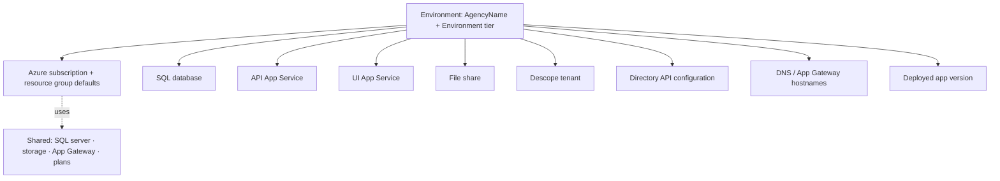

# Environment Inventory Standard

**Document type:** Standard  
**Status:** v1  
**Audience:** Engineering · Implementation (onboarding)

Defines **exactly what constitutes a Thin Line agency environment** — the bill of materials, not how to create it.

Create/update via [Bootstrap Environment SOP](bootstrap-environment.md) to the [Bootstrap Environment Standard](bootstrap-environment-standard.md).

---

## Definition

An **environment** is one agency × one tier (`dev` | `test` | `prod`) with a complete set of platform components that make Thin Line usable for that tenant.

It is **not** the shared SQL server, App Service Plan, or Application Gateway appliance alone — those are **platform shared resources** that many environments attach to.

---

## Composition

| Component | Required? | Notes |
|-----------|-----------|--------|
| **Identity** | Yes | `AgencyName` + `Environment` + `FriendlyAgencyName` |
| **Azure subscription / RG** | Yes | From tier profile (or explicit override) |
| **SQL database** | Yes | `{prefix}-rms` on shared SQL server |
| **API app** | Yes | `{prefix}-api` |
| **UI app** | Yes | `{prefix}-ui` |
| **File share** | Yes | `{prefix}-fileshare` on shared storage |
| **Descope tenant** | Yes | Auth boundary for the agency |
| **Directory configuration** | Yes | Tenant config consumed by deploy pipelines / runtime |
| **DNS / App Gateway routes** | Yes* | `*.thinline.app` UI + API; *may be deferred briefly with documented SkipListeners |
| **Deployed version** | Yes | Build/Deploy for `VersionBranch` |
| **Hub Environment record** | Target | See [Hub Environment Integration](hub-environment-integration.md) |

---

## Shared vs per-environment

| Shared (platform) | Per-environment (agency) |
|-------------------|---------------------------|
| SQL **server** | SQL **database** |
| Storage **account** | File **share** |
| App Service **plan**(s) | API / UI **sites** |
| Application **Gateway** appliance | Backend pools, listeners, rules for agency hostnames |
| Directory **API** host | Directory **tenant config** document |
| Descope **project** | Descope **tenant** |

Teardown removes per-environment pieces; it must **not** delete shared platform resources.

---

## Minimal inventory record (human)

Until Hub owns this, record at least:

| Field | Example |
|-------|---------|
| AgencyName | `thinlinepd` |
| FriendlyAgencyName | `Thin Line PD` |
| Environment | `prod` |
| VersionBranch / build | `release/6.1.0` |
| UI URL | `https://thinlinepd.thinline.app` |
| API URL | `https://thinlinepd-api.thinline.app` |
| SQL database | `tls-thinlinepd-prod-rms` |
| Bootstrap date | |
| Owner | Implementation Lead |

---

## Related documents

| Document | Role |
|----------|------|
| [Bootstrap Environment Standard](bootstrap-environment-standard.md) | Naming / URLs |
| [Environment Classification](environment-classification.md) | Tier purpose |
| [Environment Lifecycle](environment-lifecycle.md) | Stages of life |
| [Environment Health Checklist](../../checklists/environment-health-checklist.md) | Verify components |

---

## Change history

| Date | Change |
|------|--------|
| 2026-07-17 | v1 — environment bill of materials |
