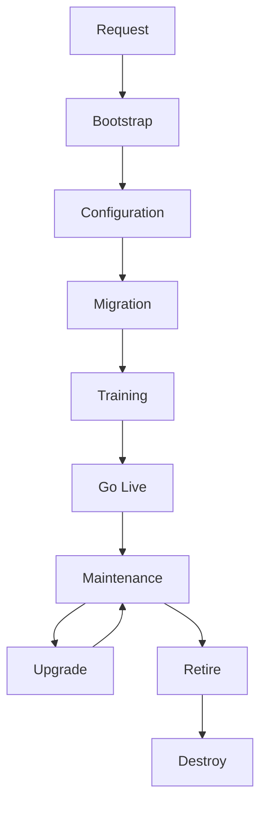

# Environment Lifecycle

**Document type:** Reference  
**Status:** v1  
**Audience:** Implementation · Engineering · leadership

Canonical stages of a Thin Line agency environment from request to destroy.

**Create:** [Bootstrap Environment SOP](bootstrap-environment.md)  
**Shape:** [Bootstrap Environment Standard](bootstrap-environment-standard.md) · [Environment Inventory Standard](environment-inventory-standard.md)

---

## Lifecycle

| Stage | Meaning | Primary docs |
|-------|---------|--------------|
| **Request** | Agency slug, tier, VersionBranch, commercial readiness agreed | Onboarding / assessment |
| **Bootstrap** | Infra + DB seed + auth + Directory + gateway + deploy | [Bootstrap SOP](bootstrap-environment.md) · [Standard](bootstrap-environment-standard.md) |
| **Configuration** | Agency settings, ORI, officers, courts, codes, printers, email, policies | [Bootstrap vs Configuration](bootstrap-vs-configuration.md) · future Implementation SOPs |
| **Migration** | Historical data (if in scope) | [Legacy System Migration](legacy-system-migration.md) |
| **Training** | Customer enablement | CVE Training *(placeholder SOP)* |
| **Go Live** | Exclusive / production use | Go-Live Readiness Assessment |
| **Maintenance** | Support, small config, ops | Operate / support |
| **Upgrade** | New VersionBranch deploy (pipelines); schema migrations as product requires | Deploy pipelines · release process |
| **Retire** | Customer leaving or environment obsolete; data retention decisions | <mark style="color:red;">**TODO:**</mark> retention policy link |
| **Destroy** | `teardown-client.ps1` — remove per-agency resources | Bootstrap SOP teardown · Inventory (shared stays) |

---

## Rules

1. **Bootstrap before Configuration** for a new tenant (or parallel only when deliberately using a prior seed).  
2. **Migration** requires a bootstrapped (or equivalent) database target.  
3. **Upgrade** is not a full bootstrap — use Build/Deploy (and product migration guidance).  
4. **Destroy** only after Retire decisions (access off, data disposition). Teardown is irreversible for that agency tier’s Azure apps/DB/share entries.  
5. Future: each stage updates [Hub Environment](hub-environment-integration.md) status.

---

## Related documents

| Document | Role |
|----------|------|
| [Migration Architecture](migration-architecture.md) | Migration slice inside Deliver |
| [Environment Classification](environment-classification.md) | Which tier for which purpose |
| [CVE — Deliver](../../customer-value-engine/deliver/README.md) | Broader Deliver stages |

---

## Change history

| Date | Change |
|------|--------|
| 2026-07-17 | v1 — request through destroy |
