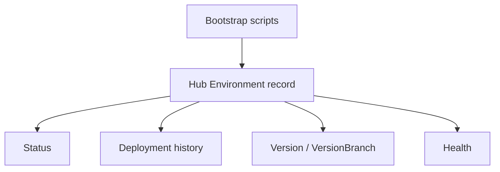

# Hub Environment Integration

**Document type:** Future-state design  
**Status:** v1 draft (not implemented)  
**Audience:** Product · Engineering · Implementation  

Bootstrap should eventually create more than Azure resources — it should create a **Thin Line Hub Environment** record so status, version, and health are visible without tribal knowledge.

---

## Target flow

| Today | Target |
|-------|--------|
| Engagement notes / memory | Hub Environment as system of record |
| Manual health spot-checks | Checklist results + probes attached to Environment |
| VersionBranch only in pipeline logs | Version on Environment + history |

---

## Suggested Environment fields

| Field | Purpose |
|-------|---------|
| AgencyName / FriendlyAgencyName | Identity |
| Classification / tier | `dev` \| `test` \| `prod` (+ demo/training when formalized) |
| Status | Requested · Bootstrapping · Ready · Configuring · Live · Retiring · Destroyed |
| UI / API URLs | From [Bootstrap Standard](bootstrap-environment-standard.md) |
| SQL database name | Inventory |
| Descope tenant id | Auth |
| Directory config key | Platform wiring |
| Current VersionBranch / BuildId | Deploy |
| Last health check | [Environment Health Checklist](../../checklists/environment-health-checklist.md) |
| Lifecycle stage | [Environment Lifecycle](environment-lifecycle.md) |

Keep **agency business configuration** on a separate Hub object (or section) — see [Bootstrap vs Configuration](bootstrap-vs-configuration.md).

---

## Bootstrap integration (future)

1. Start bootstrap → Hub status **Bootstrapping**  
2. Steps succeed → upsert resource identifiers  
3. Health checklist pass → status **Ready**  
4. Deploy pipeline → append **Deployment history**  
5. Teardown → status **Destroyed** (retain record for audit)

Non-goals for v1 Hub: replacing Azure Portal; storing secrets.

---

## Open decisions

| Topic | Notes |
|-------|-------|
| Source of truth vs Directory API | Hub may mirror Directory; avoid dual-write conflicts |
| Who can create Environments | Implementation vs automated bootstrap identity |
| Demo/Training as first-class types | See [Environment Classification](environment-classification.md) |

<mark style="color:red;">**TODO / Decision needed:**</mark> Prioritize on product roadmap relative to Migration Registry / Implementation workspace.

---

## Related documents

| Document | Role |
|----------|------|
| [Environment Inventory Standard](environment-inventory-standard.md) | What to store |
| [Bootstrap Environment SOP](bootstrap-environment.md) | Current create path |
| [Business Systems Architecture](../../operating-system/business-systems-architecture.md) | Hub as system of record |

---

## Change history

| Date | Change |
|------|--------|
| 2026-07-17 | v1 draft — future Hub Environment shape |
