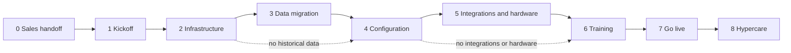

# Implementation lifecycle

**Phase:** Deliver  
**Document type:** Overview  
**Status:** v1  

The ordered phases from Sales handoff through hypercare. Parent: [Implementation overview](implementation-overview.md).

---

## Phases (0–8)

| # | Phase | Overview | Typical outcome |
|:-:|-------|----------|-----------------|
| 0 | Sales handoff | [Sales handoff](sales-handoff.md) | Handoff accepted; kickoff scheduled |
| 1 | Kickoff and discovery | [Kickoff and discovery](kickoff-and-discovery.md) | Scope, identity, timeline agreed |
| 2 | Infrastructure | [Infrastructure](infrastructure/README.md) | Environment healthy |
| 3 | Data migration | [Data migration](data-migration/README.md) | History migrated or **N/A** |
| 4 | Configuration | [Configuration](configuration/README.md) | Agency business setup done |
| 5 | Integrations and hardware | [Integrations and hardware](integrations-and-hardware.md) | Interfaces + devices verified or **N/A** |
| 6 | Training | [Training](training.md) | Users ready for production use |
| 7 | Go live | [Go live](go-live.md) | Production exclusive use |
| 8 | Hypercare and transition | [Hypercare and transition](hypercare-and-transition.md) | Steady-state Operate handoff |

Example board (not live):

```text
Deliver
□ 0 Sales handoff
□ 1 Kickoff and discovery
■ 2 Infrastructure
■ 3 Data migration
□ 4 Configuration
□ 5 Integrations and hardware
□ 6 Training
□ 7 Go live
□ 8 Hypercare and transition
```

---

## Sequence



Data migration and integrations/hardware are optional when out of scope; mark **N/A** and continue.

---

## Document types under each phase

| Type | Role |
|------|------|
| **Phase overview** | Purpose · Inputs · Activities · Outputs · Exit criteria · References |
| **Standards** | What “done” looks like |
| **SOPs** | How to execute |
| **Checklists / templates** | Verification and artifacts |

---

## Related

- [Implementation overview](implementation-overview.md)
- [Implementation workspace standard](implementation-workspace-standard.md)
- [Roles and responsibilities](roles-and-responsibilities.md)
