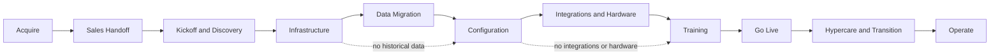

# Implementation lifecycle

**Document type:** Overview  
**Status:** v1  
**Audience:** Founders · Sales · Implementation · Engineering · Customer Success  
**Parent:** [Implementation overview](implementation-overview.md)

This is the primary big-picture roadmap for **Deliver**: the ordered path from a signed customer to stable production use and handoff into Operate.

---

## Roadmap

**Acquire** produces a signed customer. **Operate** begins after hypercare transition. Everything between is implementation (phases 0–8).

Data migration and integrations/hardware are often out of scope. Mark them **N/A** and continue—do not pretend they completed.

---

## Overlap vs completion

Phases may **overlap** in calendar time. Examples:

- Configuration discovery can start while Infrastructure finishes health checks.  
- Hardware orders can begin during Kickoff.  
- Training materials can be prepared during Configuration.  
- Integration credentials can be collected before Configuration exits.

**None of that changes the rule:** a phase is not complete until its **exit criteria** are satisfied (or it is explicitly **N/A** with a reason). Starting the next phase early is fine; declaring the previous phase done without exit criteria is not.

Deferrals need an owner and a place on the board—not a silent skip.

---

## Phase 0 — Sales handoff

**Outcome:** The implementation team has a complete and accurate understanding of the agreement, scope, expectations, risks, and commitments.

| | |
|--|--|
| **Purpose** | Move a signed deal from Sales to Implementation without re-discovering the contract in kickoff. |
| **Primary owner** | Sales owner |
| **Phase page** | [Sales handoff](sales-handoff.md) |

**Inputs**

- Signed SaaS agreement (and CJIS path when required)  
- Scope: modules, migration Y/N, integrations, hardware  
- Customer and Sales contacts  
- Migration assessment / pricing status when relevant  

**Key activities**

- Assemble the handoff packet  
- Confirm Implementation capacity and named lead  
- Flag risks, dates, and open commercial questions  
- Schedule kickoff  

**Outputs**

- Handoff accepted by Implementation  
- Kickoff date set  
- Written scope flags and risk list  

**Exit criteria**

- [ ] Commercial path is clear enough to proceed  
- [ ] Implementation has accepted ownership  
- [ ] Kickoff is scheduled  
- [ ] Migration, integrations, and hardware are stated (in / out / unknown with owner)  

**Typical customer involvement**

Low. Customer may confirm contacts or go-live aspirations; they are not running this phase.

**Supporting documents**

- [Sales handoff](sales-handoff.md)  
- [Sales handoff checklist](../../checklists/sales-handoff-checklist.md)  
- [Migration pricing policy](../../policies/migration-pricing.md)  
- [Legacy system migration assessment](../../assessments/legacy-system-migration-assessment.md) (when migration is likely)  

---

## Phase 1 — Kickoff and discovery

**Outcome:** Thin Line and the customer agree on objectives, responsibilities, workflows, timeline, and immediate next steps.

| | |
|--|--|
| **Purpose** | Align people, scope, and identity so Infrastructure and later phases have a shared plan. |
| **Primary owner** | Implementation lead |
| **Phase page** | [Kickoff and discovery](kickoff-and-discovery.md) |

**Inputs**

- Accepted handoff packet  
- Agency naming preferences (slug + display name)  
- Target go-live window  
- Scope flags from Sales  

**Key activities**

- Internal prep and draft board  
- Customer kickoff meeting  
- Confirm AgencyName, environment tiers, VersionBranch intent  
- Discovery: modules, workflows, migration, integrations, hardware, training audiences  
- Name Thin Line and customer owners  

**Outputs**

- Kickoff notes / shared plan  
- Discovery scope matrix  
- Initial lifecycle board (0–8)  
- Named owners  

**Exit criteria**

- [ ] Objectives and approximate timeline agreed  
- [ ] Agency identity (slug / display name) agreed  
- [ ] Migration, integrations, and hardware marked in-scope, out-of-scope, or TBD with owner  
- [ ] Path to Infrastructure is clear  

**Typical customer involvement**

High. Sponsor and operational leads should attend kickoff and answer discovery questions.

**Supporting documents**

- [Kickoff and discovery](kickoff-and-discovery.md)  
- [Implementation roles and responsibilities](implementation-roles-and-responsibilities.md)  
- [Implementation workspace standard](implementation-workspace-standard.md)  
- [Implementation readiness assessment](../../assessments/implementation-readiness-assessment.md)  
- Customer: [Discovery brief](../../../customer/implementation/discovery-brief-template.md) · [Kickoff agenda](../../../customer/implementation/implementation-kickoff-agenda.md) · [Preliminary plan](../../../customer/implementation/preliminary-implementation-plan.md) · [Action register](../../../customer/implementation/implementation-action-register.md) · [Implementation workbook](../../../customer/implementation/customer-implementation-workbook.md)  
- Thin Line: [Working session workbook](../../templates/working-session-workbook.md)  

---

## Phase 2 — Infrastructure

**Outcome:** The customer environment exists, is accessible, and passes technical validation.

| | |
|--|--|
| **Purpose** | Provision platform wiring (apps, auth, Directory, database seed, deploy)—not agency business setup. |
| **Primary owner** | Implementation lead *(work often done by Infrastructure operator)* |
| **Phase page** | [Infrastructure](infrastructure/README.md) |

**Inputs**

- AgencyName + FriendlyAgencyName  
- Environment tier (`dev` / `test` / `prod`)  
- VersionBranch  
- Secrets / Azure access  
- Baseline bacpac  

**Key activities**

- Confirm parameters against the bootstrap standard  
- Run bootstrap (`bootstrap-client.ps1`)  
- Complete environment health checks  
- Hand off to Data migration and/or Configuration  

**Outputs**

- Azure apps, SQL, file share (per inventory)  
- Auth / Directory wiring  
- Deployed VersionBranch  
- Passed health checklist  

**Exit criteria**

- [ ] Environment matches [Bootstrap environment standard](infrastructure/bootstrap-environment-standard.md)  
- [ ] [Environment health checklist](../../checklists/environment-health-checklist.md) passes  
- [ ] Bootstrap was not mistaken for full agency configuration ([Bootstrap vs configuration](infrastructure/bootstrap-vs-configuration.md))  

**Typical customer involvement**

Low to medium. May confirm display name, DNS preferences, or IT contacts. Day-to-day ops staff usually wait until Configuration / Training.

**Supporting documents**

- [Infrastructure](infrastructure/README.md)  
- [Bootstrap environment](infrastructure/bootstrap-environment.md)  
- [Bootstrap environment standard](infrastructure/bootstrap-environment-standard.md)  
- [Environment health checklist](../../checklists/environment-health-checklist.md)  

---

## Phase 3 — Data migration

**Outcome:** In-scope legacy data has been migrated, validated, and accepted.

| | |
|--|--|
| **Purpose** | Bring agreed historical data into Thin Line with quality the customer will accept—or explicitly skip. |
| **Primary owner** | Implementation lead *(work often done by Migration specialist)* |
| **Phase page** | [Data migration](data-migration/README.md) |

**Inputs**

- Healthy target environment (or equivalent)  
- Approved conversion plan / assessment when used  
- Vendor package + engagement Overrides  
- Legacy extract / access (after SaaS + CJIS as required)  

**Key activities**

- Assess and price (if not done)  
- Configure engagement (checklist + Overrides)  
- Execute package Pipeline / StagingImporter  
- Run post-conversion utilities  
- Validate; obtain customer acceptance  
- Promote reusable package fixes  

**Outputs**

- Converted data in the agreed environment  
- Exception report with dispositions  
- Customer acceptance record  
- Package register / VERSION updates as needed  

**Exit criteria**

- [ ] In-scope modules meet validation standard **or** phase marked **N/A**  
- [ ] Required post-conversion utilities done  
- [ ] Customer validation / acceptance recorded  
- [ ] Material exceptions fixed, accepted, or deferred with owners  

**Typical customer involvement**

High when in scope. Customer supplies extracts/access, answers mapping questions, and signs off validation—not “scripts are green.”

**Supporting documents**

- [Data migration](data-migration/README.md)  
- [Legacy system migration](data-migration/legacy-system-migration.md)  
- [Migration validation standard](data-migration/migration-validation-standard.md)  
- [Customer validation checklist](../../checklists/customer-validation-checklist.md)  
- [Customer acceptance](data-migration/customer-acceptance.md)  
- [Legacy system migration assessment](../../assessments/legacy-system-migration-assessment.md)  

---

## Phase 4 — Configuration

**Outcome:** The platform is configured for the customer’s approved operational workflows and policies.

| | |
|--|--|
| **Purpose** | Finish agency business setup so people can work in Thin Line the way the agency operates. |
| **Primary owner** | Implementation lead *(work often done by Configuration specialist)* |
| **Phase page** | [Configuration](configuration/README.md) |

**Inputs**

- Healthy environment  
- Data migration complete or N/A  
- Module / license scope  
- Discovery notes and customer preferences  
- Migration Overrides (number patterns / maps) when relevant  

**Key activities**

- Agency & Module Settings (identity, modules, numbering, reports/documents, workflow toggles)  
- Officers, users/roles, codes, CAD/evidence setup as in scope  
- Smoke core workflows  
- Defer live integration/device proof to Phase 5 when needed  

**Outputs**

- Configured agency settings  
- Go-live cohort users / officers / codes  
- Completed (or N/A) configuration checklist  
- Config debt list with owners  

**Exit criteria**

- [ ] [Agency configuration checklist](../../checklists/agency-configuration-checklist.md) complete for go-live scope (or deferred with owners)  
- [ ] Core workflows smoke-tested in the configured tenant  
- [ ] Settings match agreed workflows—not only “something is filled in”  

**Typical customer involvement**

High. Workflow owners decide codes, numbering, court defaults, and who gets which roles.

**Supporting documents**

- [Configuration](configuration/README.md)  
- [Agency & module settings](configuration/agency-settings.md)  
- [Agency configuration checklist](../../checklists/agency-configuration-checklist.md)  
- [Bootstrap vs configuration](infrastructure/bootstrap-vs-configuration.md)  
- Customer: [Configuration discovery workbook](../../../customer/implementation/configuration-discovery-workbook.md)  

---

## Phase 5 — Integrations and hardware

**Outcome:** Required external systems and field hardware are installed or verified and work as intended.

| | |
|--|--|
| **Purpose** | Prove interfaces and devices so go-live is not blocked by unknown failures. |
| **Primary owner** | Implementation lead *(work often done by Integrations / hardware owner)* |
| **Phase page** | [Integrations and hardware](integrations-and-hardware.md) |

**Inputs**

- Configuration far enough along (or parallel agreement)  
- Integration list from Kickoff / contract  
- Hardware list / quotes  
- Vendor credentials and endpoints  

**Key activities**

- Configure and end-to-end test each in-scope integration  
- Install/pair devices; print/scan/mobile smoke tests  
- Document failovers and known limits for Operate  
- Mark N/A when neither integrations nor hardware apply  

**Outputs**

- Integration matrix (pass / fail / deferred)  
- Hardware readiness complete or N/A  
- Notes / runbooks for Support  

**Exit criteria**

- [ ] Each in-scope integration tested or deferred with risk acceptance **or** phase **N/A**  
- [ ] [Hardware readiness checklist](../../checklists/hardware-readiness-checklist.md) complete or N/A  
- [ ] No unknown blockers for Go live  

**Typical customer involvement**

Medium to high. IT/vendors for credentials; field staff for device testing.

**Supporting documents**

- [Integrations and hardware](integrations-and-hardware.md)  
- [Hardware readiness checklist](../../checklists/hardware-readiness-checklist.md)  
- [Agency & module settings](configuration/agency-settings.md) (Stripe, OmniBase, CAD webhooks, etc.)  

---

## Phase 6 — Training

**Outcome:** Customer personnel are prepared to perform their assigned work in the system.

| | |
|--|--|
| **Purpose** | Make sure users can do their jobs before exclusive production use. |
| **Primary owner** | Implementation lead *(work often done by Trainer)* |
| **Phase page** | [Training](training.md) |

**Inputs**

- Configured (and migrated) environment  
- Audience lists / roles from Kickoff  
- Customer-facing guides under `customer/`  

**Key activities**

- Agree training plan (roles, sessions, environment)  
- Deliver training  
- Close critical gaps  
- Obtain readiness acknowledgment for go-live  

**Outputs**

- Trained cohorts by role  
- Outstanding training follow-ups listed  

**Exit criteria**

- [ ] Agreed audiences completed planned training  
- [ ] No training gaps that block Go live (or accepted with a plan)  
- [ ] Customer acknowledges readiness to proceed  

**Typical customer involvement**

High. Trainees and supervisors must attend; sponsor confirms readiness.

**Supporting documents**

- [Training](training.md)  
- [Customer training](../../../customer/training/README.md)  
- [Customer getting started](../../../customer/getting-started/README.md)  

---

## Phase 7 — Go live

**Outcome:** The customer begins production use under a controlled, supported plan.

| | |
|--|--|
| **Purpose** | Cut over to Thin Line as the system of record for agreed modules. |
| **Primary owner** | Implementation lead |
| **Phase page** | [Go live](go-live.md) |

**Inputs**

- Prior phases Complete or N/A  
- Go-live readiness assessment  
- Cutover plan and communications  

**Key activities**

- Go / no-go review  
- Execute cutover (exclusive use, legacy freeze as planned)  
- Production smoke checks  
- Open hypercare window with named coverage  

**Outputs**

- Production use for agreed scope  
- Go-live notes / announcement  
- Hypercare start date and owners  

**Exit criteria**

- [ ] Go-live readiness met or waived with approval  
- [ ] Customer using Thin Line for agreed production workflows  
- [ ] Hypercare ownership and window defined  

**Typical customer involvement**

High. Sponsor owns go/no-go; supervisors run the first production shift with Thin Line support standing by.

**Supporting documents**

- [Go live](go-live.md)  
- [Go-live readiness assessment](../../assessments/go-live-readiness-assessment.md)  
- [Go-live runbook](go-live-runbook.md)  
- [Go-live decision record](../../templates/go-live-decision-record.md)  
- Customer: [Go-live and hypercare brief](../../../customer/implementation/go-live-and-hypercare-brief.md)  

---

## Phase 8 — Hypercare and transition

**Outcome:** Initial issues are stabilized, open items are assigned, and ownership transitions to Customer Success and normal support.

| | |
|--|--|
| **Purpose** | Absorb post-cutover noise, then hand the customer to Operate—not leave them stranded on Implementation. |
| **Primary owner** | Implementation lead → Support / Customer Success at exit |
| **Phase page** | [Hypercare and transition](hypercare-and-transition.md) |

**Inputs**

- Customer live in production  
- Known issues / deferrals from prior phases  
- Support contacts and SLAs  

**Key activities**

- Run the hypercare window  
- Triage defects and config gaps  
- Check-ins as agreed  
- Formal handoff: owners, open tickets, known limits  

**Outputs**

- Hypercare log; critical issues closed or owned  
- Operate / Customer Success ownership confirmed  
- Lessons learned when useful  

**Exit criteria**

- [ ] Hypercare window ended per plan  
- [ ] No open blockers for steady-state support (or owned in Operate)  
- [ ] Customer and Thin Line agree hypercare is complete  
- [ ] Operate queue / ownership confirmed  

**Typical customer involvement**

Medium. Daily users report issues; sponsor agrees transition is done.

**Supporting documents**

- [Hypercare and transition](hypercare-and-transition.md)  
- [Operate — Support](../../customer-value-engine/operate/support.md)  
- [Implementation roles and responsibilities](implementation-roles-and-responsibilities.md)  

---

## Phase gates (summary)

Use this table as the engagement board. A phase exits only when the gate is met or the phase is **N/A**.

| # | Phase | Outcome (gate) | Primary owner |
|:-:|-------|----------------|---------------|
| 0 | Sales handoff | Implementation understands agreement, scope, expectations, risks, and commitments | Sales owner |
| 1 | Kickoff and discovery | Objectives, responsibilities, workflows, timeline, and next steps agreed | Implementation lead |
| 2 | Infrastructure | Environment exists, is accessible, and passes technical validation | Implementation lead |
| 3 | Data migration | In-scope legacy data migrated, validated, and accepted—or **N/A** | Implementation lead |
| 4 | Configuration | Platform configured for approved operational workflows and policies | Implementation lead |
| 5 | Integrations and hardware | Required systems and field hardware verified—or **N/A** | Implementation lead |
| 6 | Training | Personnel prepared for assigned work in the system | Implementation lead |
| 7 | Go live | Production use begun under a controlled, supported plan | Implementation lead |
| 8 | Hypercare and transition | Issues stabilized, open items assigned, ownership with Customer Success / Support | Implementation lead → Support |

---

## Related

| Document | Role |
|----------|------|
| [Implementation overview](implementation-overview.md) | Why Deliver works this way |
| [Implementation workspace standard](implementation-workspace-standard.md) | Where engagement work lives |
| [Implementation roles and responsibilities](implementation-roles-and-responsibilities.md) | RACI detail |
| [Deliver index](README.md) | Full TOC and supporting SOPs |

---

## Change history

| Date | Change |
|------|--------|
| 2026-07-17 | Initial lifecycle stub |
| 2026-07-17 | Full roadmap: per-phase purpose/owner/IO/exit, overlap rule, phase gates |
