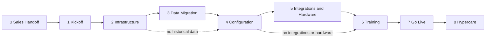

# Implementation Methodology

**Phase:** Deliver  
**Document type:** Overview  
**Status:** v1  
**TOC:** Deliver ★ — start here

---

## Where this sits

```text
Customer Value Stream          ← where the customer is (Acquire → Deliver → …)
        ↓
Deliver                        ← how Thin Line gets “signed” → “live”
        ↓
Implementation Methodology     ← this page (big picture + lifecycle)
        ↓
Implementation phases (0–8)    ← outcome pages
        ↓
Standards → SOPs → Checklists  ← how to accomplish each phase
```

The **Customer Value Engine — Deliver** stage pages describe capability/maturity.  
This **Deliver** tree is the **implementation project**: phases you complete, with supporting SOPs underneath.

---

## Purpose

Take a signed customer from Sales handoff through hypercare with a single, repeatable lifecycle. Each phase has a **measurable outcome**. Standards and SOPs are supporting documents—not the navigation itself.

---

## Implementation lifecycle (0–8)

Track status per engagement (Hub later; checkbox list today):

| # | Phase | Overview | Typical outcome |
|:-:|-------|----------|-----------------|
| 0 | Sales Handoff | [Sales Handoff](sales-handoff.md) | Handoff accepted; kickoff scheduled |
| 1 | Kickoff and Discovery | [Kickoff and Discovery](kickoff.md) | Scope, identity, timeline agreed |
| 2 | Infrastructure | [Infrastructure](infrastructure/README.md) | Environment healthy (**Infrastructure Ready**) |
| 3 | Data Migration | [Data Migration](data-migration/README.md) | History migrated or **N/A** |
| 4 | Configuration | [Configuration](configuration/README.md) | Agency business setup done |
| 5 | Integrations and Hardware | [Integrations and Hardware](integrations.md) | Interfaces + devices verified or **N/A** |
| 6 | Training | [Training](training.md) | Users ready for production use |
| 7 | Go Live | [Go Live](go-live.md) | Production exclusive use |
| 8 | Hypercare and Transition | [Hypercare and Transition](hypercare.md) | Steady-state Operate handoff |

Example (not a live project board):

```text
Deliver
□ 0 Sales Handoff
□ 1 Kickoff and Discovery
■ 2 Infrastructure
■ 3 Data Migration
□ 4 Configuration
□ 5 Integrations and Hardware
□ 6 Training
□ 7 Go Live
□ 8 Hypercare and Transition
```

---

## Phase sequence



Data Migration and Integrations/Hardware are **optional** when out of scope; mark N/A and continue.

---

## Document types under each phase

| Type | Role |
|------|------|
| **Phase overview** | Purpose · Inputs · Activities · Outputs · Exit criteria · References |
| **Standards** | What “done” looks like (naming, validation, packages) |
| **SOPs** | How to execute |
| **Checklists / templates** | Verification and artifacts |

---

## Principles

1. Organize Deliver around the **0–8 lifecycle**, not tool names.  
2. Bootstrap **stops** at Infrastructure; agency setup is Configuration.  
3. Data Migration includes assessment, packages, validation, and acceptance—not only “running scripts.”  
4. Standards define done; SOPs define how; checklists prove it.  
5. CVE Deliver pages mirror these phases for ownership and maturity—not a second methodology.

CVE capability view: [Customer Value Engine — Deliver](../../customer-value-engine/deliver/README.md).

---

## Change history

| Date | Change |
|------|--------|
| 2026-07-17 | Draft TOC restructure |
| 2026-07-17 | Milestone model + hierarchy |
| 2026-07-17 | Aligned to lifecycle 0–8 (Sales Handoff → Hypercare and Transition) |
