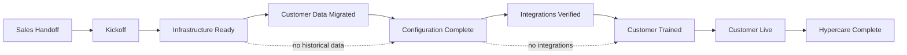

# Implementation Methodology

**Phase:** Deliver  
**Document type:** Overview  
**Status:** v1 draft  
**TOC:** Deliver ★ — start here

---

## Where this sits

```text
Customer Value Stream          ← where the customer is (Acquire → Deliver → …)
        ↓
Deliver                        ← how Thin Line gets “signed” → “live”
        ↓
Implementation Methodology     ← this page (big picture + milestones)
        ↓
Implementation phases          ← outcome pages (Infrastructure Ready, …)
        ↓
Standards → SOPs → Checklists  ← how to accomplish each phase
```

The **Customer Value Engine — Deliver** stage pages describe capability/maturity.  
This **Deliver** tree is the **implementation project**: milestones you reach, with supporting SOPs underneath.

---

## Purpose

Take a signed customer from Sales handoff through hypercare with a single, repeatable phase model. Each phase has a **measurable outcome**. Standards and SOPs are supporting documents—not the navigation itself.

---

## Implementation milestones

Track status per engagement (Hub later; checkbox list today):

| Status | Milestone | Overview |
|:------:|-----------|----------|
| ☐ | Sales Handoff | [Sales Handoff](sales-handoff.md) |
| ☐ | Kickoff Complete | [Kickoff](kickoff.md) |
| ☐ | **Infrastructure Ready** | [Infrastructure Ready](infrastructure/README.md) |
| ☐ / N/A | **Customer Data Migrated** | [Customer Data Migrated](data-migration/README.md) |
| ☐ | **Configuration Complete** | [Configuration Complete](configuration.md) |
| ☐ / N/A | **Integrations Verified** | [Integrations Verified](integrations.md) |
| ☐ | **Customer Trained** | [Customer Trained](training.md) |
| ☐ | **Customer Live** | [Customer Live](go-live.md) |
| ☐ | **Hypercare Complete** | [Hypercare Complete](hypercare.md) |

Example (not a live project board):

```text
Deliver
□ Sales Handoff
□ Kickoff Complete
■ Infrastructure Ready
■ Customer Data Migrated
□ Configuration Complete
□ Integrations Verified
□ Customer Trained
□ Customer Live
□ Hypercare Complete
```

---

## Phase sequence



Migration and integrations are **optional** when out of scope; mark N/A and continue.

---

## Document types under each phase

| Type | Role |
|------|------|
| **Phase overview** | Purpose · Inputs · Activities · Outputs · Exit criteria · References |
| **Standards** | What “done” looks like (naming, validation, packages) |
| **SOPs** | How to execute |
| **Checklists / templates** | Verification and artifacts |

---

## Principles

1. Organize Deliver around **milestones**, not tool names.  
2. Bootstrap **stops** at Infrastructure Ready; agency setup is Configuration Complete.  
3. Data migration includes assessment, packages, validation, and acceptance—not only “running scripts.”  
4. Standards define done; SOPs define how; checklists prove it.  

Related (to fold in): [Customer Onboarding](customer-onboarding.md).

---

## Change history

| Date | Change |
|------|--------|
| 2026-07-17 | Draft TOC restructure |
| 2026-07-17 | Milestone model + hierarchy (CVE → Deliver → phases → SOPs) |
