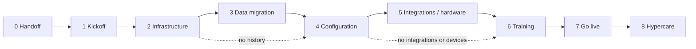

# Implementation overview

**Document type:** Overview  
**Status:** v1  
**Audience:** Founders · Sales · Implementation · Engineering · Customer Success · anyone who will run or support an implementation  
**TOC:** Deliver ★ — start here

---

## Purpose

Explain how Thin Line Software takes a newly signed customer from contract execution through stable production use on the Thin Line Platform—and how the rest of the company should work together to do that without reinventing the process each time.

---

## What implementation means here

**Implementation** is the project that turns a signed deal into a customer who is live, trained enough to do their jobs, and handed off to steady-state support.

It is not:

- Only spinning up Azure apps and a database  
- Only turning on modules in Admin  
- Only “running the conversion”  
- Only a training week  

It is the full path: commercial handoff → discovery → environment → historical data (when in scope) → agency setup → integrations and hardware → training → go-live → a short, deliberate hypercare period → transition into Operate / Customer Success.

If something has to be true for the agency to work day-to-day in Thin Line, and it is not already true when the contract is signed, it belongs in Deliver / implementation until hypercare exits.

---

## Where implementation sits in the Customer Value Stream

Thin Line’s operating model is the **Customer Value Stream**:

| Stage | What it produces |
|-------|------------------|
| **Acquire** | A signed customer ready to implement |
| **Deliver** | A customer live on the Thin Line Platform (then hypercare complete) |
| **Operate** | Steady-state support and product updates |
| **Expand** | Adoption and additional modules |
| **Advocate** | References and referrals |

```text
Acquire  →  Deliver (implementation)  →  Operate
 signed      live + stable                  ongoing support
```

- **Acquire** ends when commercial terms are clear enough that Implementation can start without re-selling or re-scoping the deal in the kickoff meeting.  
- **Deliver** owns the implementation lifecycle (this documentation tree).  
- **Operate** begins after hypercare transition—not when the first login works, and not when bootstrap finishes.

Capability and maturity notes (owners, capacity) live under [Customer Value Engine — Deliver](../../customer-value-engine/deliver/README.md). **How to run the work** lives in this Deliver methodology tree.

---

## Implementation lifecycle

Work is sequenced in nine phases. Detail and exit criteria: [Implementation lifecycle](implementation-lifecycle.md).

| # | Phase | In one sentence |
|:-:|-------|-----------------|
| 0 | [Sales handoff](sales-handoff.md) | Sales transfers a clear packet; Implementation accepts ownership |
| 1 | [Kickoff and discovery](kickoff-and-discovery.md) | Agree scope, identity, timeline, and who owns what |
| 2 | [Infrastructure](infrastructure/README.md) | Provision and health-check the environment |
| 3 | [Data migration](data-migration/README.md) | Move and accept historical data—or mark N/A |
| 4 | [Configuration](configuration/README.md) | Set up the agency to do its real work in the product |
| 5 | [Integrations and hardware](integrations-and-hardware.md) | Prove interfaces and devices—or mark N/A |
| 6 | [Training](training.md) | Users can perform their jobs before exclusive production use |
| 7 | [Go live](go-live.md) | Thin Line becomes the system of record for agreed modules |
| 8 | [Hypercare and transition](hypercare-and-transition.md) | Stabilize, then hand off to Operate / Customer Success |

Data migration and integrations/hardware are often optional. Skip with an explicit **N/A**, not by forgetting them.



---

## Why phases

Phases exist so a small team can run many agencies without holding the whole plan in one person’s head.

- **Ownership is clear** — each phase has an accountable outcome.  
- **Progress is visible** — a board of 0–8 is enough for founders and the customer sponsor to see status.  
- **Exit criteria stop silent drift** — “we’re almost ready” is not a phase exit.  
- **Optional work stays optional** — migration and integrations do not block agencies that do not need them.  
- **Knowledge stays reusable** — standards and SOPs attach to phases, not to tribal memory about the last county.

Phases are not bureaucracy for its own sake. If a phase has no work, mark it N/A and move on.

---

## Document types (do not confuse them)

| Type | Job | Example |
|------|-----|---------|
| **Methodology** | The shape of the engagement—phases, principles, where work lives | This page · [Lifecycle](implementation-lifecycle.md) |
| **Standards** | What “done” looks like (naming, packages, validation rules) | [Bootstrap environment standard](infrastructure/bootstrap-environment-standard.md) · [Migration package standards](data-migration/vendor-packages/migration-package-standards.md) |
| **SOPs** | How to execute a repeatable procedure | [Bootstrap environment](infrastructure/bootstrap-environment.md) · [Legacy system migration](data-migration/legacy-system-migration.md) |
| **Checklists** | Verify steps for *this* engagement | [Environment health checklist](../../checklists/environment-health-checklist.md) · [Agency configuration checklist](../../checklists/agency-configuration-checklist.md) |
| **Templates** | Reusable blank artifacts (summaries, acceptance forms) | [Templates](../../templates/README.md) |
| **Implementation project records** | Agency-specific truth: filled checklists, Overrides, notes, board status | Engagement workspace under `Clients/…` (see workspace standard)—not GitBook |

**Rule of thumb:** GitBook tells you *how Thin Line implements*. The engagement folder and Hub (later) tell you *what happened for this agency*.

---

## GitBook is knowledge; the workspace is execution

| Layer | Role |
|-------|------|
| **GitBook (this repo)** | Shared methodology, standards, SOPs, checklists, templates |
| **Implementation workspace** | Customer-specific execution: filled AgencyChecklist, Overrides, extracts, environment parameters, run notes |

Do not paste one-off agency ORIs, passwords, or filled Overrides into GitBook. Put reusable improvements back into vendor packages or docs; leave customer answers in the engagement workspace.

See [Implementation workspace standard](implementation-workspace-standard.md).

---

## Customer-facing materials stay derived—and limited

Customer guides under `customer/` (training, getting started, product help) should **align** with how we implement, but they must **not** expose internal-only procedures: bootstrap scripts, package internals, RACI, pricing policy, Hub/ops shortcuts, or founder-only decisions.

| OK for customers | Keep internal |
|------------------|---------------|
| How to use modules after go-live | Bootstrap SOP and Azure naming |
| What to expect in training | Sales handoff packet fields |
| Validation they participate in | Migration package promotion rules |

When you write or update customer docs, pull outcomes and language from the methodology—do not paste SOP steps into the customer book.

---

## Core implementation principles

1. **Collaborate rather than merely configure** — Sit in the agency’s workflow. Defaults and codes should match how they work, not only what the UI allows.  
2. **Understand workflows before making decisions** — Number patterns, court defaults, and sharing settings are cheap to get wrong and expensive after go-live.  
3. **Collect information when it is needed** — Do not demand every ORI, printer model, and code list at kickoff if Phase 4 or 5 is the right time.  
4. **Define clear ownership** — One accountable person per phase outcome. See [Roles and responsibilities](roles-and-responsibilities.md).  
5. **Make progress visible** — Keep a simple 0–8 board. Founders and the customer sponsor should see the same status Implementation sees.  
6. **Use explicit exit criteria** — Each phase page lists what “done” means. Meet them or document a deferral with an owner.  
7. **Validate before advancing** — Especially after migration and before go-live. Green scripts are not acceptance.  
8. **Preserve reusable knowledge** — Promote package fixes; update standards and vendor guides when the next agency would need the same answer.  
9. **Minimize customer disruption** — Parallel run, cutover windows, and training timing exist to protect dispatch, court, and jail operations—not our calendar convenience.  
10. **Transition deliberately into Customer Success** — Hypercare ends with a named Operate / Support owner and open items, not a quiet fade-out.

---

## What “implementation complete” means

Implementation is **complete** when:

1. In-scope lifecycle phases are **Complete** or explicitly **N/A**.  
2. The customer is **live** on production for agreed modules (Phase 7 exited).  
3. **Hypercare** has ended with agreement from Thin Line and the customer (Phase 8 exited).  
4. **Operate** owns ongoing tickets; Implementation is no longer the default front door for day-to-day issues.  
5. Material deferred work has owners outside “we’ll get to it”—or is accepted risk.

Bootstrap alone is not complete. First login is not complete. “Training happened” without go-live is not complete. Complete means **stable production use plus a clean handoff**.

---

## Start here (related documents)

| Document | Use when |
|----------|----------|
| [Implementation lifecycle](implementation-lifecycle.md) | You need the phase sequence, outcomes, and flow |
| [Implementation workspace standard](implementation-workspace-standard.md) | You need folder layout, naming, and where artifacts live |
| [Roles and responsibilities](roles-and-responsibilities.md) | You need who is accountable for each phase |
| [Deliver index](README.md) | You need the full TOC and supporting SOPs by phase |
| [Customer Value Engine — Deliver](../../customer-value-engine/deliver/README.md) | You need owners, capacity, and maturity |

---

## Change history

| Date | Change |
|------|--------|
| 2026-07-17 | Initial methodology stub |
| 2026-07-17 | Full overview: stream fit, lifecycle, document types, principles, completion |
