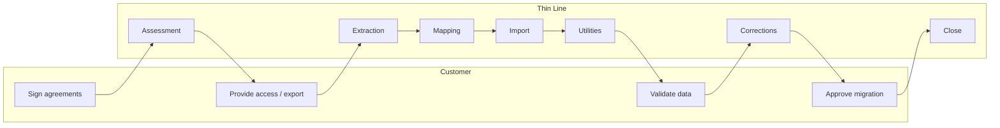
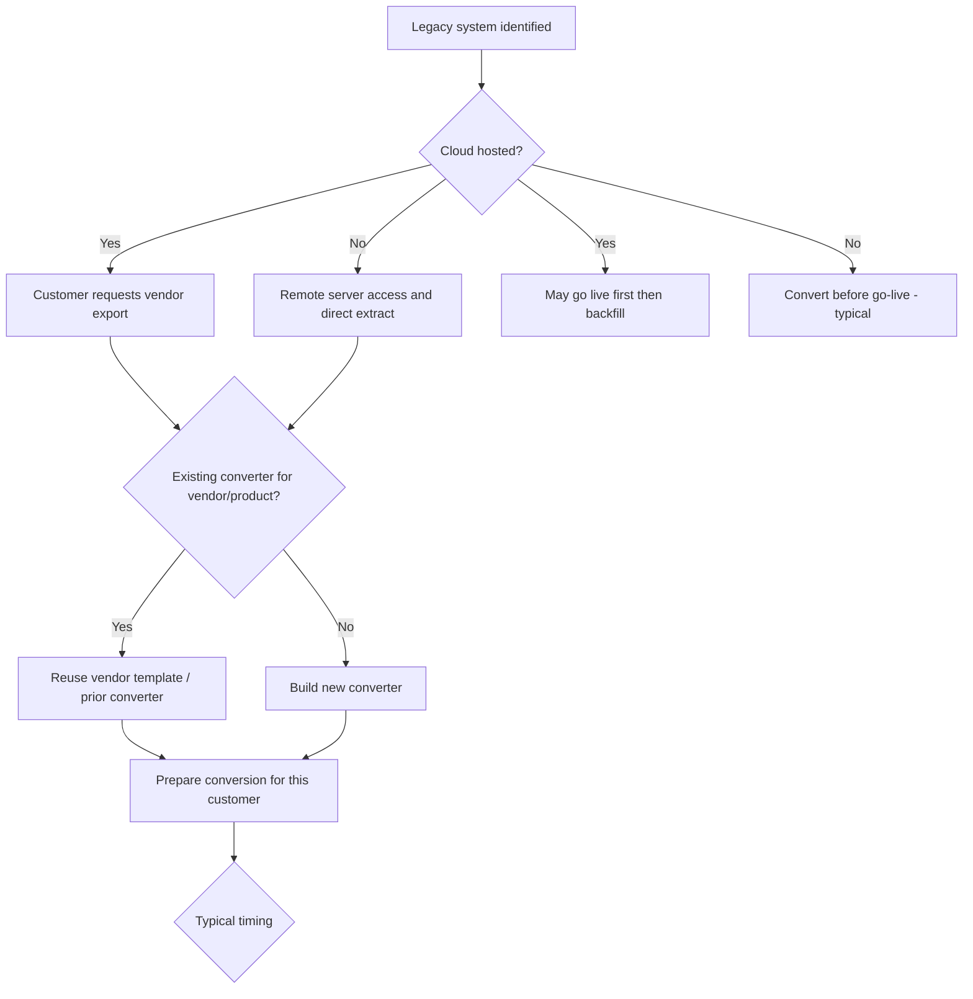
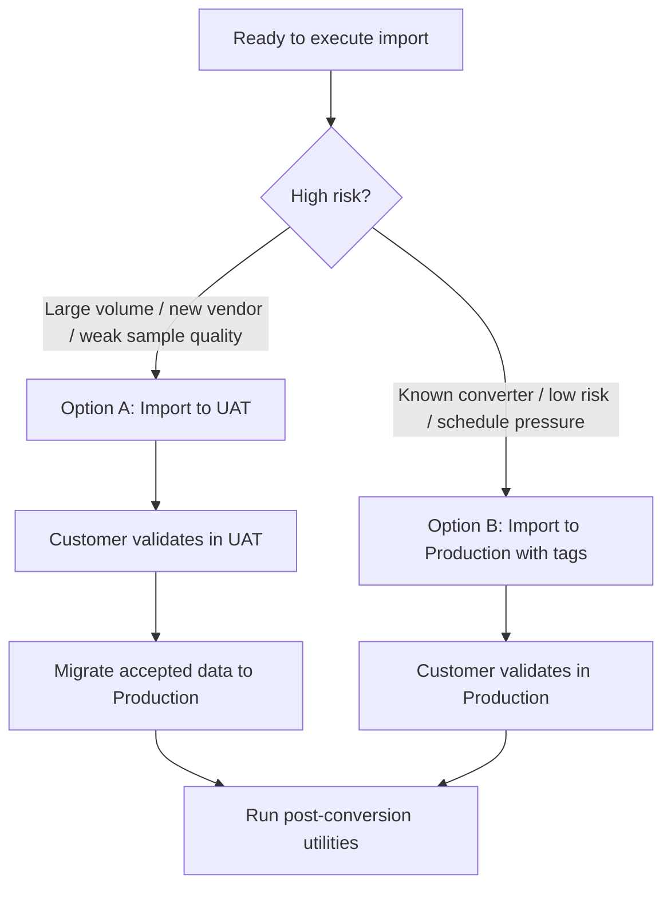

# Legacy System Migration

**Phase:** Deliver  
**Document type:** SOP  
**Status:** v1 — model SOP for Thin Line OS  
**Next review:** **TODO:** Set date (suggested: 2026-10-17)

---

## Executive Summary

| | |
|--|--|
| **Objective** | Migrate a customer's legacy data into Thin Line Platform safely and repeatably. |
| **Typical duration** | 1–10 business days (depending on vendor and data size). **TODO:** Refine from completed migrations. |
| **Owner** | Implementation Lead *(current incumbent: Matthew Keslin)* |
| **Primary stakeholders** | Customer Administrator · Implementation · Engineering |
| **Success criteria** | Data migrated · Utilities completed · Customer validated · Migration accepted |
| **Related SOPs** | [Customer Onboarding](customer-onboarding.md) · [Bootstrap Environment](bootstrap-environment.md) · [Post-Conversion Utilities](post-conversion-utilities.md) |
| **Required assessment** | [Legacy System Migration Assessment](../../assessments/legacy-system-migration-assessment.md) → Approved Conversion Plan |

Migration includes more than importing records: assessment, extraction, transformation, validation, workflow transition, customer review, and final acceptance.

---

## Responsibility swimlane

Who owns which work across the engagement:



| Lane | Responsibilities |
|------|------------------|
| **Customer** | Sign agreements; provide access or vendor export; validate data; approve migration |
| **Thin Line** | Assessment; extraction; mapping; import; utilities; corrections; close |

---

## 1. Purpose

Successfully migrate customer data from a legacy Records Management System (RMS), CAD, Court, Jail, or related application into **Thin Line Platform** while maintaining data integrity, minimizing implementation risk, and providing a repeatable, scalable migration process.

---

## 2. Scope

### In scope

All customer migrations involving historical data from a legacy vendor or custom system into Thin Line Platform.

Examples (not exhaustive): Tyler Technologies, CopSync, CrimeStar, legacy FoxPro systems, and future vendors as encountered.

### Out of scope

- Routine imports performed by customers themselves after go-live
- **TODO:** Clarify whether limited customer-driven imports need a separate SOP

---

## 3. Owner

| Role | Assignment |
|------|------------|
| **Accountable owner** | Implementation Lead |
| **Current incumbent** | Matthew Keslin |

### Current responsibilities (incumbent)

- Customer coordination
- Technical planning
- Data extraction
- Data mapping
- Conversion execution
- Validation support

Future ownership should allow standard migrations without founder involvement. See [Process maturity](#process-maturity).

---

## 4. Trigger

The process begins after **all** of the following are true:

1. Signed SaaS Agreement
2. Signed CJIS Security Addendum
3. Customer requests historical data migration

**No legacy data should be accessed until both agreements are complete.**

---

## 5. Preconditions

| Precondition | Notes |
|--------------|-------|
| SaaS Agreement executed | Required before any legacy access |
| CJIS Security Addendum executed | Required before any legacy access |
| Migration requested by customer | Trigger event |
| Target Thin Line environment available | **TODO:** Confirm whether UAT and/or Production must exist before import |
| Access path identified | On-prem remote access **or** vendor export path |

---

## 6. Inputs

- Signed SaaS Agreement
- Signed CJIS Security Addendum
- Legacy database (or vendor export)
- Customer credentials / access method (as applicable)
- Existing conversion template for the vendor (if available)

---

## 7. Outputs

- Converted customer database (chosen target environment)
- Conversion scripts and customer conversion folder artifacts
- Conversion documentation for the engagement
- Customer notification that migration is complete
- Validation / acceptance result (informal today; formal in target state)

---

## 8. Tools

| Tool | Use |
|------|-----|
| SQL Server | Extraction, transformation, load, validation queries |
| Azure | Tenant / environment context |
| Cursor | Schema comparison assistance, mapping suggestions, SQL generation support |
| Git / local conversion folders | Scripts and customer-specific conversion assets |
| GitBook | Internal documentation |

**TODO:** Confirm whether SSMS-only paths, shared network locations, or Azure DevOps should be listed as standard.

---

## Current state

How Thin Line performs legacy migrations **today**:

| Area | Today |
|------|-------|
| **Assessment** | Informal discussion; no fixed template or approved conversion plan artifact |
| **Pricing** | Conversion has generally been included in exchange for multi-year SaaS commitments |
| **Acquisition** | On-prem: remote server extract (often before go-live). Cloud: customer requests vendor export (may backfill after go-live) |
| **Preparation** | Customer-centric folders; copy scripts from the most recent same-vendor migration; adapt with Cursor assistance |
| **Execution** | Either UAT-then-Production **or** direct Production with tagged converted records — choice is judgment-based |
| **Utilities** | Run known post-import utilities (incident / citation / call workflow transition; snapshot masters). Full catalog not yet documented |
| **Validation** | Implementation Lead emails customer; customer validates; corrections via follow-up. Acceptance is informal (typically email) |
| **Close** | Informal when corrections and acknowledgement are done |
| **Visibility** | Limited customer visibility into migration progress |
| **Dependence** | Founder / Implementation Lead dependent for most standard and non-standard work |

---

## Target state

Where this process should operate when Thin Line OS is mature:

| Area | Target |
|------|--------|
| **Assessment** | Formal [Legacy System Migration Assessment](../../assessments/legacy-system-migration-assessment.md) → **Approved Conversion Plan** before pricing/execution |
| **Pricing** | Approved [Migration Pricing Policy](../../policies/migration-pricing.md) (tiered or hybrid — **Decision needed**) |
| **Acquisition** | Documented cloud vs on-prem path with clear go-live timing rules |
| **Preparation** | Vendor-centric templates (`Conversions/<Vendor>/Template/`) plus customer folders for overrides |
| **Execution** | Explicit decision matrix for UAT vs Production |
| **Utilities** | Complete [Post-Conversion Utilities](post-conversion-utilities.md) SOP; checklist-driven |
| **Validation** | Customer receives summary, counts, exceptions, and checklist; signs [Customer Acceptance Form](../../templates/customer-acceptance-form.md) |
| **Close** | Formal [Migration Close-Out Checklist](../../checklists/migration-close-out-checklist.md) |
| **Visibility** | Customer/internal progress tracking (portal or status dashboard) |
| **Dependence** | Implementation specialists complete **standard** vendor migrations using documented tooling without founder involvement |

---

## Gap analysis

| Gap | Current → Target | Priority |
|-----|------------------|----------|
| No formal assessment | Informal → [Legacy System Migration Assessment](../../assessments/legacy-system-migration-assessment.md) + Approved Conversion Plan | High |
| Pricing not standardized | Bundled practice → Approved policy | High |
| Folder model | Customer-centric → Vendor templates + customer config | High |
| Validation / acceptance | Email informal → Checklist + signed acceptance | High |
| Close-out | Informal → Close-out checklist | Medium |
| Decision clarity | Tribal knowledge → Decision diagrams + UAT/Prod matrix | High |
| Progress visibility | Opaque → Status tracking | Medium |
| Utility catalog | Partial examples → Full SOP | High |
| Delegation | Founder-dependent → Role-based ownership for standard paths | High |

---

## Common risks

| Risk | Why it matters | Mitigation (current / needed) |
|------|----------------|--------------------------------|
| Corrupt or incomplete export | Blocks or corrupts load | Validate export integrity before mapping; **TODO:** standard checks |
| Missing tables / modules | Incomplete history | Scope modules in assessment; exception report |
| Customer delays (access, export, validation) | Extends cycle time; blocks go-live or backfill | Set expectations at trigger; track wait states |
| Vendor export limitations | Cloud path constrained | Document vendor-specific limits in [Vendor Conversion Guides](vendor-conversion-guides/README.md) |
| Unexpected schema changes | Breaks reused converters | Schema compare every engagement; version notes |
| Access before agreements | CJIS / contractual exposure | **Hard stop** until SaaS + CJIS addendum signed |
| Direct-to-Production defects | Live data risk | Prefer UAT when risk is high; **TODO:** decision matrix |
| Mapping defects discovered late | Rework after customer validation | Earlier sample validation; **TODO:** checklist |

---

## Decision trees

### Decision 1 — Acquisition path and converter reuse



### Decision 2 — UAT versus Production import



> **TODO:** Replace the “high risk” heuristic with an approved decision matrix (risk, schedule, customer preference, data volume, go-live timing).

---

## Time expectations

Starting estimates for planning and future KPIs. **TODO:** Replace with measured averages from real engagements.

| Phase | Typical duration |
|-------|------------------|
| Assessment | 30–60 minutes |
| Pricing / commercial alignment | **TODO:** |
| Data acquisition (Thin Line extract) | 1–3 hours (excludes customer/vendor wait time) |
| Customer/vendor export wait (cloud) | Customer dependent |
| Mapping / script preparation | Variable (hours to days for new converters) |
| Import | 15–60 minutes |
| Post-conversion utilities | **TODO:** |
| Customer validation | Customer dependent |
| Corrections + close | Variable |

**Overall engagement:** typically **1–10 business days** excluding extended customer or vendor wait states.

---

## Automation score

Score each major process step **1–5** (1 = fully manual / founder-driven, 5 = scalable automation). Aligns with Customer Value Engine maturity language.

| Process | Automation level | Notes |
|---------|-----------------:|-------|
| Assessment | 2 / 5 | Informal; no template-driven capture yet |
| Pricing | 1 / 5 | Policy not standardized |
| Extraction | 3 / 5 | Scripts exist; still engagement-specific |
| Mapping | 3 / 5 | Cursor-assisted; not productized |
| Import | 4 / 5 | Scripted load; environment choice still manual |
| Utilities | 3 / 5 | Known utilities; catalog incomplete |
| Validation | 1 / 5 | Email + ad hoc customer review |
| Close | 1 / 5 | Informal acknowledgement |

**Investment signal:** Validation, assessment, and close are the lowest-scoring steps — highest leverage for standardization before heavy automation.

---

## 9. Procedure

### Phase 1 — Identify legacy platform

Determine vendor, product version, cloud vs on-prem, modules in scope, and whether an existing converter exists.

Examples: Tyler, CopSync, CrimeStar.

**TODO:** Maintain a living vendor/converter catalog (see [Product impact](#product-impact)).

### Phase 2 — Legacy System Migration Assessment

Perform the [Legacy System Migration Assessment](../../assessments/legacy-system-migration-assessment.md). **Today assessment is informal;** the target is a completed assessment form with an **Approved Conversion Plan**.

That assessment is the bridge between Sales, Implementation, and Engineering. It answers: can we convert, what to charge, how long, what risks, whether Sales can quote, what engineering is required, and whether to build or extend a reusable converter.

Do not treat pricing, schedule, or engineering commitments as final until the assessment recommendation is approved.

### Phase 3 — Pricing

Apply current commercial practice (historically bundled with multi-year SaaS) until [Migration Pricing Policy](../../policies/migration-pricing.md) is approved.

> **Decision needed:** Bundled vs tiered vs hybrid. Illustrative future tiers ($1k / $2.5k / $5–7.5k / custom) must not be quoted as policy until approved.

### Phase 4 — Data acquisition

Follow [Decision 1](#decision-1--acquisition-path-and-converter-reuse).

- **On-prem (e.g. Tyler):** remote access; extract directly; usually before go-live.
- **Cloud (e.g. CopSync):** customer requests vendor export; may go live first and backfill.

### Phase 5 — Prepare conversion

1. Use (or create) the customer conversion folder.
2. Copy from the most recent same-vendor migration (or vendor template when available).
3. Update for the current customer.
4. Use Cursor to compare schemas, suggest mappings, generate SQL, and assist transformations.

**Target folder model:**

```text
Conversions/
  Tyler/
    Template/
    Levelland/
    Littlefield/
  CopSync/
    Template/
    Slaton/
```

See [Vendor Conversion Guides](vendor-conversion-guides/README.md).

> **TODO:** Confirm authoritative repo path for conversion assets.

### Phase 6 — Execute conversion

Follow [Decision 2](#decision-2--uat-versus-production-import).

- **Option A:** Import to UAT → validate → Production  
- **Option B:** Import to Production with converted-record tags  

### Phase 7 — Run post-conversion utilities

Run required utilities after import. Known examples:

- Incident workflow transition  
- Citation workflow transition  
- Call workflow transition  
- Snapshot master records  

Full procedure: [Post-Conversion Utilities](post-conversion-utilities.md) (**TODO:** complete catalog).

### Phase 8 — Customer validation

**Today:** Implementation Lead notifies customer by email; customer validates; corrections via follow-up; informal acceptance.

**Target:** Deliver Conversion Summary, record counts, exception report, and [Customer Validation Checklist](../../checklists/customer-validation-checklist.md); obtain [Customer Acceptance Form](../../templates/customer-acceptance-form.md). Templates: [Conversion Summary](../../templates/conversion-summary.md).

### Phase 9 — Close migration

Complete when corrections are done, customer has acknowledged, and internal documentation is updated.

**Target:** [Migration Close-Out Checklist](../../checklists/migration-close-out-checklist.md).

---

## 10. Verification

Migration is complete when:

- [ ] Customer data has been successfully migrated
- [ ] Required post-conversion utilities have completed
- [ ] Customer has been notified
- [ ] Customer has had an opportunity to validate
- [ ] Outstanding conversion issues have been addressed
- [ ] Migration is closed (informal today; formal checklist in target state)

---

## 11. Failure and escalation

| Situation | Current practice | Escalation |
|-----------|------------------|------------|
| Cannot obtain legacy access or export | **TODO:** | **TODO:** |
| Conversion fails mid-run | **TODO:** | **TODO:** |
| Customer rejects validation findings | **TODO:** | **TODO:** |
| CJIS / security concern during access | **Stop.** Do not proceed without agreements and approved access | **Decision needed:** Named security / executive contact |

See also [Common risks](#common-risks).

---

## 12. KPIs

> **TODO:** Confirm definitions, owners, and reporting cadence.

| KPI | Definition | Target |
|-----|------------|--------|
| Average migration duration | Trigger → close (business days), excluding wait states | **TODO:** |
| Customer validation turnaround | Notification → acknowledgement | **TODO:** |
| Corrections after migration | Post-notification defect cycles | **TODO:** |
| Reuse rate | % using reusable vendor converter | **TODO:** |
| Manual effort per migration | Implementation hours | **TODO:** |
| Phase duration vs estimate | Actual vs [time expectations](#time-expectations) | **TODO:** |

---

## 13. Related documents

| Document | Relationship |
|----------|--------------|
| [Data conversion (CVE stage)](../../customer-value-engine/deliver/data-conversion.md) | Stage context |
| [Customer Onboarding](customer-onboarding.md) | Related Deliver SOP (placeholder) |
| [Bootstrap Environment](bootstrap-environment.md) | Related Deliver SOP (placeholder) |
| [Post-Conversion Utilities](post-conversion-utilities.md) | Phase 7 |
| [Vendor Conversion Guides](vendor-conversion-guides/README.md) | Phase 5 |
| [Legacy System Migration Assessment](../../assessments/legacy-system-migration-assessment.md) | Phase 2 — required decision document |
| [Migration Pricing Policy](../../policies/migration-pricing.md) | Phase 3 |
| [Customer Validation Checklist](../../checklists/customer-validation-checklist.md) | Phase 8 |
| [Conversion Summary Template](../../templates/conversion-summary.md) | Phase 8 |
| [Customer Acceptance Form](../../templates/customer-acceptance-form.md) | Phase 8 |
| [Migration Close-Out Checklist](../../checklists/migration-close-out-checklist.md) | Phase 9 |

---

## Continuous improvement system

Thin Line OS SOPs are not static manuals. Each SOP ends with the same improvement loop.

### Weaknesses

- No formal Legacy System Migration Assessment (or Approved Conversion Plan)  
- Pricing not standardized  
- Folder organization customer-centric instead of vendor-centric  
- Customer validation informal  
- No formal acceptance event  
- No standardized completion checklist  
- Limited customer visibility into migration progress  
- Founder-dependent execution for most paths  

### Automation opportunities

| Opportunity | Relieves |
|-------------|----------|
| Vendor catalog | Assessment / reuse decisions |
| Conversion registry | Status tracking, handoffs |
| Automated schema comparison | Mapping prep |
| AI-assisted field mapping | Mapping effort |
| Automated SQL generation | Preparation |
| Customer migration portal | Validation / visibility |
| Migration status dashboard | Customer and internal wait-state clarity |

### Product impact

How Thin Line Platform (or internal platform) improvements could **reduce or eliminate** work in this SOP — input to product planning, not a commitment list.

| If we build… | Work removed or reduced in this SOP |
|--------------|-------------------------------------|
| Supported Vendor Catalog | Manual “does a converter exist?” research |
| Migration Registry | Ad hoc status tracking and artifact hunting |
| Schema Comparison + Mapping Engine | Cursor-only / tribal mapping cycles |
| Customer Migration Portal | Email-driven validation and opaque progress |
| One-click / guided post-conversion utilities | Manual utility sequencing and tribal checklists |
| Stronger import tagging + environment tooling | Risky judgment calls on UAT vs Production |

> **TODO:** Rank which items belong on the product roadmap vs. internal-only tooling.

### Process maturity

| | |
|--|--|
| **Current level** | **2 / 5** |
| **Description** | Repeatable but founder-dependent. Scripts and patterns exist; assessment, validation, and close remain informal. |
| **Next milestone** | Delegate **standard** migrations (known vendor + existing converter) to an Implementation specialist using this SOP and vendor templates. |
| **Future goal** | Any implementation specialist can complete a standard migration using documented tooling, with formal assessment, validation, and acceptance — without founder involvement. |

| Score | Meaning |
|------:|---------|
| 1 | Founder-driven |
| 2 | Documented |
| 3 | Standardized |
| 4 | Automated |
| 5 | Scalable |

### Next review date

| Field | Value |
|-------|-------|
| **Next review** | **TODO:** Set date (suggested 90 days from v1: **2026-10-17**) |
| **Review owner** | Implementation Lead |
| **Review questions** | Did measured phase times match estimates? Did any standard migration run without founder involvement? Which gaps closed? |

---

## Change history

| Date | Change | Author |
|------|--------|--------|
| 2026-07-17 | Initial draft — model SOP | Documentation draft |
| 2026-07-17 | v1 enrichment — executive summary, swimlane, decision trees, current/target/gap, risks, timing, automation score, product impact, process maturity | Documentation draft |
| 2026-07-17 | Phase 2 elevated to [Legacy System Migration Assessment](../../assessments/legacy-system-migration-assessment.md) (Assessments category) | Documentation draft |
