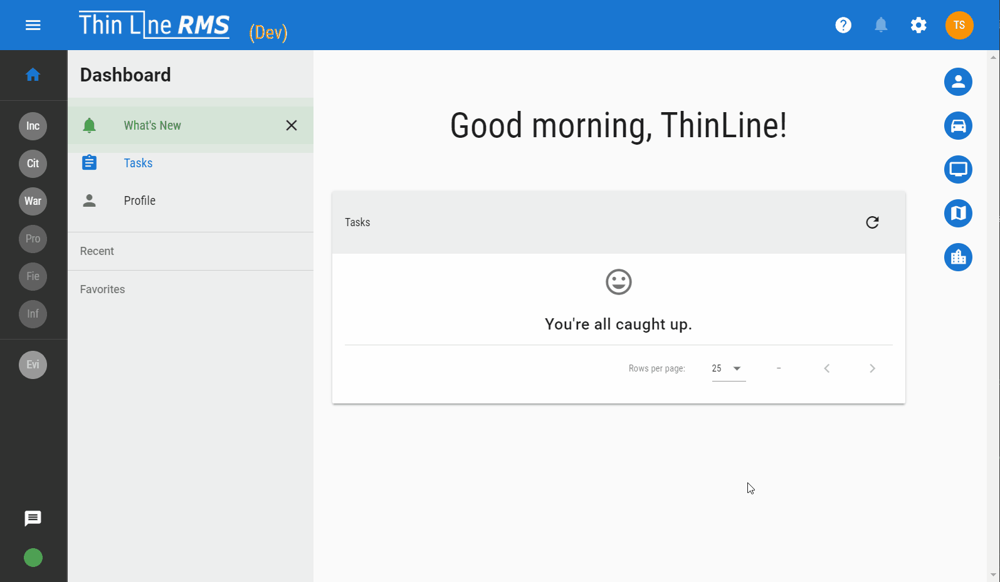

# February 2019 Update 01 (version 0.002.01)

<!-- NEW FEATURES -->

### New Features

**Warrant Module**  
Warrant module has been added. It functions like the Incident and Citation modules.

**Tasks**  
Task support has been added. Tasks are displayed on the dashboard. They are created automatically to assist with completing the incident workflow.

**Offense Lookup Search**  
Offenses are now searchable by Class, Subclass, Description, Statute, and Citation.

**Agency Management**  
Agencies can now be added and edited inside the <v-icon>settings</v-icon> module.

**Code Management**  
Codes can now be added and edited inside the <v-icon>settings</v-icon> module.

**Officer Management**  
Officers can now be edited inside the <v-icon>settings</v-icon> module.

**User Management**  
Many features for managing users have been added (also inside the <v-icon>settings</v-icon> module):

- Locking/unlocking users (prevents users from signing into the application)
- Resetting passwords (uses a temporary password that users must change during the next login)
- Changing roles and claims
  
  
- Adding users and officers (via wizard)
  
