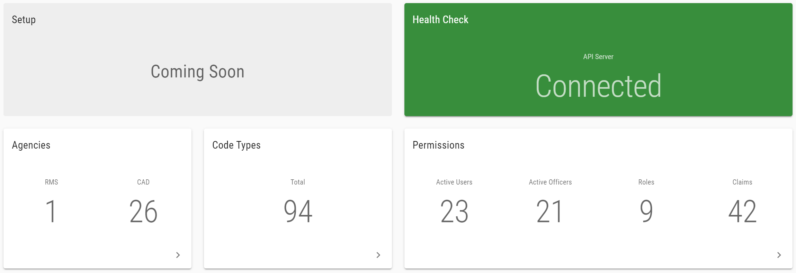
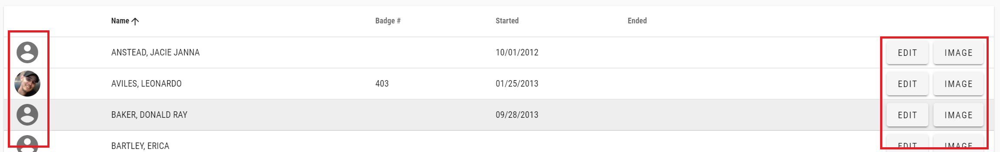
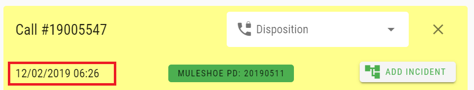
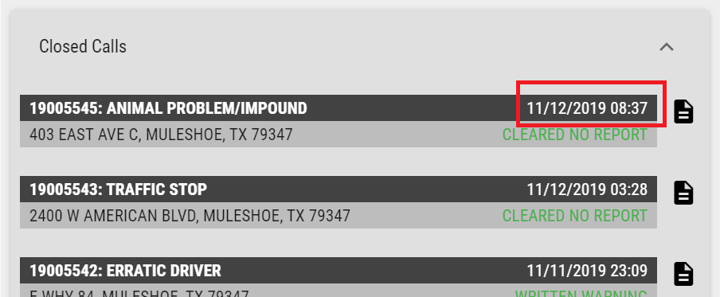
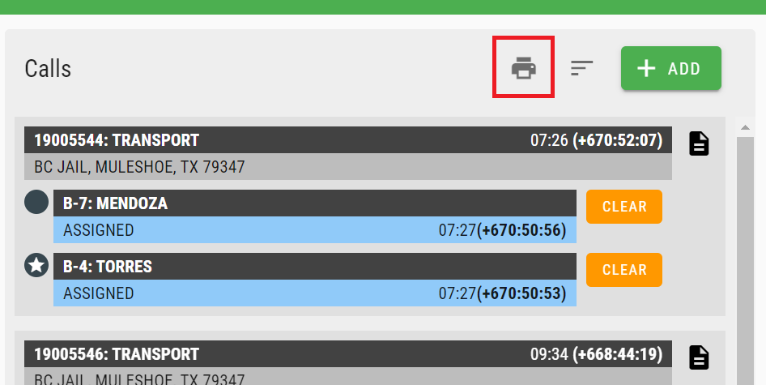
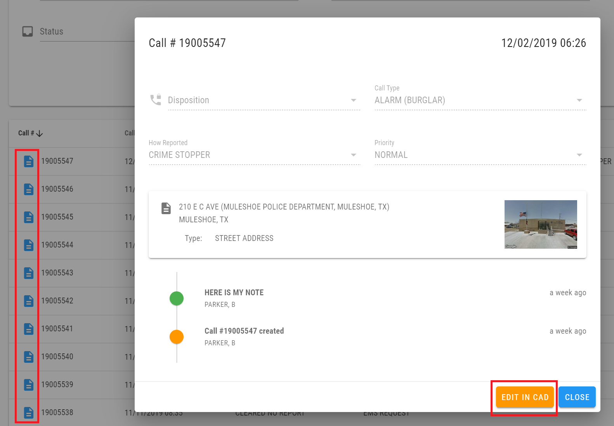
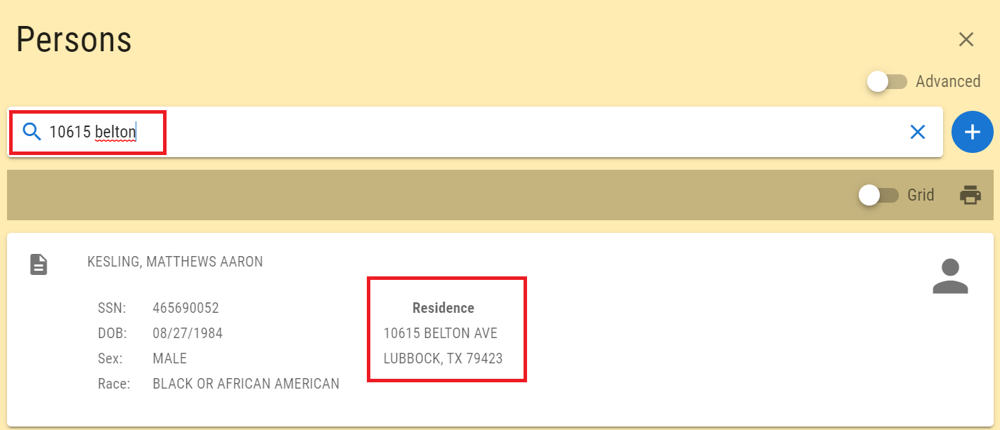
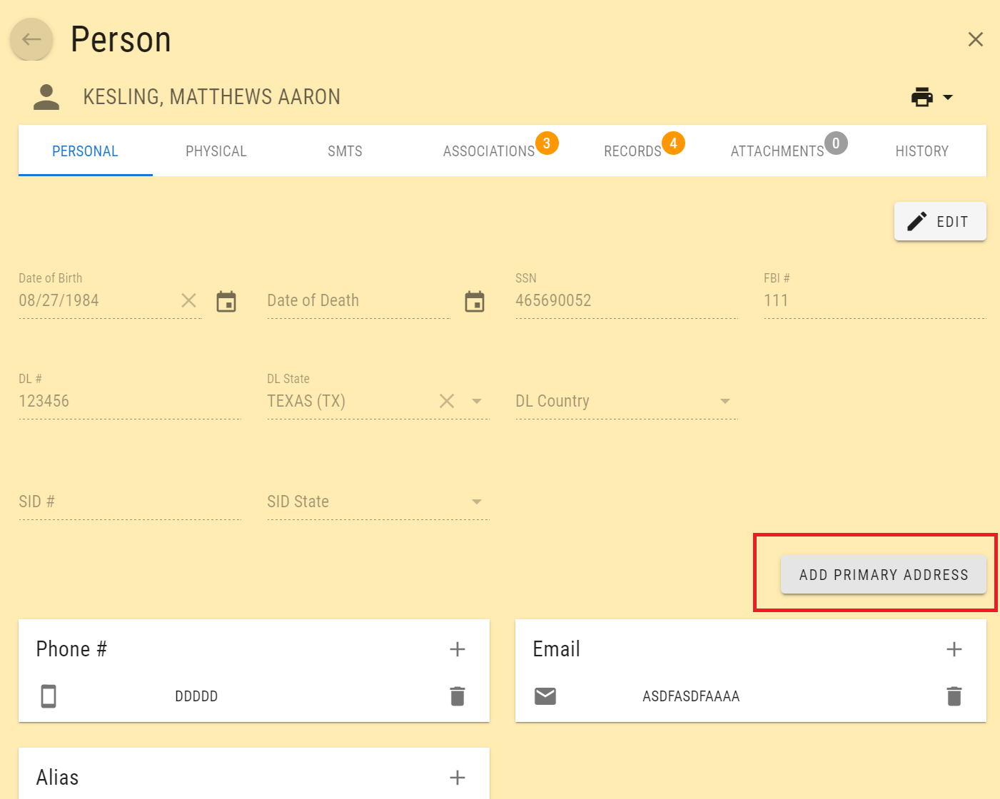
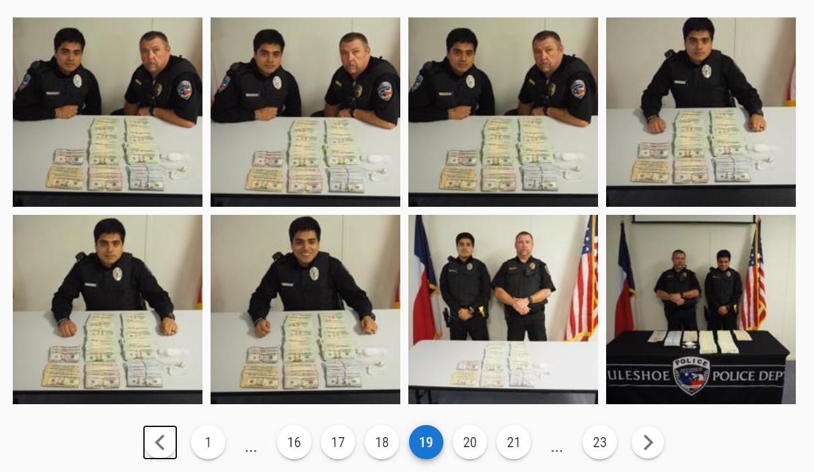

# December 2019 Update 1 (version 1.12.1)

Welcome to the December 2019 Update 1 release of Thin Line RMS/CAD. There are a number of updates in this version that we hope you like.

* Added default "file not found" image
* Added admin overview page

* Updated admin officers grid to show image; improved dialogs for editing officer information and images

* Updated RMS button to remember most recent page
* Added call date/time to call sheet and closed call cards

* Updated call sheet to reload units without reloading call sheet
* Added print link from CAD to call sheet search

* Added call sheet preview to call sheet search; added button to open call sheet in CAD

* Added location to person card (and made it searchable)

* Added button to add address to person

* Increased performance of task list
* Added paging to attachment images

* Increased performance by splitting code into modules
