# Version 2.10.0

Welcome to the 2.10.0 release of Thin Line RMS/CAD. There are a number of updates in this version that we hope you like.

* Documentation: Moved release notes to ThinLine.Docs site & updated UI
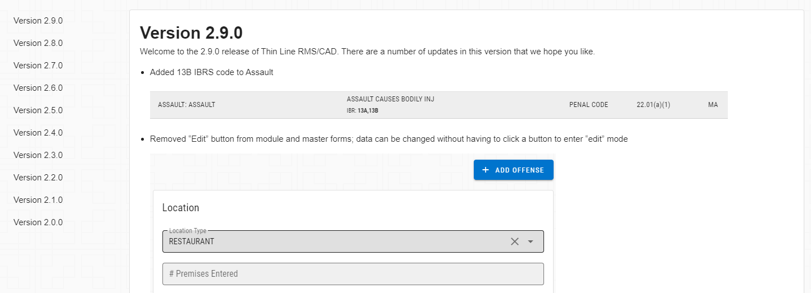
* IBRS: Updated logic for exporting and validating drug information
* IBRS: Updated logic to only allow one record per arrestee per incident
* IBRS: Updated logic to handle multiple versions of NIBRS and State IBRS
* TIBRS: Added exporter/validator for current specification
* Incidents: Renamed police blotter report
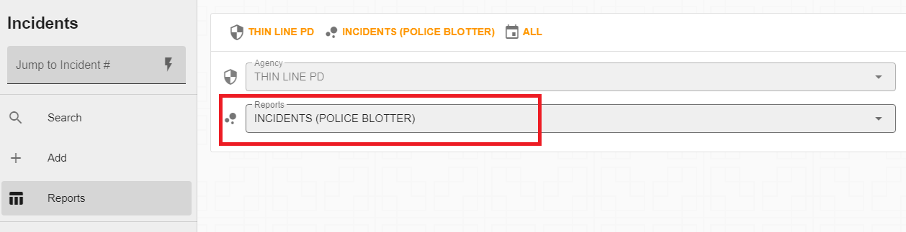
* Incident: Reverted previous change so that case status can be changed in all workflow statuses
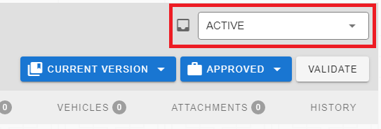
* Incident: Added "Impounded" switch to vehicles
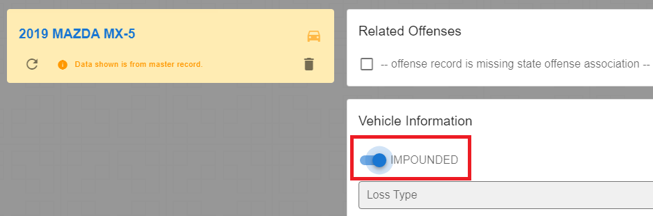
* Incident: Updated property drug fields to match new TIBRS specification
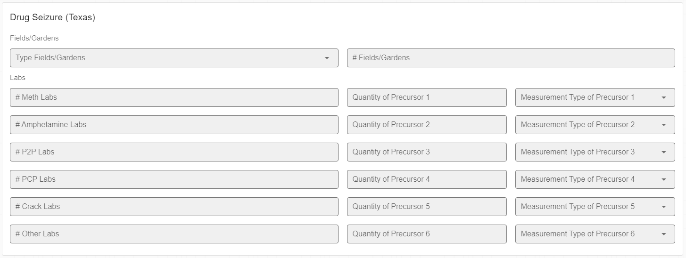
* Incident: Updated relationships so one doesn't have to be entered for himself/herself
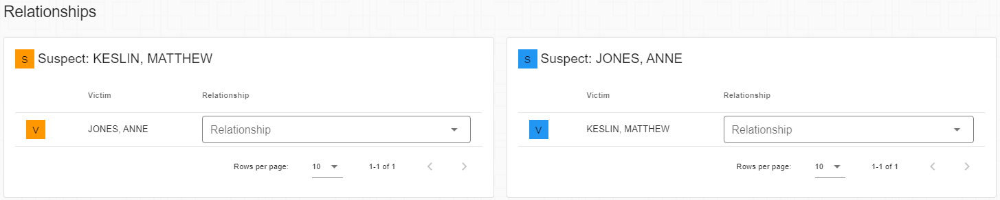
* Incident: Converted "summary" field to "synopsis" and made it a rich text editor
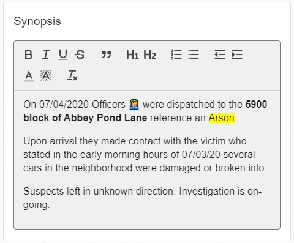
* Radio Log Search: Split into two new searches: Unit Logs & Dispatcher Notes
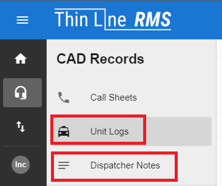
  * Unit Log:
  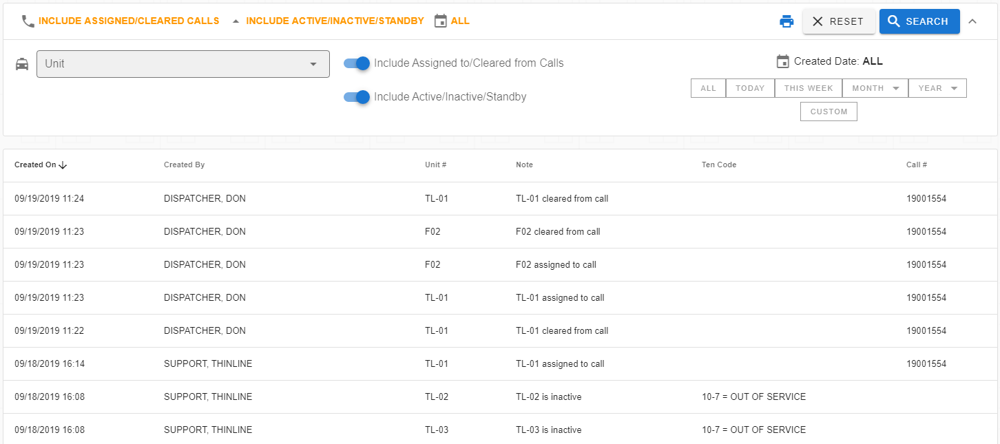
  * Dispatcher Notes: 
  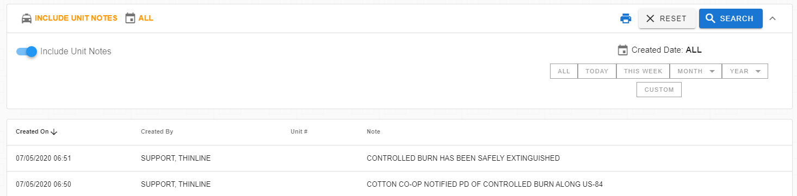
* Masters: Updated master search/add logic and UI
* Masters: Updated master module cards
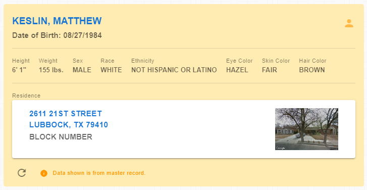
* Masters: Sorted record table by record date descending
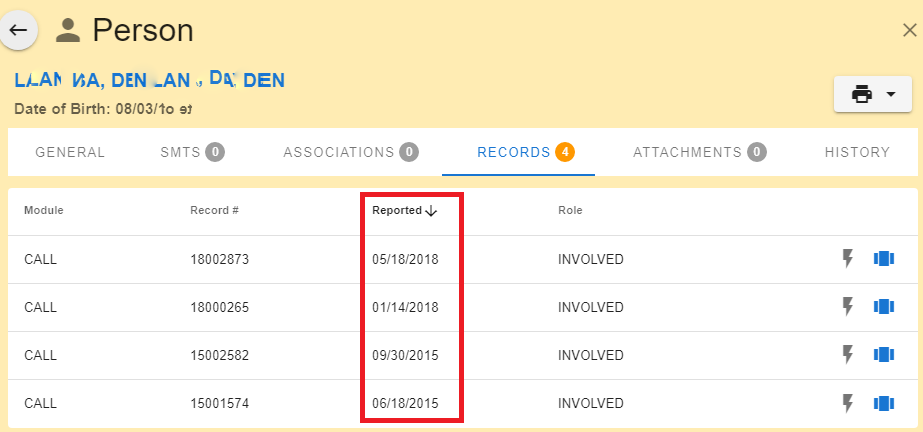
* UI: Updated alert styles

* UI: Updated header style

* CAD: Improved load times for call sheets
* CAD: Improved responsiveness (data wrapping instead of overflowing)
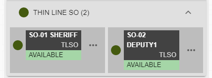
* Reports: Updated header & footer (Added agency name/contact info/logo)
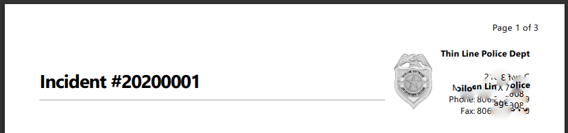
* Reports: Incident report now displays involved contact info (address and phone number)
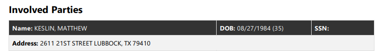
* Offenses: Started cleaning up class C misdemeanors
* Made other small improvements and fixes

## Nota Bene

* Reminder: CAD units can be "on call" by using "on standby"
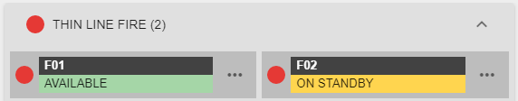
* Reminder: Persons can be searched by address and phone number
* Reminder: Evidence numbers are being left as-is for 2020; to be re-evaluated in 2021
* Coming Soon: Agency preference for switching to new call sheet when it is created
* Coming Soon: Re-imagining of the CAD call sheet to improve usability (alpha preview): 
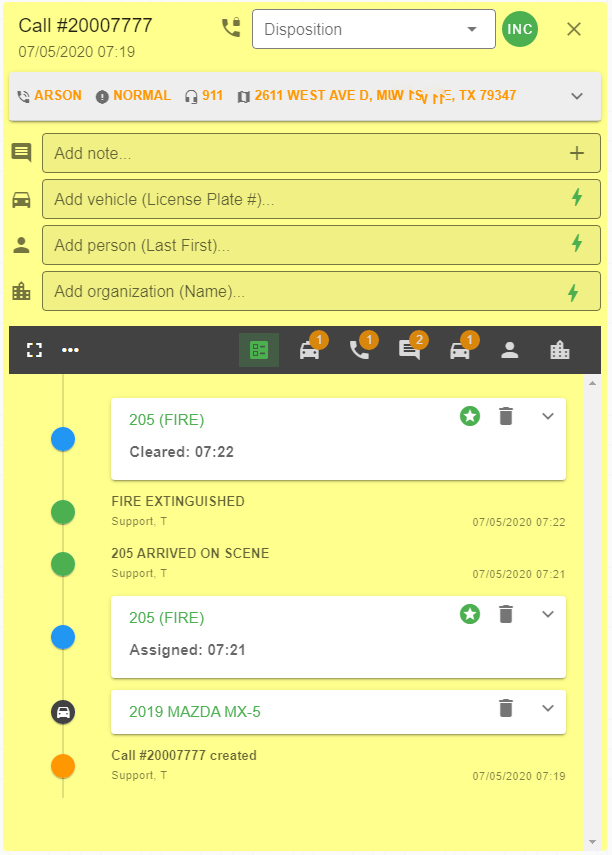

## Version 2.10.1

* Fixed a time-out issue with the master person search
* Updated master search logic to prevent duplicate searches
* Changed master quick searches to not search when focus is lost
* Removed master person quick search; added fields to search for address and phone
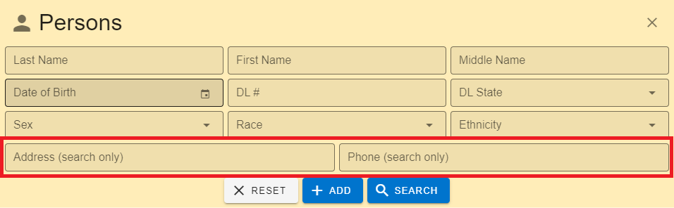
