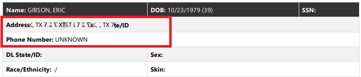

# Version 2.12.0

Welcome to the 2.12.0 release of Thin Line RMS/CAD. There are a number of updates in this version that we hope you like.

<!--* Added agency feature flags-->

<!--* -->

### RMS Highlights
<iframe width="560" height="315" src="https://www.youtube.com/embed/Cmndd0vLAYc" frameborder="0" allow="accelerometer; autoplay; encrypted-media; gyroscope; picture-in-picture" allowfullscreen></iframe>

&nbsp;

### CAD Highlights
<iframe width="560" height="315" src="https://www.youtube.com/embed/jIUt60jKGqA" frameborder="0" allow="accelerometer; autoplay; encrypted-media; gyroscope; picture-in-picture" allowfullscreen></iframe>

&nbsp;

## RMS Changes

* Incident: updated logic for setting Occurrence/Reported dates when incident is created from call sheet
* Incident: added Arrest Search and grid print

* Citation: changed radar calibration to toggle control

* Person: added "exact" search option to disable phonetic name searching

* Masters: added "smart" add logic to search for potential matches before adding records (n.b. for property, the serial number is required for this logic)

* Masters: improved performance of quick searches
* Reports: contact info added to incident reports, citation reports, and call sheets

* Reports: added Police Blotter report (2 versions)

* Reports: updated Incident Activity report

* Modules: added logic to remember what tab you are on when refreshing and navigating forward/back
* NIBRS: fixed issue with imported data; added additional validations
* General: added additional class c transportation offenses
* General: updated some icons (more changes coming in future releases)

* General: made some changes to date range control

* Made other small improvements and fixes

## CAD Changes

* CAD: added new call sheet style

* CAD: added Google Maps API integration to enter locations

* CAD: user is switched to new call sheet when it is created (enabled via feature flag)
* CAD: added print button to dispatcher note slideout

* CAD: updated person types (removed "Other: " prefix)

* Made other small improvements and fixes

## Version 2.12.1

* NIBRS: fixed issue with editing incidents inside dialog
* Vehicles: added motorcycle makes