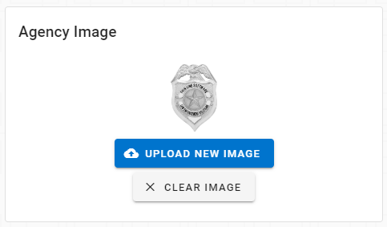

# Version 2.13.0

Welcome to the 2.13.0 release of Thin Line RMS/CAD. There are a number of updates in this version that we hope you like.

### RMS Highlights
<iframe width="560" height="315" src="https://www.youtube.com/embed/IlTqjWmiYiA" frameborder="0" allow="accelerometer; autoplay; encrypted-media; gyroscope; picture-in-picture" allowfullscreen></iframe>

&nbsp;

### Administrative Highlights
<iframe width="560" height="315" src="https://www.youtube.com/embed/WaN-YRN9FPY" frameborder="0" allow="accelerometer; autoplay; encrypted-media; gyroscope; picture-in-picture" allowfullscreen></iframe>

&nbsp;

## RMS Changes

* Added ability for admins to change usernames, emails, & phone numbers

* Added ability for users to change their passwords

* Added ability for users to reset their CAD/RMS preferences

* Updated Dashboard Profile page

* Increased size of user image

* Updated layout of agency image in admin page

* New module added: Field Contacts (fixed bug that was preventing access)

* Added ability to edit some code types

* Added record count to search options headers

* Added tasks for all officers on a call to add narrative
* Added admin area to search event/audit history

* Updated offense codes for through 09/01/2020
* Performance improvements to reports with large numbers of images.
* List of users can be printed for user auditing
* CJIS Security Officer role added for CJIS task Creation
* Made other small improvements and fixes

## CAD Changes

* Added button to create master record when there are multiple matches, but none are correct

* Made other small improvements and fixes

## Architecture Changes

* Upgraded OIDC/OAuth 2.0 grant type to PKCE (Proof Key for Code Exchange)
* Updated server libraries (including IdentityServer4)
* Added home page to Keymaster web application
* Added password preferences to Keymaster appsettings file
* Updated ThinLinePD data set
* Rebased ThinLineRMS database
* Added LastLoggedInDateTime to Keymaster AspNetUsers table
* Updated navbar to fix "duplicate navigation" errors
* Updated favicons
* Added security banner and updated security settings

* Cleaned up Claims and Roles
* Implemented additional authentication event logging
* Added new password validators (CJIS Compliance)
* Added password expiration (90 days) (CJIS Compliance)
* Added 10 minute lockout after 5 failed login attempts (CJIS Compliance)
* Added login notice (CJIS Compliance)

* Added logic to redirect user to the page they requested (after login screen)
* Added logic for auditing Users/Claims/Roles (CJIS Compliance)
* Updated several parts of the audit logic
* Added ability to log users out after 30 minutes of inactivity (warning @ 2 minutes) (CJIS Compliance)

* Added ability to prevent concurrent sessions for the same user (CJIS Compliance)
* Added logic to delete incidents/citations (disabled)