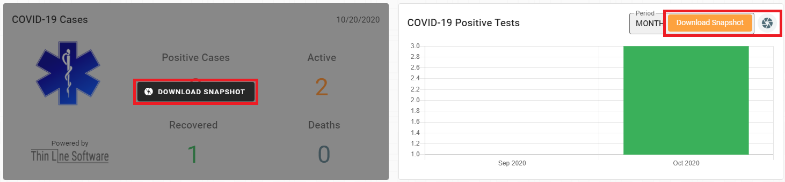
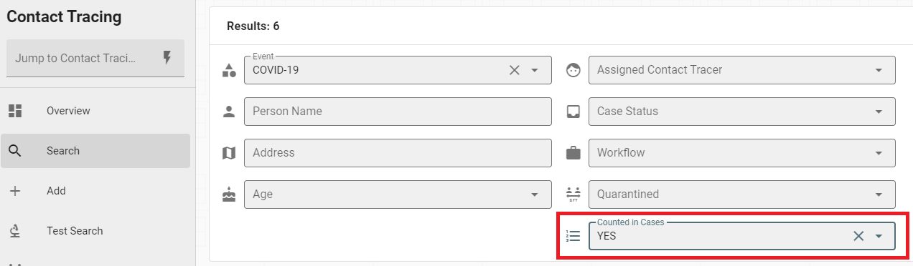
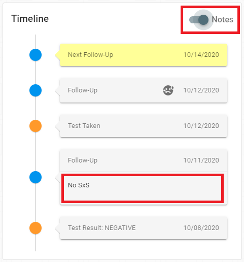
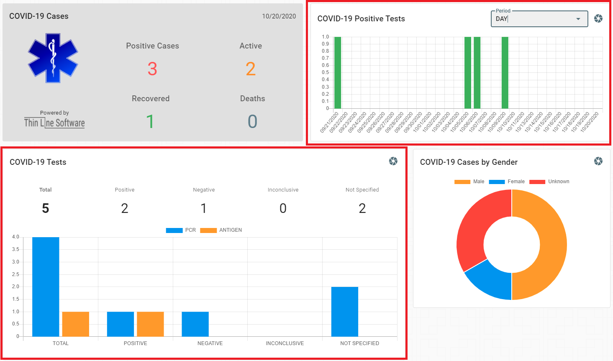
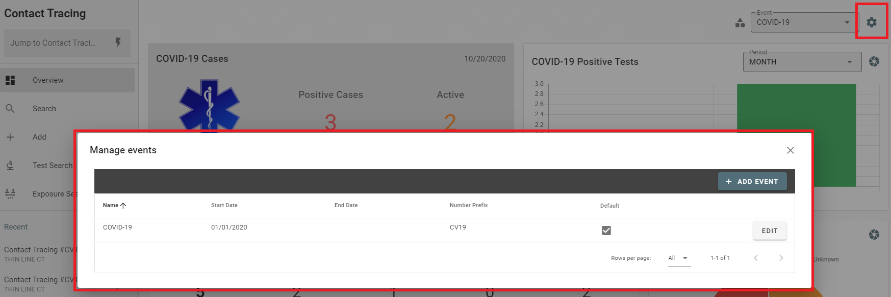

# Version 2.15.0

Welcome to the 2.15.0 release of Thin Line RMS/CAD. There are a number of updates in this version that we hope you like.

### Highlights
<iframe width="560" height="315" src="https://www.youtube.com/embed/fU1AEDrC6WA" frameborder="0" allow="accelerometer; autoplay; clipboard-write; encrypted-media; gyroscope; picture-in-picture" allowfullscreen></iframe>

## Contact Tracing

* Added ability to take snapshots of charts

* Added search option for showing cases in case counts

* Added toggle to display notes on timeline

* Updated charts and graphs

* Removed Events tab from Overview page; moved functionality to dialog

* Added exposed by to detail report
* Made other small improvements and fixes

## Architecture Changes

* Implemented delete filtering on remaining business objects
* Updated HTML container generation to fix caching issue after deployments (file hashes)
* Made other small improvements and fixes
