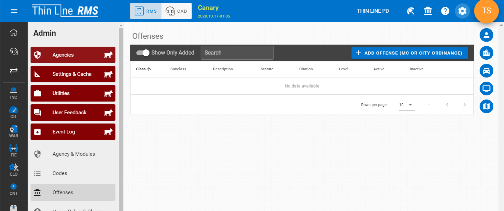
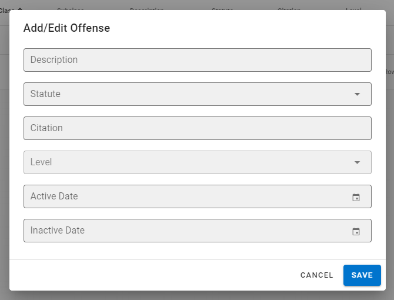
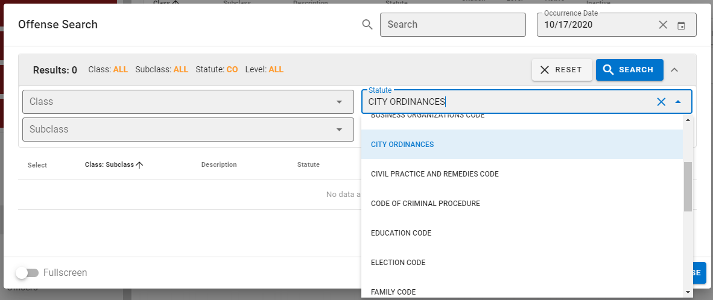
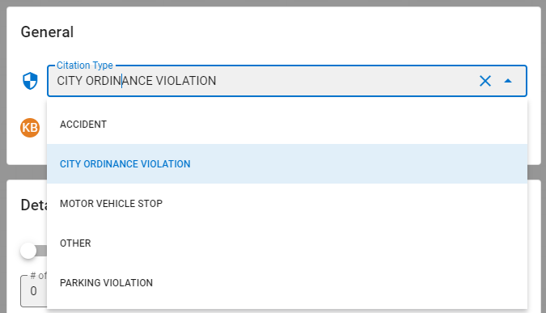

# Version 2.16.0

Welcome to the 2.16.0 release of Thin Line RMS/CAD. There are a number of updates in this version that we hope you like.

### Highlights

<iframe width="560" height="315" src="https://www.youtube.com/embed/pfgKHkVFgs0" frameborder="0" allow="accelerometer; autoplay; clipboard-write; encrypted-media; gyroscope; picture-in-picture" allowfullscreen></iframe>

## RMS Changes

- Added logic to add/edit class c misdemeanors and city ordinances
  
  
  
- Added citation type for city ordinance violations
  
- Updated master snapshots so that aliases/phones/emails/associations are included
- Made other small improvements and fixes

## CAD Changes

- Updated call sheet to handle expunged persons
- Updated master logic to auto-snapshot when call is closed and changes are made
- Added ability to re-associate master records
  
- Made other small improvements and fixes

<!--## Contact Tracing

* Made other small improvements and fixes-->

## Architecture Changes

- Made other small improvements and fixes
