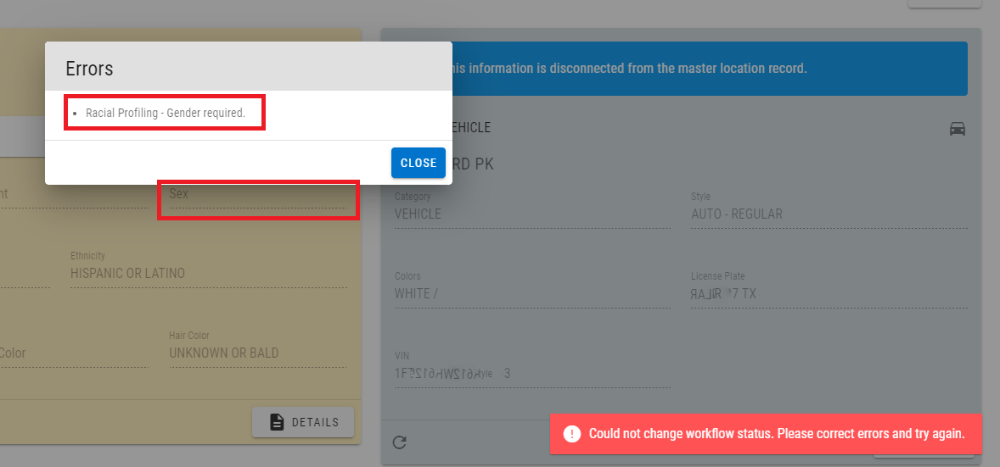
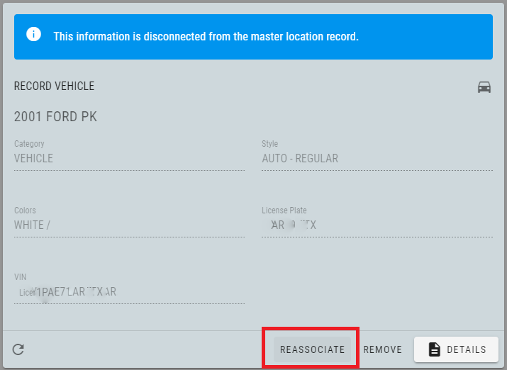
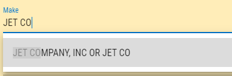

# Version 2.1.0

Welcome to the 2.1.0 release of Thin Line RMS/CAD. There are a number of updates in this version that we hope you like.

* Workflow validations for racial profiling have been added to Citations and Incidents. This ensures that data is accurate and complete when the citation is marked complete and the incident is approved.

* Disconnected master records (blue background) can now be updated/connected to the most recent version by pressing the "Reassociate" button.

* Vehicle make code for Jet Co. has been added.

## Version 2.1.1

* Fixed Segment 8 TIBRS issue with Family Violence.

## Version 2.1.2

* Fixed Segment NIBRS Issues.
* Changed logic for generation of Evidence Tags.
