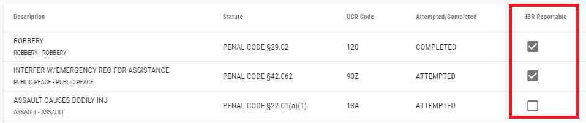
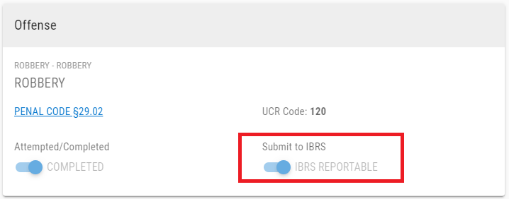
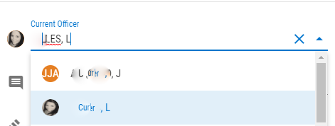

# Version 2.2.0

Welcome to the 2.2.0 release of Thin Line RMS/CAD. There are a number of updates in this version that we hope you like.

* Updated NIBRS logic and validations.
* Added "IBR Reportable" flag to Incident Offenses.

* Made minor improvements to UI, including:
  * Darkened disabled text.
  * Added officer image to select.
  
  * Updated offense card layout.
  * Updated spacing in module headers.
  * Updated spacing in module search options.
  * Updated spacing in CAD.
* Made other small improvements and fixes, including:
  * Fixed bug where search results would get stuck in a refresh loop.
  * Limited max upload size.
  * Fixed logic to delete relationships and offense associations when related records are deleted.
  * Added database constraints to prevent duplicate module numbers.

### Offense Codes

| Offense                            |                     |         | Status        |
|------------------------------------|---------------------|---------|---------------|
| PUBLIC INTOXICATION                | PENAL CODE          | 49.02   | Added/Updated |
| OBSTRUCTED VIEW THROUGH WINDSHIELD | TRANSPORTATION CODE | 547.613 | Existing      |
| FAILED TO DRIVE IN SINGLE LANE     | TRANSPORTATION CODE | 545.060 | Existing      |

## Version 2.2.1
* Fixed bug in task adder.
* Added "MC" to Offense search level select.
* Added "NON REPORTABLE", "DPS", and "TLS" to Offense search class select.

### Offense Codes

| Offense             |            |       | Status |
|---------------------|------------|-------|--------|
| THEFT PROP &lt;$100 | PENAL CODE | 31.03 | Added  |
