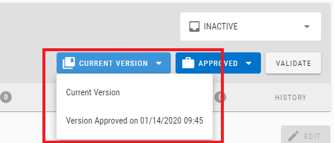
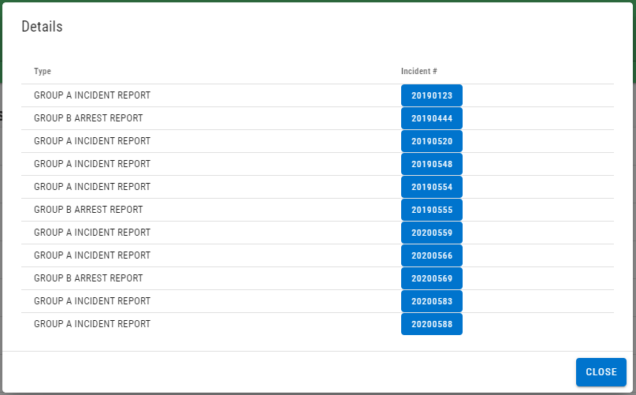

# Version 2.4.0

Welcome to the 2.4.0 release of Thin Line RMS/CAD. There are a number of updates in this version that we hope you like.

* Updated logic to prevent deleting property if it has an associated evidence record.
* Changed the concept of incident "supplements" to "versions".

* Fixed display issue with the related offenses on an incident.
* Added server paging and sorting to history grid (for performance reasons).
* Improved module/master tab loading logic.
* NIBRS: Updated Segment 8 logic.
* NIBRS: Updated UI to show included incidents.

* Added preview version of Close Patrol module.

## Version 2.4.1

* Added "CIVIL MATTER" call type code.
* Fixed bug when adding unit to closed call.
* Fixed bug when adding master records to incident.
