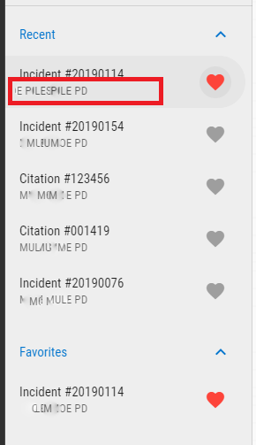
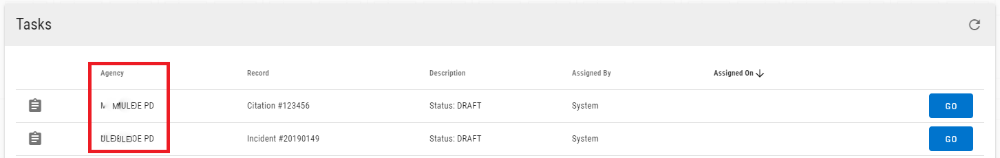
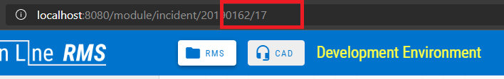
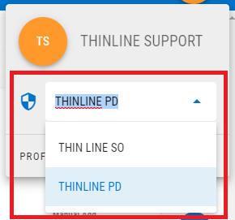

# Version 2.5.0

Welcome to the 2.5.0 release of Thin Line RMS/CAD. There are a number of updates in this version that we hope you like.

* Added support for multiple agencies:
  * Added agency name to navigation bar.
  
  * Updated Recent & Favorites to include Agency Name.
  
  * Updated Tasks to include agency.
  
  * Changed URL of module records to include agency identifier.
  
  * Added agency select list to User popover.
  
* Reworked the admin area:
  * Removed system-level functions.
  * Added new page for Agency & Module settings.
  * Updated code admin page (currently read-only).
  * Added offense admin page (currently read-only).
  * Reworked Users, Role, & Claims page.
  * Reworked Officers page.
  * Added Evidence page placeholder.
  * Added CAD page placeholder.
* Made other small improvements and fixes.