# Version 2.7.0

Welcome to the 2.7.0 release of Thin Line RMS/CAD. There are a number of updates in this version that we hope you like.

## CAD

* Added print menu to call dialog.
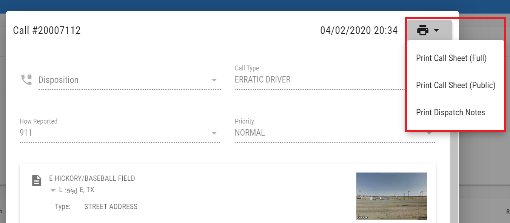
* Added ability to preview calls from master records tab.
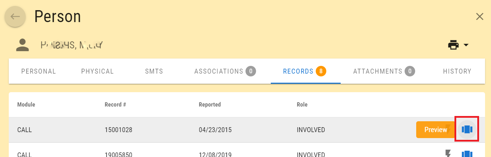
* Added ability to navigate to call sheet from master records tab.
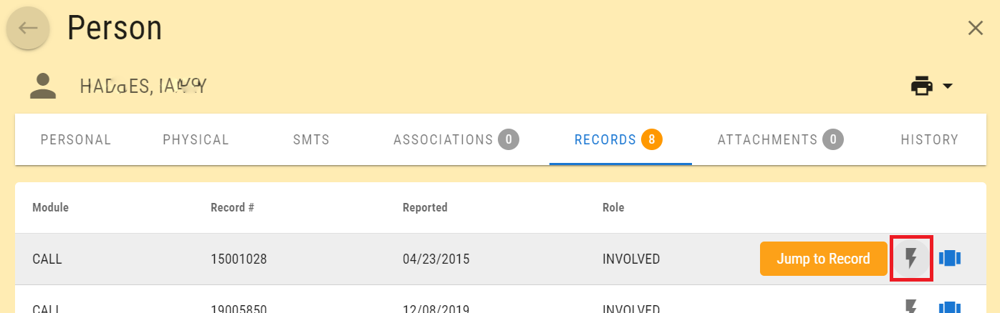
* Added agency filter to call sheet search.
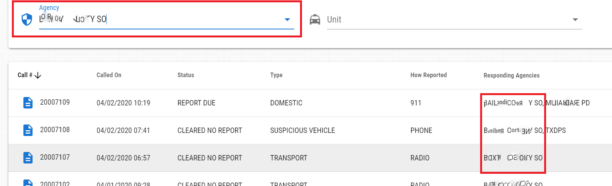
* Updated manage unit dialog to set active property of units.
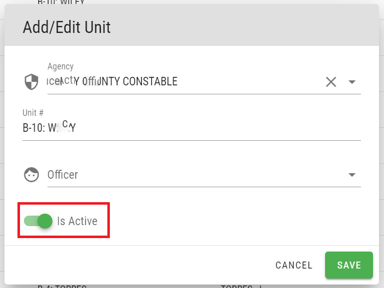
* Updated unit select list.
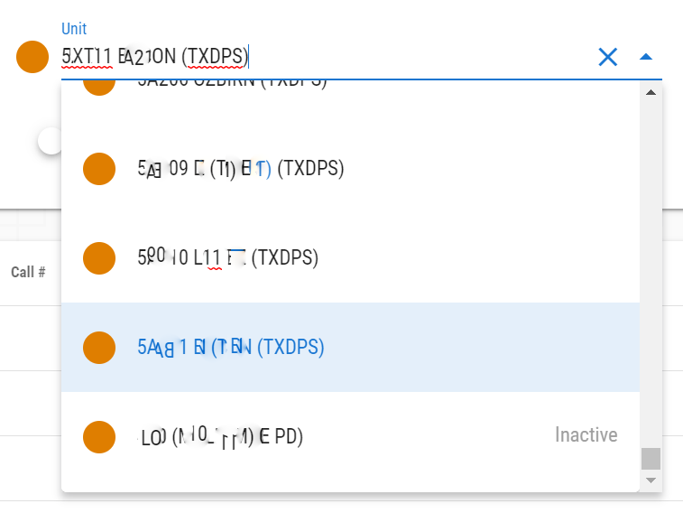
* Added new unit status: On Standby.
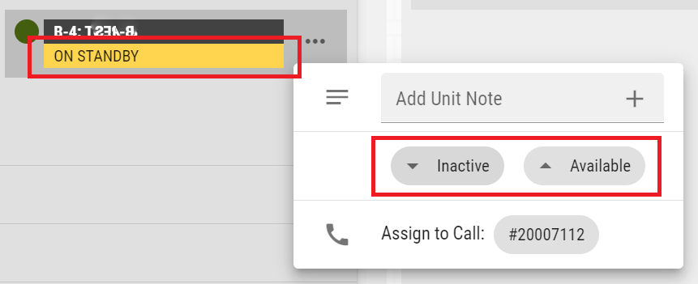
* Added keyboard focus to global and unit notes when they are opened.

## RMS

* Added logic to create suspect role for incident person when they are added as an arrestee.
* Optimized incident loading (up to 1,000 times faster).
* Added associated offenses to involved, property, and vehicle summary grids (incidents).
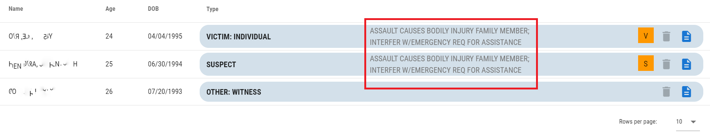
* Added ability to view master record from involved, property, and vehicle summary grids (incidents).

* Added property type to incident property summary grid.
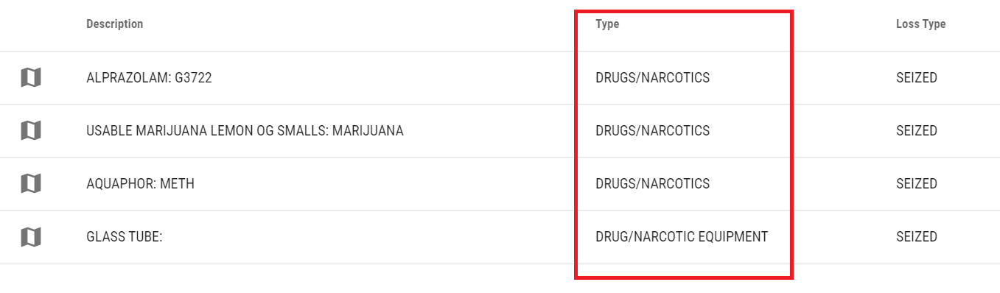
* Added refresh button to incident summary grids.
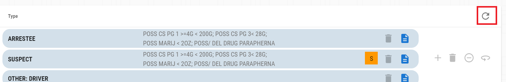
* Added button to create unknown suspects
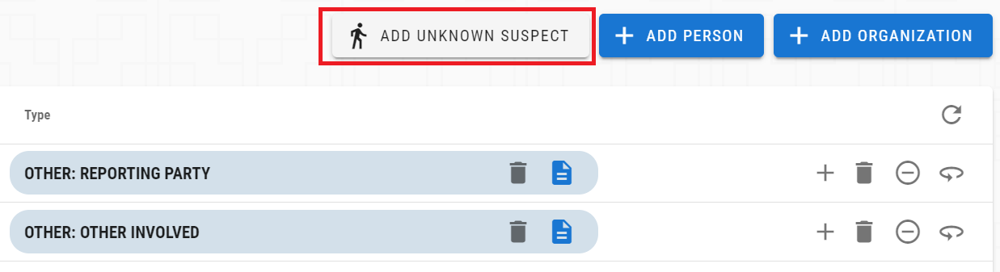
* Added switch to indicate unknown persons.
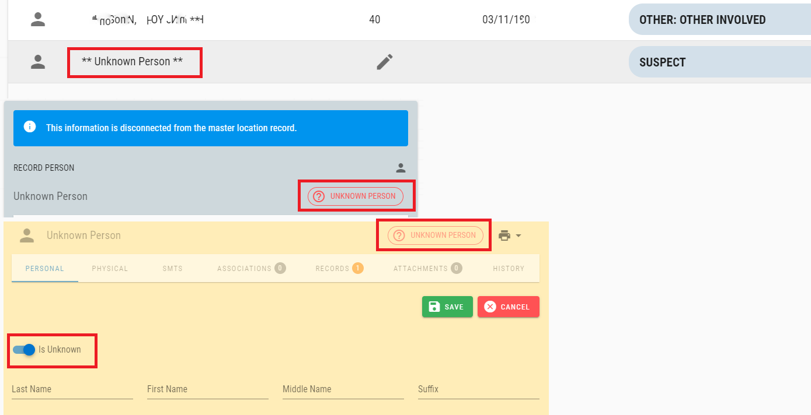
* Changed code select list to always sort items alphabetically.
* Updated add user wizard to default user as not an officer.
* Added logic to store user preferences for master search advanced and grid.
* Updated person search results grid (removed SSN; added residence).
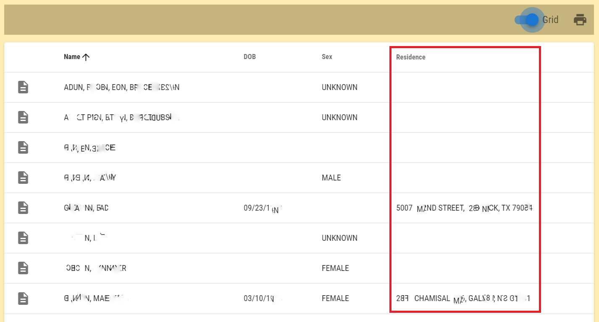
* Updated offense lookup dialog.
* Hid offense statute link if it doesn't exist.
* Added ability to select IBR code for each eligible offense.
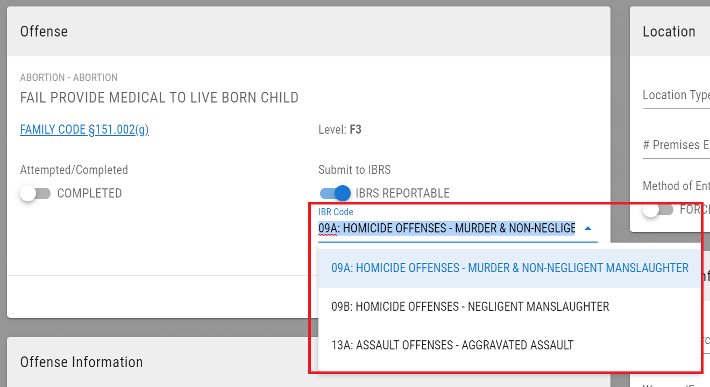
* Organized MC offenses.
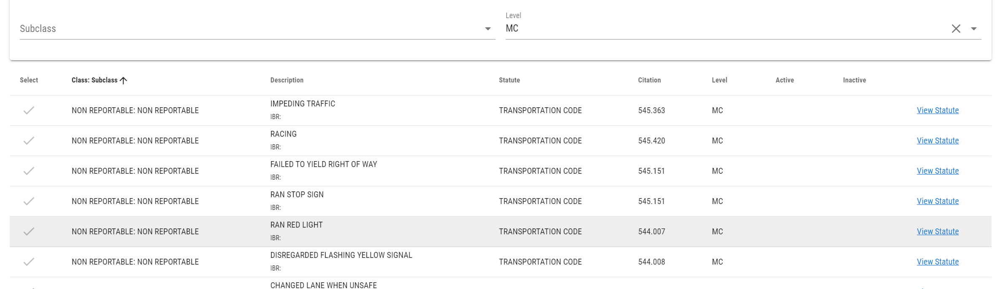
* Added "Evidence in Custody" report button.
* Updated descriptions for call type codes.
* Added manual edit dialog for incident persons.
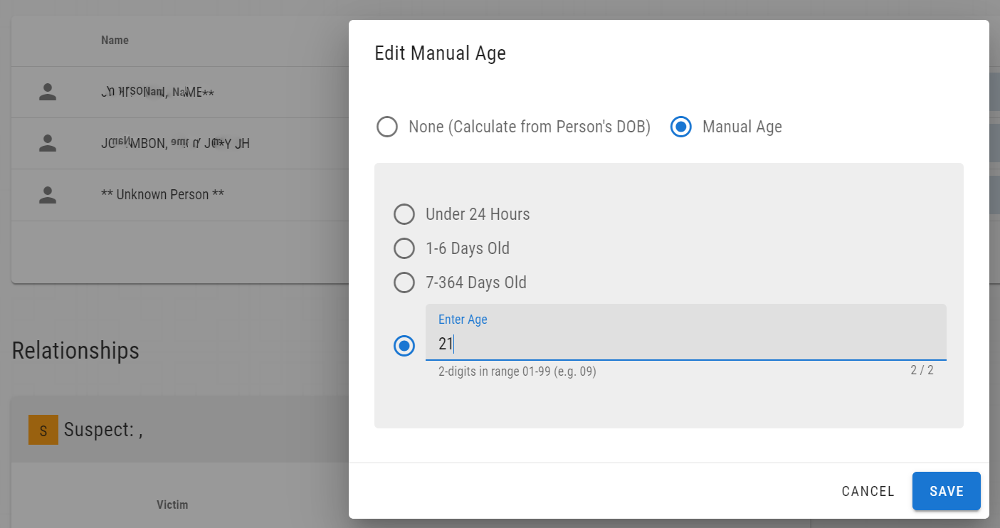
* Updated master location search to match beginning of words (for address1 and address2).
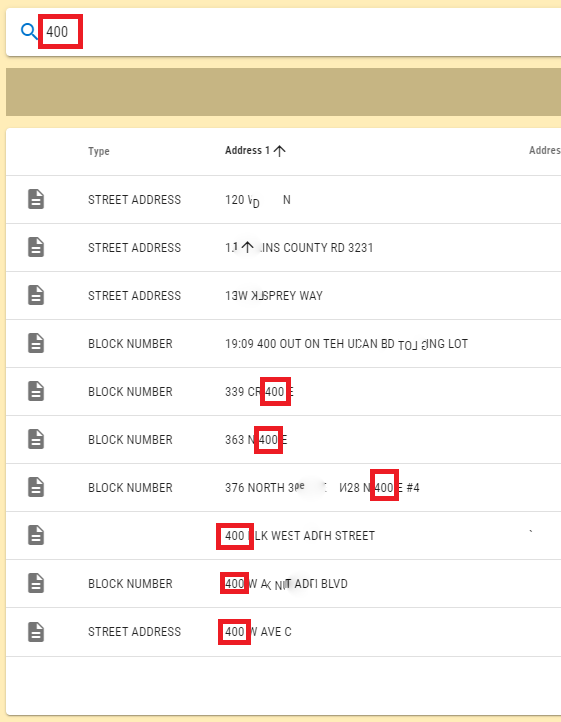
* Made other small improvements and fixes.
