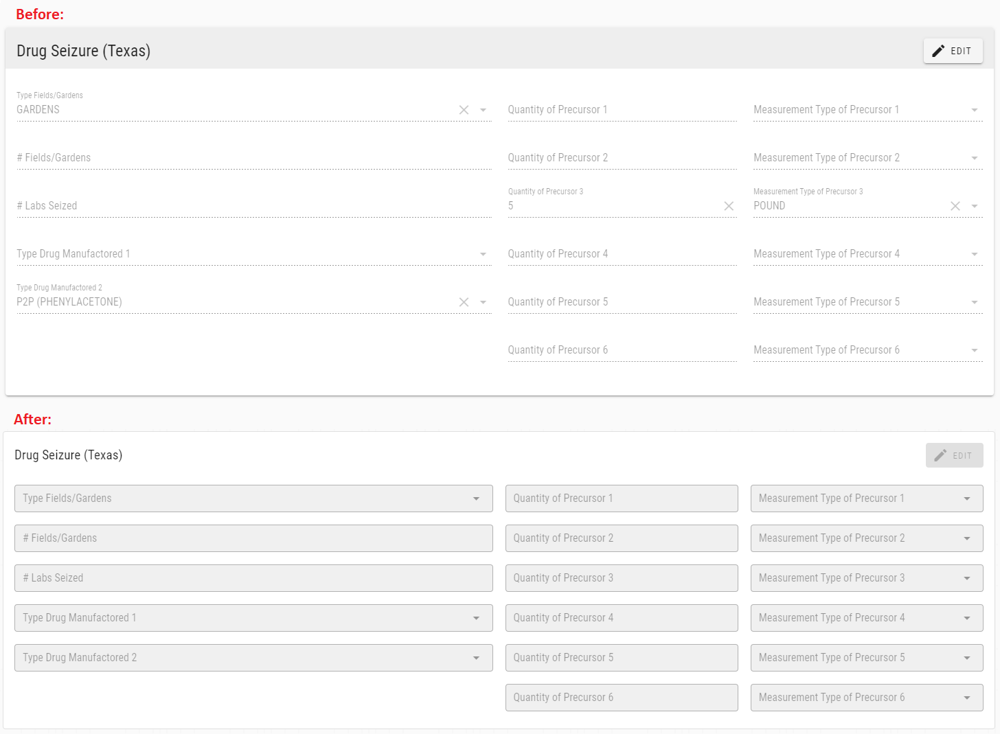
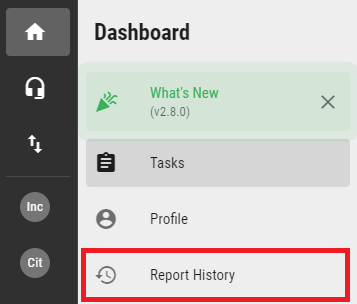
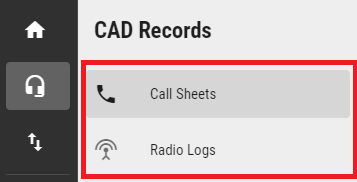
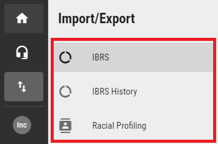
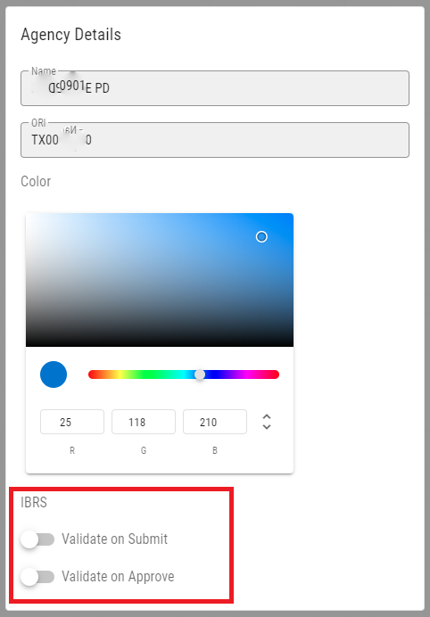

# Version 2.8.0

Welcome to the 2.8.0 release of Thin Line RMS/CAD. There are a number of updates in this version that we hope you like.

* Updated control styles.

* Removed report module pages and moved to new sections:
 * Report History was moved to Dashboard section.
 
 * IBRS & Racial Profiling was moved to a new Import/Export section.
 
 * Call Sheet & Radio Log searches were moved to new CAD Records section.
 
* Implemented TIBRS Segment 9.
* Added IBRS validations to workflow (with agency preferences).

* Updated IBRS validations & process.
* Made other small improvements and fixes.
