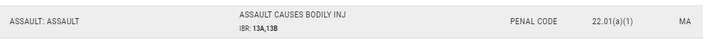
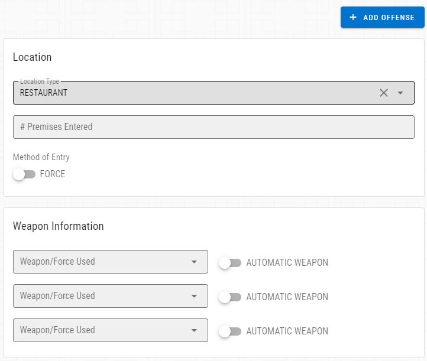
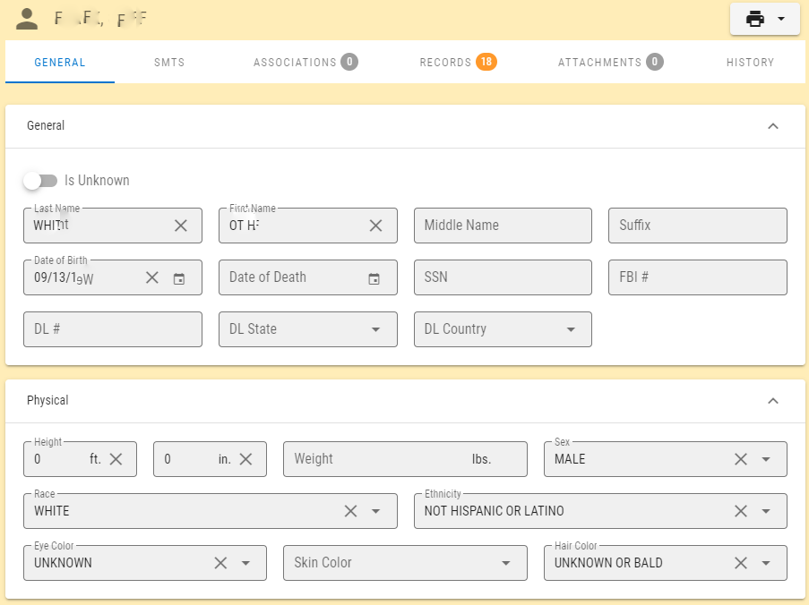
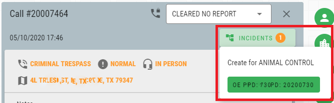
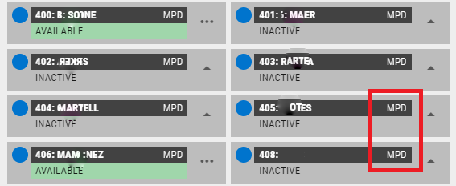
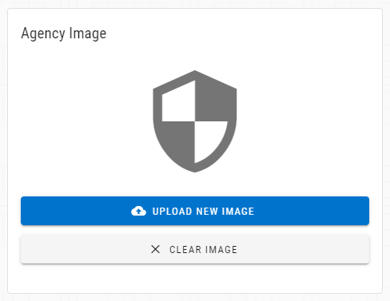

# Version 2.9.0

Welcome to the 2.9.0 release of Thin Line RMS/CAD. There are a number of updates in this version that we hope you like.

* Added 13B IBRS code to Assault

* Removed "Edit" button from module and master forms; data can be changed without having to click a button to enter "edit" mode

* Added banner to modules to indicate when they are not in an editable state

* Merged master person Personal & Physical tabs

* Updated incident menu in call sheet

* Added agency abbreviation to unit cards

* Added ability to upload/change/remove agency image

* Updated offense lookup to reset page to 1 if any filters change
* Made other small improvements and fixes
