# Version 3.0.0

Welcome to the 3.0.0 release of Thin Line RMS/CAD. There are a number of updates in this version that we hope you like.

### Highlights

### General System Highlights
<iframe width="560" height="315" src="https://www.youtube.com/embed/tlln1Ek_fSM" frameborder="0" allow="accelerometer; autoplay; encrypted-media; gyroscope; picture-in-picture" allowfullscreen></iframe>

### RMS/CAD Highlights
<iframe width="560" height="315" src="https://www.youtube.com/embed/3eAmemIk8fk" frameborder="0" allow="accelerometer; autoplay; encrypted-media; gyroscope; picture-in-picture" allowfullscreen></iframe>

### Contact Tracing Highlights
<iframe width="560" height="315" src="https://www.youtube.com/embed/05aQTWaCwuc" frameborder="0" allow="accelerometer; autoplay; encrypted-media; gyroscope; picture-in-picture" allowfullscreen></iframe>

### Administrative Highlights
<iframe width="560" height="315" src="https://www.youtube.com/embed/SrcEqOjxKw8" frameborder="0" allow="accelerometer; autoplay; encrypted-media; gyroscope; picture-in-picture" allowfullscreen></iframe>

## General Changes

* Updated Menus with Hoverover for easier navigation.
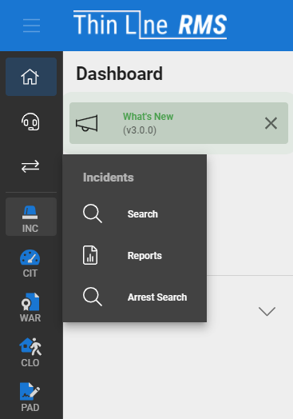
* Admins can toggle the default list of Dashboad Notifications on/off for the entire agency.
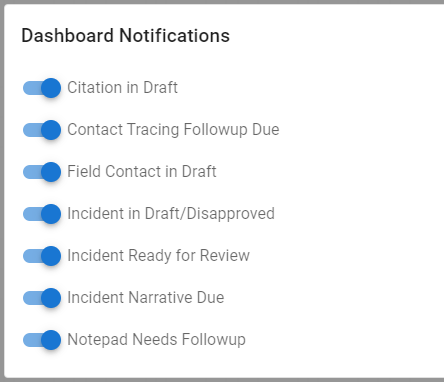
* Added ability to toggle password visibility when signing in
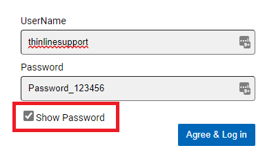
* Fully switched icon libraries
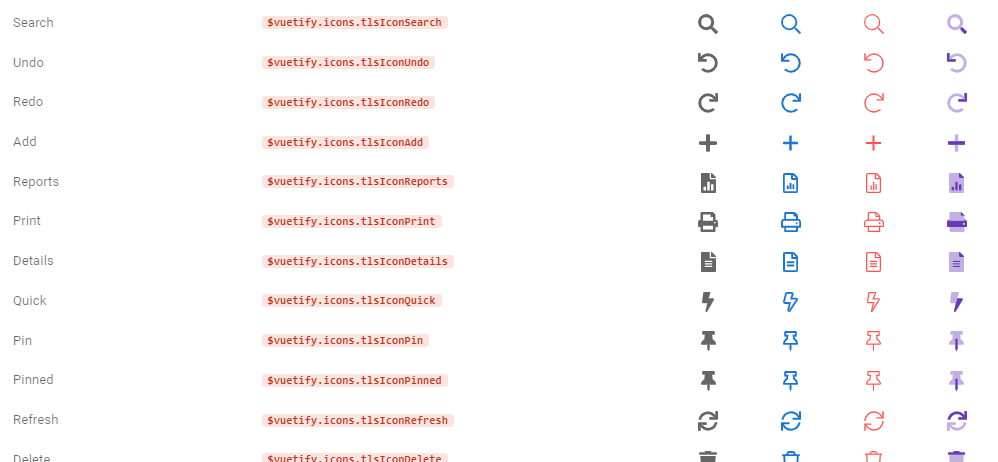
* Added logic to filter certain user changes from audit history
* Updated the Recent and Pinned lists.

## RMS Changes

* Updated chip color of incident involved roles
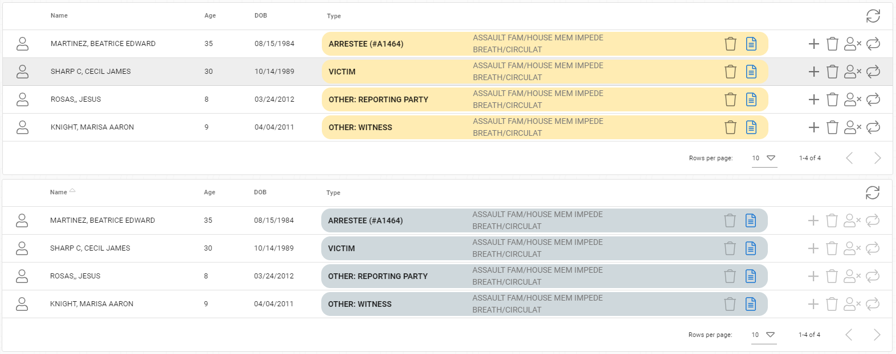
* Added ability to view/modify citations and incidents within racial profiling search without haveing to re-search
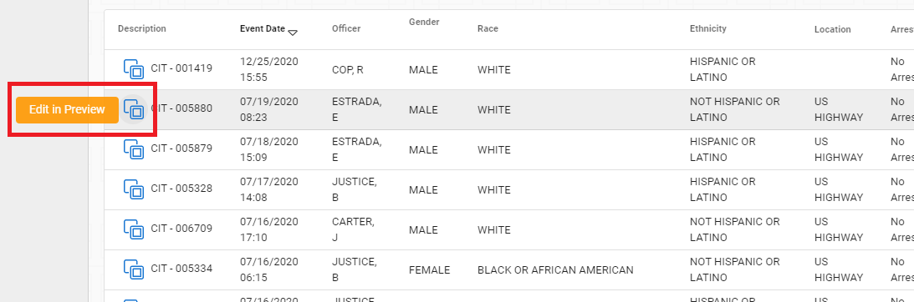
* Consolidated module search sort order
* Added warrant record date, and updated sort
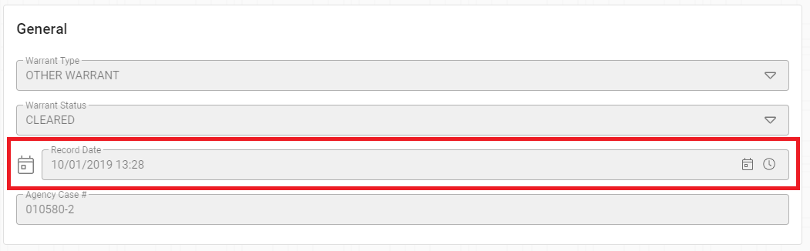
* Officers that were dispatched now have an add button to quickly create Incident narratives.
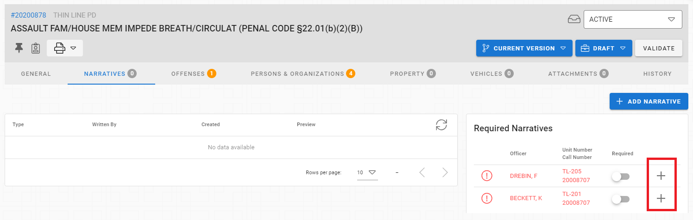
* Responding officers on Incidents can be toggled on to be notified that a Narrative is required for that officer.  This replaces older functionality that enabled notifications for all officers responding to a call.
* Field Contacts is now the Notepad module
	* Add Field Contacts, Lost and Found Records, and General Notes based on the Notepad Type
	* All records are searchable through the general Notepad search
	* All Lost and Found objects are searchable in the Lost and Found Search with more specific results
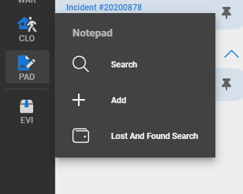
* Made other small improvements and fixes

## CAD Changes

* Updated card color of call sheet master records
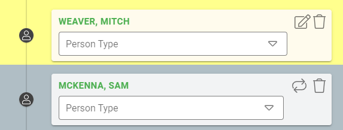
* Made other small improvements and fixes

## Contact Tracing

* Admin can set default case status when creating cases from exposures
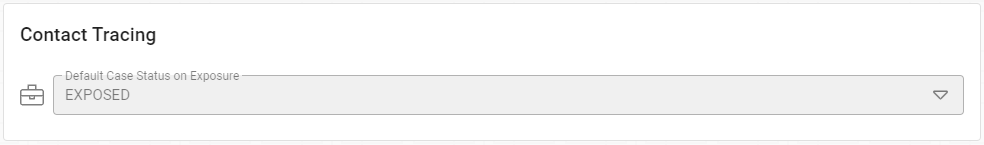
* Added exposure level to exposure records
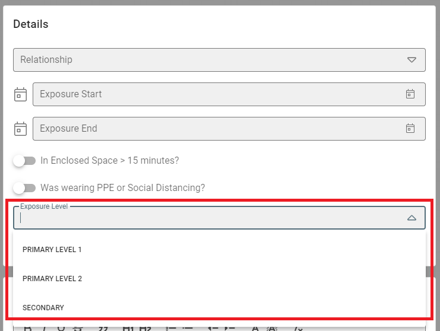
* Made other small improvements and fixes

## Architecture Changes

* Fixed incident/property/evidence exception handling
* Fixed IBRS exception handling
* Added logic to save requested agency to local storage so refreshes work as expected
* Updated workflow utility
* Updated record quick jump logic
* Refactored view models
* Masters: refactored association relationships
* Masters: refactored reference id
* Updated server libraries (including .net 5 and EF Core 5)
* Made other small improvements and fixes
