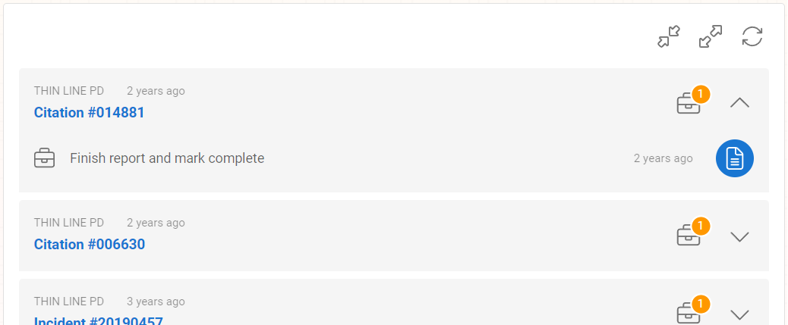
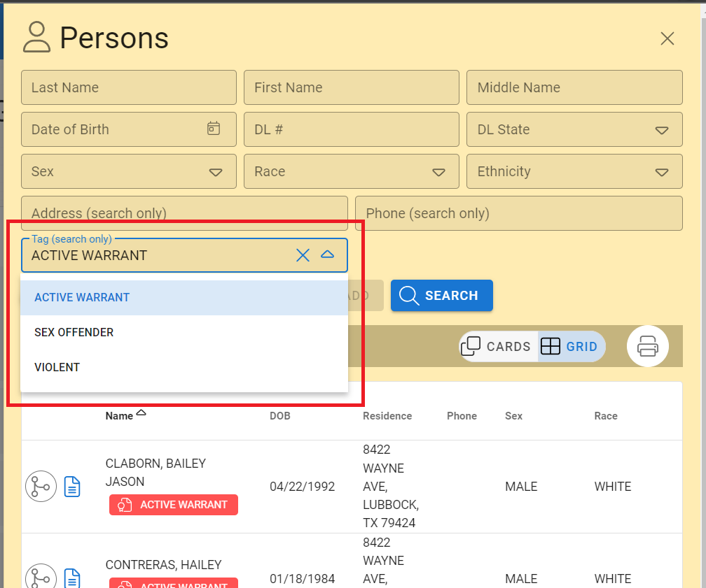
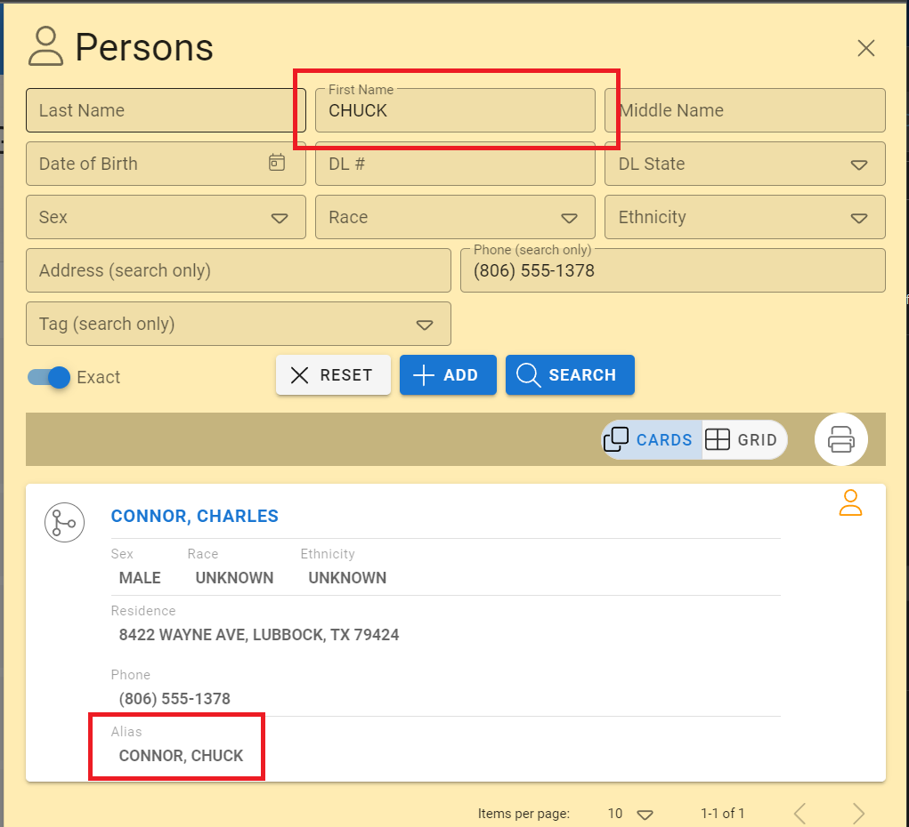
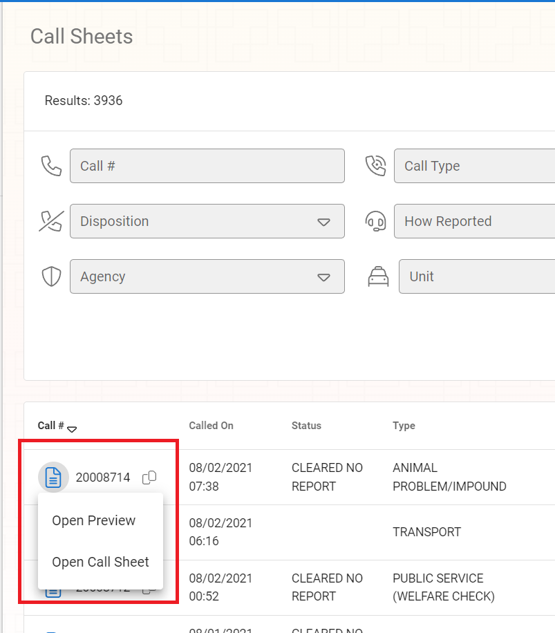
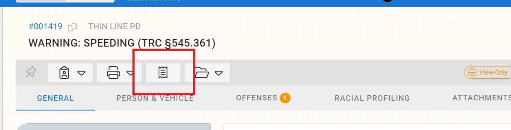
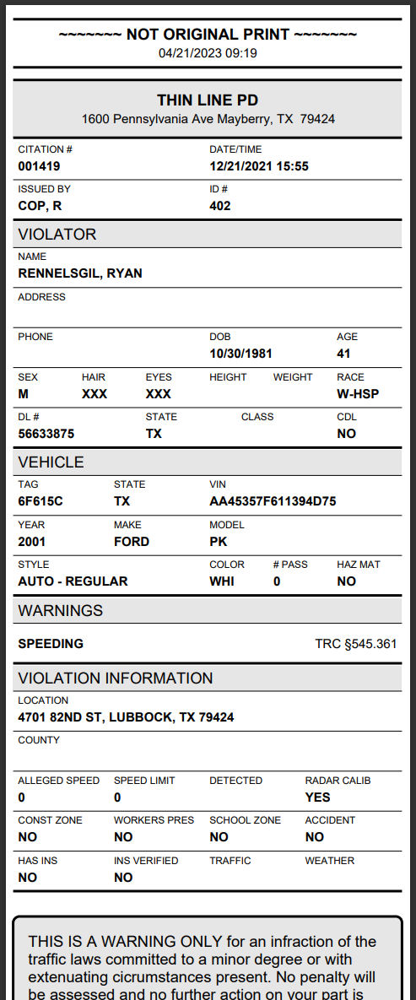

# Version 3.14.0

Welcome to the 3.14.0 release of Thin Line RMS/CAD. There are a number of updates in this version that we hope you like.

<!--### Highlights-->

<!--
### General System Highlights
<iframe width="560" height="315" src="https://www.youtube.com/embed/tlln1Ek_fSM" frameborder="0" allow="accelerometer; autoplay; encrypted-media; gyroscope; picture-in-picture" allowfullscreen></iframe>

### RMS/CAD Highlights
<iframe width="560" height="315" src="https://www.youtube.com/embed/3eAmemIk8fk" frameborder="0" allow="accelerometer; autoplay; encrypted-media; gyroscope; picture-in-picture" allowfullscreen></iframe>

### Contact Tracing Highlights
<iframe width="560" height="315" src="https://www.youtube.com/embed/05aQTWaCwuc" frameborder="0" allow="accelerometer; autoplay; encrypted-media; gyroscope; picture-in-picture" allowfullscreen></iframe>

### Administrative Highlights
<iframe width="560" height="315" src="https://www.youtube.com/embed/SrcEqOjxKw8" frameborder="0" allow="accelerometer; autoplay; encrypted-media; gyroscope; picture-in-picture" allowfullscreen></iframe>
-->

<!--  -->

## General Changes

- Improved dashboard task list
  
- Added task notification icon to header
  
- Added new options (tags and aliases) to master person search options and results
  
  
- Added new options (tags and aliases) to master person grid prints
- Updated call sheet search results to allow opening read-only preview and full call sheet
  
- Added ability to print citations in mobile format (if mobile citations enabled)
  
  
- Updated agency name on mobile citations
- Made other small improvements and fixes

## RMS Changes

- Fixed issue with racial profiling validations for citations
- Made other small improvements and fixes

## CAD Changes

- Made other small improvements and fixes

## Architecture Changes

- Updated third-party libraries
- Made other small improvements and fixes
