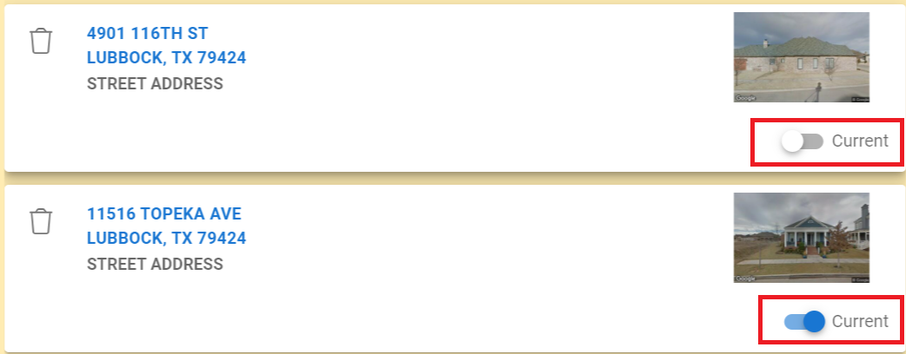
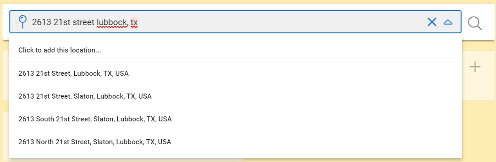

# Version 3.1.0

Welcome to the 3.1.0 release of Thin Line RMS/CAD. There are a number of updates in this version that we hope you like.

### Highlights

### RMS/CAD Highlights
<iframe width="560" height="315" src="https://www.youtube.com/embed/sajEJozJKq8" frameborder="0" allow="accelerometer; autoplay; encrypted-media; gyroscope; picture-in-picture" allowfullscreen></iframe>

<!--
### General System Highlights
<iframe width="560" height="315" src="https://www.youtube.com/embed/tlln1Ek_fSM" frameborder="0" allow="accelerometer; autoplay; encrypted-media; gyroscope; picture-in-picture" allowfullscreen></iframe>

### RMS/CAD Highlights
<iframe width="560" height="315" src="https://www.youtube.com/embed/3eAmemIk8fk" frameborder="0" allow="accelerometer; autoplay; encrypted-media; gyroscope; picture-in-picture" allowfullscreen></iframe>

### Contact Tracing Highlights
<iframe width="560" height="315" src="https://www.youtube.com/embed/05aQTWaCwuc" frameborder="0" allow="accelerometer; autoplay; encrypted-media; gyroscope; picture-in-picture" allowfullscreen></iframe>

### Administrative Highlights
<iframe width="560" height="315" src="https://www.youtube.com/embed/SrcEqOjxKw8" frameborder="0" allow="accelerometer; autoplay; encrypted-media; gyroscope; picture-in-picture" allowfullscreen></iframe>
-->

## General Changes

* Fixed bug where master records weren't refreshing/attaching automatically
* Added details when adding master record and there is a match (to help choose whether to use existing)

* Fixed some spacing issues; added responsiveness to new areas
* Added "Is Current" to master associations (updated UI, search, & reports)

* Updated person residence to use Google Maps API

* Made other small improvements and fixes

## RMS Changes

* IBRS: fixed some errors and added some validations
* Updated incident narrative unit text color & icon

* Incident: split evidence into its own tab and updated incident detail report

* Incident: added property/evidence wizard

* Incident: changed default offense property to "Completed" and made it more conspicuous

* Fixed incident so that changes to offenses propogate coorectly to involved, vehicles, and property
* Warrants: added internal note; updated default filter status; added offenses

* Citations: added internal note

* Updated Racial Profiling logic
* Made other small improvements and fixes

## CAD Changes

* Added unit management screen to main admin section

* Added agency management to main admin section

* Updated unit status of "Standby" to "On-Call (Standby)"

* Made other small improvements and fixes

## Architecture Changes

* Added code to allow users to log in if they have bookmarked the log-in page (via detection and redirection)
* Fixed missing DLL in Azure environments (.NET Error)
* Fixed Image Process Exception
* Added "Fatal" event type to event search options
* Rebased databases
* Made other small improvements and fixes
